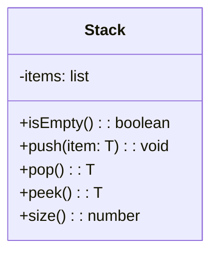

# 20240305-Week3-基本数据结构


Updated 2202 GMT+8 Feb 24, 2024

2024 spring, Complied by Hongfei Yan


**本周发布作业：**

todo: assignment3, https://github.com/GMyhf/2024spring-cs201


目标：

- To understand the abstract data types stack, queue, deque, and list.
- To be able to implement the ADTs stack, queue, and deque using Python lists.
- To understand the performance of the implementations of basic linear data structures.
- To understand prefix, infix, and postfix expression formats.
- To use stacks to evaluate postfix expressions.
- To use stacks to convert expressions from infix to postfix.
- To use queues for basic timing simulations.
- To be able to recognize problem properties where stacks, queues, and deques are appropriate data structures.
- To be able to implement the abstract data type list as a linked list using the node and reference pattern.
- To be able to compare the performance of our linked list implementation with Python’s list implementation.

# 一、基本数据结构

**What Are Linear Structures?**

We will begin our study of data structures by considering four simple but very powerful concepts. Stacks, queues, deques, and lists are examples of data collections whose items are ordered depending on how they are added or removed. Once an item is added, it stays in that position relative to the other elements that came before and came after it. Collections such as these are often referred to as **linear data structures**.

Linear structures can be thought of as having two ends. Sometimes these ends are referred to as the “left” and the “right” or in some cases the “front” and the “rear.” You could also call them the “top” and the “bottom.” The names given to the ends are not significant. What distinguishes one linear structure from another is the way in which items are added and removed, in particular the location where these additions and removals occur. For example, a structure might allow new items to be added at only one end. Some structures might allow items to be removed from either end.

These variations give rise to some of the most useful data structures in computer science. They appear in many algorithms and can be used to solve a variety of important problems.


**What is a Stack?**

A **stack** (sometimes called a “push-down stack”) is an ordered collection of items where the addition of new items and the removal of existing items always takes place at the same end. This end is commonly referred to as the “top.” The end opposite the top is known as the “base.”

The base of the stack is significant since items stored in the stack that are closer to the base represent those that have been in the stack the longest. The most recently added item is the one that is in position to be removed first. This ordering principle is sometimes called **LIFO**, **last-in first-out**. It provides an ordering based on length of time in the collection. Newer items are near the top, while older items are near the base.

Many examples of stacks occur in everyday situations. Almost any cafeteria has a stack of trays or plates where you take the one at the top, uncovering a new tray or plate for the next customer in line.


**What Is a Queue?**

A queue is an ordered collection of items where the addition of new items happens at one end, called the “rear,” and the removal of existing items occurs at the other end, commonly called the “front.” As an element enters the queue it starts at the rear and makes its way toward the front, waiting until that time when it is the next element to be removed.

The most recently added item in the queue must wait at the end of the collection. The item that has been in the collection the longest is at the front. This ordering principle is sometimes called **FIFO**, **first-in first-out**. It is also known as “first-come first-served.”


**What Is a Deque?**

A **deque**, also known as a double-ended queue, is an ordered collection of items similar to the queue. It has two ends, a front and a rear, and the items remain positioned in the collection. What makes a deque different is the unrestrictive nature of adding and removing items. New items can be added at either the front or the rear. Likewise, existing items can be removed from either end. In a sense, this hybrid linear structure provides all the capabilities of stacks and queues in a single data structure. 


# 1. The Stack Abstract Data Type

The stack abstract data type is defined by the following structure and operations. A stack is structured, as described above, as an ordered collection of items where items are added to and removed from the end called the “top.” Stacks are ordered LIFO. The stack operations are given below.

- `Stack()` creates a new stack that is empty. It needs no parameters and returns an empty stack.
- `push(item)` adds a new item to the top of the stack. It needs the item and returns nothing.
- `pop()` removes the top item from the stack. It needs no parameters and returns the item. The stack is modified.
- `peek()` returns the top item from the stack but does not remove it. It needs no parameters. The stack is not modified.
- `isEmpty()` tests to see whether the stack is empty. It needs no parameters and returns a boolean value.
- `size()` returns the number of items on the stack. It needs no parameters and returns an integer.

For example, if `s` is a stack that has been created and starts out empty, then Table 1 shows the results of a sequence of stack operations. Under stack contents, the top item is listed at the far right.


Table 1: Sample Stack Operations

| **Stack Operation** | **Stack Contents**   | **Return Value** |
| :------------------ | :------------------- | :--------------- |
| `s.isEmpty()`       | `[]`                 | `True`           |
| `s.push(4)`         | `[4]`                |                  |
| `s.push('dog')`     | `[4,'dog']`          |                  |
| `s.peek()`          | `[4,'dog']`          | `'dog'`          |
| `s.push(True)`      | `[4,'dog',True]`     |                  |
| `s.size()`          | `[4,'dog',True]`     | `3`              |
| `s.isEmpty()`       | `[4,'dog',True]`     | `False`          |
| `s.push(8.4)`       | `[4,'dog',True,8.4]` |                  |
| `s.pop()`           | `[4,'dog',True]`     | `8.4`            |
| `s.pop()`           | `[4,'dog']`          | `True`           |
| `s.size()`          | `[4,'dog']`          | `2`              |


### 1.1 Implementing a Stack in Python

Now that we have clearly defined the stack as an abstract data type we will turn our attention to using Python to implement the stack. Recall that when we give an abstract data type a physical implementation we refer to the implementation as a data structure.

As we described in Chapter 1, in Python, as in any object-oriented programming language, the implementation of choice for an abstract data type such as a stack is the creation of a new class. The stack operations are implemented as methods. Further, to implement a stack, which is a collection of elements, it makes sense to utilize the power and simplicity of the primitive collections provided by Python. We will use a list.




```python
class Stack:
    def __init__(self):
        self.items = []
    
    def is_empty(self):
        return self.items == []
    
    def push(self, item):
        self.items.append(item)
    
    def pop(self):
        return self.items.pop()
    
    def peek(self):
        return self.items[len(self.items)-1]
    
    def size(self):
        return len(self.items)

s = Stack()

print(s.is_empty())
s.push(4)
s.push('dog')

print(s.peek())
s.push(True)
print(s.size())
print(s.is_empty())
s.push(8.4)
print(s.pop())
print(s.pop())
print(s.size())

"""
True
dog
3
False
8.4
True
2
"""
```


要求自己会用类实现Stack，但是实际编程时候，直接使用系统的list更好。

```python
#function rev_string(my_str) that uses a stack to reverse the characters in a string.
def rev_string(my_str):
    s = [] # Stack()
    rev = []
    for c in my_str:
        s.append(c) # push(c)

    #while not s.is_empty():
    while s:
        rev.append(s.pop())
    return "".join(rev)

test_string = "cutie"

print(rev_string(test_string))

# output: eituc
    
```


### 1.2 匹配括号

We now turn our attention to using stacks to solve real computer science problems. You have no doubt written arithmetic expressions such as

(5+6)∗(7+8)/(4+3)

where parentheses are used to order the performance of operations. You may also have some experience programming in a language such as Lisp with constructs like

```
(defun square(n)
     (* n n))
```

This defines a function called `square` that will return the square of its argument `n`. Lisp is notorious for using lots and lots of parentheses.

In both of these examples, parentheses must appear in a balanced fashion. **Balanced parentheses** means that each opening symbol has a corresponding closing symbol and the pairs of parentheses are properly nested. Consider the following correctly balanced strings of parentheses:

```
(()()()())

(((())))

(()((())()))
```

Compare those with the following, which are not balanced:

```
((((((())

()))

(()()(()
```

The ability to differentiate between parentheses that are correctly balanced and those that are unbalanced is an important part of recognizing many programming language structures.

The challenge then is to write an algorithm that will read a string of parentheses from left to right and decide whether the symbols are balanced. To solve this problem we need to make an important observation. As you process symbols from left to right, the most recent opening parenthesis must match the next closing symbol (see Figure 4). Also, the first opening symbol processed may have to wait until the very last symbol for its match. Closing symbols match opening symbols in the reverse order of their appearance; they match from the inside out. This is a clue that stacks can be used to solve the problem.


Figure 4: Matching Parentheses


```python
#returns a boolean result as to whether the string of parentheses is balanced
def par_checker(symbol_string):
    s = [] # Stack()
    balanced = True
    index = 0
    while index < len(symbol_string) and balanced:
        symbol = symbol_string[index]
        if symbol == "(":
            s.append(symbol) # push(symbol)
        else:
            #if s.is_empty():
            if not s:
                balanced = False
            else:
                s.pop()
        index = index + 1
    
    #if balanced and s.is_empty():
    if balanced and not s:
        return True
    else:
        return False

print(par_checker('((()))'))
print(par_checker('(()'))

# True
# False
```


#### 1.2.1 Balanced Symbols (A General Case)

The balanced parentheses problem shown above is a specific case of a more general situation that arises in many programming languages. The general problem of balancing and nesting different kinds of opening and closing symbols occurs frequently. For example, in Python square brackets, `[` and `]`, are used for lists; curly braces, `{` and `}`, are used for dictionaries; and parentheses, `(` and `)`, are used for tuples and arithmetic expressions. It is possible to mix symbols as long as each maintains its own open and close relationship. Strings of symbols such as

```
{ { ( [ ] [ ] ) } ( ) }

[ [ { { ( ( ) ) } } ] ]

[ ] [ ] [ ] ( ) { }
```

are properly balanced in that not only does each opening symbol have a corresponding closing symbol, but the types of symbols match as well.

Compare those with the following strings that are not balanced:

```
( [ ) ]

( ( ( ) ] ) )

[ { ( ) ]
```

The simple parentheses checker from the previous section can easily be extended to handle these new types of symbols. Recall that each opening symbol is simply pushed on the stack to wait for the matching closing symbol to appear later in the sequence. When a closing symbol does appear, the only difference is that we must check to be sure that it correctly matches the type of the opening symbol on top of the stack. If the two symbols do not match, the string is not balanced. Once again, if the entire string is processed and nothing is left on the stack, the string is correctly balanced.


```python
def par_checker(symbol_string):
    s = [] # Stack()
    balanced = True
    index = 0 
    while index < len(symbol_string) and balanced:
        symbol = symbol_string[index] 
        if symbol in "([{":
            s.append(symbol) # push(symbol)
        else:
            top = s.pop()
            if not matches(top, symbol):
                balanced = False
        index += 1
        #if balanced and s.is_empty():
        if balanced and not s:
            return True 
        else:
            return False
        
def matches(open, close):
    opens = "([{"
    closes = ")]}"
    return opens.index(open) == closes.index(close)

print(par_checker('{{}}[]]'))

# output: False
```


### 1.3 将十进制数转换成二进制数

In your study of computer science, you have probably been exposed in one way or another to the idea of a binary number. Binary representation is important in computer science since all values stored within a computer exist as a string of binary digits, a string of 0s and 1s. Without the ability to convert back and forth between common representations and binary numbers, we would need to interact with computers in very awkward ways.

Integer values are common data items. They are used in computer programs and computation all the time. We learn about them in math class and of course represent them using the decimal number system, or base 10. The decimal number $233_{10}$ and its corresponding binary equivalent $11101001_2$ are interpreted respectively as

$2×10^2+3×10^1+3×10^0$

and

$1×2^7+1×2^6+1×2^5+0×2^4+1×2^3+0×2^2+0×2^1+1×2^0$

But how can we easily convert integer values into binary numbers? The answer is an algorithm called “Divide by 2” that uses a stack to keep track of the digits for the binary result.

The Divide by 2 algorithm assumes that we start with an integer greater than 0. A simple iteration then continually divides the decimal number by 2 and keeps track of the remainder. The first division by 2 gives information as to whether the value is even or odd. An even value will have a remainder of 0. It will have the digit 0 in the ones place. An odd value will have a remainder of 1 and will have the digit 1 in the ones place. We think about building our binary number as a sequence of digits; the first remainder we compute will actually be the last digit in the sequence. As shown in Figure 5, we again see the reversal property that signals that a stack is likely to be the appropriate data structure for solving the problem.


Figure 5: Decimal-to-Binary Conversion


```python
def divide_by_2(dec_num):
    rem_stack = [] # Stack()
    
    while dec_num > 0:
        rem  = dec_num % 2
        rem_stack.append(rem) # push(rem)
        dec_num = dec_num // 2
    
    bin_string = ""
    #while not rem_stack.is_empty():
    while rem_stack:
        bin_string = bin_string + str(rem_stack.pop())
        
    return bin_string

print(divide_by_2(233))

# output: 11101001
```


```python
def base_converter(dec_num, base):
    digits = "0123456789ABCDEF"
    
    rem_stack = [] # Stack()
    
    while dec_num > 0:
        rem = dec_num % base
        #rem_stack.push(rem)
        rem_stack.append(rem)
        dec_num = dec_num // base
        
    new_string = ""
    #while not rem_stack.is_empty():
    while rem_stack:
        new_string = new_string + digits[rem_stack.pop()]
        
    return new_string

print(base_converter(25, 2))
print(base_converter(2555, 16))

# 11001
# 9FB
```


### 1.4 中序、前序和后序表达式

When you write an arithmetic expression such as B * C, the form of the expression provides you with information so that you can interpret it correctly. In this case we know that the variable B is being multiplied by the variable C since the multiplication operator * appears between them in the expression. This type of notation is referred to as **infix** since the operator is *in between* the two operands that it is working on.

Consider another infix example, A + B * C. The operators + and * still appear between the operands, but there is a problem. Which operands do they work on? Does the + work on A and B or does the * take B and C? The expression seems ambiguous.

In fact, you have been reading and writing these types of expressions for a long time and they do not cause you any problem. The reason for this is that you know something about the operators + and *. Each operator has a **precedence** level. Operators of higher precedence are used before operators of lower precedence. The only thing that can change that order is the presence of parentheses. The precedence order for arithmetic operators places multiplication and division above addition and subtraction. If two operators of equal precedence appear, then a left-to-right ordering or associativity is used.

Let’s interpret the troublesome expression A + B * C using operator precedence. B and C are multiplied first, and A is then added to that result. (A + B) * C would force the addition of A and B to be done first before the multiplication. In expression A + B + C, by precedence (via associativity), the leftmost + would be done first.

Although all this may be obvious to you, remember that computers need to know exactly what operators to perform and in what order. One way to write an expression that guarantees there will be no confusion with respect to the order of operations is to create what is called a **fully parenthesized** expression. This type of expression uses one pair of parentheses for each operator. The parentheses dictate the order of operations; there is no ambiguity. There is also no need to remember any precedence rules.

The expression A + B * C + D can be rewritten as ((A + (B * C)) + D) to show that the multiplication happens first, followed by the leftmost addition. A + B + C + D can be written as (((A + B) + C) + D) since the addition operations associate from left to right.

There are two other very important expression formats that may not seem obvious to you at first. Consider the infix expression A + B. What would happen if we moved the operator before the two operands? The resulting expression would be + A B. Likewise, we could move the operator to the end. We would get A B +. These look a bit strange.

These changes to the position of the operator with respect to the operands create two new expression formats, **prefix** and **postfix**. Prefix expression notation requires that all operators precede the two operands that they work on. Postfix, on the other hand, requires that its operators come after the corresponding operands. A few more examples should help to make this a bit clearer (see Table 2).

A + B * C would be written as + A * B C in prefix. The multiplication operator comes immediately before the operands B and C, denoting that * has precedence over +. The addition operator then appears before the A and the result of the multiplication.

In postfix, the expression would be A B C * +. Again, the order of operations is preserved since the * appears immediately after the B and the C, denoting that * has precedence, with + coming after. Although the operators moved and now appear either before or after their respective operands, the order of the operands stayed exactly the same relative to one another.

Table 2: Exmples of Infix, Prefix, and Postfix

| **Infix Expression** | **Prefix Expression** | **Postfix Expression** |
| :------------------- | :-------------------- | :--------------------- |
| A + B                | + A B                 | A B +                  |
| A + B * C            | + A * B C             | A B C * +              |

Now consider the infix expression (A + B) * C. Recall that in this case, infix requires the parentheses to force the performance of the addition before the multiplication. However, when A + B was written in prefix, the addition operator was simply moved before the operands, + A B. The result of this operation becomes the first operand for the multiplication. The multiplication operator is moved in front of the entire expression, giving us * + A B C. Likewise, in postfix A B + forces the addition to happen first. The multiplication can be done to that result and the remaining operand C. The proper postfix expression is then A B + C *.

Consider these three expressions again (see Table 3). Something very important has happened. Where did the parentheses go? Why don’t we need them in prefix and postfix? The answer is that the operators are no longer ambiguous with respect to the operands that they work on. Only infix notation requires the additional symbols. The order of operations within prefix and postfix expressions is completely determined by the position of the operator and nothing else. In many ways, this makes infix the least desirable notation to use.


Table 3: An Expression with Parentheses

| **Infix Expression** | **Prefix Expression** | **Postfix Expression** |
| :------------------- | :-------------------- | :--------------------- |
| (A + B) * C          | * + A B C             | A B + C *              |

Table 4 shows some additional examples of infix expressions and the equivalent prefix and postfix expressions. Be sure that you understand how they are equivalent in terms of the order of the operations being performed.

Table 4: Additional Examples of Infix, Prefix and Postfix

| **Infix Expression** | **Prefix Expression** | **Postfix Expression** |
| :------------------- | :-------------------- | :--------------------- |
| A + B * C + D        | + + A * B C D         | A B C * + D +          |
| (A + B) * (C + D)    | * + A B + C D         | A B + C D + *          |
| A * B + C * D        | + * A B * C D         | A B * C D * +          |
| A + B + C + D        | + + + A B C D         | A B + C + D +          |


#### 1.4.1 Conversion of Infix Expressions to Prefix and Postfix

So far, we have used ad hoc methods to convert between infix expressions and the equivalent prefix and postfix expression notations. As you might expect, there are algorithmic ways to perform the conversion that allow any expression of any complexity to be correctly transformed.

The first technique that we will consider uses the notion of a fully parenthesized expression that was discussed earlier. Recall that A + B * C can be written as (A + (B * C)) to show explicitly that the multiplication has precedence over the addition. On closer observation, however, you can see that each parenthesis pair also denotes the beginning and the end of an operand pair with the corresponding operator in the middle.

Look at the right parenthesis in the subexpression (B * C) above. If we were to move the multiplication symbol to that position and remove the matching left parenthesis, giving us B C *, we would in effect have converted the subexpression to postfix notation. If the addition operator were also moved to its corresponding right parenthesis position and the matching left parenthesis were removed, the complete postfix expression would result (see Figure 6).


Figure 6: Moving Operators to the Right for Postfix Notation

If we do the same thing but instead of moving the symbol to the position of the right parenthesis, we move it to the left, we get prefix notation (see Figure 7). The position of the parenthesis pair is actually a clue to the final position of the enclosed operator.


Figure 7: Moving Operators to the Left for Prefix Notation

So in order to convert an expression, no matter how complex, to either prefix or postfix notation, fully parenthesize the expression using the order of operations. Then move the enclosed operator to the position of either the left or the right parenthesis depending on whether you want prefix or postfix notation.

Here is a more complex expression: (A + B) * C - (D - E) * (F + G). Figure 8 shows the conversion to postfix and prefix notations.


Figure 8: Converting a Complex Expression to Prefix and Postfix Notations


#### 1.4.2 通用的中缀转后缀算法

We need to develop an algorithm to convert any infix expression to a postfix expression. To do this we will look closer at the conversion process.

Consider once again the expression A + B * C. As shown above, A B C * + is the postfix equivalent. We have already noted that the operands A, B, and C stay in their relative positions. It is only the operators that change position. Let’s look again at the operators in the infix expression. The first operator that appears from left to right is +. However, in the postfix expression, + is at the end since the next operator, *, has precedence over addition. The order of the operators in the original expression is reversed in the resulting postfix expression.

As we process the expression, the operators have to be saved somewhere since their corresponding right operands are not seen yet. Also, the order of these saved operators may need to be reversed due to their precedence. This is the case with the addition and the multiplication in this example. Since the addition operator comes before the multiplication operator and has lower precedence, it needs to appear after the multiplication operator is used. Because of this reversal of order, it makes sense to consider using a stack to keep the operators until they are needed.

What about (A + B) * C? Recall that A B + C * is the postfix equivalent. Again, processing this infix expression from left to right, we see + first. In this case, when we see *, + has already been placed in the result expression because it has precedence over * by virtue of the parentheses. We can now start to see how the conversion algorithm will work. When we see a left parenthesis, we will save it to denote that another operator of high precedence will be coming. That operator will need to wait until the corresponding right parenthesis appears to denote its position (recall the fully parenthesized technique). When that right parenthesis does appear, the operator can be popped from the stack.

As we scan the infix expression from left to right, we will use a stack to keep the operators. This will provide the reversal that we noted in the first example. The top of the stack will always be the most recently saved operator. Whenever we read a new operator, we will need to consider how that operator compares in precedence with the operators, if any, already on the stack.

Assume the infix expression is a string of tokens delimited by spaces. The operator tokens are *, /, +, and -, along with the left and right parentheses, ( and ). The operand tokens are the single-character identifiers A, B, C, and so on. The following steps will produce a string of tokens in postfix order.

1. Create an empty stack called `opstack` for keeping operators. Create an empty list for output.
2. Convert the input infix string to a list by using the string method `split`.
3. Scan the token list from left to right.
   - If the token is an operand, append it to the end of the output list.
   - If the token is a left parenthesis, push it on the `opstack`.
   - If the token is a right parenthesis, pop the `opstack` until the corresponding left parenthesis is removed. Append each operator to the end of the output list.
   - If the token is an operator, *, /, +, or -, push it on the `opstack`. However, first remove any operators already on the `opstack` that have higher or equal precedence and append them to the output list.
4. When the input expression has been completely processed, check the `opstack`. Any operators still on the stack can be removed and appended to the end of the output list.


```python
def infixToPostfix(infixexpr):
    prec = {}
    prec["*"] = 3
    prec["/"] = 3
    prec["+"] = 2
    prec["-"] = 2
    prec["("] = 1
    opStack = [] # Stack()
    postfixList = []
    tokenList = infixexpr.split()

    for token in tokenList:
        if token in "ABCDEFGHIJKLMNOPQRSTUVWXYZ" or token in "0123456789":
            postfixList.append(token)
        elif token == '(':
            #opStack.push(token)
            opStack.append(token)
        elif token == ')':
            topToken = opStack.pop()
            while topToken != '(':
                postfixList.append(topToken)
                topToken = opStack.pop()
        else:
            #while (not opStack.is_empty()) and (prec[opStack.peek()] >= prec[token]):
            while opStack and (prec[opStack[-1]] >= prec[token]):
                postfixList.append(opStack.pop())
            #opStack.push(token)
            opStack.append(token)

    #while not opStack.is_empty():
    while opStack:
        postfixList.append(opStack.pop())
    return " ".join(postfixList)

print(infixToPostfix("A * B + C * D"))
print(infixToPostfix("( A + B ) * C - ( D - E ) * ( F + G )"))

print(infixToPostfix("( A + B ) * ( C + D )"))
print(infixToPostfix("( A + B ) * C"))
print(infixToPostfix("A + B * C"))

"""
A B * C D * +
A B + C * D E - F G + * -
A B + C D + *
A B + C *
A B C * +
"""
```


#### 1.4.3 Postfix Evaluation

As a final stack example, we will consider the evaluation of an expression that is already in postfix notation. In this case, a stack is again the data structure of choice. However, as you scan the postfix expression, it is the operands that must wait, not the operators as in the conversion algorithm above. Another way to think about the solution is that whenever an operator is seen on the input, the two most recent operands will be used in the evaluation.

```python
def postfixEval(postfixExpr):
    operandStack = []
    tokenList = postfixExpr.split()

    for token in tokenList:
        if token in "0123456789":
            operandStack.append(int(token))
        else:
            operand2 = operandStack.pop()
            operand1 = operandStack.pop()
            result = doMath(token,operand1,operand2)
            operandStack.append(result)
    return operandStack.pop()

def doMath(op, op1, op2):
    if op == "*":
        return op1 * op2
    elif op == "/":
        return op1 / op2
    elif op == "+":
        return op1 + op2
    else:
        return op1 - op2

print(postfixEval('7 8 + 3 2 + /'))

# output: 3.0
```


# 2. The Queue Abstract Data Type

The queue abstract data type is defined by the following structure and operations. A queue is structured, as described above, as an ordered collection of items which are added at one end, called the “rear,” and removed from the other end, called the “front.” Queues maintain a FIFO ordering property. The queue operations are given below.

- `Queue()` creates a new queue that is empty. It needs no parameters and returns an empty queue.
- `enqueue(item)` adds a new item to the rear of the queue. It needs the item and returns nothing.
- `dequeue()` removes the front item from the queue. It needs no parameters and returns the item. The queue is modified.
- `isEmpty()` tests to see whether the queue is empty. It needs no parameters and returns a boolean value.
- `size()` returns the number of items in the queue. It needs no parameters and returns an integer.

As an example, if we assume that `q` is a queue that has been created and is currently empty, then [Table 1](https://runestone.academy/ns/books/published/pythonds/BasicDS/TheQueueAbstractDataType.html#tbl-queueoperations) shows the results of a sequence of queue operations. The queue contents are shown such that the front is on the right. 4 was the first item enqueued so it is the first item returned by dequeue.


| **Queue Operation** | **Queue Contents**   | **Return Value** |
| :------------------ | :------------------- | :--------------- |
| `q.isEmpty()`       | `[]`                 | `True`           |
| `q.enqueue(4)`      | `[4]`                |                  |
| `q.enqueue('dog')`  | `['dog',4]`          |                  |
| `q.enqueue(True)`   | `[True,'dog',4]`     |                  |
| `q.size()`          | `[True,'dog',4]`     | `3`              |
| `q.isEmpty()`       | `[True,'dog',4]`     | `False`          |
| `q.enqueue(8.4)`    | `[8.4,True,'dog',4]` |                  |
| `q.dequeue()`       | `[8.4,True,'dog']`   | `4`              |
| `q.dequeue()`       | `[8.4,True]`         | `'dog'`          |
| `q.size()`          | `[8.4,True]`         | `2`              |


```python

```


```python

```


```python

```


```python

```


```python

```


```python

```


```python

```


```python

```


# 3. The Deque Abstract Data Type

The deque abstract data type is defined by the following structure and operations. A deque is structured, as described above, as an ordered collection of items where items are added and removed from either end, either front or rear. The deque operations are given below.

- `Deque()` creates a new deque that is empty. It needs no parameters and returns an empty deque.
- `addFront(item)` adds a new item to the front of the deque. It needs the item and returns nothing.
- `addRear(item)` adds a new item to the rear of the deque. It needs the item and returns nothing.
- `removeFront()` removes the front item from the deque. It needs no parameters and returns the item. The deque is modified.
- `removeRear()` removes the rear item from the deque. It needs no parameters and returns the item. The deque is modified.
- `isEmpty()` tests to see whether the deque is empty. It needs no parameters and returns a boolean value.
- `size()` returns the number of items in the deque. It needs no parameters and returns an integer.

As an example, if we assume that `d` is a deque that has been created and is currently empty, then Table {dequeoperations} shows the results of a sequence of deque operations. Note that the contents in front are listed on the right. It is very important to keep track of the front and the rear as you move items in and out of the collection as things can get a bit confusing.


| **Deque Operation** | **Deque Contents**         | **Return Value** |
| :------------------ | :------------------------- | :--------------- |
| `d.isEmpty()`       | `[]`                       | `True`           |
| `d.addRear(4)`      | `[4]`                      |                  |
| `d.addRear('dog')`  | `['dog',4,]`               |                  |
| `d.addFront('cat')` | `['dog',4,'cat']`          |                  |
| `d.addFront(True)`  | `['dog',4,'cat',True]`     |                  |
| `d.size()`          | `['dog',4,'cat',True]`     | `4`              |
| `d.isEmpty()`       | `['dog',4,'cat',True]`     | `False`          |
| `d.addRear(8.4)`    | `[8.4,'dog',4,'cat',True]` |                  |
| `d.removeRear()`    | `['dog',4,'cat',True]`     | `8.4`            |
| `d.removeFront()`   | `['dog',4,'cat']`          | `True`           |


```python

```


```python

```


```python

```


```python

```


# 4. Lists

Throughout the discussion of basic data structures, we have used Python lists to implement the abstract data types presented. The list is a powerful, yet simple, collection mechanism that provides the programmer with a wide variety of operations. However, not all programming languages include a list collection. In these cases, the notion of a list must be implemented by the programmer.

A **list** is a collection of items where each item holds a relative position with respect to the others. More specifically, we will refer to this type of list as an unordered list. We can consider the list as having a first item, a second item, a third item, and so on. We can also refer to the beginning of the list (the first item) or the end of the list (the last item). For simplicity we will assume that lists cannot contain duplicate items.

For example, the collection of integers 54, 26, 93, 17, 77, and 31 might represent a simple unordered list of exam scores. Note that we have written them as comma-delimited values, a common way of showing the list structure. Of course, Python would show this list as [54,26,93,17,77,31].

## 4.1 The Unordered List Abstract Data Type

The structure of an unordered list, as described above, is a collection of items where each item holds a relative position with respect to the others. Some possible unordered list operations are given below.

- `List()` creates a new list that is empty. It needs no parameters and returns an empty list.
- `add(item)` adds a new item to the list. It needs the item and returns nothing. Assume the item is not already in the list.
- `remove(item)` removes the item from the list. It needs the item and modifies the list. Assume the item is present in the list.
- `search(item)` searches for the item in the list. It needs the item and returns a boolean value.
- `isEmpty()` tests to see whether the list is empty. It needs no parameters and returns a boolean value.
- `size()` returns the number of items in the list. It needs no parameters and returns an integer.
- `append(item)` adds a new item to the end of the list making it the last item in the collection. It needs the item and returns nothing. Assume the item is not already in the list.
- `index(item)` returns the position of item in the list. It needs the item and returns the index. Assume the item is in the list.
- `insert(pos,item)` adds a new item to the list at position pos. It needs the item and returns nothing. Assume the item is not already in the list and there are enough existing items to have position pos.
- `pop()` removes and returns the last item in the list. It needs nothing and returns an item. Assume the list has at least one item.
- `pop(pos)` removes and returns the item at position pos. It needs the position and returns the item. Assume the item is in the list.

You have attempted 1 of 1 activities on this page


```python

```


```python

```


```python

```


```python

```


# 二、编程题目

## 02694:波兰表达式

http://cs101.openjudge.cn/practice/02694/

## 24588:后序表达式求值

http://cs101.openjudge.cn/practice/24588/

## 02734:十进制到八进制

http://cs101.openjudge.cn/practice/02734/

## 24591:中序表达式转后序表达式

http://cs101.openjudge.cn/practice/24591/

## 22068:合法出栈序列

http://cs101.openjudge.cn/practice/22068/


# 三、笔试题目

## 选择（30分，每题2分）

**Q:** 


## 判断（10分，每题1分）

对填写"Y"，错填写"N"

**Q:** （Y）


## 填空（20分，每题2分）

**Q:** 


## 简答（24分，每题6分）

Q: 


## 算法（16分，每题8分）

阅读下列程序，


# 参考

Python数据结构与算法分析(第2版)，布拉德利·米勒 戴维·拉努姆/吕能,刁寿钧译，出版时间:2019-09

Brad Miller and David Ranum, Problem Solving with Algorithms and Data Structures using Python, https://runestone.academy/ns/books/published/pythonds/index.html


https://github.com/wesleyjtann/Problem-Solving-with-Algorithms-and-Data-Structures-Using-Python