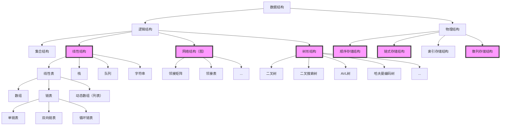

# DS101笔记

2024 spring Compiled by 武昱达 23工院

说明：

1. 一部分代码是结合标准自己手搓的（保证能够AC），如有错误或优化欢迎指正。
1. 写在后来：有的地方代码显得冗余，可略过；有些知识点覆盖不全。
1. 本意是把数据结构和算法分开，但是很多算法又对数据结构有很强的依赖性，所以除了排序算法都把算法和相应的结构放在了一起。


# I. 基础知识预备

## 一、何为计算机科学

可以将计算机科学完善地定义为：研究**问题及其解决方案**，以及**研究目前无解的问题**的学科。

* **算法**：算法是具有**有限步骤**的过程，依照这个过程便能解决问题。

* **可计算**：若存在能够解决某个问题的算法，那么该问题便是可计算的。

​	**注意：解决方案本身是独立于计算机的。**

* **接口**：这有时候也被称为过程的“黑盒”视角。我们仅需要描述接口——函数名、所需参数，以及返回值。所有的计算细节都被隐藏了起来。

* **数据类型**：计算机中的所有数据实例均由二进制字符串来表达。为了赋予这些数据实际的意义，必须要有数据类型。数据类型能够帮助我们解读二进制数据的含义，从而使我们能从待解决问题的角度来看待数据。

* **抽象**：

  * **过程抽象**将功能的实现细节隐藏起来，从而使用户能从更高的视角来看待功能。
  * **数据抽象**的基本思想与此类似。**抽象数据类型**（有时简称为**ADT**）从逻辑上描述了如何看待数据及其对应运算而无须考虑具体实现。这意味着我们仅需要关心数据代表了什么，而可以忽略它们的构建方式。通过这样的抽象，我们对数据进行了一层封装，其基本思想是封装具体的实现细节，使它们对用户不可见，这被称为**信息隐藏**。

* **数据结构**：抽象数据类型的实现常被称为**数据结构**，这需要我们通过编程语言的语法结构和原生数据类型从物理视角看待数据。

  由于实现抽象数据类型通常会有很多种方法，因此**独立于实现**的数据视角使程序员能够改变实现细节而不影响用户与数据的实际交互。用户能够始终专注于解决问题。

  

## 二、 Python基础


* **原子数据类型**：指在并发编程中不可再分的数据类型。它们是在并发环境中可以被安全地访问和修改的数据类型，通常是基本数据类型，如整数、布尔值和指针等。

  Python的原子数据类型包括**整数、浮点数、布尔值**等。

  

* **集合数据类型**：列表、字符串以及元组是概念上非常相似的有序集合，集（set）和字典是无序集合。

  非常重要的一点是，重复运算返回的结果是序列中指向数据对象的引用的重复。下面的例子可以很好地说明这一点。

  ```python
  >>> myList = [1,2,3,4]
  >>> A = [myList]＊3
  >>> A
  [[1, 2, 3, 4], [1, 2, 3, 4], [1, 2, 3, 4]]
  >>> myList[2] = 45
  >>> A 
  [[1, 2, 45, 4], [1, 2, 45, 4], [1, 2, 45, 4]]
  ```

  变量A包含3个指向myList的引用。myList中的一个元素发生改变，A中的3处都随即改变。

* **控制结构**

  算法需要两个重要的控制结构：**迭代**和**分支**。Python通过多种方式支持这两种控制结构。程序员可以根据需要选择最有效的结构。

  对于迭代，Python提供了while语句以及for语句。

  绝大多数的编程语言都提供两种有用的分支结构：if,elif,else。


## 三、复杂度

- **Big-O Notation (Ο)** – Big-O notation specifically describes the worst-case scenario.

  O记号专门记录最坏情况

- **Omega Notation (Ω)** – Omega(Ω) notation specifically describes the best-case scenario.  

  Ω记号专门记录最佳情况

- **Theta Notation (θ)** – This notation represents the average complexity of an algorithm.  

  θ记录平均

一般O记号应用最多，因为他给出了一个上界。


# II. 基础数据结构




## 一、线性结构

### 1. 线性表

线性表是一种线性结构（**逻辑结构**，在说线性表的时候不考虑具体实现办法），常见的有**数组**和**链表**。

* **数组**是⼀种**连续存储结构**，它将线性表的元素按照⼀定的顺序依次存储在内存中的**连续地址空间**上。数组需要预先分配⼀定的内存空间，每个元素占⽤相同⼤⼩的内存空间，并可以通过索引来进⾏快速访问和操作元素。访问元素 的时间复杂度为O(1)，因为可以直接计算元素的内存地址。然⽽，插⼊和删除元素的时间复杂度较⾼，平均为O(n)，因为需要**移动其他元素来保持连续存储的特性**。
* **链表**是⼀种存储结构，它是线性表的链式存储⽅式。链表通过节点的相互链接来实现元素的存储。每个节点包含元素本身以及指向下⼀个节点的指针。**链表的插⼊和删除操作非常高效，时间复杂度为O(1)**，因为只需要调整节点的 指针。然⽽，访问元素的时间复杂度较⾼，平均为O(n)，因为必须从头节点开始遍历链表直到找到⽬标元素。

| 线性表 | 插入复杂度 | 查找复杂度 |
| ------ | ---------- | ---------- |
| 数组   | O(n)       | O(1)       |
| 链表   | O(1)       | O(n)       |


链表是一种常见的数据结构，用于存储和组织数据。它**由一系列节点组成，每个节点包含一个数据元素和一个指向下一个节点（或前一个节点）的指针**。

在链表中，每个节点都包含两部分：

1. **数据元素（或数据项）**：这是节点存储的实际数据。可以是任何数据类型，例如整数、字符串、对象等。

2. **指针（或引用）**：该指针指向链表中的下一个节点（或前一个节点）。它们用于建立节点之间的连接关系，从而形成链表的结构。

根据指针的类型和连接方式，链表可以分为不同类型，包括：

1. **单向链表（单链表）**：每个节点只有一个指针，指向下一个节点。链表的头部指针指向第一个节点，而最后一个节点的指针为空（指向 `None`）。

2. **双向链表**：每个节点有两个指针，一个指向前一个节点，一个指向后一个节点。双向链表可以从头部或尾部开始遍历，并且可以在任意位置插入或删除节点。

3. **循环链表**：最后一个节点的指针指向链表的头部，形成一个环形结构。循环链表可以从任意节点开始遍历，并且可以无限地循环下去。

链表相对于数组的一个重要特点是，链表的大小可以动态地增长或缩小，而不需要预先定义固定的大小。这使得链表在需要频繁插入和删除元素的场景中更加灵活。

然而，链表的访问和搜索操作相对较慢，因为需要遍历整个链表才能找到目标节点。与数组相比，链表的优势在于插入和删除操作的效率较高，尤其是在操作头部或尾部节点时。因此，链表在需要频繁插入和删除元素而不关心随机访问的情况下，是一种常用的数据结构。

####  **单向链表实现**

```python
class Node:
    def __init__(self, value):
        self.value = value
        self.next = None

class LinkedList:
    def __init__(self):
        self.head = None

    def insert(self, value):
        new_node = Node(value)
        if self.head is None:
            self.head = new_node
        else:
            current = self.head
            while current.next:
                current = current.next
            current.next = new_node

    def delete(self, value):
        if self.head is None:
            return

        if self.head.value == value:
            self.head = self.head.next
        else:
            current = self.head
            while current.next:
                if current.next.value == value:
                    current.next = current.next.next
                    break
                current = current.next

    def display(self):
        current = self.head
        while current:
            print(current.value, end=" ")
            current = current.next
        print()

# 使用示例
linked_list = LinkedList()
linked_list.insert(1)
linked_list.insert(2)
linked_list.insert(3)
linked_list.display()  # 输出：1 2 3
linked_list.delete(2)
linked_list.display()  # 输出：1 3
```

#### **双向链表实现**

```python
class Node:
    def __init__(self, value):
        self.value = value
        self.prev = None
        self.next = None

class DoublyLinkedList:
    def __init__(self):
        self.head = None
        self.tail = None

    def insert_before(self, node, new_node):
        if node is None:  # 如果链表为空，将新节点设置为头部和尾部
            self.head = new_node
            self.tail = new_node
        else:
            new_node.next = node
            new_node.prev = node.prev
            if node.prev is not None:
                node.prev.next = new_node
            else:  # 如果在头部插入新节点，更新头部指针
                self.head = new_node
            node.prev = new_node

    def display_forward(self):
        current = self.head
        while current is not None:
            print(current.value, end=" ")
            current = current.next
        print()

    def display_backward(self):
        current = self.tail
        while current is not None:
            print(current.value, end=" ")
            current = current.prev
        print()

# 使用示例
linked_list = DoublyLinkedList()

# 创建节点
node1 = Node(1)
node2 = Node(2)
node3 = Node(3)

# 将节点插入链表
linked_list.insert_before(None, node1)  # 在空链表中插入节点1
linked_list.insert_before(node1, node2)  # 在节点1前插入节点2
linked_list.insert_before(node1, node3)  # 在节点1前插入节点3

# 显示链表内容
linked_list.display_forward()  # 输出：3 2 1
linked_list.display_backward()  # 输出：1 2 3
```


### 2. 栈与队列

栈和队列可以认为是特殊线性表。

栈：后进先出，Python中容易实现。

队列：先进先出，Python中容易实现。

#### ① 栈

----

```python
# stack类的标准方法
s.isEmpty()
s.push(1)
s.peek()
s.size()
s.pop()
```

```python
class Stack:
    def __init__(self):
        self.items = []
    
    def is_empty(self):
        return self.items == []
    
    def push(self, item):
        self.items.append(item)
    
    def pop(self):
        return self.items.pop()
    
    def peek(self):
        return self.items[len(self.items)-1]
    
    def size(self):
        return len(self.items)
```

##### **（a）中缀表达式转后缀表达式-Dijkstra Shunting Yard算法**

**Dijkstra Shunting Yard** 调度场算法的主要思想是使用两个栈（运算符栈和输出栈）来处理表达式的符号。算法按照运算符的优先级和结合性，将符号逐个处理并放置到正确的位置。最终，输出栈中的元素就是转换后的后缀表达式。

以下是 Shunting Yard 算法的基本步骤：

1. 初始化运算符栈和输出栈为空。
2. 从左到右遍历中缀表达式的每个符号。
   - 如果是操作数（数字），则将其添加到输出栈。
   - 如果是左括号，则将其推入运算符栈。
   - 如果是运算符：
     - 如果运算符的优先级大于运算符栈顶的运算符，或者运算符栈顶是左括号，则将当前运算符推入运算符栈。
     - 否则，将运算符栈顶的运算符弹出并添加到输出栈中，直到满足上述条件（或者运算符栈为空）。
     - 将当前运算符推入运算符栈。
   - 如果是右括号，则将运算符栈顶的运算符弹出并添加到输出栈中，直到遇到左括号。将左括号弹出但不添加到输出栈中。
3. 如果还有剩余的运算符在运算符栈中，将它们依次弹出并添加到输出栈中。
4. 输出栈中的元素就是转换后的后缀表达式。


#### **②队列**

| **Queue Operation** | **Queue Contents**   | **Return Value** |
| :------------------ | :------------------- | :--------------- |
| `q.isEmpty()`       | `[]`                 | `True`           |
| `q.enqueue(4)`      | `[4]`                |                  |
| `q.enqueue('dog')`  | `['dog',4]`          |                  |
| `q.enqueue(True)`   | `[True,'dog',4]`     |                  |
| `q.size()`          | `[True,'dog',4]`     | `3`              |
| `q.isEmpty()`       | `[True,'dog',4]`     | `False`          |
| `q.enqueue(8.4)`    | `[8.4,True,'dog',4]` |                  |
| `q.dequeue()`       | `[8.4,True,'dog']`   | `4`              |
| `q.dequeue()`       | `[8.4,True]`         | `'dog'`          |
| `q.size()`          | `[8.4,True]`         | `2`              |

**队列的代码实现：**

----

```python
class Queue:
    def __init__(self):
        self.items = []

    def is_empty(self):
        return self.items == []

    def enqueue(self, item):
        self.items.insert(0, item)

    def dequeue(self):
        return self.items.pop()

    def size(self):
        return len(self.items)


q = Queue()

q.enqueue('hello')
q.enqueue('dog')
q.enqueue(3)
print(q.items)

q.dequeue()
print(q.items)
# output:
# [3, 'dog', 'hello']
# [3, 'dog']
```

**双端队列：（右边头，左边尾）**

---

| **Deque Operation** | **Deque Contents**         | **Return Value** |
| :------------------ | :------------------------- | :--------------- |
| `d.isEmpty()`       | `[]`                       | `True`           |
| `d.addRear(4)`      | `[4]`                      |                  |
| `d.addRear('dog')`  | `['dog',4,]`               |                  |
| `d.addFront('cat')` | `['dog',4,'cat']`          |                  |
| `d.addFront(True)`  | `['dog',4,'cat',True]`     |                  |
| `d.size()`          | `['dog',4,'cat',True]`     | `4`              |
| `d.isEmpty()`       | `['dog',4,'cat',True]`     | `False`          |
| `d.addRear(8.4)`    | `[8.4,'dog',4,'cat',True]` |                  |
| `d.removeRear()`    | `['dog',4,'cat',True]`     | `8.4`            |
| `d.removeFront()`   | `['dog',4,'cat']`          | `True`           |

代码实现：

```python
class Deque:
    def __init__(self):
        self.items = []

    def isEmpty(self):
        return self.items == []

    def addFront(self, item):
        self.items.append(item)

    def addRear(self, item):
        self.items.insert(0, item)

    def removeFront(self):
        return self.items.pop()

    def removeRear(self):
        return self.items.pop(0)

    def size(self):
        return len(self.items)


d = Deque()
print(d.isEmpty())
d.addRear(4)
d.addRear('dog')
d.addFront('cat')
d.addFront(True)

print(d.size())
print(d.isEmpty())
d.addRear(8.4)
print(d.removeRear())
print(d.removeFront())
"""
True
4
False
8.4
True
"""
```

在双端队列的Python实现中，在前端进行的添加操作和移除操作的时间复杂度是O(1)，在后端的则是O(n)。


## 二、树

### 1. 树的定义

**定义一：树**由节点及连接节点的边构成。树有以下属性：
❏ 有一个根节点；
❏ 除根节点外，其他每个节点都与其唯一的父节点相连；
❏ 从根节点到其他每个节点都有且仅有一条路径；
❏ 如果每个节点最多有两个子节点，我们就称这样的树为二叉树。

**定义二：**一棵树要么为空，要么由一个根节点和零棵或多棵子树构成，子树本身也是一棵树。每棵子树的根节点通过一条边连到父树的根节点。图3展示了树的递归定义。从树的递归定义可知，图中的树至少有4个节点，因为三角形代表的子树必定有一个根节点。这棵树或许有更多的节点，但必须更深入地查看子树后才能确定。


### 2. 树的组成

**节点 Node**：节点是树的基础部分。
每个节点具有名称，或“键值”。节点还可以保存额外数据项，数据项根据不同的应用而变。

**边 Edge**：边是组成树的另一个基础部分。
每条边恰好连接两个节点，表示节点之间具有关联，边具有出入方向；
每个节点（除根节点）恰有一条来自另一节点的入边；
每个节点可以有零条/一条/多条连到其它节点的出边。<u>如果加限制不能有 “多条边”，这里树结构就特殊化为线性表</u>

**根节 Root**: 树中唯一没有入边的节点。

**路径 Path**：由边依次连接在一起的有序节点列表。比如，哺乳纲→食肉目→猫科→猫属→家猫就是一条路径。

**子节点 Children**：入边均来自于同一个节点的若干节点，称为这个节点的子节点。

**父节点 Parent**：一个节点是其所有出边连接节点的父节点。

**兄弟节点 Sibling**：具有同一父节点的节点之间为兄弟节点。

**子树 Subtree**：一个节点和其所有子孙节点，以及相关边的集合。

**叶节点 Leaf Node**：没有子节点的节点称为叶节点。

**层级 Level**：
从根节点开始到达一个节点的路径，所包含的边的数量，称为这个节点的层级。

**高度Height** ：所有节点层级的最大值。

**二叉树深度**：从根节点到叶节点依次经过的节点形成的树的一条路径，最长路径的节点个数为树的深度。

特别注意：根据定义，**depth=height+1**

### 3. 树的表示方法

（1）嵌套括号表示

例如：（A(D,E(F,G)),B,C）

（2）树形表示

（3）venn图表示

（4）凹入表

### 4. 树的遍历

原理：

前序：根、左子树、右子树（根左右）

中序：左子树、根、右子树（左根右）

后序：左子树、右子树、跟（右根左）


实现（同时附带括号表达树向类的转换）：

```python
class TreeNode:
    def __init__(self, value):
        self.value = value
        self.children = []

        
def parse_tree(s):
    stack = []
    node = None
    for char in s:
        if char.isalpha():  # 如果是字母，创建新节点
            node = TreeNode(char)
            if stack:  # 如果栈不为空，把节点作为子节点加入到栈顶节点的子节点列表中
                stack[-1].children.append(node)
        elif char == '(':  # 遇到左括号，当前节点可能会有子节点
            if node:
                stack.append(node)  # 把当前节点推入栈中
                node = None
        elif char == ')':  # 遇到右括号，子节点列表结束
            if stack:
                node = stack.pop()  # 弹出当前节点
    return node  # 根节点

# 返回的字符串会作为可迭代对象被拆分加入output列表中
def preorder(node):
    output = [node.value]
    for child in node.children:
        output.extend(preorder(child))
    return ''.join(output)

def postorder(node):
    output = []
    for child in node.children:
        output.extend(postorder(child))
    output.append(node.value)
    return ''.join(output)
```

对树进行遍历的笔试建议：

https://www.bilibili.com/video/BV1Ub4y147Zv/?spm_id_from=333.880.my_history.page.click&vd_source=3f199d9ea3483b5a16fda356dff9a2b0

### 5. 树的应用

#### ① 解析树

我们可以将` ( ( 7 + 3) * ( 5 - 2 ) )` 这样的数学表达式表示成解析树


* **构建解析树**

  构建解析树的第一步是将表达式字符串拆分成标记列表。

  需要考虑4种标记：左括号、右括号、运算符和操作数。

  我们知道，左括号代表新表达式的起点，所以应该创建一棵对应该表达式的新树。

  反之，遇到右括号则意味着到达该表达式的终点。我们也知道，操作数既是叶子节点，也是其运算符的子节点。

  此外，每个运算符都有左右子节点。

  有了上述信息，便可以定义以下4条规则：

  **(1) 如果当前标记是“(”，就为当前节点添加一个左子节点，并下沉至该子节点；**
  **(2) 如果当前标记在列表`['+', '-', '/', '＊']`中，就将当前节点的值设为当前标记对应的运算符；为当前节点添加一个右子节点，并下沉至该子节点；**
  **(3) 如果当前标记是数字，就将当前节点的值设为这个数并返回至父节点；**
  **(4) 如果当前标记是)，就跳到当前节点的父节点。**

  以（3+（4*5））为例。

  

```python
class Stack(object):
    def __init__(self):
        self.items = []
        self.stack_size = 0

    def isEmpty(self):
        return self.stack_size == 0

    def push(self, new_item):
        self.items.append(new_item)
        self.stack_size += 1

    def pop(self):
        self.stack_size -= 1
        return self.items.pop()

    def peek(self):
        return self.items[self.stack_size - 1]

    def size(self):
        return self.stack_size


class BinaryTree:
    def __init__(self, rootObj):
        self.key = rootObj
        self.leftChild = None
        self.rightChild = None

    def insertLeft(self, newNode):
        if self.leftChild == None:
            self.leftChild = BinaryTree(newNode)
        else:  # 已经存在左子节点。此时，插入一个节点，并将已有的左子节点降一层。
            t = BinaryTree(newNode)
            t.leftChild = self.leftChild
            self.leftChild = t

    def insertRight(self, newNode):
        if self.rightChild == None:
            self.rightChild = BinaryTree(newNode)
        else:
            t = BinaryTree(newNode)
            t.rightChild = self.rightChild
            self.rightChild = t

    def getRightChild(self):
        return self.rightChild

    def getLeftChild(self):
        return self.leftChild

    def setRootVal(self, obj):
        self.key = obj

    def getRootVal(self):
        return self.key

    def traversal(self, method="preorder"):
        if method == "preorder":
            print(self.key, end=" ")
        if self.leftChild != None:
            self.leftChild.traversal(method)
        if method == "inorder":
            print(self.key, end=" ")
        if self.rightChild != None:
            self.rightChild.traversal(method)
        if method == "postorder":
            print(self.key, end=" ")


def buildParseTree(fpexp):
    fplist = fpexp.split()
    pStack = Stack()
    eTree = BinaryTree('')
    pStack.push(eTree)
    currentTree = eTree

    for i in fplist:
        if i == '(':
            currentTree.insertLeft('')
            pStack.push(currentTree)
            currentTree = currentTree.getLeftChild()
        elif i not in '+-*/)':
            currentTree.setRootVal(int(i))
            parent = pStack.pop()
            currentTree = parent
        elif i in '+-*/':
            currentTree.setRootVal(i)
            currentTree.insertRight('')
            pStack.push(currentTree)
            currentTree = currentTree.getRightChild()
        elif i == ')':
            currentTree = pStack.pop()
        else:
            raise ValueError("Unknown Operator: " + i)
    return eTree


exp = "( ( 7 + 3 ) * ( 5 - 2 ) )"
pt = buildParseTree(exp)
for mode in ["preorder", "postorder", "inorder"]:
    pt.traversal(mode)
    print()

"""
* + 7 3 - 5 2 
7 3 + 5 2 - * 
7 + 3 * 5 - 2 
"""

# 代码清单6-10
import operator

def evaluate(parseTree):
    opers = {'+':operator.add, '-':operator.sub, '*':operator.mul, '/':operator.truediv}

    leftC = parseTree.getLeftChild()
    rightC = parseTree.getRightChild()

    if leftC and rightC:
        fn = opers[parseTree.getRootVal()]
        return fn(evaluate(leftC),evaluate(rightC))
    else:
        return parseTree.getRootVal()

print(evaluate(pt))
# 30

#代码清单6-14 后序求值
def postordereval(tree):
    opers = {'+':operator.add, '-':operator.sub,
             '*':operator.mul, '/':operator.truediv}
    res1 = None
    res2 = None
    if tree:
        res1 = postordereval(tree.getLeftChild())
        res2 = postordereval(tree.getRightChild())
        if res1 and res2:
            return opers[tree.getRootVal()](res1,res2)
        else:
            return tree.getRootVal()

print(postordereval(pt))
# 30

#代码清单6-16 中序还原完全括号表达式
def printexp(tree):
    sVal = ""
    if tree:
        sVal = '(' + printexp(tree.getLeftChild())
        sVal = sVal + str(tree.getRootVal())
        sVal = sVal + printexp(tree.getRightChild()) + ')'
    return sVal

print(printexp(pt))
# (((7)+3)*((5)-2))
```

解析树的构建、遍历可以和前、中、后续表达式联系起来。


#### ② 二叉搜索树（Binary Searching Tree BST）

二叉搜索树（Binary Search Tree，BST），它是映射的另一种实现。我们感兴趣的不是元素在树中的确切位置，而是如何利用二叉树结构提供高效的搜索。

**二叉搜索树依赖于这样一个性质：小于父节点的键都在左子树中，大于父节点的键则都在右子树中。我们称这个性质为二叉搜索性。**

依赖于这一特性，二叉搜索树的中序遍历是有序的。通过这个办法可以实现树排序，平均时间复杂度为**$$nlogn$$**.但是当树的平衡性很差时时间复杂度会坍塌到$$O(n^2)$$​.


#### ③平衡二叉搜索树（AVLTree）

##### (a) 简介

当二叉搜索树不平衡时，get和put等操作的性能可能降到O(n)。本节将介绍一种特殊的二叉搜索树，它能**自动维持平衡**。这种树叫作 AVL树，以其发明者G. M. **A**delson-**V**elskii和E. M. **L**andis的姓氏命名。

实现：AVL树实现映射抽象数据类型的方式与普通的二叉搜索树一样，唯一的差别就是性能。实现AVL树时，要**记录每个节点的平衡因子**。我们**通过查看每个节点左右子树的高度来实现**这一点。更正式地说，我们**将平衡因子定义为左右子树的高度之差**。

$BalanceFactor = height (left SubTree) - height(right SubTree)$

根据上述定义，如果平衡因子大于零，我们称之为**左倾**；如果平衡因子小于零，就是**右倾**；如果平衡因子等于零，那么树就是**完全平衡**的。

为了实现AVL树并利用平衡树的优势，我们**将平衡因子为-1、0和1的树都定义为平衡树**。一旦某个节点的**平衡因子超出这个范围，我们就需要通过一个过程让树恢复平衡**。


**图1** 带平衡因子的右倾树


假设现在已有一棵平衡二叉树，那么可以预见到，在往其中插入一个结点时，一定会有结点的平衡因子发生变化，此时可能会有结点的平衡因子的绝对值大于 1（这些平衡因子只可能是 2 或者 -2)，这样以该结点为根结点的子树就是失衡的，需要进行调整。显然，只有在从根结点到该插入结点的路径上的结点才可能发生平衡因子变化，因此只需对这条路径上失衡的结点进行调整。

可以证明，**只要把最靠近插入结点的失衡结点调整到正常，路径上的所有结点就都会平衡**。

##### (b) 两种旋转操作

* **左旋**

> 如果需要进行再平衡，该怎么做呢？高效的再平衡是让AVL树发挥作用同时不损性能的关键。为了让AVL树恢复平衡，需要在树上进行一次或多次旋转。
>
> 要理解什么是旋转，来看一个简单的例子。考虑图2中左边的树。这棵树失衡了，平衡因子是-2。要让它恢复平衡，我们围绕以节点A为根节点的子树做一次左旋。
>
> 
>
> **图2** 通过左旋让失衡的树恢复平衡
>
> 本质上，左旋包括以下步骤。
>
> 1. **将右子节点（节点B）提升为子树的根节点。**
>
> 2.  **将旧根节点（节点A）作为新根节点的左子节点。**
>
> 3.  **如果新根节点（节点B）已经有一个左子节点，将其作为新左子节点（节点A）的右子节点。**
>
>    **注意，<u>因为节点B之前是节点A的右子节点，所以此时节点A必然没有右子节点。</u>因此，可以为它添加新的右子节点，而无须过多考虑。**

* **右旋**

> 我们来看一棵稍微复杂一点的树，并理解右旋过程。图4左边的是一棵左倾的树，根节点的平衡因子是2。右旋步骤如下。
>
> 
>
> **图3** 通过右旋让失衡的树恢复平衡
>
> 1. **将左子节点（节点C）提升为子树的根节点。**
> 2.  **将旧根节点（节点E）作为新根节点的右子节点。**
> 3.  **如果新根节点（节点C）已经有一个右子节点（节点D），将其作为新右子节点（节点E）的左子节点。注意，<u>因为节点C之前是节点E的左子节点，所以此时节点E必然没有左子节点。</u>因此，可以为它添加新的左子节点，而无须过多考虑。**


##### (c) 四种树形以及对应调整办法

假设最靠近插入结点的失衡结点是 A，显然它的平衡因子只可能是 2 或者 -2。很容易发现这两种情况完全对称，因此主要讨论结点 A 的平衡因子是 2 的情形。

由于结点 A 的平衡因子是 2，因此左子树的高度比右子树大 2，于是以结点 A 为根结点的子树一定是图4的两种形态 LL 型与 LR 型之一（**注意：LL 和 LR 只表示树型，不是左右旋的意思**），其中☆、★、◇、◆是图中相应结点的 AVL 子树，结点 A、B、C 的权值满足 A > B > C。可以发现，**当结点 A 的左孩子的平衡因子是 1 时为 LL 型，是 -1 时为 LR 型**。那么，为什么结点 A 的左孩子的平衡因子只可能是 1 或者 -1 ，而不可能是 0 呢？这是因为这种情况无法由平衡二叉树插入一个结点得到。


**图4** 树型之 LL 型与 LR 型（数字代表平衡因子）


补充说明，除了☆、★、◇、◆均为空树的情况以外，其他任何情况均满足：**在插入前，底层两棵子树的高度比另外两棵子树的高度小 1，且插入操作一定发生在底层两棵子树上**。例如对LL型来说，插入前子树的高度满足☆ = ★ = ◆-1 = ◇-1，而在☆或★中插入一个结点后导致☆或★的高度加 1，使得结点A不平衡。现在考虑怎样调整这两种树型，才能使树平衡。

> 先考虑 LL 型，可以把以 C 为根结点的子树看作一个整体，然后以结点 A 作为 root 进行右旋，便可以达到平衡，如图5 所示。
>
> 
>
> **图5** LL 型调整示意图（数字代表平衡因子）


>然后考虑 LR 型，可以先忽略结点 A，以结点 C 为root 进行左旋，就可以把情况转化为 LL 型，然后按上面 LL 型的做法进行一次右旋即可，如图6 所示。
>
>
>
>**图6** LR型调整示意图（数字代表平衡因子）


至此,结点 A 的平衡因子是 2 的情况已经讨论清楚,下面简要说明平衡因子是 -2 的情况，显然两种情况是完全对称的。
由于结点 A 的平衡因子为 -2，因此右子树的高度比左子树大 2，于是以结点A为根结点的子树一定是图7 的两种形态 RR 型与 RL 型之一。注意，由于和上面讨论的 LL 型和 LR 型对称，此处结点 A、B、C 的权值满足A < B < C。可以发现，**当结点 A 的右孩子的平衡因子是 -1 时为 RR 型，是1时为 RL 型**。


**图7** 树型之 RR型与RL型（数字代表平衡因子）


>对 RR 型来说，可以把以 C 为根结点的子树看作一个整体，然后以结点 A 作为 root 进行左旋，便可以达到平衡，如图8 所示。
>
>
>
>**图8** RR 型调整示意图（数字代表平衡因子）


>对 RL 型来说，可以先忽略结点 A，以结点 C 为 root 进行右旋，就可以把情况转化为 RR 然后按上面 RR 型的做法进行一次左旋即可，如图9 所示。
>
>
>
>**图9** RL型调整示意图（数字代表平衡因子）


至此，对**LL 型、LR 型、RR 型、RL型**的调整方法都已经讨论清楚。

通过维持树的平衡，可以保证get方法的时间复杂度为$O(log_2(n))$。但这会给put操作的性能带来多大影响呢？我们来看看put操作。因为新节点作为叶子节点插入，所以更新所有父节点的平衡因子最多需要$log_2(n)$次操作——每一层一次。如果树失衡了，恢复平衡最多需要旋转两次。每次旋转的时间复杂度是O(1)，所以put操作的时间复杂度仍然是$O(log_2(n))$​。

至此，我们已经实现了一棵可用的AVL树。

##### (d) 建立AVLTree

```python
class Node:
    def __init__(self, value):
        self.value = value
        self.left = None
        self.right = None
        self.height = 1
class AVL:
    def __init__(self):
        self.root = None
    def insert(self, value):
        if not self.root:
            self.root = Node(value)
        else:
            self.root = self._insert(value, self.root)

    def _insert(self, value, node):
        if not node:
            return Node(value)
        elif value < node.value:
            node.left = self._insert(value, node.left)
        else:
            node.right = self._insert(value, node.right)

        node.height = 1 + max(self._get_height(node.left), self._get_height(node.right))

        balance = self._get_balance(node)

        if balance > 1:
            if value < node.left.value:	# 树形是 LL
                return self._rotate_right(node)
            else:	# 树形是 LR
                node.left = self._rotate_left(node.left)
                return self._rotate_right(node)

        if balance < -1:
            if value > node.right.value:	# 树形是 RR
                return self._rotate_left(node)
            else:	# 树形是 RL
                node.right = self._rotate_right(node.right)
                return self._rotate_left(node)

        return node

    def _get_height(self, node):
        if not node:
            return 0
        return node.height

    def _get_balance(self, node):
        if not node:
            return 0
        return self._get_height(node.left) - self._get_height(node.right)

    def _rotate_left(self, z):
        y = z.right
        T2 = y.left
        y.left = z
        z.right = T2
        z.height = 1 + max(self._get_height(z.left), self._get_height(z.right))
        y.height = 1 + max(self._get_height(y.left), self._get_height(y.right))
        return y

    def _rotate_right(self, y):
        x = y.left
        T2 = x.right
        x.right = y
        y.left = T2
        y.height = 1 + max(self._get_height(y.left), self._get_height(y.right))
        x.height = 1 + max(self._get_height(x.left), self._get_height(x.right))
        return x
```


#### ④ Huffman算法（哈夫曼编码）

哈夫曼算法是一种压缩算法，可以在不损失信息的同时减省空间，在通讯领域使用频繁。

哈夫曼编码的一切理论细节可以参考视频：[哈弗曼编码理论](https://www.bilibili.com/video/BV1qu411F7Zs/?spm_id_from=333.1007.top_right_bar_window_history.content.click&vd_source=3f199d9ea3483b5a16fda356dff9a2b0)

代码实现（这里不包含最小带权路径的计算）：

```python
import heapq
class HuffmanTreeNode:
    def __init__(self,weight,char=None):
        self.weight=weight
        self.char=char
        self.left=None
        self.right=None

    def __lt__(self,other):
        if self.weight==other.weight:
            return self.char<other.char
        return self.weight<other.weight

def BuildHuffmanTree(characters):
    heap=[HuffmanTreeNode(weight,char) for char,weight in characters.items()]
    heapq.heapify(heap)
    while len(heap)>1:
        left=heapq.heappop(heap)
        right=heapq.heappop(heap)
        merged=HuffmanTreeNode(left.weight+right.weight)
        merged.left=left
        merged.right=right
        heapq.heappush(heap,merged)
    root=heapq.heappop(heap)
    return root

def encode_huffman_tree(root):
    codes={}
    def traverse(node,code):
        if node.char:
            codes[node.char]=code
        else:
            traverse(node.left,code+'0')
            traverse(node.right,code+'1')
    traverse(root,"")
    return codes

def huffman_encoding(codes,string):
    encoded=""
    for char in string:
        encoded+=codes[char]
    return encoded

def huffman_decoding(root,encoded_string):
    decoded=""
    node=root
    for bit in encoded_string:
        if bit=='0':
            node=node.left
        else:
            node=node.right
        if node.char:
            decoded+=node.char
            node=root
    return decoded
```


#### ⑤ 并查集（Disjoint Set）

我们为树引入拓展概念：森林。

多棵互不包含的树组成一个森林。并查集散乱的性质刚好适合于用森林来实现，因此我们把并查集放在树的应用部分。

概括地讲，我们是为了高效地实现散分布元素的**合并与查找**，引入并查集这一高效的数据结构。

由上述目的，并查集需要两个核心方法：**Union**和**Find**。

> 如果两个集合没有交集，那么他们之间互为Disjoint sets。
>
> 并查集支持如下操作：
>
> * 添加新的散集合
> * 合并散集合
> * 找到每个集合的代表元素。特别地，我们选择寻找树根的方式实现。
> * 判断两个集合是否互为Disjoint Sets。


## 三、散列表

### 3.1 散列表的基本概念

> 参考：数据结构（C语言版 第2版） (严蔚敏) ，第7章 查找

前6周讨论了基于线性结构、树表结构的查找方法，这类查找方法都是以关键字（Keyword）的比较为基础的。

> 线性表是一种具有相同数据类型的有限序列，其特点是每个元素都有唯一的直接前驱和直接后继。换句话说，线性表中的元素之间存在明确的线性关系，每个元素都与其前后相邻的元素相关联。
>
> 线性结构是数据结构中的一种基本结构，它的特点是数据元素之间存在一对一的关系，即除了第一个元素和最后一个元素以外，其他每个元素都有且仅有一个直接前驱和一个直接后继。线性结构包括线性表、栈、队列和串等。
>
> 因此，线性表是线性结构的一种具体实现，它是一种最简单和最常见的线性结构。

在查找过程中只考虑各元素关键字之间的相对大小，记录在存储结构中的位置和其关键字无直接关系，其查找时间与表的长度有关，特别是当结点个数很多时，查找时要大量地与无效结点的关键字进行比较，致使查找速度很慢。如果能**在元素的存储位置和其关键字之间建立某种直接关系**，那么在进行查找时，就无需做比较或做很少次的比较，按照这种关系直接由关键字找到相应的记录。这就是**散列查找法**（Hash Search）的思想，它通过对元素的关键字值进行某种运算，直接求出元素的地址，即使用关键字到地址的直接转换方法，而不需要反复比较。因此，散列查找法又叫杂凑法或散列法。


下面给出散列法中常用的几个术语。

(1) **散列函数和散列地址**：在**记录的存储位置p**和其**关键字 key** 之间建立一个确定的**对应关系 H**，使**$ p=H(key) $**，称这个对应关系H为散列函数，p为散列地址。

(2) **散列表**：一个有限连续的地址空间，用以存储按散列函数计算得到相应散列地址的数据记录。通常散列表的存储空间是一个一维数组，散列地址是数组的下标。

(3) **冲突和同义词**：对不同的关键字可能得到同一散列地址,即 key1≠key2,而 H(key1) = H(key2) 这种现象称为冲突。**具有相同函数值的关键字对该散列函数来说称作同义词，key1与 key2 互称为同义词**。


例如，在Python语言中，可以针对给定的关键字集合建立一个散列表。假设有一个关键字集合为`S1`，其中包括关键字`main`, `int`, `float`, `while`, `return`, `break`, `switch`, `case`, `do`。为了构建散列表，可以定义一个长度为26的散列表`HT`，其中每个元素是一个长度为8的字符数组。假设我们采用散列函数`H(key)`，该函数将关键字`key`中的第一个字母转换为字母表`{a,b,…,z}`中的序号（序号范围为0~25），即`H(key) = ord(key[0]) - ord('a')`。根据此散列函数构造的散列表`HT`如下所示：

```python
HT = [['' for _ in range(8)] for _ in range(26)]
```

其中，假设关键字`key`的类型为长度为8的字符数组。根据给定的关键字集合和散列函数，可以将关键字插入到相应的散列表位置。


表1

| 0    | 1     | 2    | 3    | 4    | 5     | ...  | 8    | ...  | 12   | ...  | 17     | 18     | ...  | 22    | ...  | 25   |
| ---- | ----- | ---- | ---- | ---- | ----- | ---- | ---- | ---- | ---- | ---- | ------ | ------ | ---- | ----- | ---- | ---- |
|      | break | case | do   |      | float |      | int  |      | main |      | return | switch |      | while |      |      |


假设关键字集合扩充为:

S2 = S1 + {short, default, double, static, for, struct}

如果散列函数不变，新加入的七个关键字经过计算得到：

$ H(short)=H(static)=H(struct)=18，H(default)=H(double)=3，H(for)=5 $​，

而 18、3 和5这几个位置均已存放相应的关键字，这就发生了冲突现象，其中,switch、short、static 和 struct 称为同义词；float 和 for 称为同义词；do、default 和 double 称为同义词。

集合S2中的关键字仅有 15 个，仔细分析这 15个关键字的特性，应该不难构造一个散列函数避免冲突。但在实际应用中，理想化的、不产生冲突的散列函数极少存在，这是因为通常散列表中关键字的取值集合远远大于表空间的地址集。例如，高级语言的编译程序要对源程序中的标识符建立一张符号表进行管理，多数都采取散列表。在设定散列函数时，考虑的查找关键字集合应包含所有可能产生的关键字，不同的源程序中使用的标识符一般也不相同，如果此语言规定标识符为长度不超过8的、字母开头的字母数字串，字母区分大小写，则标识符取值集合的大小为:
$C_{52}^1 \times C_{62}^7 \times 7! = 1.09 \times 10^{12}$

而一个源程序中出现的标识符是有限的,所以编译程序将散列表的长度设为 1000 足矣。于是要将多达 $ 10^{12} $个可能的标识符映射到有限的地址上，难免产生冲突。通常，散列函数是一个多对一的映射，所以冲突是不可避免的，只能通过选择一个“好”的散列函数使得在一定程度上减少冲突。而一旦发生冲突，就必须采取相应措施及时予以解决。
综上所述，散列查找法主要研究以下两方面的问题:

(1) 如何构造散列函数；
(2) 如何处理冲突。


### 3.2 散列函数的构造方法

构造散列函数的方法很多，一般来说，应根据具体问题选用不同的散列函数，通常要考虑以下因素:

(1) 散列表的长度;
(2) 关键字的长度;
(3) 关键字的分布情况;
(4) 计算散列函数所需的时间;
(5) 记录的查找频率。

构造一个“好”的散列函数应遵循以下两条原则:

(1)函数计算要简单，每一关键字只能有一个散列地址与之对应;

(2)函数的值域需在表长的范围内，计算出的散列地址的分布应均匀，尽可能减少冲突。

下面介绍构造散列函数的几种常用方法。

**1.数字分析法**

如果**事先知道关键字集合**，且**每个关键字的位数比散列表的地址码位数多**，每个关键字由n位数组成，如$ k_{1},k_{2},…k_{n} $，则可以**从关键字中提取数字分布比较均匀的若干位作为散列地址**。

例如，有 80个记录，其关键字为8位十进制数。假设散列表的表长为100，则可取两位十进制数组成散列地址，选取的原则是分析这80个关键字，使得到的散列地址尽量避免产生冲突。假设这 80个关键字中的一部分如下所列:


对关键字全体的分析中可以发现:第①、②位都是“81”，第③位只可能取3或 4，第⑧位可能取 2、5或7，因此这4位都不可取。由于中间的4位可看成是近乎随机的，因此可取其中任意两位，或取其中两位与另外两位的叠加求和后舍去进位作为散列地址。

数字分析法的适用情况：事先必须明确知道所有的关键字每一位上各种数字的分布情况。

在实际应用中，例如，同一出版社出版的所有图书，其ISBN号的前几位都是相同的，因此，若数据表只包含同一出版社的图书，构造散列函数时可以利用这种数字分析排除ISBN 号的前几位数字。


**2.平方取中法**

通常在选定散列函数时**不一定能知道关键字的全部情况**，取其中哪几位也不一定合适，而**一个数平方后的中间几位数和数的每一位都相关**，如果取关键字平方后的中间几位或其组合作为散列地址，则使随机分布的关键字得到的散列地址也是随机的，具体所取的位数由表长决定。平方取中法是一种较常用的构造散列函数的方法。

例如，为源程序中的标识符建立一个散列表，假设标识符为字母开头的字母数字串。

假设人为约定每个标识的内部编码规则如下：把字母在字母表中的位置序号作为该字母的内部编码，如 I 的内部编码为 09，D 的内部编码为 04，A 的内部编码为 01。数字直接用其自身作为内部编码,如 1的内部编码为 01，2 的内部编码为 02。根据以上编码规则，可知“IDA1”的内部编码为09040101，同理可以得到“IDB2”、“XID3”和“YID4”的内部编码。

之后分别对内部编码进行平方运算，再取出第7位到第9位作为其相应标识符的散列地址，如表 2所示。

表2 标识符及其散列地址


**3.折叠法**

将关键字分割成位数相同的几部分（最后一部分的位数可以不同），然后取这几部分的叠加和（舍去进位）作为散列地址，这种方法称为折叠法。根据数位叠加的方式，可以把折叠法分为移位叠加和边界叠加两种。移位叠加是将分割后每一部分的最低位对齐，然后相加;边界叠加是将两个相邻的部分沿边界来回折看，然后对齐相加。

例如，当散列表长为 1000 时，关键字key=45387765213，从左到右按3 位数一段分割，可以得到 4个部分:453、877、652、13。分别采用移位叠加和边界叠加，求得散列地址为 995 和914，如图 1 所示。


图 1由折叠法求得散列地址


折叠法的适用情况：适合于散列地址的位数较少，而关键字的位数较多，且难于直接从关键字中找到取值较分散的几位。


**4.除留余数法**

假设散列表表长为 m（$ len(散列)=m $），选择一个不大于m 的数p，用p去除关键字，除后所得余数为散列地址，即
$ H(key) = key\%p $

这个方法的关键是选取适当的p，**一般情况下，可以选p为小于表长的最大质数**。例如，表长m=100，可取p=97。

除留余数法计算简单，适用范围非常广，是最常用的构造散列函数的方法。它不仅可以对关键字直接取模，也可在折叠、平方取中等运算之后取模，这样能够保证散列地址一定落在散列表的地址空间中。


### 3.3 处理冲突的方法

选择一个“好”的散列函数可以在一定程度上减少冲突，但在实际应用中，很难完全避免发生冲突，所以选择一个有效的处理冲突的方法是散列法的另一个关键问题。创建散列表和查找散列表都会遇到冲突，两种情况下处理冲突的方法应该一致。下面以创建散列表为例，来说明处理冲突的方法。

处理冲突的方法与散列表本身的组织形式有关。按组织形式的不同，通常分两大类:开放地址法和链地址法。

**1.开放地址法**

开放地址法的基本思想是：把记录都存储在散列表数组中，当某一记录关键字 key 的初始散列地址 H0 = H(key)发生冲突时，以 H0 为基础，采取合适方法计算得到另一个地址 H1，如果 H1 仍然发生冲突，以 为基础再求下一个地址 H2，若 H2 仍然冲突，再求得 H3。依次类推，直至 Hk 不发生冲突为止，则 Hk 为该记录在表中的散列地址。

这种方法在寻找 ”下一个” 空的散列地址时，原来的数组空间对所有的元素都是开放的所以称为开放地址法。通常把寻找 “下一个” 空位的过程称为**探测**，上述方法可用如下公式表示：

$ H_{i}=(H(key) +d_{i})\%m $	$ i=1,2,…,k(k≤m-l) $

其中，H(key)为散列函数，m 为散列表表长，d为增量序列。根据d取值的不同，可以分为以下3种探测方法。

(1) 线性探测法
$ d_{i} = 1, 2, 3, …, m-1 $ 

这种探测方法可以将散列表假想成一个循环表，发生冲突时，从冲突地址的下一单元顺序寻找空单元，如果到最后一个位置也没找到空单元，则回到表头开始继续查找，直到找到一个空位，就把此元素放入此空位中。如果找不到空位，则说明散列表已满，需要进行溢出处理。

(2) 二次探测法
$d_i =1^2, -1^2, 2^2,-2^2,3^2,.…, +k^2,-k^2 \space (k \le m/2)$​

(3)伪随机探测法

$ d_{i} = 伪随机数序列 $
例如，散列表的长度为 11，散列函数 $ H(key)=key\%11$，假设表中已填有关键字分别为 17、60、29 的记录，如图`7.29(a)`所示。现有第四个记录，其关键字为38，由散列函数得到散列地址为 5，产生冲突。

若用线性探测法处理时，得到下一个地址6，仍冲突；再求下一个地址7，仍冲突；直到散列地址为8的位置为“空”时为止，处理冲突的过程结束，38填入散列表中序号为8的位置，如图2(b)所示。

若用二次探测法，散列地址5冲突后，得到下一个地址6，仍冲突；再求得下一个地址 4，无冲突，38填入序号为4的位置，如图 2(c)所示。

若用伪随机探测法，假设产生的伪随机数为9，则计算下一个散列地址为(5+9)%11=3，所以38 填入序号为3 的位置，如图 2(d)所示。


图 2 用开放地址法处理冲突时，关键字为38的记录插入前后的散列表

从上述线性探测法处理的过程中可以看到一个现象:当表中

$ i, i+1, i+2 $

位置上已填有记录时，下一个散列地址为

$ i、i+1、i+2、i+3 $

的记录都将填入i+3的位置，这种在处理冲突过程中发生的两个第一个散列地址不同的记录争夺同一个后继散列地址的现象称作“**二次聚集**”(或称作“**堆积**”)，即在处理同义词的冲突过程中又添加了非同义词的冲突。

可以看出，上述三种处理方法各有优缺点。线性探测法的优点是：只要散列表未填满，总能找到一个不发生冲突的地址。缺点是：会产生“二次聚集”现象。而二次探测法和伪随机探测法的优点是：可以避免“二次聚集”现象。缺点也很显然：不能保证一定找到不发生冲突的地址。


**2.链地址法**

链地址法的基本思想是：把具有相同散列地址的记录放在同一个单链表中，称为同义词链表。有 m个散列地址就有m 个单链表，同时用数组 

$ HT[0…m-1] $

存放各个链表的头指针，凡是散列地址为i的记录都以结点方式插入到以 HT[]为头结点的单链表中。

【例】 已知一组关键字为 (19 , 14 , 23 , 1，68，20 , 84 , 27 , 55 , 11 , 10 , 79)，设散列函数

$ H(key)=key\%13 $

用链地址法处理冲突，试构造这组关键字的散列表。

由散列函数 H(key)=key %13 得知散列地址的值域为 0~12，故整个散列表有 13 个单链表组成，用数组 HT[0..12]存放各个链表的头指针。如散列地址均为1的同义词 14、1、27、79 构成一个单链表，链表的头指针保存在 HT[1]中，同理，可以构造其他几个单链表，整个散列表的结构如图 3 所示。


图 3 用链地址法处理冲突时的散列表

这种构造方法在具体实现时，依次计算各个关键字的散列地址，然后根据散列地址将关键字插入到相应的链表中。


### 3.4 散列表的查找

在散列表上进行查找的过程和创建散列表的过程基本一致。


## 四、图

### 1. 图的概念、表示与遍历

1. 图的表示

   邻接矩阵、邻接表等

2. 图的遍历

   常见有BFS和DFS

3. 最短路径

   Dijkstra算法和*Floyd-Warshall算法。

4. 最小生成树

   在一个连通加权图中找出一个权值最小的生成树，常见的算法包括Prim 算法和 Kruskal 算法

5. 拓扑排序

   拓扑排序算法用于对有向无环图进行排序，使得所有的顶点按照一定的顺序排列，并且保证图中的边的方向符合顺序关系。

6. 连通性

   用于判断图中的顶点是否连通，以及找出图中的连通分量


* 初步定义

  **图（Graph）**由**顶点（Vertex）**和**边（Edge）**组成，每条边的两端都必须是图的两个顶点(可以是相同的顶点)。而记号 G(V,E)表示图 G 的顶点集为 V、边集为 E。图 2 是一个抽象出来的图


* 有向图与无向图

  图可分为有向图和无向图。有向图的所有边都有方向，即确定了顶点到顶点的一个指向；而无向图的所有边都是双向的，即无向边所连接的两个顶点可以互相到达。在一些问题中，可以把无向图当作所有边都是正向和负向的两条有向边组成。


* 顶点或键Vertex

  顶点又称节点，是图的基础部分。它可以有自己的名字，我们称作“键”。顶点也可以带有附加信息，我们称作“有效载荷”。


* **边Edge**
  边是图的另一个基础部分。两个顶点通过一条边相连，表示它们之间存在关系。边既可以是单向的，也可以是双向的。如果图中的所有边都是单向的，我们称之为有向图。图1明显是一个有向图，因为必须修完某些课程后才能修后续的课程。


* **度Degree**

  顶点的度是指和该顶点相连的边的条数。特别是**对于有向图来说，顶点的出边条数称为该顶点的出度，顶点的入边条数称为该顶点的入度**。例如图 3 的无向图中，V1的度为 2,V5的度为 4；有向图例子中，V2的出度为 1、入度为 2。

  


* **权值Weight**

  顶点和边都可以有一定属性，而量化的属性称为权值，顶点的权值和边的权值分别称为点权和边权。权值可以根据问题的实际背景设定。


* 正式定义**图Graph**

  图可以用G来表示，并且G = (V, E)。其中，V是一个顶点集合，E是一个边集合。每一条边是一个二元组(v, w)，其中w, v∈V。可以向边的二元组中再添加一个元素，用于表示权重。子图s是一个由边e和顶点v构成的集合，其中e⊂E且v⊂V。

  图4 展示了一个简单的带权有向图。我们可以用6个顶点和9条边的两个集合来正式地描述这个图：

  $V = \left\{ V0,V1,V2,V3,V4,V5 \right\}$

  

  $\begin{split}E = \left\{ \begin{array}{l}(v0,v1,5), (v1,v2,4), (v2,v3,9), (v3,v4,7), (v4,v0,1), \\
               (v0,v5,2),(v5,v4,8),(v3,v5,3),(v5,v2,1)
               \end{array} \right\}\end{split}$

  

  

  

  <center>图4 简单的带权有向图</center>

  

* **路径Path**
  路径是**由边连接的顶点组成的序列**。路径的正式定义为$w_1, w_2, ···, w_n$，其中对于所有的1≤i≤n-1，有$(w_i, w_{i+1})∈E$​。无权重路径的长度是路径上的边数，有权重路径的长度是路径上的边的权重之和。以图4为例，从 V3到 V1的路径是顶点序列(V3, V4, V0, V1)，相应的边是{(v3, v4,7), (v4, v0,1), (v0, v1,5)}。

  

* **环cycle**
  环是有向图中的一条起点和终点为同一个顶点的路径。例如，图4中的路径(V5, V2, V3, V5)就是一个环。没有环的图被称为无环图，没有环的有向图被称为有向无环图，简称为DAG。接下来会看到，DAG能帮助我们解决很多重要的问题。


### 2. 图的表示方法

我们需要以下方法定义一个抽象数据类型：图。

❏ Graph()新建一个空图。
❏ addVertex(vert)向图中添加一个顶点实例。
❏ addEdge(fromVert, toVert)向图中添加一条有向边，用于连接顶点fromVert和toVert。
❏ addEdge(fromVert, toVert, weight)向图中添加一条带权重weight的有向边，用于连接顶点fromVert和toVert。
❏ getVertex(vertKey)在图中找到名为vertKey的顶点。
❏ getVertices()以列表形式返回图中所有顶点。
❏ in通过vertex in graph这样的语句，在顶点存在时返回True，否则返回False。


> 有两种非常著名的图实现，它们分别是邻接矩阵 **adjacency matrix** 和邻接表**adjacency list**。
>
> 邻接表：
>
> ```python
> graph = {
>     'A': ['B', 'C'],
>     'B': ['A', 'D'],
>     'C': ['A', 'D'],
>     'D': ['B', 'C']
> }
> ```


#### ①邻接矩阵

要实现图，最简单的方式就是使用二维矩阵。在矩阵实现中，每一行和每一列都表示图中的一个顶点。第v行和第w列交叉的格子中的值表示从顶点v到顶点w的边的权重。如果两个顶点被一条边连接起来，就称它们是相邻的。图5展示了图4对应的邻接矩阵。格子中的值表示从顶点v到顶点w的边的权重。


Figure 5: An Adjacency Matrix Representation for a Graph

**邻接矩阵的优点是简单**。对于小图来说，邻接矩阵可以**清晰地展示哪些顶点是相连的**。但是，图5中的绝大多数单元格是空的，我们称这种矩阵是“稀疏”的。**对于存储稀疏数据来说，矩阵并不高效**。邻接矩阵适用于表示有很多条边（|V|^2^）的图。


#### ②邻接表

为了**实现稀疏连接的图，更高效的方式是使用邻接表**。在邻接表实现中，我们为图对象的所有顶点保存一个主列表，同时为每一个顶点对象都维护一个列表，其中记录了与它相连的顶点。在对Vertex类的实现中，我们使用字典（而不是列表），字典的键是顶点，值是权重。图6展示了图4所对应的邻接表。


Figure 6: An Adjacency List Representation of a Graph

邻接表的优点是能够紧凑地表示稀疏图。此外，邻接表也有助于方便地找到与某一个顶点相连的其他所有顶点。


#### ③图的类实现（代码样例）

在Python中，通过字典可以轻松地实现邻接表。**我们要创建两个类：Graph类存储包含所有顶点的主列表，Vertex类表示图中的每一个顶点**。
Vertex使用字典connectedTo来记录与其相连的顶点，以及每一条边的权重。

```python
class Vertex:
    def __init__(self,key):
        self.id = key
        self.connectedTo = {}

    def addNeighbor(self,nbr,weight=0):
        self.connectedTo[nbr] = weight

    def __str__(self):
        return str(self.id) + ' connectedTo: ' + str([x.id for x in self.connectedTo])

    def getConnections(self):
        return self.connectedTo.keys()

    def getId(self):
        return self.id

    def getWeight(self,nbr):
        return self.connectedTo[nbr]
```

```python
class Graph:
    def __init__(self):
        self.vertList = {}
        self.numVertices = 0

    def addVertex(self,key):
        self.numVertices = self.numVertices + 1
        newVertex = Vertex(key)
        self.vertList[key] = newVertex
        return newVertex

    def getVertex(self,n):
        if n in self.vertList:
            return self.vertList[n]
        else:
            return None

    def __contains__(self,n):
        return n in self.vertList

    def addEdge(self,f,t,weight=0):
        if f not in self.vertList:
            nv = self.addVertex(f)
        if t not in self.vertList:
            nv = self.addVertex(t)
        self.vertList[f].addNeighbor(self.vertList[t], weight)

    def getVertices(self):
        return self.vertList.keys()

    def __iter__(self):
        return iter(self.vertList.values())
```


### 3. 图的算法

#### ①BFS和DFS

DFS递归，BFS队列，略。

#### ②DFS实现拓扑排序

为了展示计算机科学家可以将几乎所有问题都转换成图问题，让我们来考虑如何制作一批松饼。图7-18用图的形式展示了整个过程。


图1 松饼的制作步骤

拓扑排序根据有向无环图生成一个包含所有顶点的线性序列，使得如果图G中有一条边为(v, w)，那么顶点v排在顶点w之前。

**实现：**

(1) 对图`g`调用`dfs(g)`。之所以调用深度优先搜索函数，是因为要计算每一个顶点的结束时间。
**(2) 基于结束时间，将顶点按照递减顺序存储在列表中。**
(3) 将有序列表作为拓扑排序的结果返回。


图2 根据松饼制作步骤构建的深度优先森林

```python
import sys

class Graph:
    def __init__(self):
        self.vertices = {}
        self.num_vertices = 0

    def add_vertex(self, key):
        self.num_vertices = self.num_vertices + 1
        new_ertex = Vertex(key)
        self.vertices[key] = new_ertex
        return new_ertex

    def get_vertex(self, n):
        if n in self.vertices:
            return self.vertices[n]
        else:
            return None

    def __len__(self):
        return self.num_vertices

    def __contains__(self, n):
        return n in self.vertices

    def add_edge(self, f, t, cost=0):
        if f not in self.vertices:
            nv = self.add_vertex(f)
        if t not in self.vertices:
            nv = self.add_vertex(t)
        self.vertices[f].add_neighbor(self.vertices[t], cost)
        #self.vertices[t].add_neighbor(self.vertices[f], cost)

    def getVertices(self):
        return list(self.vertices.keys())

    def __iter__(self):
        return iter(self.vertices.values())


class Vertex:
    def __init__(self, num):
        self.key = num
        self.connectedTo = {}
        self.color = 'white'
        self.distance = sys.maxsize
        self.previous = None
        self.discovery = 0
        self.finish = None

    def __lt__(self, o):
        return self.key < o.key

    def add_neighbor(self, nbr, weight=0):
        self.connectedTo[nbr] = weight

    def setDiscovery(self, dtime):
        self.discovery = dtime

    def setFinish(self, ftime):
        self.finish = ftime

    def getFinish(self):
        return self.finish

    def getDiscovery(self):
        return self.discovery

    def get_neighbors(self):
        return self.connectedTo.keys()

    # def getWeight(self, nbr):
    #     return self.connectedTo[nbr]

    def __str__(self):
        return str(self.key) + ":color " + self.color + ":disc " + str(self.discovery) + ":fin " + str(
            self.finish) + ":dist " + str(self.distance) + ":pred \n\t[" + str(self.previous) + "]\n"


class DFSGraph(Graph):
    def __init__(self):
        super().__init__()
        self.time = 0
        self.topologicalList = []

    def dfs(self):
        for aVertex in self:
            aVertex.color = "white"
            aVertex.predecessor = -1
        for aVertex in self:
            if aVertex.color == "white":
                self.dfsvisit(aVertex)

    def dfsvisit(self, startVertex):
        startVertex.color = "gray"
        self.time += 1
        startVertex.setDiscovery(self.time)
        for nextVertex in startVertex.get_neighbors():
            if nextVertex.color == "white":
                nextVertex.previous = startVertex
                self.dfsvisit(nextVertex)
        startVertex.color = "black"
        self.time += 1
        startVertex.setFinish(self.time)

    def topologicalSort(self):
        self.dfs()
        temp = list(self.vertices.values())
        temp.sort(key = lambda x: x.getFinish(), reverse = True)
        print([(x.key,x.finish) for x in temp])
        self.topologicalList = [x.key for x in temp]
        return self.topologicalList

# Creating the graph
g = DFSGraph()

g.add_vertex('cup_milk')    # 3/4杯牛奶
g.add_vertex('egg')         # 一个鸡蛋
g.add_vertex('tbl_oil')     # 1勺油

g.add_vertex('heat_griddle')    # 加热平底锅
g.add_vertex('mix_ingredients') # 混合材料——1杯松饼粉
g.add_vertex('pour_batter')   # 倒入1/4杯松饼粉
g.add_vertex('turn_pancake')    # 出现气泡时翻面
g.add_vertex('heat_syrup')  # 加热枫糖浆
g.add_vertex('eat_pancake') # 开始享用

# Adding edges based on dependencies
g.add_edge('cup_milk', 'mix_ingredients')
g.add_edge('mix_ingredients', 'pour_batter')
g.add_edge('pour_batter', 'turn_pancake')
g.add_edge('turn_pancake', 'eat_pancake')

g.add_edge('mix_ingredients', 'heat_syrup')
g.add_edge('heat_syrup', 'eat_pancake')

g.add_edge('heat_griddle', 'pour_batter')
g.add_edge('tbl_oil', 'mix_ingredients')
g.add_edge('egg', 'mix_ingredients')

topo_order = g.topologicalSort()
print("Topological Sort of the Pancake Making Process:")
print(topo_order)

```


图3 对有向无环图的拓扑排序结果

#### ③BFS实现拓扑排序（Kahn算法）

**实现：**

Kahn算法的基本思想是通过不断地移除图中的入度为0的顶点，并将其添加到拓扑排序的结果中，直到图中所有的顶点都被移除。具体步骤如下：

1. 初始化一个队列，用于存储当前入度为0的顶点。
2. **遍历图中的所有顶点，计算每个顶点的入度，并将入度为0的顶点加入到队列中。**
3. **不断地从队列中弹出顶点，并将其加入到拓扑排序的结果中。同时，遍历该顶点的邻居，并将其入度减1。如果某个邻居的入度减为0，则将其加入到队列中。**
4. 重复步骤3，直到队列为空。

**Kahn算法的时间复杂度为O(V + E)，其中V是顶点数，E是边数**。它是一种简单而高效的拓扑排序算法，在有向无环图（DAG）中广泛应用。

```python
from collections import deque, defaultdict

def topological_sort(graph):
    indegree = defaultdict(int)
    result = []
    queue = deque()

    # 计算每个顶点的入度
    for u in graph:
        for v in graph[u]:
            indegree[v] += 1

    # 将入度为 0 的顶点加入队列
    for u in graph:
        if indegree[u] == 0:
            queue.append(u)

    # 执行拓扑排序
    while queue:
        u = queue.popleft()
        result.append(u)

        for v in graph[u]:
            indegree[v] -= 1
            if indegree[v] == 0:
                queue.append(v)

    # 检查是否存在环
    if len(result) == len(graph):
        return result
    else:
        return None

# 示例调用代码
graph = {
    'A': ['B', 'C'],
    'B': ['C', 'D'],
    'C': ['E'],
    'D': ['F'],
    'E': ['F'],
    'F': []
}

sorted_vertices = topological_sort(graph)
if sorted_vertices:
    print("Topological sort order:", sorted_vertices)
else:
    print("The graph contains a cycle.")

# Output:
# Topological sort order: ['A', 'B', 'C', 'D', 'E', 'F']
```

####  ④强连通单元（SCCs 两种实现算法）

我们认同这样一个事实：网络具有一种基础结构，使得在某种程度上相似的网页相互聚集。

通过一种叫作**强连通单元**的图算法，可以**找出图中高度连通的顶点簇**。对于图G，强连通单元C为最大的顶点子集$C \subset V$ ，其中对于每一对顶点$v, w \in C$​，都有一条从v到w的路径和一条从w到v的路径。（任意顶点对连通）


定义$G^{T}$：G的转置。下面展示了一个简单图及其转置图。


注意到图a中有2个强连通单元，图b中也是如此。

##### Kosaraju算法

**强连通单元的实现（Kosaraju算法 Double DFS）**：
(1) 对图G调用dfs，以计算每一个顶点的结束时间。
(2) 计算图$G^T$。
(3) 对图$G^T$​​调用dfs，但是在主循环中，按照结束时间的递减顺序访问顶点。
(4) 第3步得到的深度优先森林中的每一棵树都是一个强连通单元。输出每一棵树中的顶点的id。


##### \*Tarjan算法：略


#### ⑤ 最短路径（Shortest Paths，Dijkstra算法）

讨论互联网的运作机制，并以此介绍另一个非常重要的图算法。

当我们使用浏览器访问某一台服务器上的网页时，访问请求必须通过**路由器**从**本地局域网**传送到**互联网**上，并最终到达**该服务器所在局域网对应的路由器**。然后，被请求的网页通过相同的路径被传送回浏览器。

互联网上的每一个路由器都与一个或多个其他的路由器相连。如果在不同的时间执行traceroute命令，极有可能看到信息在不同的路由器间流动。这是由于一对路由器之间的连接存在着一定的成本，成本大小取决于流量、时间段以及众多其他因素。至此，你应该能够理解为何可以用带权重的图来表示路由器网络。


##### Dijkstra算法

Dijkstra算法与BFS（广度优先搜索）有相似之处，但它们有一些关键的区别。

1. **相似性**：
   - Dijkstra算法和BFS都是用于图的遍历。
   - 它们都从一个起始顶点开始，逐步扩展到邻居顶点，并以某种方式记录已经访问过的顶点。

2. **不同之处**：
   - BFS是一种无权图的最短路径算法，它以层次遍历的方式遍历图，并找到从起始顶点到所有其他顶点的最短路径。
   - Dijkstra算法是一种有权图的最短路径算法，它通过贪心策略逐步确定从起始顶点到所有其他顶点的最短路径。
   - BFS使用队列来保存待访问的顶点，并按照顺序进行遍历。它不考虑权重，只关注路径的长度。
   - **Dijkstra算法使用优先队列（通常是最小堆）**来保存待访问的顶点，并按照顶点到起始顶点的距离进行排序。它根据路径长度来决定下一个要访问的顶点，从而保证每次都是选择最短路径的顶点进行访问。


**特别注意：Dijkstra算法只适用于边的权重均为正的情况。如果图2中有一条边的权重为负，那么Dijkstra算法永远不会退出。**

**时间复杂度：**$O((|V|+|E|) \log(|V|))$


#### ⑥最小生成树（MSTs）

对最小**`生成树`**的**正式定义**如下：对于图G=(V, E)，最小生成树T是E的无环子集，并且连接V 中的所有顶点，并且T中边集合的权重之和最小。

在学习最后一个图算法之前，先考虑网络游戏设计师和互联网广播服务提供商面临的问题。他们希望高效地把信息传递给所有人。这在网络游戏中非常重要，因为所有玩家都可以据此知道其他玩家的最近位置。互联网广播也需要做到这一点，以让所有听众都接收到所需数据。图1展示了上述广播问题。


图2展示了简化的广播图，并且突出显示了形成最小生成树的所有边。为了解决广播问题，广播服务提供商只需向网络中发送一条消息副本。每一个路由器向属于生成树的相邻路由器转发消息，其中不包括刚刚向它发送消息的路由器。在图2的例子中，需要广播的消息只需要从A开始，沿着树的路径层次向下传播，就可以达到每个路由器只需要处理1次消息，消息的传输有成本，消息的复制没有成本。A把消息转发给B, B把消息转发给C和D, D转发给E, E转发给F, F转发给G。每一个路由器都只看到任意消息的一份副本，并且所有的收听者都接收到了消息。


这种算法叫**Prim算法**，由于每一步都选择代价最小的下一步，因此Prim算法属于一种“贪婪算法”。


定义**可以安全添加到树中的边**：

它的一端是生成树中的顶点，另一端是还不在生成树中的顶点。这保证了构建的树不会出现循环。

List1 Prim算法的Python实现

```python
# https://github.com/psads/pythonds3
from pythonds3.graphs import PriorityQueue

def prim(graph,start):
    pq = PriorityQueue()
    for vertex in graph:
        vertex.distance = sys.maxsize
        vertex.previous = None
    start.distance = 0
    pq.buildHeap([(v.distance,v) for v in graph])
    while pq:
        distance, current_v = pq.delete()
        for next_v in current_v.get_eighbors():
          new_distance = current_v.get_neighbor(next_v)
          if next_v in pq and new_distance < next_v.distance:
              next_v.previous = current_v
              next_v.distance = new_distance
              pq.change_priority(next_v,new_distance)
```


图3展示了将Prim算法应用于示例生成树的过程。以顶点A作为起点，将A到其他所有顶点的距离都初始化为无穷大。检查A的相邻顶点后，可以更新从A到B和C的距离，因为实际的距离小于无穷大。更新距离之后，B和C被移到优先级队列的头部。并且，它们的前驱顶点被设置为A。注意，我们还没有把B和C添加到生成树中。只有在从优先级队列中移除时，顶点才会被添加到生成树中。**出堆入树**

由于到B的距离最短，因此接下来检查B的相邻顶点。检查后发现，可以更新D和E。接下来处理优先级队列中的下一个顶点C。与C相邻的唯一一个还在优先级队列中的顶点是F，因此更新到F的距离，并且调整F在优先级队列中的位置。

现在检查与D相邻的顶点，发现可以将到E的距离从6减少为4。修改距离的同时，把E的前驱顶点改为D，以此准备将E添加到生成树中的另一个位置。Prim算法正是通过这样的方式将每一个顶点都添加到生成树中。

**步骤：**

1. **将起点到所有点的距离设置为无穷，起点入堆**

2. **堆顶元素出堆（排序依据是距离起点的距离）**

3. **访问该节点相邻节点，若首次访问，将相邻节点与起点的距离设置为前次距离和当前距离的最小值**

4. **相邻节点前驱设置为当前节点**

5. **当前节点入树**

6. **相邻节点入堆**

   


图3 Prim算法的应用过程


一般Prim实现：

```python
import sys
import heapq

class Vertex:
    def __init__(self, key):
        self.id = key
        self.connectedTo = {}
        self.distance = sys.maxsize
        self.pred = None

    def addNeighbor(self, nbr, weight=0):
        self.connectedTo[nbr] = weight

    def getConnections(self):
        return self.connectedTo.keys()

    def getWeight(self, nbr):
        return self.connectedTo[nbr]

    def __lt__(self, other):
        return self.distance < other.distance

class Graph:
    def __init__(self):
        self.vertList = {}
        self.numVertices = 0

    def addVertex(self, key):
        newVertex = Vertex(key)
        self.vertList[key] = newVertex
        self.numVertices += 1
        return newVertex

    def getVertex(self, n):
        return self.vertList.get(n)

    def addEdge(self, f, t, cost=0):
        if f not in self.vertList:
            self.addVertex(f)
        if t not in self.vertList:
            self.addVertex(t)
        self.vertList[f].addNeighbor(self.vertList[t], cost)
        self.vertList[t].addNeighbor(self.vertList[f], cost)

def prim(graph, start):
    pq = []
    start.distance = 0
    heapq.heappush(pq, (0, start))
    visited = set()

    while pq:
        currentDist, currentVert = heapq.heappop(pq)
        if currentVert in visited:
            continue
        visited.add(currentVert)

        for nextVert in currentVert.getConnections():
            weight = currentVert.getWeight(nextVert)
            if nextVert not in visited and weight < nextVert.distance:
                nextVert.distance = weight
                nextVert.pred = currentVert
                heapq.heappush(pq, (weight, nextVert))

# 创建图和边
g = Graph()
g.addEdge('A', 'B', 4)
g.addEdge('A', 'C', 3)
g.addEdge('C', 'B', 1)
g.addEdge('C', 'D', 2)
g.addEdge('D', 'B', 5)
g.addEdge('D', 'E', 6)

# 执行 Prim 算法
print("Minimum Spanning Tree:")
prim(g, g.getVertex('A'))

# 输出最小生成树的边
for vertex in g.vertList.values():
    if vertex.pred:
        print(f"{vertex.pred.id} -> {vertex.id} Weight:{vertex.distance}")

"""
Minimum Spanning Tree:
C -> B Weight:1
A -> C Weight:3
C -> D Weight:2
D -> E Weight:6
"""
```


##### Kruskal算法

Kruskal算法是一种用于解决最小生成树（Minimum Spanning Tree，简称MST）问题的贪心算法。给定一个连通的带权无向图，Kruskal算法可以找到一个包含所有顶点的最小生成树，即包含所有顶点且边权重之和最小的树。

**以下是Kruskal算法的基本步骤：**

1. **将图中的所有边按照权重从小到大进行排序。**

2. **初始化一个空的边集，用于存储最小生成树的边。**

3. **重复以下步骤，直到边集中的边数等于顶点数减一或者所有边都已经考虑完毕：**

   - **选择排序后的边集中权重最小的边。**
   - **如果选择的边不会导致形成环路（即加入该边后，两个顶点不在同一个连通分量中），则将该边加入最小生成树的边集中。**

4. **返回最小生成树的边集作为结果。**

Kruskal算法的核心思想是通过不断选择权重最小的边，并判断是否会形成环路来构建最小生成树。算法开始时，每个顶点都是一个独立的连通分量，随着边的不断加入，不同的连通分量逐渐合并为一个连通分量，直到最终形成最小生成树。

实现Kruskal算法时，一种常用的数据结构是并查集（Disjoint Set）。并查集可以高效地判断两个顶点是否在同一个连通分量中，并将不同的连通分量合并。

下面是一个使用Kruskal算法求解最小生成树的示例代码：

```python
class DisjointSet:
    def __init__(self, num_vertices):
        self.parent = list(range(num_vertices))
        self.rank = [0] * num_vertices

    def find(self, x):
        if self.parent[x] != x:
            self.parent[x] = self.find(self.parent[x])
        return self.parent[x]

    def union(self, x, y):
        root_x = self.find(x)
        root_y = self.find(y)

        if root_x != root_y:
            if self.rank[root_x] < self.rank[root_y]:
                self.parent[root_x] = root_y
            elif self.rank[root_x] > self.rank[root_y]:
                self.parent[root_y] = root_x
            else:
                self.parent[root_x] = root_y
                self.rank[root_y] += 1


def kruskal(graph):
    num_vertices = len(graph)
    edges = []

    # 构建边集
    for i in range(num_vertices):
        for j in range(i + 1, num_vertices):
            if graph[i][j] != 0:
                edges.append((i, j, graph[i][j]))

    # 按照权重排序
    edges.sort(key=lambda x: x[2])

    # 初始化并查集
    disjoint_set = DisjointSet(num_vertices)

    # 构建最小生成树的边集
    minimum_spanning_tree = []

    for edge in edges:
        u, v, weight = edge
        if disjoint_set.find(u) != disjoint_set.find(v):
            disjoint_set.union(u, v)
            minimum_spanning_tree.append((u, v, weight))

    return minimum_spanning_tree
```

在上述代码中，`graph` 是一个二维矩阵，表示带权无向图的邻接矩阵。`graph[i][j]` 表示顶点 i 和顶点 j 之间的边的权重。

Kruskal算法的时间复杂度为 O(ElogE)，其中 E 是边的数量。排序边集的时间复杂度为 O(ElogE)，并查集操作的时间复杂度为 O(Eα(V))，其中 α 是 Ackermann 函数的反函数，近似为常数。因此，总体上来说，Kruskal算法的时间复杂度可以近似为 O(ElogE)。


# III. 排序算法

## 1. 插入排序 Insertion Sort


插入排序的基本思想是将待排序的序列分为已排序和未排序两部分，每次从未排序部分选择一个元素插入到已排序部分的适当位置，直到所有元素都被插入到已排序部分为止。

```python
def insertion_sort(arr):							
    for i in range(1, len(arr)):
        j = i										
        while arr[j - 1] > arr[j] and j > 0:		
            arr[j - 1], arr[j] = arr[j], arr[j - 1]
arr = [2, 6, 5, 1, 3, 4]
insertion_sort(arr)
print(arr)

# [1, 2, 3, 4, 5, 6]
```


## 2. 冒泡排序 Bubble Sort

In Bubble Sort algorithm: 

- traverse from left and compare adjacent elements and the higher one is placed at right side.  从左到右扫一遍临项比较，大的置于右侧。
- In this way, the largest element is moved to the rightmost end at first.  每次扫完，当前最大的在最右侧。
- This process is then continued to find the second largest and place it and so on until the data is sorted. 

```python
def bubbleSort(arr):
    n = len(arr)
    for i in range(n):	# (*)
        swapped = False
        for j in range(0, n - i - 1):
            if arr[j] > arr[j + 1]:
                arr[j], arr[j + 1] = arr[j + 1], arr[j]
                swapped = True
        if (swapped == False):
            break

if __name__ == "__main__":
    arr = [64, 34, 25, 12, 22, 11, 90]
    bubbleSort(arr)
    print(' '.join(map(str, arr)))
```

名词解释：一个pass指(*)处取一个i，一个swap指一次临项交换。

Time Complexity:  $ O(n^{2}) $
Auxiliary Space:  $ O(1)$ 

* 好理解
* 不需要辅助空间
* 稳定（每次对于不同键值排序，例如A指标，排完后其他键值的元素相对位置不变）
* in-place：不需要辅助空间。


## 3. 选择排序 Selection Sort

```python
A = [64, 25, 12, 22, 11]
# 一位一位往下找，确保每一趟后，该位及之前的元素有序。
for i in range(len(A)):
    min_idx = i
    for j in range(i + 1, len(A)):
        if A[min_idx] > A[j]:
            min_idx = j
    A[i], A[min_idx] = A[min_idx], A[i]
    
print(' '.join(map(str, A)))
# Output: 11 12 22 25 64 
```

把最小的前移（或把最大的后移）。

Time Complexity:  $ O(n^{2}) $
Auxiliary Space:  $ O(1)$ 

* 好理解
* 简单数据效率不错
* 不保留顺序（不稳定）

* in-place：不需要辅助空间。


## 4. 快速排序 Quick Sort

```python
def quicksort(arr, left, right):
    # 函数的功能就是把数组从left到right排成顺序。
    if left < right:
        partition_pos = partition(arr, left, right)
        quicksort(arr, left, partition_pos - 1)
        quicksort(arr, partition_pos + 1, right)

def partition(arr, left, right):
    # 函数的功能是：把数组从left到right依据pivot分成两部分，其中pivot左边小于pivot,右半部分不小于pivot.
    i = left
    j = right - 1
    pivot = arr[right]
    while i <= j:
        # 筛选不合适的arr[i]，即在pivot左边且大于等于pivot
        while i <= right and arr[i] < pivot:
            i += 1
        # 筛选不合适的arr[j],即在pivot右边且小于pivot
        while j >= left and arr[j] >= pivot:
            j -= 1
        if i < j:
            arr[i], arr[j] = arr[j], arr[i]
    if arr[i] > pivot:
        arr[i], arr[right] = arr[right], arr[i]
    return i


arr = [22, 11, 88, 66, 55, 77, 33, 44]
quicksort(arr, 0, len(arr) - 1)
print(arr)

# [11, 22, 33, 44, 55, 66, 77, 88]
```


Time Complexity:

Best Case: $\Omega(N log (N))$

Average Case: $\Theta ( N log (N))$

Worst Case: $O(N^2)$

Auxiliary Space: O(1), if we don’t consider the recursive stack space.

If we consider the recursive stack space then, in the worst case quicksort could make O(N).

* 高效
* 低内存
* pivot选不好会退化成$ O(n^{2}) $
* 不稳定


## 5. 归并排序 Merge Sort

```python
def mergeSort(arr):
	if len(arr) > 1:
		mid = len(arr)//2

		L = arr[:mid]	# Dividing the array elements
		R = arr[mid:] # Into 2 halves

		mergeSort(L) # Sorting the first half
		mergeSort(R) # Sorting the second half

		i = j = k = 0
		# Copy data to temp arrays L[] and R[]
		while i < len(L) and j < len(R):
			if L[i] <= R[j]:
				arr[k] = L[i]
				i += 1
			else:
				arr[k] = R[j]
				j += 1
			k += 1

		# Checking if any element was left
		while i < len(L):
			arr[k] = L[i]
			i += 1
			k += 1

		while j < len(R):
			arr[k] = R[j]
			j += 1
			k += 1


if __name__ == '__main__':
	arr = [12, 11, 13, 5, 6, 7]
	mergeSort(arr)
	print(' '.join(map(str, arr)))
# Output: 5 6 7 11 12 13
```

Time Complexity: $ O(N log(N)) $

Auxiliary Space: $ O(N)$ 

* 稳定！
* 最坏情况有所保证（上界是nlogn）
* 可并行


* 需要额外辅助空间
* 小数据量不一定优


## 6.希尔排序 Shell Sort

```python
def shellSort(arr):
    n = len(arr)
    gap = n // 2
    while gap > 0:
        # i是子数组末尾元素索引,其确定了一个子数组
        for i in range(gap, n):
            # 下面是一个对子数组的插入排序
            temp = arr[i]
            j = i
            # 保证j-gap>=0,也就是下一个子数组元素索引不越界；
            # 我们理应认为子数组的前面一部分是有序的（参考插入排序）
            # 保证arr[j-gap]<=temp,即找到了合适的插入位置，插入，进入下一个子数组。
            while j >= gap and arr[j - gap] > temp:
                arr[j] = arr[j - gap]
                j -= gap
            arr[j] = temp
        gap //= 2

# 示例
arr = [8, 3, 1, 7, 0, 4, 9, 2, 5, 6]
shellSort(arr)
print(arr)
```

 $O(n^2)$

不需要辅助空间。

* 不稳定


## 7. 排序的比较

|        Name         |  Best   |  Average  |   Worst   | Memory | Stable |       Method        |                         Other notes                          |
| :-----------------: | :-----: | :-------: | :-------: | :----: | :----: | :-----------------: | :----------------------------------------------------------: |
| In-place merge sort |    —    |     —     | $nlog^2n$ |   1    |  Yes   |       Merging       | Can be implemented as a stable sort based on stable in-place merging. |
|      Heapsort       | $nlogn$ |  $nlogn$  |  $nlogn$  |   1    |   No   |      Selection      |                                                              |
|     Merge sort      | $nlogn$ |  $nlogn$  |  $nlogn$  |  *n*   |  Yes   |       Merging       | Highly parallelizable (up to *O*(log *n*) using the Three Hungarian's Algorithm) |
|       Timsort       |   *n*   |  $nlogn$  |  $nlogn$  |  *n*   |  Yes   | Insertion & Merging | Makes *n-1* comparisons when the data is already sorted or reverse sorted. |
|      Quicksort      | $nlogn$ |  $nlogn$  |   $n^2$   | $logn$ |   No   |    Partitioning     | Quicksort is usually done in-place with *O*(log *n*) stack space. |
|      Shellsort      | $nlogn$ | $n^{4/3}$ | $n^{3/2}$ |   1    |   No   |      Insertion      |                       Small code size.                       |
|   Insertion sort    |   *n*   |   $n^2$   |   $n^2$   |   1    |  Yes   |      Insertion      | *O*(n + d), in the worst case over sequences that have *d* inversions. |
|     Bubble sort     |   *n*   |   $n^2$   |   $n^2$   |   1    |  Yes   |     Exchanging      |                       Tiny code size.                        |
|   Selection sort    |  $n^2$  |   $n^2$   |   $n^2$   |   1    |   No   |      Selection      | Stable with O(n) extra space, when using linked lists, or when made as a variant of Insertion Sort instead of swapping the two items. |

