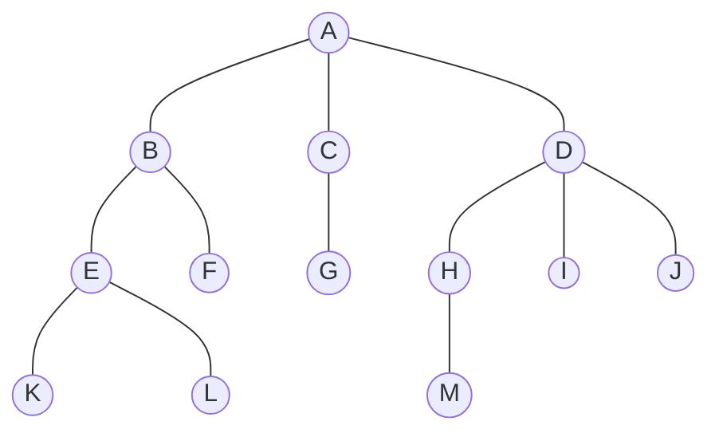
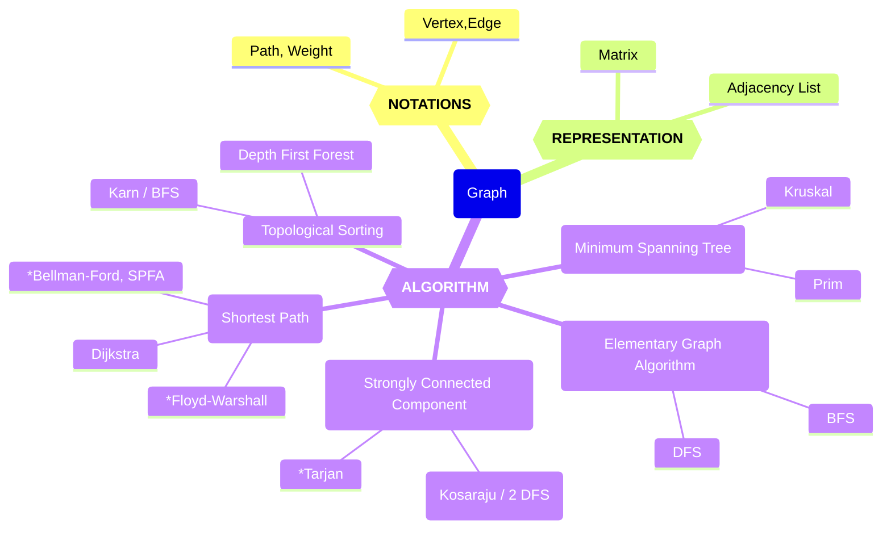
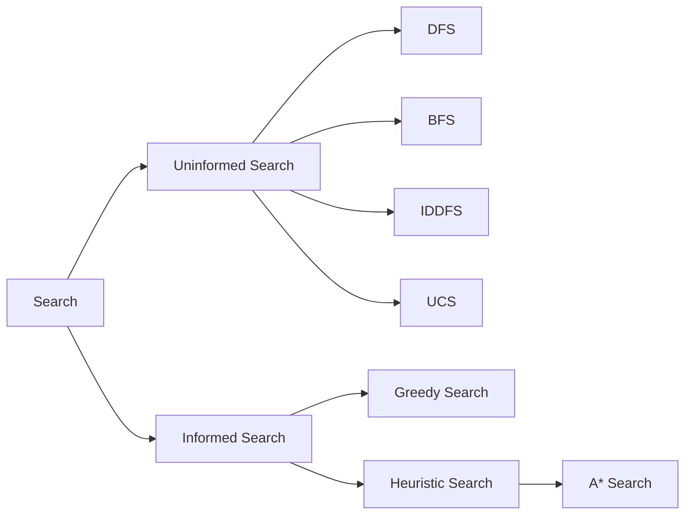
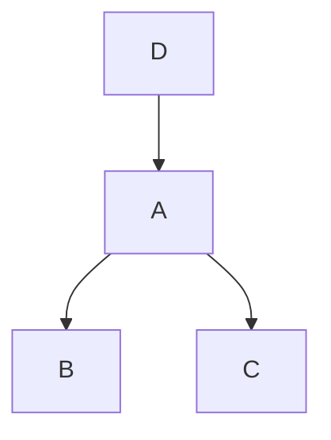

*本笔记更侧重于讲解原理与梳理做题"思想", 为作者本人思考和查阅资料总结的结果, 仅供参考. 原文用 Obsidian 编辑, 读者也可使用 Obsidian 结合双向链接功能获得更佳的阅读体验. 另外加 \* 章节是 (至少作者认为) 机考不会考察的内容, 可以跳过.*

# 一、基础算法
## 1. 排序
### 1.1 快速排序
> **"快速排序就是个二叉树的前序遍历，归并排序就是个二叉树的后序遍历."**
> [See more here.](https://labuladong.online/algo/essential-technique/binary-tree-summary/#二叉树的重要性)
#### 1.1.1 模版
##### C++
```cpp
void quick_sort(int arr[], int l, int r) {
	// 对[l, r]闭区间排序
	
    // base case
    if (l == r) return;
    
    // 第一步: 分成子问题
    int i = l - 1, j = r + 1; // 双指针
    int pivot = arr[l + r >> 1];
    while (i < j) {
    	do i++; while (arr[i] < pivot);
    	do j--; while (arr[j] > pivot);
    	if (i < j) swap(arr[i], arr[j]);
    }
    
    // 第二步: 递归处理子问题
    quick_sort(arr, l, j);
    quick_sort(arr, j + 1, r);
    
    // 第三步: 子问题合并 (快排这一步不需要操作, 但归并排序的核心在这一步骤) 
}
```
##### Python
```Python
def quick_sort(arr, l, r):
	'''对[l, r]闭区间排序'''

    # base case
    if l == r:
        return
    
    # 第一步: 分成子问题
    i, j = l - 1, r + 1  # 双指针
    pivot = arr[l + r >> 1]
    while i < j:
        i += 1
        while arr[i] < pivot:
            i += 1
        j -= 1
        while arr[j] > pivot:
            j -= 1
        if i < j:
            arr[i], arr[j] = arr[j], arr[i]
    
    # 第二步: 递归处理子问题
    quick_sort(arr, l, j)
    quick_sort(arr, j + 1, r)
    
    # 第三步: 子问题合并 (快排这一步不需要操作, 但归并排序的核心在这一步骤) 
```
#### 1.1.2 理解
##### 分治
快排属于分治 (Divide And Conquer) 思想, 分治一般分为三个步骤: 
1) Divide: This involves dividing the problem into smaller sub-problems. **注意不要划分出和原问题相同的子问题, 造成无限递归！**
2) Conquer: Solve sub-problems by calling recursively until solved.
3) **Combine:** Combine the sub-problems to get the final solution of the whole problem.
##### 快排的流程
1) 划分: 从`arr`中挑选一个`pivot`, 以`pivot`为界将序列分 (partition) 为两个部分, 小于`pivot`的元素放在它左边, 大于的放右边, *相等的随意放一边*；或者说使`pivot`左边的元素都不大于它, 右边的元素都不小于它. 
2) 将两个部分分别排好序: 递归进行以上步骤, base case 为序列只有一个元素——什么也不做, 直接返回. 
3) `pivot`的一般可以选择`arr[l]`, `arr[r]`, `arr[l + r >> 1]`, 或者随机, 但是需要注意选`arr[r]`时, 不能将子问题划分为`[l, j]`和`[j + 1, r]`, 同理选`arr[l]`时不能划分为`[l, i]`和`[i + 1, r]`, 否则可能会划分出和原问题相同的子问题, 造成**无限递归**. 

在不考虑空间复杂度的情况下, 可以写出很简单易懂的程序: 
```Python
def quick_sort(arr):
	'''返回排序后的arr列表'''
	n = len(arr)
    if n == 1:
        return arr
	
    pivot = arr[n - 1 >> 1]
    le = [x for x in arr if x < pivot]
    if not le: # le为空代表ge和arr元素相同, 无限递归
        le.append(pivot)
    ge = [x for x in arr if x not in le]
	
    return quick_sort(le) + quick_sort(ge)
```
如上, 使用列表解析式可以简单明了地实现快排的第二步, 也就是所谓的`partition`函数, 但这样会有额外的空间开销, 也不是一个 in-place 排序. 实际应用中一般会像[[#1.1.1 模版]]那样, 利用双指针完成`partition`, 不需要额外的空间, 直接完成 in-place 排序, 但流程稍微复杂. 
##### 双指针`partition`证明
[*Reference*](https://www.acwing.com/solution/content/16777/)

下面使用算法导论里的**循环不变式**方法证明[[#C++|C++模版]]的双指针`partition`: 

待证命题: 

外层`while`循环结束后, `arr[l...j] <= pivot`, `arr[j+1...r] >= pivot`, 这是一个$\forall$的全称命题. 

证明: 

循环不变式: `arr[l...i] <= pivot`, `arr[j...r] >= pivot`. 

1. 初始化

循环开始之前 `i = l - 1`, `j = r + 1`, 则`arr[l...i]`, `arr[j...r]`为空, 循环不变式显然成立, 因为命题是全称命题, 没有这样的元素也符合命题. 

2. 保持

假设某轮循环开始前循环不变式成立, 即`arr[l...i] <= pivot`, `arr[j...r] >= pivot`

执行循环体: 

- `do i++; while(arr[i] < x);`会使得`arr[l...i-1] <= pivot`,  `arr[i] >= pivot`, 

- `do j--; while(arr[j] > x);`会使得`arr[j+1...r] >= pivot`,  `arr[j] <= pivot`, 

- `if(i < j) swap(arr[i], arr[j]);`会使得`arr[l...i] <= pivot`, `arr[j...r] >= pivot`, 其中`if`判断只有在外层`while`的最后一轮循环才为假, 此处先看本轮循环非最后一轮的情形. 

所以, 经历一轮循环 (非最后一轮) 后, 循环不变式保持成立. 

3. 终止

循环最后一轮中, `i >= j`, `if`语句一定不会执行, 所以, 只能保证:

- `arr[l...i-1] <= pivot`, `arr[i] >= pivot`

- `arr[j+1...r] >= pivot`, `arr[j] <= pivot`

- `i >= j`

由`arr[l...i-1] <= pivot`, `i - 1 >= j - 1`和`arr[j] <= pivot`可以得到`arr[l...j] <= pivot`, 

又因为`arr[j+1...r] >= pivot`, 

所以, `arr[l...j] <= x`, `arr[j+1...r] >= pivot`, 证毕. 
##### 双指针疑难杂症
###### do while
`do i++; while (arr[i] < pivot)`与`while (arr[i] < pivot) i++;` 的**唯一**区别在于, 前者至少会执行一次`i++;`. 

二者很多情况是没有区别的, 都是找到使`arr[i] >= pivot`的最小`i`. 

但是在第一个`i`就使`arr[i] >= pivot`时二者有区别——前者多进行了一次`i++;`, 此时前者找到的是`i`之后的、不包含`i`的、使`arr[k] >= pivot`的最小的`k`, 但是这并不会导致什么错误, 因为我们的循环不变式`arr[l...i] <= pivot`, `arr[j+1...r] >= pivot`保证了进入外层`while`循环前`arr[i] <= pivot`, 如果此轮外层`while`循环的第一个`i`就使`arr[i] >= pivot`, 说明`arr[i] == pivot`, 不会在`pivot`前面留下一个更大的元素. 

至于为什么不能直接用后者, 原因就在于特殊情况下后者会陷入死循环, 例如`arr[i]`和`arr[j]`都等于`pivot`时；而前者的好处就是至少可以更新一次`i`, `j`指针, 不会死循环. 

另外, Python中没有 do while 语句, 但是清楚其与 while 的区别后, 容易改出 while 版本——只需在 while 循环先将指针移动一位. 
###### 初始化
1) 为了满足循环不变式的初始条件, 需要把两个指针往外初始化一位. 
2) 也可以这样看: 因为要用 do while 循环, 或者用等价的先移动一位指针再 while 循环, 为了避免两端的元素被跳过, 需要把两个指针往外初始化一位. 

这两点事实上是一体的. 
###### Base case
双指针法的 base case 只需要`l == r`时返回, 不用`l <= r`, 这是因为我们可以证明外层`while`循环结束后的`j`取值范围是 $[l,\, r - 1]$, 递归调用时不会出现`l < r`. 

证明: 
根据[[#do while]]中的分析, 类比到`j`, do while 循环结束后的`j`代表从本轮外层 while 循环的初始`j`及其左边的元素中, 从右向左第一个 (或第二个, 最多在右边留一个和`pivot`相等的值) 使得`arr[j] <= pivot`的索引, 所以`j`首先属于 $[l,\, r]$ 区间；同理`i`也在这个区间. 

下面只需证明`j != r`, 用反证法: 

假设`j`最终的值为`r`, 这说明只有一轮`while`循环(两轮的话`j`至少会自减两次), 且因为要跳出 do while 循环, 有`arr[r] <= pivot` ；又由外层 while 循环的结束条件, 有`i >= j`即`i >= r`, 又因为`i`属于 $[l,\, r]$ 区间, 有`i == r`, 说明在`i`的 do while 循环中它自增到了`r`, 所以有`arr[r] >= pivot`, `arr[l...r-1] < pivot`, 但这与`pivot = arr[l + r >> 1]`矛盾, 因为向下取整, `l + r >> 1`永远不可能取到`r` (`l == r`的情况进入函数就返回了) . 

所以`j`的取值范围为 $[l,\, r-1]$ , base case 只需要取`l == r`时返回. 另外, `j`的取值范围也告诉我们, 递归调用时不会造成无限划分和数组越界 (指 C++ 中, Python 有负数索引不必担心) . 
#### 1.1.3 Properties
1) Time complexity: **$O(n^2)$**, $\Omega(n\log n)$, $\Theta(n\log n)$. 
> The worst-case scenario for quick sort occur when the pivot at each step consistently results in highly unbalanced partitions. When the array is already sorted and the pivot is always chosen as the smallest or largest element. To mitigate the worst-case scenario, various techniques are used such as choosing a good pivot (e.g., median of three) and using randomized algorithm (Randomized Quicksort) to shuffle the element before sorting.

虽然最坏情况快排的时间复杂度高, 但是这个情况几乎不会发生, 且其平均时间复杂度的常数小, 因此还是一个很好的排序方法. 

2) Auxiliary pace: $O(1)$ if we don’t consider the recursive stack space. If we do consider the recursive stack space then, in the worst case quick sort could make $O(N)$.
3) **Not stable.** It means that if two elements have the same key, their relative order will not be preserved in the sorted output in case of quick sort, because here we are swapping elements according to the pivot’s position (without considering their original positions).
4) In-place.
5) *Comparison-based.*
#### 1.1.4 应用: 快速选择算法
快速选择算法用于求出数列从小到大排序后的第 $k$ 个数, 时间复杂度 $\Theta (n)$. 

思路: 在快排中, 每次 partition 使得左边 $[l,\, j]$ 的元素都不大于`pivot`, 右边 $[j+1,\, r]$ 都不小于它, 我们只关注第`k`个数, 可以发现, 如果`k <= j - l + 1`, 第`k`个数就会在左边序列, 反之则在右边序列, 因此只需要递归调用一个部分, 直到序列只有一个元素为止. 
```Python
def quick_select(arr, l, r, k):
	'''选择出[l, r]区间中排序后的第k个数并返回'''
	if l == r:
		return arr[l]

	i, j = l - 1, r + 1
	pivot = arr[l + r >> 1]
	while i < j:
		i += 1
		while arr[i] < pivot:
			i += 1
		j -= 1
		while arr[j] > pivot:
			j -= 1
		if i < j:
			arr[i], arr[j] = arr[j], arr[i]

	if k <= j - l + 1:
		return quick_select(arr, l, j, k)
	return quick_select(arr, j + 1, r, k - j + l - 1)
	# 如果k > j - l + 1, 当前序列第k个数就是右边子序列第k - j + l - 1个数
```
### 1.2 归并排序
#### 1.2.1 模版
```cpp
void merge_sort(int arr[], int l, int r) {
    // 对[l, r]闭区间排序
    
    // base case
    if (l == r) return;
    
    // 第一步: 分成子问题
    int mid = l + r >> 1;
    
    // 第二步: 递归处理子问题
    merge_sort(arr, l, mid);
    merge_sort(arr, mid + 1, r);
    
    // 第三步: 合并子问题
    int i = l, j = mid + 1, temp[r - l + 1], k = 0,;
    while (i <= mid && j <= r)
        if arr[i] <= arr[j]; temp[k++] = arr[i++];
        else temp[k++] = arr[j++];
    
    while (i <= mid) temp[k++] = arr[i++];
    while (j <= r) temp[k++] = arr[j++];
    
    for (k = 0, i = l; i <= r; ++k, ++i) arr[i] = temp[k];
}
```
#### 1.2.2 理解
从中间位置将数组分为左右两个子数组, 先对子数组排序, 然后将两个数组合并.
#### 1.2.3 Properties
1) Time complexity: $O(n\log n)$.
2) Auxiliary Space: $O(n)$.
3) Stable.
4) **Not in-place.** Merge sort is not an in-place sorting algorithm, which means it requires additional memory to store the sorted data. This can be a disadvantage in applications where memory usage is a concern.
5) *Comparison-based.*
#### 1.2.4 应用: 求逆序数
除排序外, 归并排序的一个重要应用是求逆序对的个数 (等价于“只交换相邻元素使序列有序的最少交换次数”), 核心在于归并两个有序数组时可以顺便计算出"这两个数组间的"逆序数; 以下是求逆序数的 Python 代码:
```Python
def merge_sort(arr: list, l, r):
    '''将arr[l: r]排好, 并返回该切片 (左闭右开) 内的逆序数'''
    if r - l == 1:
        return 0
    
    mid = l + r >> 1
    inv = 0
    inv += merge_sort(arr, l, mid)
    inv += merge_sort(arr, mid, r)

    temp = []
    i = l
    j = mid
    while i < mid and j < r:
        if arr[i] <= arr[j]:
            temp.append(arr[i])
            i += 1
        else:
            temp.append(arr[j])
            j += 1
            inv += mid - i # 此步计算逆序数
    
    while i < mid:
        temp.append(arr[i])
        i += 1
    while j < r:
        temp.append(arr[j])
        j += 1

    for k in range(l, r):
        arr[k] = temp[k - l]

    return inv
```
### 1.3 冒泡排序
#### 1.3.1 模版
```Python
def bubble_sort(arr):
    n = len(arr)
    for i in range(1, n): # i是冒泡排序的“趟数”
        for j in range(n - i): # j是每一趟的前一数下标
            if arr[j] > arr[j + 1]:
                arr[j], arr[j + 1] = arr[j + 1], arr[j]
    return arr
```
#### 1.3.2 理解
可以看出, 在第 $1$ 趟排序后, `arr[n - 1]`是此序列的最大值；一般地, 第 $k$ 趟排序使得`arr[n - k]`成为`arr[:n - k + 1]`中的最大值, 故 $n - 1$​ 趟排序后序列有序. 

也可以递归地看这个问题, 把冒泡排序分为两步, 第一步将`arr`中最大元素移到最后, 第二步对前`n - 1`个元素递归调用冒泡排序；而递归的 base case 为`n == 1`时直接返回该序列. 
#### 1.3.3 Properties
1) Time complexity: $O(n^2)$.
2) Auxiliary space: $O(1)$, due to swapping.
3) Stable.
4) In-place.
5) *Comparison-based.*
### 1.4 插入排序
#### 1.4.1 模版
```Python
def insertion_sort(arr):													
    for i in range(1, len(arr)): # 每次对无序部分的第一个数arr[i]
	    # 由于Python中用range函数决定i的下一个取值, 而非每次让目前的i加1, 可以不用j
        while i >= 1 and arr[i - 1] > arr[i]: # arr[j]是插入的数, 把它换到合适位置
            arr[i - 1], arr[i] = arr[i], arr[i - 1]
            i -= 1
```
#### 1.4.2 理解
插入排序的思想: 
1) 将序列分为两个部分, 有序部分和无序部分. 一般以左侧为有序部分, 右侧为无序部分, 则初始时有序部分只有`arr[0]`一个元素, 剩下的是无序部分. 
2) 维护左侧有序序列: 每次从无序部分中拿出一个元素, 插入到有序序列中的合适位置. 
3) 重复直至无序序列为空, 完成排序. 

可以发现, 我们打牌的时候就是用这个方法排序的: 摸到的第一张牌作为初始有序序列, 将新摸到的每一张牌插入到有序序列的合适位置完成排序. 
#### 1.4.3 Properties
1) Time complexity: $O(n^2)$.
2) Auxiliary space: $O(1)$, due to swapping.
3) Stable.
4) In-place.
5) *Comparison-based.*
### 1.5 选择排序
#### 1.5.1 模版
```Python
def selection_sort(arr):
	n = len(arr)
    for i in range(n): # 每次从arr[i: ]这个无序部分挑选最小值, 放到arr[i]处
        min_index = i
        for j in range(i + 1, n):
            if arr[j] < arr[min_index]:
                min_index = j
        arr[i], arr[min_index] = arr[min_index], arr[i]
	return arr
```
#### 1.5.2 理解
选择排序的思想与插入排序类似, 也是维护一个有序序列, 具体如下: 

每次从无序部分选出最小值, 换到无序部分首端, 直到无序部分为空. 与插入排序类似, 这也可以看作一个递归的过程. 
#### 1.5.3 Properties
1) Time complexity: $O(n^2)$.
2) Auxiliary space: $O(1)$, due to swapping.
3) **Not stable.** (However, it can be made stable. Please see the [stable Selection Sort](https://www.geeksforgeeks.org/stable-selection-sort/) for details.)
4) In-place.
5) *Comparison-based.*
### 1.6 希尔排序
#### 1.6.1 模板
##### Python
```Python
def shell_sort(arr):
    n = len(arr)
    gap = n // 2

    while gap > 0:
        for i in range(gap, n):
			# 每一组的初始有序部分只有一个元素, 分别为arr[0], arr[1], ...
			# 无序部分的第一个元素分别为arr[gap], arr[1 + gap], ...

            # 不需要j = i,原因同插入排序

			# 把无序部分的元素插入到有序部分, 只是不是一组一组地完成插入
			# 例如处理完arr[gap]后下一个不是arr[2 * gap]而是arr[gap + 1], 另一组的
            while i >= gap and arr[i - gap] > arr[i]:
                arr[i - gap], arr[i] = arr[i], arr[i - gap]
                i -= gap
        gap //= 2

    return arr
```
#### 1.6.2 理解
希尔排序事实上就是分组的插入排序: 每趟把等间距的元素归为一组, 进行插入排序, 然后间距减半, 重复, 直到完成间距为1的最后一趟排序 (这一趟就是插入排序, 所以结束后序列即有序) . 
#### 1.6.3 Properties
1) Time complexity: $O(n^\frac{3}{2})$, $\Omega(n\log n)$, $\Theta (n^\frac{4}{3})$.
2) Auxiliary space: $O(1)$, due to swapping.
3) **Not Stable.**
4) In-place.
5) *Comparison-based.*
## \*2. 二分
二分还是适合手写, Python的`bisect_left`和`bisect_right`只能用于升序序列, 太局限.
### 2.1 整数二分
 只有在问题具有单调性, 或者说二分性质时才适用, 即: 若`x`满足要求, 则`x`左侧 (或右侧) 的都满足要求; 若`x`不满足要求, 则`x`右侧 (或左侧) 的都不满足要求. 
 
 在问题具有二分性质时, 二分搜索就可以找到最右侧 (最左侧) 的满足要求的`x`, 且时间复杂度仅有 $O (\log n)$.
 
记忆: `check(mid)`为真时, `r`或`l`肯定就要更新成`mid`, 为假时另一个就要更新成`mid + 1`或`mid - 1`, 再注意用到`mid - 1`前面就要是`l + r + 1 >> 1`.
```cpp
bool check(int x); 
// 定义check(x)函数, 使得x满足该性质时返回true, 不满足时返回false

int bsearch_left(int l, int r)
// 找满足check(x)的x的最小值 (左边界) 
// 常用于找最大值的最小值 (最大值的左边界) , check(x)即检验x能否为最大值
{
	while (l < r) {
		int mid = l + r >> 1;
		if (check(mid)) r = mid; 
		else l = mid + 1;
	}
	
	return l; 
}
```

```cpp
bool check(int x); 
// 定义check(x)函数, 使得x满足该性质时返回true, 不满足时返回false

int bsearch_right(int l, int r) 
// 找满足check(x)的x的最大值 (右边界) 
// 常用于找最小值的最大值 (最小值的右边界) , check(x)即检验x能否为最小值
{
	while (l < r) {
		int mid = l + r + 1 >> 1; // 注意要加1
		if (check(mid)) l = mid; 
		else r = mid - 1;
	}
   
	return l;
}
```
### 2.2 浮点数二分
浮点数二分比较简单, 就是初高中学的求方程根的二分法.
```cpp
double bsearch_left(double l, double r) {
	while (r - l > precision) {
	    double mid = (l + r) / 2;
        if (check(mid)) l = mid;
        else r = mid;
    }
    
    return l;
}

double bsearch_right(double l, double r) {
    while (r - l > precision) {
        double mid = (l + r) / 2;
        if (check(mid)) r = mid;
        else l = mid;
    }
    
    return l;
}
```
## \*3. 前缀和与差分
### 3.1 一维前缀和与差分
#### 一维前缀和
```cpp
// 初始化S[0] = 0;
S[i] = a[1] + a[2] + ... a[i];
// 作用: 快速求出数组a (下标) 在区间[l, r]内的部分和
a[l] + ... + a[r] = S[r] - S[l - 1];
```
#### 一维差分
```cpp  
// 作用: 给数组a (下标) 在区间[l, r]内的每个数加上c; 下面的b是a的差分 (即a是b的前缀和) 
b[l] += c;
b[r + 1] -= c;
// 从a得到b: 
// 假设初始状态a[i]全为0, 则易算得b[i]也全为0；此时每一步在[i, i]区间内给a[i] (此时为0) 加上a[i] (实际的取值) , 使用上面的式子即可更新b
```
### 3.2 二维前缀和与差分
#### 二维前缀和
```cpp
// S[i][j] = 第i行j列元素a[i][j]及左上部分所有元素的和
//初始化S[0][j] = s[i][0] = 0;
S[i][j] = S[i - 1][j] + S[i][j - 1] - S[i - 1][j - 1] + a[i][j];
// 作用: 以(x1, y1)为左上角, (x2, y2)为右下角的子矩阵的和为: 
S[x2, y2] - S[x1 - 1, y2] - S[x2, y1 - 1] + S[x1 - 1, y1 - 1]
```
#### 二维差分
```cpp
// 作用: 给以(x1, y1)为左上角, (x2, y2)为右下角的子矩阵中的所有元素加上c: 
b[x1, y1] += c;
b[x2 + 1, y1] -= c;
b[x1, y2 + 1] -= c;
b[x2 + 1, y2 + 1] += c;
// 从a得到b: 
// 假设初始状态a[i][j]全为0, 则易算得b[i][j]也全为0；此时每一步给以(i, j)为左上角, (i,j)为右下角的子矩阵中的所有元素加上实际应取的a[i][j], 使用上面的式子即可更新b
```
## \*4. 双指针
#todo 重新整理==
### 4.1 左右指针
本质: 利用题目中的某种 (单调) 性质, 使第二个指针 (数组中一般用`j`) 在第一个指针 (一般用`i`) 移动或者说指向下一元素时, **不需要从头开始** (这里的头不一定是下标`0`, 而是指`j`的初始值), 只需要从上一次到的位置继续移动, 将 $O(n^2)$ 的暴力算法优化到 $O(n)$; 做题时往往可以**先想暴力算法**, 再去寻找 (单调) **性质**优化时间复杂度.
```cpp
for (int i = 0, j = 0; i < n; i++ ) // 初始值因题目而已
{
	while (j < i && check(i, j)) // 不一定是j < i, 也可能是j < n等等
		j++;

  // 具体问题的逻辑
}
```
**常见问题分类:**
1. 对于一个序列, 用两个指针维护一段区间.
2. 对于两个序列, 维护某种次序, 比如归并排序中合并两个有序序列的操作.

最长回文子串
https://labuladong.online/algo/essential-technique/array-two-pointers-summary/#二、左右指针的常用算法

滑动窗口
https://labuladong.online/algo/essential-technique/sliding-window-framework/
### 4.2 快慢指针
# 二、线性数据结构
[学习算法和刷题的框架思维](https://labuladong.online/algo/essential-technique/abstraction-of-algorithm/)

数据结构的基本存储方式只有链式和顺序两种.

而基本操作就是遍历 + 访问, 根据数据结构的不同, 遍历又有线性和非线性两种形式:
1. 线性遍历: 数组的遍历, 链表的遍历. 一般用`for`循环**迭代**实现, 也可以用线性的**递归** (但一般没必要).
2. 非线性遍历: 树的遍历, 图的遍历. 可以用**递归**实现 (树的前中后序遍历, 图的 DFS), 也可以依托一个容器用`while`循环**迭代**实现 (用栈实现树的前中后序遍历和图的 DFS, 用队列实现树的层次遍历和图的 BFS).

其中[用栈实现树的中、后序遍历](https://zhuanlan.zhihu.com/p/260494484)较复杂, 不常用.
## 1. 栈和队列
### 1.1 栈
C++ 数组实现: (这样写会快一些)
```cpp
// tt表示栈顶
int stk[N], tt = 0;

// 向栈顶插入一个数
stk[ ++ tt] = x;

// 从栈顶弹出一个数
tt -- ;

// 栈顶的值
stk[tt];

// 判断栈是否为空, 如果 tt > 0, 则表示不为空
if (tt > 0) {
}
```
Python 直接用`list`即可. 
### 1.2 普通队列
C++ 数组实现: 
```cpp
// hh 表示队头, tt表示队尾
int q[N], hh = 0, tt = -1;

// 向队尾插入一个数
q[ ++ tt] = x;

// 从队头弹出一个数
hh ++ ;

// 队头的值
q[hh];

// 判断队列是否为空, 如果 hh <= tt, 则表示不为空
if (hh <= tt)
```
Python 用内置的双端队列`collections.deque`即可. 
### \*1.3 循环队列
使用数组模拟队列会导致一个问题: 随着时间的推移, 整个队列会向数组的尾部移动, 一旦到达数组的最末端, 即使数组的前端还有空闲位置, 再进行入队操作也会导致溢出 (这种数组里实际有空闲位置而发生了上溢的现象被称为「假溢出」) . 

解决假溢出的办法是采用循环的方式来组织存放队列元素的数组, 即将数组下标为 `0` 的位置看做是最后一个位置的后继.  (数组下标为 `x` 的元素, 它的后继为 `(x + 1) % SIZE`) . 这样就形成了循环队列. 
```cpp
// hh 表示队头, tt表示队尾的后一个位置
int q[N], hh = 0, tt = 0;

// 向队尾插入一个数
q[tt ++ ] = x;
if (tt == N) tt = 0;

// 从队头弹出一个数
hh ++ ;
if (hh == N) hh = 0;

// 队头的值
q[hh];

// 判断队列是否为空, 如果hh != tt, 则表示不为空
if (hh != tt)
```
### 1.4 单调栈和单调队列
单调栈/单调队列只是**在加入元素前先弹出一些元素**, 使得栈/队列中元素单调严格递增/严格递减/不增/不减, 从而降低时间复杂度或维护出某些性质 (其用途十分单一, 后文会进一步说明). 所以这其实是很朴素的东西, 完全没有必要怕.

具体做题时分两种情况:
1. 题目明确给了单调栈/单调队列 tag 提示: 一方面可以考虑先用栈/队列暴力 (穷举) 模拟, 然后挖掘一些性质 (**加入元素前先弹出一些不会有用的元素**), 使得栈/队列有单调性, 降低时间复杂度; 另一方面可以考虑将题目条件"强行"转化成单调栈/单调队列能实现的几个**单一用途**.
2. 没有 tag 提示: 只能在平时训练对单调栈/单调队列能实现的几个**单一用途**的敏感度.
#### 1.4.1 单调栈
如上所述, 单调栈的用途十分单一, 具体来说它只用来**维护数组的所有前缀 (子串) 的后缀最值 (或其下标)**, 这个最值可以是最大/最小值, 也可以是严格 (或者说唯一) 最大/最小值. 具体来说单调栈中就按原数组顺序存储了当前前缀的所有后缀最值 (或其下标). 另外, 单调栈的"单调"当然指的是其存储数组元素的值时是单调的, 但因为它按原数组顺序来存储, 所以它在存储下标时也是单调的 (有时需要利用这一点来做二分, 例如[[Problems#92. 奶牛排队]]).

当然单调栈也会有一些变形和等价的用途, 常见的有:
1. 将数组颠倒后再入栈, 显然也就可以**维护数组的所有后缀的前缀最值 (或其下标)**.
2. 找数组中每个数左/右边第一个大于/小于/不大于/不小于它的数 (或其下标). 以找每个数左边第一个大于它的数为例, 根据后缀最值的定义就可以发现, 每个数 (设下标为`i`) 左边第一个大于它的数, 其实就是前缀`arr[:i + 1]` (切片右边是开区间) 的后缀严格最大值中除`arr[i]`以外的最右边一个, 或者说是后缀严格最大值栈在加入`arr[i]`前的栈顶元素.

具体实现也很简单, 以维护数组的所有前缀的后缀严格最大值下标 (顺便记录每个数左边第一个大于它的数) 为例, 显然这需要维护一个严格递减栈:
```Python
stack = []  # 存储当前前缀的后缀严格最大值下标
res = []  # 记录每个数左边第一个大于它的数, 没有记为 None
for i in range(n):  # 前缀右端点 i 每次加 1
	while stack and arr[stack[-1]] <= arr[i]:
		stack.pop()
		
	# 此时栈顶是 arr[i] 左边第一个比它大的数的下标
	res.append(arr[stack[-1]] if stack else None)
	stack.append(i)
	# 此时栈中是前缀 arr[:i + 1] 的所有后缀严格最大值下标
```
#### 1.4.2 单调队列
#todo ==重新总结单调队列==
常见模型: 找出滑动窗口中的最大值/最小值. 
  ```cpp
    int hh = 0, tt = -1;
    //队列q[N]存的是下标
    for (int i = 0; i < n; i++) {
        if ( check1(q[hh]) ) hh++;  // 判断队头是否滑出窗口
        while ( hh <= tt && check2(q[tt], i) ) tt--;
        q[++tt] = i;
    }
  ```
### 1.5 前中后序表达式转换和求值
#### 1.5.1 前序表达式 (波兰表达式) 求值
##### 递归
递归定义波兰表达式, 再用递归求解: 波兰表达式是一个数, 或者“操作符 波兰表达式 波兰表达式”, [参考代码](http://cs101.openjudge.cn/2024sp_routine/solution/44065119/)；这是一个 **top-down** 的过程. 
##### 栈
从后往前扫表达式, 遇到数字压入栈, 遇到操作符从栈中弹出两个操作数 (注意顺序) 做计算, 运算完再压入栈, 扫完一遍表达式刚好运算完, 栈内唯一元素即运算结果；这是一个 **bottom-up** 的过程. 

注意, 如果从前往后看, 遇见操作符压入栈等待操作数出现再运算, 运算后再压入栈, 则扫一遍表达式无法完成所有计算, 事实上只计算了一层；这个思路也是一个 **top-down** 的过程, 但没有算完, 可以再用递归算完.
#### 1.5.2 后序表达式 (逆波兰表达式) 求值
##### 递归
递归定义逆波兰表达式, 再用递归求解: 逆波兰表达式是一个数, 或者“逆波兰表达式 逆波兰表达式 操作符”；递归永远是一个 **top-down** 的过程, 所以结合波兰表达式两种做法的经验 (递归法从左向右看, 化整为零；栈法从后往前看, 化零为整) , 逆波兰表达式要用递归法的话需要从后往前看, 自顶向下、化整为零. 
##### 栈
从前往后扫表达式, 遇到数字压入栈, 遇到操作符从从栈中弹出两个操作数 (注意顺序) 做计算, 运算完再压入栈, 扫完一遍表达式刚好运算完, 栈内唯一元素即运算结果；这是一个 **bottom-up** 的过程. 

可以看出, 这和前序表达式的计算是非常相似的, 主要区别在于扫的方向和弹出操作数后两个操作数的顺序. 
#### 1.5.3 中序表达式转后序表达式 - Shunting yard 算法
例题: [OpenJudge: 中序表达式转后序表达式](http://cs101.openjudge.cn/2024sp_routine/24591/)
  ```python
  def shunting_yard(s: str) -> str:
      '''参数s是没有空格分隔的中序表达式, 返回对应的空格分隔的后序表达式'''
      expr = [""]
      for i in range(len(s)):
          c = s[i]
          if c in "+-*/()":
              expr.append(c)
              expr.append("")
          else:
              expr[-1] += c
      expr = [c for c in expr if c != '']
  	# 以上是把没空格分隔的s做成列表expr
      '''
  	想法: 遇到运算符就直接append到expr中, 然后再append一个空串“”, 遇到数字就加到expr[-1]上 (字符串加法) , 注意到s开头可能就是数字, 所以初始化expr为[""], 最后去掉空串
  	'''
     
  	# 开始shunting yard
      '''
      注意到: 
      (1)后序表达式中操作数的顺序与中序一致, 运算符顺序可能由于优先级而颠倒；
      (2)中序表达式运算法则: 先乘除后加减, 相同优先级先算左边；
      (3)后序表达式越靠左的运算符越先运算. 
      所以在转换时: 
      (1)遇到操作数直接放到输出列表out中；
      (2)遇到+-*/则需要判断: 我们要保证该运算符左侧的更优先的运算符都已经加到out中 (即已进行运算) , 所以先弹出此前存好的 (如果有的话) 所有优先级更高的运算符和同级的运算符 (同优先级先算左边) , 而且显然我们需要先弹出后进来的运算符, 所以是用栈来装运算符；
      (3)遇到左括号: 这意味着遇到下一个右括号之前的这部分表达式有最高优先级 (因为又是括号又在目前的最左边) , 所以我们要先运算完括号内的这部分表达式后再去运算右括号后面的, 所以左括号先存在opstack中, 括号里这部分表达式正常按前面的法则运算, 直到右括号出现；
      (4)遇到右括号: 这意味着括号里的表达式运算完毕, 再继续扫该括号后面的表达式前, 应该完成这个括号内的所有运算, 所以先弹出opstack中的运算符, 并加到out中, 最后把左括号弹出且不加到out中；
      (5)最后, 扫完表达式后, 把opstack中的所有运算符弹出加到out中, 完成运算. 需要这一步的原因在于, 前面的步骤中, opstack中的运算符都能由后面的运算符的到来而被弹出 (轮到之前存好的运算符运算了) , 而最后的一个或几个运算符需要“表达式结束”来“允许”它们进行运算. 
      '''
      opstack = []
      out = []
      precedence = {'(': 0, '+': 1, '-': 1, '*': 2, '/': 2}
  	# precedence字典是为了弹出更优先的运算符 (先弹出来的先算) , 设定左括号优先级低是为了左括号在比较优先级时不被弹出, 因为当且仅当遇到右括号才弹出左括号
      
      for token in expr:
          if token not in "+-*/()":
              out.append(token)
          elif token == '(':
              opstack.append(token)
          elif token == ')':
              while True:
                  op = opstack.pop()
                  if op == '(':
                      break
                  out.append(op)
          else:
              while opstack and precedence[opstack[-1]] >= precedence[token]:
                  out.append(opstack.pop())
              opstack.append(token)
      
      while opstack:
          out.append(opstack.pop())
  
      return ' '.join(out)
  
  def main():
      n = int(input())
      for _ in range(n):
          print(shunting_yard(input()))
  
  if __name__ == "__main__":
      main()
  ```
## 2. 链表
### 2.1 单链表
单链表一般用于实现邻接表, 存储树和图.
#### \*2.1.1 静态链表/链式前向星
首先是 C++ 数组实现的链表, 也称静态链表, 这种实现方式不用`struct`或`class`, 不需要用到很慢的操作`new`, 会更快, 但代价是稍难理解一些. 

我们用两个数组来模拟, 分别是`e[N]`和`ne[N]`, 前者存索引`N`处的值, 后者存 索引`N`处元素的下一个元素 的索引, 两个数组分别是索引到值、索引到下一个元素索引的映射, 由索引`idx`联系起来, 最后一个元素的下一个元素的索引定义为`-1`; 我们利用前述两个数组, 使用索引`idx`将链表信息记录在数组中. 
```cpp
// head存储头指针, e[]存储节点的值, ne[]存储节点的next指针, idx表示下一个可用的数组索引
int head, e[N], ne[N], idx;

// 初始化
void init() {
    head = -1; // 使用链表一定要记得初始化
    idx = 0;
}

// 在链表头插入一个数
void insert(int x) {
    e[idx] = x, ne[idx] = head, head = idx ++;
}

// 将头节点删除, 需要保证头节点存在
void remove() {
    head = ne[head];
}

// 将x插到下标是k的点后面
void add(int k, int x) {
    e[idx] = x, ne[idx] = ne[k], ne[k] = idx ++;
}

// 将下标是k的点后面的一个点删掉
void remove(int k) {
    ne[k] = ne[ne[k]];
}

//如果需要在链表最后插入元素, 则令 最后一个元素的下一个元素 的下标为tail
```
#### 2.1.2 动态链表
OOP 实现则更容易理解和使用, 以下是一个 Python 实现: 
```python
class Node:
    def __init__(self, value):
        self.value = value
        self.next = None # None作为一种特殊的Node, 空节点

class LinkedList:
    def __init__(self):
        self.head = None # head是链表的属性, oop写法中head就是链表首节点
        # 有时单链表中也会有tail (或只有tail没有head的循环单链表) , tail就是链表的尾节点
            
	def insert(self, value, position): # 加入后在position位置
        if position < 0 or position > self.length():
            raise IndexError("Invalid position")

        newNode = Node(value)
        if position == 0:
            newNode.next = self.head
            self.head = newNode
        else:
            current = self.head
            for _ in range(position - 1):
                current = current.next
            newNode.next = current.next # 先用“下一个”
            current.next = newNode # 修改“下一个”
            # 这里不会修改newNode.next, 因为倒数第二行使得newNode.next和current.next指向同一个对象, 最后一行使current的next这个变量指向newNode, 不影响current.next, 和C++中的引用不同

    def remove(self, value):
        if self.is_empty():
            raise ValueError("LinkedList is empty")

        if self.head.value == value:
            self.head = self.head.next
        else:
            current = self.head
            while current.next and current.next.value != value:
                current = current.next
            if current.next:
                current.next = current.next.next
            else:
                raise ValueError("Value not found")

                
	def reverse(self):
        prev = None
        curr = self.head
        while curr:
            nextNode = curr.next # 先存下之前的“下一个”
            curr.next = prev # 修改“下一个”
            prev = curr
            curr = nextNode
        self.head = prev # head只需最后修改一次即可
```
在单链表中, 由于“下一个”只能用“当前这个”的`next`得到, 所以在操作时一般需要**先存下或使用“下一个”**, 即`current.next`, 再将`current`的`next`修改；反过来操作的话“原来的下一个”, 即`current.next`就找不到了, 注意到这一点有利于更清晰地写出`insert`, `remove`, `reverse`等方法. 
### 2.2 双链表
>  双链表一般用于优化某些问题. 
>  -- <cite> yxc </cite>

#todo ==优化哪些问题? To be continued.==
#### \*2.2.1 静态双链表
C++ 数组实现: 
```cpp
// e[]表示节点的值, l[]表示节点的左指针, r[]表示节点的右指针, idx表示当前用到了哪个节点
int e[N], l[N], r[N], idx;

// 初始化
void init() {
    // 0是左端点, 1是右端点
    r[0] = 1, l[1] = 0;
    idx = 2;
}

// 在节点 下标是k的点 的右边插入x
void insert(int k, int x) {
    e[idx] = x;
    l[idx] = k, r[idx] = r[k];
    l[r[k]] = idx；r[k] = idx ++ ;
}

// 删除下标为k的节点
void remove(int k) {
    l[r[k]] = l[k];
    r[l[k]] = r[k];
}
```
#### 2.2.2 动态双链表
Python OOP实现:
```python
class Node:
    def __init__(self, value):
        self.value = value
        self.prev = None
        self.next = None

class DoublyLinkedList:
    def __init__(self):
        self.head = None
        self.tail = None

    def insert_before(self, node, new_node):
        if node is None:  # 如果链表为空, 将新节点设置为头部和尾部
            self.head = new_node
            self.tail = new_node
        else:
            new_node.next = node
            new_node.prev = node.prev # 先用“上一个”
            if node.prev != None:
                node.prev.next = new_node
            else:  # 如果在头部插入新节点, 更新头部指针
                self.head = new_node
            node.prev = new_node # 修改“上一个”

    def display_forward(self):
        current = self.head
        while current != None:
            print(current.value, end=" ")
            current = current.next
        print()

    def display_backward(self):
        current = self.tail
        while current != None:
            print(current.value, end=" ")
            current = current.prev
        print()
```
## 3. 哈希表
### 5.1 一般哈希
#### 5.1.1 Definitions
**哈希表**又称散列表, 一种以「key-value」形式存储数据的数据结构. 所谓以「key-value」形式存储数据, 是指任意的 key 都唯一对应到内存中的某个位置. 只需要输入查找的key, 就可以快速地找到其对应的 value. 可以把哈希表理解为一种高级的数组, 这种数组的下标可以是很大的整数, 浮点数, 字符串甚至自定义类. 

要让 key 对应到内存中的位置, 就要为 key 计算索引, 也就是计算这个数据应该放到哪里. 这个根据 key 计算索引的函数就叫做**哈希函数**. 一般取 $f(x) = x \space mod \space M$ 为哈希函数, 其中$M$为一个较大的质数 (且离2的幂次尽量远) , 可以证明, 这样取$M$可以让冲突尽量少. $M$也作为哈希表中槽的数量 (拉链法).
#### 5.1.2 实现
##### 拉链法
在每个存放数据的地方开一个链表, 如果有多个 key 索引到同一个地方, 只需要把他们都放到那个位置的链表里就行了. 查询的时候需要把对应位置的链表整个扫一遍. 
```cpp
int h[N], e[N], ne[N], idx;

// 向哈希表中插入一个数
void insert(int x) {
    int k = (x % N + N) % N; // c++中负数模运算结果为负数
    e[idx] = x;
    ne[idx] = h[k];
    h[k] = idx ++ ;
}

// 在哈希表中查询某个数是否存在
bool find(int x) {
    int k = (x % N + N) % N;
    for (int i = h[k]; i != -1; i = ne[i])
        if (e[i] == x)
            return true;

    return false;
}

// 若要实现删除, 可以定义一个bool标志该元素被删去, 不会真的去删
```
补充: 什么是**桶**?

A **bucket** in English is a device for holding water.

When used in software, it normally means a data type that groups objects together.

The term is used often when discussing hashing algorithms, where different items that have the same hash code (hash collision) go into the same "bucket". Meaning, the objects are grouped by the hash. The term is also used with dictionaries whose value (not key) is a collection of items.

[What does Bucket mean?](https://softwareengineering.stackexchange.com/questions/144983/what-does-bucket-mean)

https://developer.aliyun.com/article/934037
##### 开放寻址法
如果在`t`处有冲突, 就往后找`t + 1`, `t + 2`, 直到找到没有冲突的位置 (空位置) , 如果遍历到数组尾则再从`0` 开始.

设待哈希数据有 $M$ 个, 则数组大小大概需要开 $2M \sim 3M$ (经验).
```cpp
int h[N], null = 0x3f3f3f3f;

// 如果x在哈希表中, 返回x的下标；如果x不在哈希表中, 返回x应该插入的位置
int find(int x) {
	int t = (x % N + N) % N;
	while (h[t] != null && h[t] != x) {
		t ++ ;
		if (t == N) t = 0;
	}
	return t;
}
```

tips: 在算法竞赛中, 我们常常需要用到设置一个常量用来代表“无穷大”. 

比如对于`int`类型的数, 有的人会采用`INT_MAX`, 即`0x7fffffff`作为无穷大. 但是以`INT_MAX`为无穷大常常面临一个问题, 即加一个其他的数会溢出, 而这种情况在动态规划, 或者其他一些递推的算法中常常出现, 很有可能导致算法出问题. 所以在算法竞赛中, 我们常采用`0x3f3f3f3f`来作为无穷大, 这样做主要有如下好处: 

1. `0x3f3f3f3f`的十进制为`1061109567`, 和`INT_MAX`一个数量级, 即 $10^9$ 数量级, 而一般场合下的数据都是小于 $10^9$ 的.
2. `0x3f3f3f3f * 2 = 2122219134`, 无穷大相加依然不会溢出.
3. **可以使用`memset(array, 0x3f, sizeof(array))`来为数组每个元素设初值为`0x3f3f3f3f`, 因为这个数的每个字节都是`0x3f`.**

### 5.2 字符串哈希-前缀哈希
核心思想: 将字符串看成 P 进制数, P 的经验值是 131 或 13331 , 取这两个值的**冲突概率低**.

作用: 判断字符串是否相等.

tips: 
-   取模的数用$2^{64}$, 这样直接用`unsigned long long`存储, 溢出的结果就是取模的结果
-   一般情况下, 不要把某个字符映射到 $0$
-   此方法不考虑冲突的处理, 我们认为按经验参数基本上不会遇到冲突
```cpp
int P = 131; // 或13331
typedef unsigned long long ULL;
ULL h[N], p[N]; 
// h[k]存储字符串前k个字符的哈希值, p[k]存储 P^k mod 2^64
// 一般让字符串从下标1开始, 而h[0]赋为0, 方便初始化前缀哈希

// 初始化, 预处理前缀的哈希
h[0] = 0;
p[0] = 1;
for (int i = 1; i <= n; i ++ ) {
    h[i] = h[i - 1] * P + str[i - 1];
    // 这里减1是因为我们使用的字符串是从下标0开始的, 下标i - 1即第i个字符
    // 另一种等价的处理方式是把字符串读到str + 1这个指针里 (使用char str[]型字符串) 
    p[i] = p[i - 1] * P;
}

// 计算子串 str[l ~ r] 的哈希值
ULL get(int l, int r) {
    return h[r] - h[l - 1] * p[r - l + 1];
}
```
### 5.3 前缀函数与 KMP 算法
思路: 先暴力模拟, 再优化时间复杂度.

可用来求循环节, 其余问题 (大概) 都能用字符串前缀哈希做.

[参考资料](https://oi-wiki.org/string/kmp/)
```cpp
    // s[]是长文本, p[]是模式串, n是s的长度, m是p的长度
    // s和p均从下标1开始, 0不要了
    // next数组即前缀函数prefix function
    
    // 求模式串的next数组: 
    // i从2开始, 因为i=1时 (第一个字符) 对应的前缀函数定义为0
    for (int i = 2, j = 0; i <= m; i++) {
        while (j && p[i] != p[j + 1]) j = ne[j];
        if (p[i] == p[j + 1]) j++;
        ne[i] = j;
    }
    
    // 匹配
    for (int i = 1, j = 0; i <= n; i++) {
        while (j && s[i] != p[j + 1]) j = ne[j];
        if (s[i] == p[j + 1]) j++;
        if (j == m) {
            j = ne[j];
            // 匹配成功后的题目要求做的事
        }
    }
```
## 4. Map ADT
#todo ==参考 pythonds 总结==
# 三、树
## 0. 做题总结
二叉树解题的思维模式分两类：

**1、是否可以通过遍历一遍二叉树得到答案**？如果可以，用一个 `traverse` 函数配合外部变量来实现，这叫「遍历」的思维模式。

**2、是否可以定义一个递归函数，通过子问题（子树）的答案推导出原问题的答案**？如果可以，写出这个递归函数的定义，并充分利用这个函数的返回值，这叫「分解问题」的思维模式。

**这两类思路分别对应着 [回溯算法核心框架](https://labuladong.online/algo/essential-technique/backtrack-framework/) 和 [动态规划核心框架](https://labuladong.online/algo/essential-technique/dynamic-programming-framework/)**。

无论使用哪种思维模式，你都需要思考：

**如果单独抽出一个二叉树节点，它需要做什么事情？需要在什么时候（前/中/后序位置）做**？其他的节点不用你操心，递归函数会帮你在所有节点上执行相同的操作。

**二叉树的所有问题，就是让你在前中后序位置注入巧妙的代码逻辑，去达到自己的目的，你只需要单独思考每一个节点应该做什么，其他的不用你管，抛给二叉树遍历框架，递归会在所有节点上做相同的操作**。

> 二叉树中用遍历思路解题时函数签名一般是 `void traverse(...)`，没有返回值，靠更新**外部变量** (或者记录在函数参数中) 来计算结果，而用分解问题思路解题时函数名根据该函数具体功能而定，而且一般会有返回值，返回值是子问题的计算结果。
> 
> 与此对应的，你会发现我在 [回溯算法核心框架](https://labuladong.online/algo/essential-technique/backtrack-framework/) 中给出的函数签名一般也是没有返回值的 `void backtrack(...)`，而在 [动态规划核心框架](https://labuladong.online/algo/essential-technique/dynamic-programming-framework/) 中给出的函数签名是带有返回值的 `dp` 函数。这也说明它俩和二叉树之间千丝万缕的联系。
> 
> 虽然函数命名没有什么硬性的要求，但我还是建议你也遵循我的这种风格，这样更能突出函数的作用和解题的思维模式，便于你自己理解和运用。
## 1. 定义
### 1.1 树的普通定义
树要么是空树——什么也没有, 要么由节点及连接节点的边构成, 且满足以下属性: 
1) 有一个根节点;
2) 除根节点外, 其他每个节点都与其**唯一**的父节点相连;
3) 从根节点到其他每个节点都有且仅有一条路径. 

从 2 中可以看出树的一条性质 $E = V - 1$, 其中 $E$ 是边数或总度数, $V$ 是节点数. 
### 1.2 树的递归定义
一棵树要么为空, 要么由一个根节点和零棵或多棵子树构成, 子树本身也是一棵树. 每棵子树的根节点通过一条边连到父树的根节点. 

由此可见, **树的相关问题都适合从递归的角度思考**, 反过来**递归的问题都可以借助一棵递归树来 (可视化) 辅助理解**.
### 1.3 Terminologies
节点 Node: 节点是树的基础部分. 每个节点具有名称, 即"key", 节点还可以保存额外数据项, 即"value".

边 Edge: 边是组成树的另一个基础部分. 每条边恰好连接两个节点, 表示节点之间具有关联, 边具有出入方向；每个节点 (除根节点) 恰有一条来自另一节点的入边；每个节点可以有零条/一条/多条连到其它节点的出边. 如果加限制不能有“多条边”, 这里树结构就特殊化为线性表. 

度 Degree: 每个节点的子树个数称为该节点的度. 

根节点 Root: 树中唯一没有入边的节点. 

路径 Path: 由边依次连接在一起的有序节点列表. 比如, 哺乳纲→食肉目→猫科→猫属→家猫就是一条路径. 

子节点 Children: 入边均来自于同一个节点的若干节点, 称为这个节点的子节点. 

父节点 Parent: 一个节点是其所有出边连接节点的父节点. 

兄弟节点 Sibling: 具有同一父节点的节点之间为兄弟节点. 

子树 Subtree: 一个节点和其所有子孙节点, 以及相关边的集合. 

叶节点 Leaf Node: 没有子节点的节点称为叶节点. 

**层级 Level**:  从根节点开始到达一个节点的路径, 所包含的边的数量, 称为这个节点的层级. 一般规定根的层级是0. 

**深度 Depth**: 节点到根的路径边数称为该**节点的**深度；从下往上看. 

**高度 Height**: 根节点到叶节点的最长路径边数称为该**子树的**高度；从上往下看. 

**二叉树 Binary Tree**: 每个节点**最多**有两个子节点的树称为二叉树. 

**完全二叉树 Complete Binary Tree**: 除最底层外, 其余各层的节点数都达到最大, 且最底层的节点若未填满只能填左边, 这样的二叉树就是完全二叉树. 完全二叉树可以用数组表示
### 1.4 树的逻辑表示
树是一种重要的逻辑结构: **线性表是一对一的, 树是一对多的, 图是多对多的.**
##### 树形表示

##### Nested Parentheses Representation
在括号嵌套表示中, 树 = 根, 或者“左括号 + 根 + 左括号 + 至少一棵子树 + 右括号 + 右括号”, 有多棵子树时用逗号隔开. 例如[[#树形表示]]中所示的树的嵌套括号表示为: $(A(B(E(K,L),F),C(G),D(H(M),I,J)))$. 

或者去掉最外层括号, 定义为: 树 = 根, 或者“根 + 左括号 + 至少一棵子树 + 右括号”, 有多棵子树时用逗号隔开. 则上图表示为: $A(B(E(K,L),F),C(G),D(H(M),I,J))$. 
##### Venn Diagram
##### Indented Representation
## 2. 树的存储
### 2.1 Adjacency List
每个节点`u`都使用一个支持动态增减元素的**内层容器**`adj[u]`来存储它连接的节点 (及附加信息), 而**外层容器**`adj`只需要支持以`u`为下标. 详见[[#2. 图的存储#2.2 Adjacency list#]].
### 2.2 Nodes and References
Python 中一般使用写`Node`类, 再实例化出根节点`root`的方式表示树, 此时节点的连接关系都存储在`root`中. 有时 ([例](http://cs101.openjudge.cn/2024sp_routine/solution/44379180/)) 为了方便地添加边, 也将所有节点放到一个列表中 (Python 中只存"指针", 所以并不会带来太大的额外内存负担), 但事实上一个连接好节点的`root`节点已经蕴含这棵树的所有信息了. 

注意虽然平时最常用这种写法, 但输入数据格式更适合用邻接表的话就用邻接表写, 不要思维固化. 
#### 2.2.1 Child Representation
##### 二叉树 Binary Tree
```Python
class Node:
	def __init__(self, data): 
		self.data = data 
		self.leftChild = None
		self.rightChild = None
```
##### 多叉树 Generic Tree/N-ary Tree
```Python
class Node:
	def __init__(self, data): 
		self.data = data 
		self.children = []
```
#### 2.2.2 Left-Child Right-Sibling Representation
```Python
class Node: 
	def __init__(self, data): 
		self.data = data
		self.firstChild = None
		self.nextSibling = None
```
##### Convert Generic Tree to Binary Tree
上述表示方法事实上把多叉树转化成了二叉树, 转换的代码如下: 
```Python
class Node:
	"""多叉树节点"""
    def __init__(self):  
        self.children = []  
        self.next_sibling = None  


class Node2:
	"""二叉树节点"""
    def __init__(self):  
        self.left = None  
        self.right = None
```
如果在建多叉树时为每个节点存储了`next_sibling`, 则很容易根据递归模版建树: 
```Python
def convert(root: Node) -> Node2:
	"""将以root为根的多叉树转换为二叉树, 并返回该二叉树的根节点"""
	# 两个if导致 base case 省略
	
    # step 1: build root
    new_root = Node2()
    # step 2: connect subtrees
    if root.children:  
        new_root.left = convert(root.children[0])  
    if root.next_sibling:  
        new_root.right = convert(root.next_sibling)  
    # step 3:  return
    return new_root
```
如果没有存`next_sibling`也可以转二叉树, 但需要换个角度来建这棵二叉树, 即不是按照“建根, 连左子树, 连右子树”的方式进行, 而是按原多叉树的特点进行: 
```Python
def convert(root: Node) -> Node2:
	"""将以root为根的多叉树转换为二叉树, 并返回该二叉树的根节点"""
	# base case
    if not root:  
        return None  

	# step 1: 建根
    binary_root = Node2()  
    # step 2: 将原多叉树的第一个子树 (转换出的二叉树) 连接为二叉树的左子树
    if root.children:  
        binary_root.left = convert(root.children[0])  
	# step 3: 将原多叉树的其他子树 (转换出的二叉树) , 按顺序 (类似链表) 连接为前一棵子树 (转换出的二叉树) 的右子树
    curr = binary_root.left  
    for i in range(1, len(root.children)):  
        curr.right = convert(root.children[i])  
        curr = curr.right  
	# step 4: return
    return binary_root
```
例题: [[Problems#73. 树的转换]]
##### Recover Generic Tree
```Python
def convert(root: Node2) -> Node:  
	"""将以root为根的二叉树还原为多叉树, 并返回该多叉树的根节点"""
	# step 1: 建根
    new_root = Node(root.val)  
    left = root.left  
    if left:  
	    # step 2: 将二叉树的左子树 (转换出的多叉树) 连接为多叉树的第一个子树
        new_root.children.append((convert(left)))  
		# step 3: 从将二叉树的左子节点的右子节点开始向右按链表遍历, 每次将以当前节点为根的子树 (转换出的多叉树) 连接到根
        cur = left.right  
        while cur:  
            new_root.children.append((convert(cur)))  
            cur = cur.right    
    # step 4: return
    return new_root
```
例题: [[Problems#74. 树的镜面映射]]
## 3. Tree Traversal
Tree traversal (also known as tree search) is a form of graph traversal and refers to the process of visiting (e.g. retrieving, updating, or deleting) **each node** in a tree data structure, **exactly once**. 

Unlike [[#3. Graph Traversal|Graph Traversal]], tree traversal **does not keep track of visited states or nodes explicitly**. It only focuses on generating and expanding new nodes based on the search strategy.

#todo ==总结笔记 前中后序位置==

https://labuladong.online/algo/essential-technique/binary-tree-summary/#深入理解前中后序

**前中后序是遍历二叉树过程中处理每一个节点的三个特殊时间点**，绝不仅仅是三个顺序不同的 List：

前序位置的代码在刚刚进入一个二叉树节点的时候执行；

后序位置的代码在将要离开一个二叉树节点的时候执行；

中序位置的代码在一个二叉树节点左子树都遍历完，即将开始遍历右子树的时候执行。


中序位置主要用在 BST 场景中，你完全可以把 BST 的中序遍历认为是遍历有序数组。

前序位置本身其实没有什么特别的性质，之所以你发现好像很多题都是在前序位置写代码，实际上是因为我们习惯把那些对前中后序位置不敏感的代码写在前序位置罢了。

**前序位置的代码只能从函数参数中获取父节点传递来的数据，而后序位置的代码不仅可以获取参数数据，还可以获取到子树通过函数返回值传递回来的数据**。

遇到子树问题，首先想到的是给函数设置返回值，然后在后序位置做文章。如果你写出了类似一开始的那种递归套递归的解法，大概率也需要反思是不是可以通过后序遍历优化了。
### 3.1 Preorder
In a preorder traversal, we visit the root node first, followed by a recursive preorder traversal of each child subtree in left-to-right order.
### 3.2 Inorder
In an inorder traversal of a **binary tree**, we recursively do an inorder traversal on the left subtree, visit the root node, and finally do a recursive inorder traversal of the right subtree.
### 3.3 Postorder
In a postorder traversal, we perform a recursive postorder traversal of each child subtree in left-to-right order, and then visit the root node.
### 3.4 Level-order
In a level-order traversal, we visit the nodes of the tree level by level from left to right, starting from the root and moving down to the leaves.
## 4. Summary of Tree Building
1. 梳理树的结构, **找到根和子树**. 可能需要先递归定义xxx, 再将其对应到树而得到 (例如表达式树, [[Problems#[21. OpenJudge 文件结构“图”](http//cxsjsx.openjudge.cn/hw202313/B/)|文件结构“图”]]) , 也可能直接从“位置”获取信息, 例如根据前中后序遍历序列之二建树, 或者是综合的信息, [[Problems#74. 树的镜面映射|例如]]给出满二叉树 (要么是叶节点要么有两个子节点) 的前序遍历序列, 其中叶节点有标记. 
2. 按照两类方法之一建树. 
   1) Top-down: 做出root, **递归**建子树, 连接子树, **返回root**. Base case是leaf或空树. 
   2) Bottom-up: 做出root, 从**栈**中弹出子树根节点, 连接子树, 存到栈中；如果是leaf, 直接存到栈中. 最后栈中唯一元素即root. [例题及参考代码](http://dsbpython.openjudge.cn/dspythonbook/solution/44430461/)
3. 有时也通过每次插入一个节点 (到合适位置) 的方式建树, 例如建 BST, 以及堆 (不过建堆有更好的方式, 见[[#3.7.2 Implementation|堆的实现]]). 
### 4.1 Build a Parse Tree
Parse trees can be used to represent real-world constructions like sentences or mathematical expressions.
#### 4.1.1 Build a Parse Tree
##### From a preorder expression
递归定义表达式 (指前序表达式) : 表达式是操作数, 或者“操作符 表达式 表达式”. 

对应到树: 树是操作数, 或者“操作符 左子树 右子树”. 

建树: 
1. Top-down: 从左到右扫表达式, 做出root -> **递归**建左子树并连接 -> 递归右子树；Base base为操作数；最后返回的就是整棵树的root. [参考此代码. ](http://dsbpython.openjudge.cn/dspythonbook/solution/44430486/)
2. Bottom-up: 从右向左扫表达式, 做出当前子树root -> 从**栈**中弹出子树 -> 连接子树 -> 存到栈中；如果是leaf直接存到栈中. 最后栈中唯一元素即整棵树的root. [参考此代码. ](http://dsbpython.openjudge.cn/dspythonbook/solution/44430461/)
##### From a postorder expression
做法与preorder类似, 从略. [参考此题. ](http://cs101.openjudge.cn/practice/25140/)
#### 4.1.2 Evaluate
#todo ==写完==
#### 4.1.3 Recover the expression from a parse tree
#todo ==写完==
## 5. Huffman Algorithm
### 5.1 Steps
Huffman 算法用于构造一棵 Huffman 树, 算法步骤如下: 
1. **初始化**: 由给定的 $n$ 个权值构造 $n$ 棵只有一个根节点的二叉树, 得到一个二叉树森林 $F$. 
2. **选取与合并**: 从二叉树集合 $F$ 中选取根节点权值**最小**的两棵二叉树分别作为左右子树构造一棵新的二叉树, 这棵新二叉树的根节点的权值为其左、右子树根结点的权值和. 
3. **删除与加入**: 从 $F$ 中删除作为左、右子树的两棵二叉树, 并将新建立的二叉树加入到 $F$ 中.
4. 重复2, 3步, 当森林中只剩下一棵二叉树时, 这棵二叉树就是霍夫曼树. 

### 5.2 Properties
树的带权路径长度: 设二叉树具有 $n$ 个带权叶节点, 从根节点到各叶节点的路径长度与相应叶节点权值的乘积之和称为树的带权路径长度 (Weighted Path Length, WPL) , 也称带权外部路径长度 (Weighted External Path Length) . 

对于给定一组具有确定权值的叶节点, 可以构造出不同的二叉树, 其中, **WPL 最小的二叉树称为Huffman 树.**
对于霍夫曼树来说, 其叶节点权值越小, 离根越远, 叶节点权值越大, 离根越近, 此外其仅有叶结点的度为 $0$, **其他结点度均为 $2$** (从算法过程的“合并”可以看出) . 
### 5.3 Huffman Code
在进行二进制编码时, 假设所有的代码都等长, 那么表示 $n$ 个不同的字符需要 $\left \lceil \log_2 n \right \rceil$ 位, 称为等长编码. 

如果每个字符的使用频率相等, 那么等长编码无疑是空间效率最高的编码方法, 而如果字符出现的频率不同, 则可以让频率高的字符采用尽可能短的编码, 频率低的字符采用尽可能长的编码, 来构造出一种不等长编码, 从而获得更好的空间效率. 

在设计不等长编码时, 要考虑解码的唯一性, 如果一组编码中任一编码都不是其他任何一个编码的前缀, 那么称这组编码为前缀编码, 其保证了编码被解码时的唯一性. 

Huffman 树可用于构造**最短的前缀编码**, 即 Huffman 编码, 其构造步骤如下: 

1. 设需要编码的字符集为: $d_1,d_2,\dots,d_n$, 他们在字符串中出现的频率为: $w_1,w_2,\dots,w_n$. 
2. 以 $d_1,d_2,\dots,d_n$ 作为叶节点, $w_1,w_2,\dots,w_n$ 作为叶节点的权值, 构造一棵 Huffman 树. 
3. 规定哈夫曼编码树的左分支代表 $0$, 右分支代表 $1$, 则从根结点到每个叶结点所经过的路径组成的 $0,1$ 序列即为该叶节点对应字符的编码. 

## 6. Binary Heaps
### 6.1 Related Concepts
#### Heap and Binary Heap
>  In computer science, a [heap](https://en.wikipedia.org/wiki/Heap_(data_structure)) is a tree-based data structure that satisfies the heap property: In a max heap, for any given node C, if P is a parent node of C, then the key (the value) of P is greater than or equal to the key of C. In a min heap, the key of P is less than or equal to the key of C. 
>   
>   A common implementation of a heap is the **binary heap**, in which the tree is a complete binary tree.  (注: 一般语境下堆都指的是二叉堆. ) 
>   
>   The heap is one maximally efficient implementation of an abstract data type called a priority queue, and in fact, priority queues are often referred to as "heaps", regardless of how they may be implemented.
#### The Structure Property
[pythonds](https://runestone.academy/ns/books/published/pythonds/Trees/BinaryHeapImplementation.html)
> In order to make our heap work efficiently, we will take advantage of the **logarithmic nature** of the binary tree to represent our heap. **In order to guarantee logarithmic performance, we must keep our tree balanced.** A balanced binary tree has roughly the same number of nodes in the left and right subtrees of the root. In our heap implementation we keep the tree balanced by creating a **complete binary tree**.

The structure property of heaps refer to the fact that heaps are complete binary trees, which means we can represent them using an **array**:
1) The left child of a parent (at position $p$) is the node that is found in position $2p$ in the array, and the right child of the parent is at position $2p+1$.
2) Given that a node is at position $p$ in the array, the parent is at position $[p/2]$.
#### The Heap Order Property
The heap order property or heap property has been talked [[#Heap and Binary Heap|before]].
### 6.2 Implementation
#### C++(Min Heap)
```cpp
    // h[N]存储堆中的值, h[1]是堆顶, x的左儿子是2x, 右儿子是2x+1
    int h[N], size;
    
    // 此处的heap_swap比较简单, 可以直接用 <algorithm> 里的swap交换值
    void heap_swap(int a, int b) {
        swap(h[a], h[b]);
    }
    
    // 把下标为u的点向下调整位置
    void down(int u) {
        int t = u;
        if (u * 2 <= size && h[u * 2] < h[t]) t = u * 2;
        if (u * 2 + 1 <= size && h[u * 2 + 1] < h[t]) t = u * 2 + 1;
        if (u != t) {
            heap_swap(u, t);
            down(t);
        }
    }
    
    // 把下标为u的点向上调整位置
    void up(int u) {
        while (u / 2 && h[u] < h[u / 2]) {
            heap_swap(u, u / 2);
            u >>= 1;
        }
    }
    
    // 数组已经装好元素时, 以O(n)的时间复杂度建堆
    for (int i = n / 2; i; i--) down(i);
    
    // 插入一个数
    h[++size] = x;
    up(size);
    
    // 求最小值
    h[1];
    
    // 删除最小值
    heap_swap(1, size);
    size--;
    down(1);
    
    // 删除下标为k的元素
    heap_swap(k, size);
    size--;
    down[k]; up[k];
    
    // 修改下标为k的元素
    h[k] = x;
    down[k]; up[k];
```
如果需要维护每个点是第几个插入的: 
```cpp
    // ph[k]存储第k个插入的点在堆中的下标
    // hp[k]存储堆中下标是k的点是第几个插入的
    int ph[N], hp[N];
    
    // heap_swap需要更改
    // 交换两个点及其映射关系
    void heap_swap(int a, int b) {
        swap(ph[hp[a]],ph[hp[b]]);
        swap(hp[a], hp[b]);
        swap(h[a], h[b]);
    }
```
#### Python(Min Heap)
建堆的说明: 
1. `insert`每个元素建堆: 每次 $\log n$, 总复杂度 $O(n\log n)$, 不好；
2. Top-down 建堆: 按层次遍历顺序, `percUp`每个节点, 从根开始一层一层构建堆 (保持堆性质) ；注意到第 $k$ 层节点需要操作 $\log k$ 次, 总时间复杂度为 $\log 1 + \log 2 + \cdots + \log n = O(n \log n)$, 其中用到了 $\text{Stirling}$ 公式. 
3. Bottom-up 建堆: 从最底层向上, `percDown`每个节点, 有堆性质的子树逐渐合并；第 $k$ 层需要操作 $\log n - k$ 次, 总复杂度 $n\log n - \log 1 - \log 2 - \cdots -\log n = O(n)$, 同样用到 $\text{Stirling}$ 公式；另外注意到叶节点不需要`percDown`, 所以可以从`n // 2`开始, 节约一些检查是否需要`percDown`的时间. 

注意: 删除最小值, 直接pop底层最右再加到顶, 需要注意原堆只有一个元素的情形下这样操作会加到None, RE.

其他的注意事项在注释中. 
```Python
class BinHeap:
    def __init__(self):
        self.heapList = [0] # 用一个元素占住`0`索引位置, 便于用列表表示完全二叉树. 
        self.currentSize = 0

    def percUp(self, i): # percolate
        while i // 2 > 0:
            if self.heapList[i] < self.heapList[i // 2]:
                self.heapList[i], self.heapList[i // 2] = self.heapList[i // 2], self.heapList[i]
            i = i // 2

    def insert(self, k):
        self.heapList.append(k)
        self.currentSize = self.currentSize + 1
        self.percUp(self.currentSize)

    def percDown(self, i):
        while (i * 2) <= self.currentSize:
            mc = self.minChild(i)
            if self.heapList[i] > self.heapList[mc]:
                self.heapList[i], self.heapList[mc] = self.heapList[mc], self.heapList[i]
            i = mc

    def minChild(self, i):
        if i * 2 + 1 > self.currentSize:
            return i * 2
        else:
            if self.heapList[i * 2] < self.heapList[i * 2 + 1]:
                return i * 2
            return i * 2 + 1

    def delMin(self):
        retval = self.heapList[1]
        self.heapList[1] = self.heapList[self.currentSize]
        self.currentSize -= 1
        self.heapList.pop() # 不pop掉的话insert时调用append就加错位置了！
        self.percDown(1)
        return retval

    def buildHeap(self, alist):
        i = len(alist) // 2
        self.currentSize = len(alist)
        self.heapList = [0] + alist[:] # copy一份！
        while (i > 0):
            self.percDown(i)
            i = i - 1
```
## 7. Binary Search Trees
### 7.1 Definition
[pythonds](https://runestone.academy/ns/books/published/pythonds/Trees/SearchTreeImplementation.html)
> A binary search tree relies on the property that keys that are less than the parent are found in the left subtree, and keys that are greater than the parent are found in the right subtree. We will call this the **BST property**.
### 7.2 Implementation
建 BST 的一般方法是逐个加入节点；且 **BST 的新加入节点一定是叶节点**. 

需要注意由于python变量的“指针”特性, 需要让`insert_node`函数有返回值才能对实参进行修改, 详见[[notes_py#补充例子|此处]]. 
```Python
def insert_node(root, value):
	'''将值为value的节点插入root为根的树, 并返回插入后的root'''
    if root is None:
        return Node(value)
    
    if value < root.val:
        root.left = insert_node(root.left, value)
    elif value > root.val:
        root.right = insert_node(root.right, value)
    
    return root

def build_bst(values: list):
    root = None
    for value in values:
        root = insert_node(root, value)
    return root
```
参考pythonds更新get, del, in方法

#todo ==补一下 BST 删除操作, 至少笔试是要考的==
### 7.3 Performance Analysis
插入节点的最坏时间复杂度为 $O(h)$, 其中 $h$ 是树的高度, 所以在二叉树完全平衡 (根节点左右子树节点数相等) 时是 $O(\log n)$, 在二叉树完全不平衡 (根节点只有一颗子树) 时达到 $O(n)$. 

参考pythonds更新get, del, in方法
### 7.4 AVL Tree
Reference: [pythonds](https://runestone.academy/ns/books/published/pythonds/Trees/BalancedBinarySearchTrees.html); 算法笔记 (胡凡) 
#### Balanced Binary Search Trees
> **AVL tree** is a special kind of binary search tree that automatically makes sure that the tree remains balanced.
> 
> To implement our AVL tree we need to keep track of a **balance factor** for each node in the tree. 
$$balance Factor = height (left SubTree) - height(right SubTree)$$
> Using the definition for balance factor given above we say that a subtree is left-heavy if the balance factor is greater than zero. If the balance factor is less than zero then the subtree is right-heavy. If the balance factor is zero then the tree is perfectly in balance. For purposes of implementing an AVL tree, and gaining the benefit of having a balanced tree we will **define a tree to be in balance if the balance factor is -1, 0, or 1**. Once the balance factor of a node in a tree is outside this range we will need to have a procedure to **bring the tree back into balance**.
#### AVL Tree Performance
 In the **most unbalanced** AVL tree, the number of nodes of height h $(N_h)$ is:
 $N_h = 1 + N_{h-1} + N_{h-2}$, where $1$ is for root and $N_{h-1}$ and $N_{h-2}$ are for subtrees.

This is also the **minimum number of nodes** in an AVL tree.
#### Implementation
We can augment the procedure of inserting new nodes to keep the balance factor:
> Since all new keys are inserted into the tree as leaf nodes and we know that the balance factor for a new leaf is zero, there are no new requirements for the node that was just inserted. But once the new leaf is added we must **update the balance factor of its parent**. How this new leaf affects the parent’s balance factor depends on whether the leaf node is a left child or a right child. If the new node is a right child the balance factor of the parent will be reduced by one. If the new node is a left child then the balance factor of the parent will be increased by one. This relation can be applied **recursively** to the grandparent of the new node, and possibly to every ancestor all the way up to the root of the tree. Since this is a recursive procedure let us examine the two base cases for updating balance factors:
> - The recursive call has reached the root of the tree.
> - **The balance factor of the parent has been adjusted to zero.** You should convince yourself that once a subtree has a balance factor of zero, then the balance of its ancestor nodes does not change.

> In order to bring an AVL Tree back into balance we will perform one or more **rotations** on the tree.

> To perform a **left rotation** we essentially do the following:
> 1) Promote the right child (B) to be the root of the subtree.
> 2) Move the old root (A) to be the left child of the new root.
> 3) If new root (B) already had a left child then make it the right child of the new left child (A). Note: Since the new root (B) was the right child of A the right child of A is guaranteed to be empty at this point. This allows us to add a new node as the right child without any further consideration.


> To perform a **right rotation** we essentially do the following:
> 1) Promote the left child (C) to be the root of the subtree.
> 2) Move the old root (E) to be the right child of the new root.
> 3) If the new root(C) already had a right child (D) then make it the left child of the new right child (E). Note: Since the new root (C) was the left child of E, the left child of E is guaranteed to be empty at this point. This allows us to add a new node as the left child without any further consideration. 

设现在已有一棵 AVL 树, 在往其中插入一个新节点时, 可能会有节点的平衡因子的绝对值大于 1 (因为只插入一个节点, 这些平衡因子只可能是 2 或者 -2), 这时以该节点为根的子树就是失衡的, 需要进行旋转. 显然, 只有在从根节点到该新节点的路径上的节点才可能发生平衡因子变化 (因为其他节点的两棵子树都不变) , 因此**只需对这条路径上失衡的节点进行调整**. 事实上, **只需对最小不平衡子树的根 (或者说插入路径上距离新节点最近的失衡节点) 进行旋转**, 即可保证所有节点平衡, 这是因为旋转后的子树高度和插入新节点之前相同, 因而不影响插入路径上所有祖先节点的平衡因子. 另外, 旋转一个节点时暂时不用管它的父节点, 只看以其为根的子树, 旋转完后把该子树新的根连到父节点即可. 

所以, 不加证明地指出, 将 AVL 树恢复平衡**只需处理以下四种旋转**: 

假设最靠近新节点的失衡节点是 A, 它的平衡因子是 2 或者 -2. 

若 A 的平衡因子为 2, 它的左孩子的平衡因子为 1, 称为** LL 型**；其左孩子平衡因子为 -1, 称为** LR 型**. 
1) LL 型: 右旋 A；
2) LR 型: 左旋 A 的左孩子转换为 LL 型, 再右旋 A. 

若A的平衡因子为 -2, 它的右孩子的平衡因子为 -1, 称为** RR 型**；其右孩子平衡因子为 1, 称为** RL 型**. 这一类与上一类是完全**对称**的. 
1) RR型: 左旋 A；
2) RL型: 右旋 A 的右孩子转换为 RR 型, 再左旋 A. 

##### 代码
```Python
class Node:
    def __init__(self, value):
        self.value = value
        self.left = None
        self.right = None
        self.height = 1

class AVL:
    def __init__(self):
        self.root = None

    def insert(self, value):
        '''用于AVL实例调用, 往这颗AVL树里插入一个值为value的节点, 并更新插入节点后的新AVL树的根'''
        if not self.root:
            self.root = Node(value)
        else:
            self.root = self._insert(value, self.root)

    def _insert(self, value, node):
        '''将值为value的节点插入以node为根的子树, 并返回插入后的node'''
	    # 1. BST的插入
        if not node:
            return Node(value)
        elif value < node.value:
            node.left = self._insert(value, node.left)
        else:
            node.right = self._insert(value, node.right)

		# 2. 更新高度和平衡因子 (执行到此处已经把新节点插好, 且已经更新子节点的高度, “后序位置”！) 
        node.height = 1 + max(self._get_height(node.left), self._get_height(node.right))
        balance = self._get_balance(node)

        # 3. 旋转失衡节点 (因为在“后序位置”, 所以是自底向上操作的, 所以先旋转插入路径上距离新节点最近的失衡节点, 然后上文已证这也是唯一一次旋转) 
        if balance > 1:
            if value < node.left.value:	# 树形是 LL
                # 新节点在以node.left为根的树的左子树, 可以推出node.left平衡因子是1, 从而得到LL
                return self._rotate_right(node)
            else:	# 树形是 LR
                node.left = self._rotate_left(node.left)
                return self._rotate_right(node)
        if balance < -1:
            if value > node.right.value:	# 树形是 RR
                return self._rotate_left(node)
            else:	# 树形是 RL
                node.right = self._rotate_right(node.right)
                return self._rotate_left(node)
            
        # 4. 返回
        return node
    
    def _get_height(self, node):
        if not node: # 写该方法的目的是处理空节点, 减少主要方法里的分类讨论
            return 0
        return node.height

    def _get_balance(self, node):
        if not node: # 同上
            return 0
        return self._get_height(node.left) - self._get_height(node.right)

    def _rotate_left(self, node):
        '''左旋node, 并返回新的根；根据对称性, 把left与right互换即为_rotate_right'''
        # 1. 重新构建箭头 (像链表题) : 
        new_root = node.right
        node.right = new_root.left
        new_root.left = node

        # 2. 更新高度: 
        # 同样由于旋转出现在“后序位置”, 是自底向上的, 再结合示意图可以看出, “下面的”子树高度是不变的, 只有旋转节点和新的根需要更新高度
        node.height = 1 + max(self._get_height(node.left), self._get_height(node.right))
        new_root.height = 1 + max(self._get_height(new_root.left), self._get_height(new_root.right))

        # 3. 返回
        return new_root

    def _rotate_right(self, node):
        '''右旋node, 并返回新的根；根据对称性, 把left与right互换即为_rotate_left'''
        # 1. 重新构建箭头 (像链表题) : 
        new_root = node.left
        node.left = new_root.right
        new_root.right = node

        # 2. 更新高度: 
        # 同样由于旋转出现在“后序位置”, 是自底向上的, 再结合示意图可以看出, “下面的”子树高度是不变的, 只有旋转节点和新的根需要更新高度
        node.height = 1 + max(self._get_height(node.left), self._get_height(node.right))
        new_root.height = 1 + max(self._get_height(new_root.left), self._get_height(new_root.right))

        # 3. 返回
        return new_root
    
    def pre(self):
        return self._pre(self.root)
    
    def _pre(self, node):
        if not node:
            return []
        sq = [node.value]
        sq.extend(self._pre(node.left))
        sq.extend(self._pre(node.right))

        return sq
```
### 7.5 Application - Quick Sort
#todo ==写完==
## 8. 并查集
Disjoint-set/Union–Find Data Structure
### 4.1 Definition
> In computer science, a [disjoint-set data structure](https://en.wikipedia.org/wiki/Disjoint-set_data_structure), also called a **union–find data structure** or **merge–find set**, is a data structure that stores a collection of disjoint (non-overlapping) sets. Equivalently, it stores a partition of a set into disjoint subsets. It provides operations for adding new sets, merging sets (replacing them by their union), and finding a representative member of a set. The last operation makes it possible to find out efficiently if any two elements are in the same or different sets.
> 
> While there are several ways of implementing disjoint-set data structures, in practice they are often identified with a particular implementation called a **disjoint-set forest**.

并查集是一种用于管理元素所属集合的数据结构, 通常实现为一个森林, 其中每棵树表示一个集合, 树中的节点表示对应集合中的元素. 

顾名思义, 并查集支持两种操作: 
1) 合并 (Union) : 合并两个元素所属集合 (合并对应的树) . 
2) 查询 (Find) : 查询某个元素所属集合 (查询对应的树的根节点) , 这可以用于判断两个元素是否属于同一集合. 
### 4.2 Implementation
#### 4.2.1 C++
##### 普通并查集
```cpp
    int p[N]; //存储每个点的父节点
    
    // 返回x的根节点
    int find(int x) {
	    /*
	    if (p[x] == x) return x;
	    return find(p[x]);
	    */
	    // 路径压缩优化: 全都连到根上去
    	if (p[x] != x) p[x] = find(p[x]); // 肯定还要递归调用find(p[x]), 以便记忆
    	return p[x];
    }
    
    // 初始化, 假定节点编号是1~n
    for (int i = 1; i <= n; i++) p[i] = i;
    
    // 合并a和b所在的两个集合: 
    p[find(a)] = find(b);
```
##### 维护size的并查集
注意使用size这个变量名可能会引起编译错误. 
```cpp
    int p[N], size[N];
    // p[]存储每个点的父节点, size[]只有根节点的有意义, 表示该集合中的点的数量
    
    // 返回x的根节点
    int find(int x) {
    	if (p[x] != x) p[x] = find(p[x]); // 路径压缩
    	return p[x];
    }
    
    // 初始化, 假定节点编号是1~n
    for (int i = 1; i <= n; i++) {
    	p[i] = i;
    	size[i] = 1;
    }
    
    // 合并a和b所在的两个集合: 
    if (p[a] != p[b]) {
    	size[find(b)] += size[find(a)]; // 每次将size小的树接到大的会更快, 见Python部分unionBySize
    	p[find(a)] = find(b);
    }
```
##### 带权并查集
也可以称为维护到根节点距离的并查集. 
```cpp
    int p[N], d[N];
    //p[]存储每个点的父节点, d[x]存储x到p[x]的距离, 接到根上后就是到根的距离
    
    // 初始化, 假定节点编号是1~n
    for (int i = 1; i <= n; i ++ ) {
    	p[i] = i;
    	d[i] = 0;
    }

    int find(int x) {
	    // 将x及x所有祖先节点 (不含根) 连接到他们共同的根上, 且更新他们的距离；最后返回这个根节点
	    // 定义好递归函数！
	    // base case
	    if (p[x] == x) return x;

		// step 1: 将p[x]及p[x]所有祖先节点 (不含根) 连接到他们共同的根上, 且更新他们的距离；记录根节点
		int u = find(p[x]); // 用临时变量t的原因: 要先调用find(p[x])更新p[x]的距离d[p[x]], 又需要暂时不改变p[x] (更新距离时要更新之前的p[x]) 

		// step 2: 更新x的距离
		d[x] += d[p[x]];
		// 更新完的结果是x也接在根上 (下条语句执行之后) , 所以新的d[x] (到根节点的距离) 等于旧的d[x] (到p[x]的距离) 加上d[p[x]] (已经接在根上的p[x]到根节点的距离, 它是之前的调用中一路更新过来的值, 它等于路径压缩前p[x]到根节点的距离) 

		// step 3: 将x连到根上并返回根节点
		p[x] = u;
    	return u;
    }
    
    // 合并a和b所在的两个集合: 
    int root_a = find(a), root_b = find(b); // 一定要先存下来, 见下
    p[root_a] = root_b;
    d[root_a] = f(d[a], d[b]); // 根据具体问题更新a的根节点的距离；而a这棵树中的其他节点的距离在调用find()时才会被更新
    // f(d[a], d[b])可根据(d[a] + d[root_a] - d[b]) % t = xx;确定, 其中xx由a与b的关系决定, t就是要模的数, 注意处理C++中负数模运算后是负数. 
	// 其中d[a] + d[root_a]是连接后a到新的根即root_b的距离, d[b]为b到根root_b的距离, 根据题目给出的a与b关系确定这个xx即可. 

    /* 1: 
    p[find(a)] = find(b); 
    d[find(a)] = xxx; // 这样写的话, 第二次的find(a)已经是新的根, 即b的根了. 
    */
    /* 2:
    d[find(a)] = xxx; // 这样写的话距离更新不对, 因为要先更新d[find(a)]会用到d[b], d[b]需要在调用find(b)时更新. 
    p[find(a)] = find(b); 
    */
    
```
#### 4.2.2 Python
[geeksforgeeks](https://www.geeksforgeeks.org/introduction-to-disjoint-set-data-structure-or-union-find-algorithm/)
##### Operations
```Python
def find(x):
	if p[x] != x:
		p[x] = find([p[x]]) # path compression
	return p[x]

def union(a, b):
	root_a = find(a)
	root_b = find(b) # 先存下来是一种习惯, 带权并查集中最好存下来
	p[root_a] = root_b
```
事实上并查集的**核心**是`p[x]`永远代表`x`的**父节点**, 明确这一点就容易在`union`和`find`的过程中正确**维护**这个信息, 而当需要使用其根节点时, 简单地调用`find(x)`将其连接到根上再访问`p[x]`即可.

另外需要注意在做`union`操作时应**先将根节点存下来**, 而不要在连接时使用`p[find(a)]`或调用`find(a)`后使用`p[p[a]]`. 这样操作虽然在普通并查集中完全是正确的, 但是在**带权并查集**中极其容易导致 bug (见后文), 所以保持一个一致的习惯更好.
##### Union by Rank
> First of all, we need a new array of integers called `rank`. The length of this array is the same as the parent array `p`. If `i` is a representative of a set, `rank[i]` is the height of the tree representing the set. Now recall that in the Union operation, it doesn’t matter which of the two trees is moved under the other. Now what we want to do is **minimize the height of the resulting tree**. If we are uniting two trees (or sets), let’s call them left and right, then it all depends on the rank of left and the rank of right. 
> 1) If the rank of left is less than the rank of right, then it’s best to move left under right, because that won’t change the rank of right (while moving right under left would increase the height). In the same way, if the rank of right is less than the rank of left, then we should move right under left. 
> 2) If the ranks are equal, it doesn’t matter which tree goes under the other, but the rank of the result will always be **one greater** than the rank of the trees.
```Python
def unionByRank(x, y):	
	root_x = find(x)
	root_t = find(y)

	if root_x == root_y:
		return

	# 注意 rank 数组只对每棵树的根有意义
	if rank[root_x] < rank[root_y]:
		p[root_x] = root_y
	elif rank[root_x] > rank[root_y]:
		p[root_y] = root_x
	else:
		p[root_x] = root_y
		rank[root_y] += 1
```
##### Union by size
> Again, we need a new array of integers called `size`. The length of this array is the same as the parent array `p`. If `i` is a representative of a set, `size[i]` is the number of the elements in the tree representing the set. Now we are uniting two trees (or sets), let’s call them left and right, then in this case it all depends on the size of left and the size of right tree (or set).
> 1) If the size of left is less than the size of right, then it’s best to move left under right and increase size of right by size of left. In the same way, if the size of right is less than the size of left, then we should move right under left. and increase size of left by size of right.
> 2) If the sizes are equal, it doesn’t matter which tree goes under the other.

显然每次把`size`小的树接到大的树更快, 因为有路径压缩, 每个点都要接到根上, 把`size`小的树接到大的上接的点少一些. 
```Python
def unionBySize(x, y):
    root_x = find(x)
    root_y = find(y)

    if root_x == root_y:
        return

    if size[root_x] < size[root_y]:
        p[root_x] = root_y
        size[root_y] += size[root_x]
    else:
        p[root_y] = root_x
        size[root_x] += size[root_y]
```
##### 带权并查集
在这种并查集中, 两个点在同一棵树中并不说明他们是一类, 只说明我们对这两个点“有信息”. 

最简单的情形是: 已知一共只有两个集合, 现在给定一些信息, 这些信息只说明两个点**不在**一个集合, 然后需要判断询问的两个点的关系, 即在同一集合、在不同集合或不确定. 这时, 我们可以维护一个到根节点的距离, 如果两个点的这个距离在模 2 的意义下相等, 就说明在同一集合, 不等就说明在不同集合, 如果两个点的根节点不同就说明根据当前信息还不确定二者的关系. [例题](http://cs101.openjudge.cn/2024sp_routine/01703/)

最后实现上, 我们只存储到父节点的距离, 在调用`find`连接到根上后才是到根节点的距离. 与普通并查集类似, 带权并查集的**核心**是`p[x]`永远代表`x`的**父节点**, `d[x]`永远代表`x`到**父节点**的距离, 明确这一点就容易在`union`和`find`的过程中正确**维护**这两个信息, 而当需要使用其根节点及到根节点的距离时, 简单地调用`find(x)`将其连接到根上再访问`p[x]`及`d[x]`即可.
```Python
p = [i for i in range(n + 1)]
d = [0] * (n + 1)

def find(x):
    """将x及x所有祖先节点(不含根)连接到它们共同的根上, 且更新距离；最后返回这个根节点"""
    # 要更新好d[p[x]]才能更新d[x], 要更新好d[x]才能更新p[x]
    # base case
    if p[x] == x:
        return x
    # 没有连接操作, d 无需更新

    # step 1: 将p[x]及p[x]所有祖先节点(不含根)连接到它们共同的根上, 且更新距离; 记录根节点
    u = find(p[x])  # 用临时变量u的原因: 要先调用find(p[x])更新p[x]的距离d[p[x]], 又需要暂时不改变p[x](更新距离时要更新之前的p[x]) 

    # step 2: 更新x的距离
    d[x] += d[p[x]]
    # 更新完的结果是x也接在根上(下条语句执行之后), 所以新的d[x] (到根节点的距离) 等于旧的d[x] (到p[x]的距离) 加上d[p[x]](已经接在根上的p[x]到根节点的距离, 它是之前的调用中一路更新过来的值, 它等于路径压缩前p[x]到根节点的距离) 

    # step 3: 将x连到根上并返回根节点
    p[x] = u
    return u

def union(a, b):
	"""将a的根连接到b的根, 并更新a的根的距离"""
	root_a = find(a)
	root_b = find(b) # 一定要先存下来, 否则见下面两种错误情况
	p[root_a] = root_b
	d[root_a] = f(d[a], d[b]) # 更新root_a到父节点的距离
	# f(d[a], d[b])可根据(d[a] + d[root_a] - d[b]) % t = xx;确定, 其中xx由a与b的关系决定 
	# 其中d[a] + d[root_a]是连接后a到新的根即root_b的距离, d[b]为b到根root_b的距离, 根据题目给出的a与b关系确定这个xx即可. 
	"""
	# 1: 
    p[find(a)] = find(b); 
    d[find(a)] = xxx  # 这样写的话, 第二次的find(a)已经是新的根, 即b的根了. 

    # 2:
    d[find(a)] = xxx  # 这样写的话距离更新不对, 因为更新d[find(a)]会用到d[b], d[b]需要在调用find(b)时更新为到root_b的距离, 否则只是到p[b]的距离. 
    p[find(a)] = find(b)
	
	# 下面是另一个正确的写法, 但推荐一致地使用上面的写法
	# 先调用 find(a) 和 find(b)
	d[p[a]] = xxx
	p[p[a]] = p[b]
	# 但是二者顺序仍然不可以交换
	# 因为 p[a] 可能就是 a, 先执行 p[p[a]] = p[b] 可能改变 p[a]
    """
```

##### Time Complexity
Path compression: $O(\log n)$.

Path compression + Union by rank/size: $O(\alpha(n))$, where $\alpha(n)$ is the inverse Ackermann function, which grows very steadily and we can approximately consider it's $O(1)$ in most cases.
## 9. Trie
#todo ==重新整理==

也叫字典树, 高效地存储和查找字符串集合的数据结构。
```cpp
int son[N][26], cnt[N], idx;
// 0号点既是根节点, 又是空节点
// son[][]存储树中每个节点的子节点
// cnt[]存储以每个节点结尾的单词数量

// 插入一个字符串
void insert(char* str) {
	int p = 0;
	for (int i = 0; str[i]; i++) 
		// 利用字符串以0结尾来控制循环的结束
	{
		int u = str[i] - 'a';
		if (!son[p][u]) son[p][u] = ++ idx;
		p = son[p][u];
	}
	cnt[p]++;
}

// 查询字符串出现的次数
int query(char* str) {
	int p = 0;
	for (int i = 0; str[i]; i++) {
		int u = str[i] - 'a';
		if (!son[p][u]) return 0;
		p = son[p][u];
	}
	return cnt[p];
}
```
# 四、图
## 1. 定义
### 1.1 Definition of graph
A graph can be represented by $G$ where $G = (V,E)$. For the graph $G$, $V$ is a set of vertices and $E$ is a set of edges. Each edge is a tuple $(v, w)$ where $v, w \in V$. We can add a third component to the edge tuple to represent a weight. A subgraph $s$ is a set of edges $e$ and vertices $v$ such that $e \subset E$ and $v \subset V$.

平面图的 $\text{Euler}$ 公式: $|V| - |E| + |F| = 2$, 其中 $|F|$ 是面数. 
### 1.2 Terminologies
顶点Vertex: 又称节点Node, 是图的基础部分. 每个顶点可以有自己的名字, 称为"key", 也可以有其他附加信息, 称为"value".

边Edge: 边是图的另一个基础部分. 两个顶点通过一条边相连, 表示它们之间存在关系. 边既可以是单向的, 也可以是双向的.

度Degree: 顶点的度是指和该顶点相连的边数. 特别是对于有向图来说, 顶点的出边条数称为该顶点的出度, 顶点的入边条数称为该顶点的入度.

权值Weight: 顶点和边都可以有一定属性, 称为权值, 顶点的权值和边的权值分别称为点权和边权.

路径Path: 路径是由边连接的顶点组成的序列. 

环Cycle: 环是有向图中的一条起点和终点为同一个顶点的路径.
### 1.3 图的逻辑表示
#### 1.3.1 图形表示
将 Graph 画成可视化图形表示, 例如数算B图论部分的知识结构"图":

## 2. 图的存储
对于无向图中的边 a -- b, 可以存储两条有向边 a -> b, b -> a 替代, 因此可以只考虑有向图的存储.
### 2.1 Adjacency matrix
使用一个二维容器`adj`来存边, 其中`adj[u][v]`为 1 表示存在`u`到`v`的边, 为 0 表示不存在. 如果是有权图, `adj[u][v]`中则存储`u`到`v`的边的边权.

该二维容器只需要支持两次下标操作:
1. 如果顶点的 key 为非负整数, 用二维数组即可.
2. 如果顶点的 key 不是非负整数, 可以使用字典套字典. (或者给每个点编号后用数组.)
#### 2.1.1 Properties
 1. 邻接矩阵只适用于没有重边 (或重边可以忽略) 的情况.
 2. 其最显著的优点是可以 $O(1)$ 查询一条边是否存在.
 3. 由于邻接矩阵在稀疏图上效率很低 (尤其是在点数较多的图上, **空间**无法承受), 所以一般只会在稠密图 ($|E| \sim |V|^2$) 上使用邻接矩阵.
### 2.2 Adjacency list
每个顶点`u`都使用一个支持动态增减元素的**内层容器**`adj[u]`来存储它连接的顶点 (及边权), 而**外层容器**`adj`只需要支持以`u`为下标.
#### 2.2.1 Properties
1. 存各种图都很适合, 除有特殊需求 (如快速查询一条边是否存在且点数较少) 外都使用邻接表.
2. 尤其适用于需要对一个点的所有出边进行排序的场合.
#### 2.2.2 非 OOP 实现
根据内外层数据结构的不同实现, 可以组合出多种邻接表.
##### 内层容器实现
###### 1) 链表
```cpp
// 对于每个点节点k, 开一个单链表存储k的子节点, h[k]存储这个单链表的头指针
int h[N], e[N], ne[N], idx, w[N]; // w[N]存边权 (如果需要的话) 

// 添加一条有向边a->b
void add(int a, int b, int c) {
	e[idx] = b, ne[idx] = h[a], h[a] = idx ++ ;
	w[idx] = c;
}

// 初始化
idx = 0;
memset(h, -1, sizeof h); // 指向-1代表指向空
```
###### 2) 动态数组
写起来简单, 但增删没有链表高效.
###### 3) (无序/哈希)集合
需要在`adj[u]`中查找顶点`v`是否存在时比数组好.
###### 4) 哈希表/字典
可以比上面的"集合"方法多存储一个信息, 例如用`adj[u][v]`存`u`到`v`的边权.
##### 外层容器实现
###### 1) 动态数组
如果顶点的 key 为非负整数, 外层用动态数组即可.
###### 2) 哈希表/字典
如果顶点的 key 不是非负整数 (不可作为数组下标) 的话, 外层可以使用哈希表. (或者给每个点编号后用数组.)
#### 2.2.3 OOP 实现
OOP 实现其实也还是用了内外两层容器, 只是写在了类中. 具体来说, 可以将内层容器作为`Vertex`类的一个实例变量 (即 C++ 中所说的成员变量), 再将实例化出来的`vertices`装到一个外层容器中, 当然这个外层容器也可以再作为`Graph`类的一个实例变量.
### 2.3 \*关联矩阵
## 3. 搜索、图的遍历
### 3.1 搜索/枚举算法
图 (多对多) 是一种很宽泛的数据结构, 它包含了线性表 (一对一) 和树 (一对多), 许多问题都可以抽象为图, 再用图的遍历 (当然也可以找到一个解就提前终止) 解决, 这就是我们常说的搜索/枚举算法.
#### 3.1.1 Formulate and Solve
（注：以下仅仅是个人的思考总结）

从语义上细分下来, 可以说**搜索**指的是按照某些**约束**构建**搜索树**和**状态空间** (集合) 的过程, 简单线性情形可以直接用一次`for`或`while`循环迭代实现 (当然也可以用线性的递归, 但递归的优点是容易处理非线性情形, 但有额外的栈开销, 简单情形没必要用递归), 一般的、非线性的情形则需要根据图搜索算法用**递归**或借助一个"容器"用`while`循环"复杂地"**迭代**实现; **枚举**指的是检验状态空间里的每个状态是否符合**约束**的过程. 另外实际应用中往往不是搜索结束构建好状态空间后再开始枚举, 而是**边搜索边枚举**, 也就是在搜索中每访问到一个新状态就检验其是否满足约束, 而不用真的存储所有状态.

注意, 多重`for`循环事实上也是非线性的搜索, 更进一步说其实是简单的树搜索. 例如 $d$ 重 `for`循环 (设每重迭代 $b$ 次) 就是搜索一棵深度为 $d$ 分叉数为 $b$ 的树. 但我们一般不用多重循环来实现搜索,这一方面是因为其难以处理实际问题中的复杂约束, 另一方面是即便处理了约束也需要写很多重循环, 代码难写 (且难看), 例如八皇后需要写八重循环来搜索皇后串`x[]`.

搜索的核心在于**状态表示** (用什么来作为搜索树/状态空间的节点) 和**状态转移** (搜索树的节点如何扩展得到其子节点), 然后据此完成搜索过程, 构建**搜索树**和**状态空间**. 需要注意的是, 搜索树中可能会有重复的节点, 但在后文[[#Graph Traversal|图的遍历章节]]我们将会说明, 遍历图的所有顶点需要每个顶点扩展且**只扩展一次**, 对应到搜索树中就是**搜索树的每个节点扩展且只扩展一次**, 节点按不同的顺序扩展就得到了不同的搜索方式, 详见[[#调整扩展顺序]]. 注意有时 (例如 *cs188* 中, 见下图) 搜索树这个 terminology 也会指每个节点出现时都做扩展得到的树 (或者说每个图的每个顶点都以其所有相邻顶点作为子节点的树), 需要结合上下文区分.

#### 3.1.2 优化时间复杂度
记每个 (包括不符合要求的) 状态组成的集合为全集 $U$, 则枚举就是从全集 $U$​ 中寻找满足题目约束的一个点或所有点 (或者一些满足某性质的点).

根据 Formulate 方式的不同, 可以把题目对状态的约束分成两类:
1. 一类是搜索时, 或者说构建状态空间时需要满足的约束, 不妨称为一类约束, 满足该约束的集合记作状态空间 $V$ (例如变量的取值范围等). 当然也完全可以没有一类约束, 则此时状态空间就是 $U$.
2. 另一类是枚举时对状态空间里的每个状态进行检验的约束, 不妨称为二类约束 $f_1, f_2, \cdots$.

所以搜索就是构建 $V$, 枚举就是逐一检验 $V$ 中的点是否满足约束 $f_i$. 据此可以得到如下的优化思路.
##### 重整约束
容易看出枚举的时间复杂度一般取决于 $V$ 的大小 (当然也与每次检查一个点是否满足 $f$ 的时间有关), 而两类约束都是约束, 本质上是相同的, 所以可以**转化**, 于是有:
1. 如果 $V$ 很大, 则枚举时可以考虑**把一部分容易处理的二类约束 $f^\prime$ 归到一类约束中**, 即取出 $V$ 的满足 $f^\prime$ 的子集 $V'$ 作为新的状态空间, 这样状态空间就减小了, 意味着搜索和枚举需要遍历的状态数减少 (且每个枚举出的状态要检验的约束也变少). 例如, 八皇后中, 我们"自动地"把 queen 不在同一行归到了一类约束中去, 实质上对搜索过程进行了剪枝; 又如, [完美立方](http://cs101.openjudge.cn/2024sp_routine/02810/)的搜索过程中可以把时间复杂度从 $n^4$ 降到 $n^3$, 见[题解解法](http://cs101.openjudge.cn/2024sp_routine/solution/44020161/); 进一步研究发现还能降到 $n^2$, [see here](http://cs101.openjudge.cn/2024sp_routine/solution/44883730/), 这是**双向搜索**, 例题: [4sums](http://cs101.openjudge.cn/practice/03441/), [[Problems#86. 方程的解数]]   #todo ==总结双向搜索, 构建多个约束空间找交集; 要用到哈希表; 没法多向搜索, 因为没有多个起点; 枚举的话折半最优, 因为时间复杂度取决于慢的一边, 两边相等时最快==
2. 如果 $V$ 很大, 但满足 $f$ 的集合 $W$ 很小, 则枚举是很稀疏的. 这时可以**交换两类约束**, 反过来枚举 $W$ 中的点, 判断其是否在 $V$ 中, 这样也使得状态空间变小. 例如, [[Problems#77. 词梯]]中, 建图的暴力做法是固定一个单词, 枚举其他单词, 判断其间是否有边; 但反过来枚举就可以得到优化, 即固定一个单词, 枚举与其有边的单词, 判断其他单词是否在有边单词集合中.
3. 二者可以灵活叠加使用, **核心是减小状态空间 $V$ 的大小**.
##### Grouping/Bucketing
另一方面, 如果 $V$ 中的状态可以根据某个"性质"归为一些类 (或者说装到一些**桶**中), 每一类里的方案虽然不同, 但其对本题的"影响"相同, 我们就可以以一个状态代替一类状态, 从而**减小状态空间**.

具体来说, "影响"相同可以这样定义:

只要该类中一个状态符合要求, 这一类就都符合要求; 反过来, 只要其中一个不符合要求, 这一类就都不符合要求, 且从这个不符合要求的类中任选一个状态用来**转移** (即从搜索树的当前节点得到子节点) 都是等价的. 换句话说就是本题只和状态的这一"性质"有关.

事实上这也就是闫氏 dp 分析法中状态表示的思路: 将一群方案**化零为整**归为一个集合.

例题及题解: [[Problems#78. Find The Multiple]].

如果二类约束是二元或多元的, 如词梯, 桶. #todo ==总结==
##### 调整扩展顺序
所谓扩展顺序, 就是搜索树中扩展节点的顺序, 这个顺序决定了找到第一个解需要的时间以及这个解**满足的性质**, 但显然找所有解需要构建完整的状态空间, 每个点扩展且只扩展一次, 则扩展的顺序不影响时间复杂度.

所以调整扩展顺序可以优化只找一个解的问题, 只找一个解又可分为:
1. 找一个满足特定性质 (例如距离最短) 的解. 这类问题可以通过控制特定的扩展顺序保证找到的第一个解满足所需要的性质 (例如 BFS 求无权最短路), 或者仍然找出所有解, 从中挑选出满足特定性质的解 (例如 DFS 求最短路, 穷尽所有走法的距离, 维护出最小值), 此时需要注意最优性[[#剪枝]], 且即便剪枝效率也不算高, 只在不知道按什么顺序扩展能够一次找到解时使用.
2. 找任意一个解, 这就是 *AI 引论* 以及 *cs188* 中讨论的问题, 其中**根据扩展顺序的不同**把搜索算法做了分类:

对于具体的问题, 我们不好提前预知几种 uninformed search 里哪一个能更快地找到第一个解, 但是可以认为 informed search 总比 uninformed search 要更快找到解 (只要将信息"正向地"利用了).

因此, 我们可以考虑用 informed search 代替原有的 uninformed search 来优化算法, 经常用到的 (也是目前唯一会的) 方法就是在决定扩展节点的顺序时**多考虑一个 heuristics**. 例如 A\* (只找一个解) 就是 UCS 把决定节点弹出的属性由到起点的距离 $g$ 改为 $g+ h$, 多考虑了 $h$ 这一启发函数; 再如[[Problems#78. 骑士周游|骑士周游]]中, 我们在 DFS 的框架上以 Warnsdorf's rule 作为启发, 在同一点的子节点中优先扩展度数少的子节点 (统计度数时不计算已访问过的节点), 这一 heuristics 也可应用于其他问题.
##### 发现约束
只需要枚举一个局部, (因为存在约束) 整个状态就确定了. [[Problems#[14. OpenJudge 特殊密码锁](http //cxsjsx.openjudge.cn/hw202312/B/)]]
##### 剪枝
**可行性剪枝**事实上就是提前使用二类约束, 可以在[[#重整约束]]中处理;

需要**留意** (重要的是往这方面想, 因为这类剪枝一般都很简单) 的是最优化问题中的**最优性剪枝**, 这类问题中我们的目的不只是枚举状态空间中的所有点是否满足二类约束, 而且要进一步从中挑选最优的点, 因而可以在搜索过程已经不可能给出比当前结果更优的方案时提前终止. 需要注意, 如果要求的性质简单, 也可以先[[#调整扩展顺序]]来保证搜索到的第一个解就是最优解, 然后剪枝终止, 从而大幅降低时间复杂度.
### 3.2 图的遍历 - (强)连通图
#### 3.2.1 Definition
##### Connectivity
A undirected graph is said to be **connected** if every pair of vertices in the graph is connected. (A graph with just one vertex is connected.)

A directed graph is called **weakly connected** if replacing all of its directed edges with undirected edges produces a connected (undirected) graph. It is **unilaterally connected** or unilateral (also called **semiconnected**) if it contains a directed path from $u$ to $v$ or a directed path from $v$ to $u$ for every pair of vertices $u$, $v$. It is **strongly connected**, or simply strong, if it contains a directed path from $u$ to $v$ and a directed path from $v$ to $u$ for every pair of vertices $u$, $v$.

在 3.2 节中, 我们只考虑连通的无向图, 或者强连通的有向图, 此时从任意顶点开始遍历都可以访问完所有顶点, 只需要做一次遍历.
##### Graph Traversal
Graph traversal (also known as graph search) refers to the process of visiting (checking and/or updating) each vertex in a graph.

Unlike [[#3. Tree Traversal|Tree Traversal]], graph traversal **maintains a set of visited states/nodes** to prevents revisiting the same state or entering an infinite loop. 更本质的原因在于, 遍历图的所有顶点需要每个顶点扩展 (即状态转移) **且只扩展一次**, 这是因为: 若有顶点不扩展, 则可能无法遍历到一些顶点 (事实上只需扩展 $|V|- 1$ 个顶点就足够访问到所有点了, 也就是说可以任选一个顶点只访问不扩展, 我们在[[#朴素 $ text{Dijkstra}$ 算法|朴素 Dijkstra 算法]]中就少扩展了一次); 若有顶点扩展多次, 则会浪费时间甚至造成死循环. 这个性质在普通的遍历过程中似乎显得无足轻重, 因为只需要简单地用一个`visited`集合即可处理, 但若需要多次访问图的顶点 (如[[#4.2.1 拓扑排序|BFS 实现拓扑排序]]) 就需要注意, 尽管该顶点要多次访问, 但只应该对其扩展一次. 换一个角度看, 其实我们普通的遍历过程中也有对一个点的多次"访问", 因为我们会对访问过的点进行是否访问过的判断 (如`if xx not in visited`), 这个判断可以认为是一种"访问". 从搜索树上看就是我们会重新到达访问过的点, 只是没有再对其做扩展. 在这个意义上, 我们**与其说每个点只访问一次, 不如说其只扩展一次**.

当然实际应用中也并非都要将图的每个点访问完, 有时只需要找到一个"终点"就可以终止, 这便是 [cs188-fa22-note01](https://inst.eecs.berkeley.edu/~cs188/fa18/assets/notes/n1.pdf)中讨论的问题.

此外, 需要注意有些问题中编号相同的顶点由于其他约束的限制, 需要在**以"更优"的属性到达该点时重复扩展顶点** (例如[[Problems#[37. OpenJudge Saving Tang Monk](http //cxsjsx.openjudge.cn/hw202317/A/)|Saving Tang Monk]], [[Problems#[50. OpenJudge ROADS](http //bailian.openjudge.cn/practice/1724)|ROADS]]等). 另一个理解角度是, 认为搜索树的节点/状态由顶点编号和所有属性共同组成, 这样便不再会重复扩展, 但以更坏或相同的属性到达同一编号的顶点时仍然不用扩展, 即剪枝.

事实上寻找所有路径/走法数的问题 (例如[[Problems#80. 走迷宫]], 马走日, 骑士周游等) 也需要重复扩展编号相同的顶点, 只有在到达该点的路径相同时才无需重复扩展 (又显然搜索中"路径"是不会重复的, 所以完全不用记录扩展过的节点, 直接做树搜索即可). 或者按另一个角度理解, 即搜索树的节点/状态是路径.
#### 3.2.2 Implementation
值得一提的是, "找所有解"可以用**生成器**来优美、高效地完成, 注意其中递归调用需要改为`yield from`. [[#3.4.3 Implementation|CSPs Implementation]]中就用生成器实现.
##### Recursive DFS
常用的 DFS 事实上就是**搜索树的前序遍历**, 但**不扩展已访问过的节点**.
```python
def dfs(node):
    """
    前序遍历以node为根的搜索树, 但不访问已访问过的节点;
    没有 base case, 靠搜完来终止.
    """
    # step1: 访问根
    # 访问
    visited.add(node)
    
	# step2: 遍历子树
	for nb in node.nbs:
		if nb not in visited:
			dfs(nb)
			

visited = set()
dfs(startNode)
```
但我们也完全可以以**后序遍历**来实现 DFS (在后序位置访问节点), 或者进一步地, 综合使用**前序位置**与**后序位置**实现更多效果, 例如记录开始时间与结束时间, 具体在[[#3.4.1 DFS|一般图的遍历中]]讨论.

另外, 在"step2: 遍历子树"中, 按不同的顺序遍历子树可以构建出不同的搜索树, 但它们都属于深度优先遍历. 对此处[[#调整扩展顺序|调整扩展顺序]]就可得到[[Problems#78. 骑士周游]]中的 Warnsdorf's rule.
##### Non-recursive DFS, BFS, UCS, A\*...
###### 通用写法
```python
def search(startNode):
	container = Container([startNode])
	# stack -> dfs, queue -> bfs, heap -> ucs.
    expanded = set()
    
    while container:
        node = container.pop()
        # 在这里访问节点可以重复访问
        if node not in expanded: # 1. 找到下一个要扩展的节点
	        # 在这里访问节点就只访问一次
	        # 2. 扩展
	        for nb in node.nbs: 
		        # if nb not in expanded:
	            container.push(nb)

			# 3. 扩展完做标记
			expanded.add(node) 
```
注:
1. 节点从容器中弹出来后代表它被访问到了, **只在它没有被扩展过时做扩展**, 以保证前文指出的"每个点扩展且仅扩展一次".
2. 如果不需要重复访问节点, 就可以增加 13 行的判断优化一下, 因为从代码上容易看出扩展过的节点再次加入容器又被弹出后 (如果无需重复访问就) 什么也没干, 完全可以不再加进去; 但是如果确实需要重复访问的话就要将扩展过的节点再次加入容器之后再次访问它, 但是就不再做扩展了. 但是, 即便加入 13 行的判断后, 前面的第 9 行的判断也不能去掉, 原因见[[#错误写法]].
3. 如果只是实现 BFS, 为了保证"每个点扩展且仅扩展一次", 可以让每个节点只入队一次, 根据队列的特性显然这样可以使每个点只弹出并扩展一次. 这样就在入队时标记一个节点, 可以得到下面的[[#BFS 常见写法]].
4. 栈实现的 DFS 和 UCS (A\* 同理, 因为只是改了一下"权重")则不能在加入容器时就标记为不能再加入, 否则前者实现的不是 DFS, 只是一种 "stack traversal", 详见[此网页](https://11011110.github.io/blog/2013/12/17/stack-based-graph-traversal.html); 后者无法实现最短路, 因为该算法需要允许一个节点多次进入优先队列 (因为一个点第一次进入优先队列时其对应的走法不一定最优, 或者说之后可能还有其他走法可以以更短的路径到达该点), 直至其被弹出并扩展.
5. 可以证明, UCS 中一个节点被弹出时, 其相应的 (和节点一起存储的) 路径长度就是起点到该节点的最短距离, 对应的路径就是最短路径. 如果在搜索过程中维护了每个点到起点的"当前最短距离", 这样还会使得扩展时可以**剪枝**, 就得到了[[#堆优化的 $ text{Dijkstra}$ 算法|堆优化的 Dijkstra 算法]].
6. 如果节点中要存储 mutable 类型的变量, 务必**给每个节点拷贝一份, 避免其指向同一对象**.
7. 在 UCS 及堆优化 $\text{Dijkstra}$ 算法中, 因为需要用到堆, 所以需要节点支持`<`比较, 我们常常把节点写为一个元组, 且把需要排序的属性放到最前面, 从而借助元组的比较方式实现这一点. 但这个方法中需要注意**不能把无法比较大小的类型也写进元组**, 如[Saving Tang Monk](http://cs101.openjudge.cn/2024sp_routine/solution/44871932/)中, 每个节点保存了蛇的状态`st`, 这是一个字典, 把它放到节点元组中导致两个元组比较时出现比较字典的行为, 导致`TypeError: '<' not supported between instances of 'dict' and 'dict'`. 且使用元组会导致排序时多比较其他属性, 这也不太高效. 综合下来更宜**写类**并重载`__lt__`.
8. 用递归和栈两种方式 (且按照子节点默认存储顺序来扩展子树) 实现的 DFS 有一点小区别: 递归实现的 DFS 先扩展左边的节点, 再依次扩展右边; 栈实现的 DFS 则相反, 先扩展右边的节点, 再依次扩展左边.
###### BFS 常见写法
```python
def bfs():
	queue = deque([startNode])
    visited = {startNode} # 改个名比较好, 因为其含义是是否已入过队
    
    while queue:
        node = queue.popleft()
        
        for nb in node.nbs:
            if nb not in visited:
                queue.append(nb)
                visited.add(nb)
```
如上所述, 这个写法对 BFS 来说是正确的, 但仅将队列换成栈后不是 DFS, 也不能套用到 UCS.
###### 错误写法
```Python
def wrongSearch(startNode):
	container = Container([startNode])
    visited = set()
    
    while container:
        node = container.pop()
		visited.add(node)
		
		for nb in node.nbs:
			if nb not in expanded:
				container.push(nb)
```
这个写法的问题是, 一个节点进入容器但还没弹出 (及标记) 时, 它可以重复入队, 然后这些重复的节点每次弹出后都会做扩展, 出现重复扩展的问题.
#### 3.2.3 Properties
##### Complexity
DFS 和 BFS 的时间复杂度: 邻接表 $O(|V|+|E|)$, 邻接矩阵 $O(|V|^2)$. 

DFS 和 BFS 的空间复杂度: $O(|V|)$, 这里指的是搜索带来的额外空间, 不含图的存储空间. 但这是最坏的情况, **一般情况下 DFS 的空间复杂度低于 BFS**. 有些时候我们需要兼顾 DFS 的空间复杂度低与 BFS 的路径最短 (无权图) 特性, 于是有迭代加深深度优先搜索 (Iterative Deepening Depth-First Search, **IDDFS**), 或简称为迭代加深搜索 (Iterative Deepening Search, **IDS**), 该算法就是迭代执行多次限定深度的 DFS, 每次迭代后增加 1, 这样在保证了 BFS 最短路特性的同时也优化了空间复杂度, 代价是运行时间比 BFS 长, 因为每次迭代后都从头开始搜索, 但由于树的特性, 搜索树的深度增加使搜索的时间复杂度指数增长 (不失本质地, 可以考虑没有重复节点的树), 所以重复访问最底层以外的点差不多和只访问底层节点是一个时间复杂度 (例如二叉树 $0$ 到 $k-1$ 层一共 $2^k - 1$ 个点, $k$ 层一共 $2^k$ 个点).
##### 选择合适的遍历算法
如同此前在[[#调整扩展顺序]]中所指出的那样, 不同的遍历算法的区别在于对节点的扩展顺序不同. 如果只是需要遍历图的所有点而没有别的要求, 那么一般选用 DFS (因为其的空间效率一般比 BFS 高, 其他复杂的扩展顺序没必要考虑); 如果关心最短路, 那么就更应该用 BFS 与 UCS/$\text{Dijkstra}$ 算法 (也可以用 DFS 枚举所有可能路径再比较出最短, 但显然低效); 如果只需要快速地找到一个解, 仍然如[[#调整扩展顺序]]中所述, 不好说 DFS 与 BFS 哪个更快, 但可以认为 (正确的) 启发式搜索总会更快.
### 3.3 图的遍历 - 一般情形
一般情形下, 我们不能保证从任意一个顶点开始做一次 (连通图/强连通图的) 遍历就访问完图中所有顶点, 此时需要迭代所有顶点, 若该顶点没有访问过, 就从它开始做 (强) 连通图的遍历, 其遍历过程构建了**搜索森林**.

注意, 除非连通的图外, 弱连通的有向图也不能保证一次遍历就访问完, 如下图从 A 点开始做一次遍历就无法访问到 D 点.

#### 3.3.1 DFS
对每个没有访问过的顶点做 (强) 连通图的 DFS 就得到了一般情形的 DFS.

在 DFS 过程中可以维护一个**时间**变量 (每访问到一个新的节点, 时间就增加一个单位), 进而对每个节点维护两个属性:
1. 开始时间, 即第一次进入该节点的时间, 对应搜索树的**前序位置**.
2. 结束时间, 即访问完其所有相邻节点后离开该节点的时间, 对应搜索树的**后序位置**.

于是, 在搜索森林上看我们可以发现这样的性质:
1. **子节点的结束时间总是小于根;** 连通图中结束时间小于根的节点一定是其子节点, 而非连通图中结束时间小于根的节点不一定是其子节点 (可以是上一棵树的节点).
2. 子节点的开始时间不一定大于根 (搜索树中子节点可能在访问根之前已访问过); 连通图中开始时间大于根的节点一定是其子节点, 而非连通图中开始时间大于根的节点不一定是其子节点 (可以是下一棵树的节点).
#### 3.3.2 BFS
同样, 对每个没有访问过的顶点做 (强) 连通图的 BFS 就得到了一般情形的 BFS.
### 3.4 CSPs
我们接下来关注一类常见的搜索/枚举问题, 称为 CSPs(Constraint Satisfaction Problems). 

CSPs are defined by three factors:
- *Variables* - CSPs possess a set of N variables $X_1,...,X_N$ that can each take on a single value from some defined set of values.
- *Domain* - A set $\{x_1,...,x_d\}$ representing all possible values that a CSP variable can take on.
- *Constraints* - Constraints define restrictions on the values of variables, potentially with regard to other variables.

单从名称上看, CSPs  可以是十分宽泛的概念, 显然所有搜索/枚举问题都需要满足一定的约束, 所以都可以称作广义的 CSPs. 但此处指狭义的 CSPs, 它是搜索/枚举问题的具有如下特点的子集: 
1. 递归写法中, 状态常常 (不是一定的) 由一组部分赋值的全局变量 (至少是各状态共用的变量) 表示.
2. 状态转移由对一个未赋值的变量**赋值**而得到新的状态完成, 且只转移到符合 *Constraints* 的状态, 以减小状态空间. 由于 CSPs 的 *Constraints* 都是容易表达的约束, 这样是可行的.
3. 枚举时需要检查的约束就只有"是否完全赋值". 这可由上一条得出.
4. 不需要显式地标记/扩展过的节点, 由固定 *Variables* 的赋值顺序避免重复.
#### 3.4.1 Backtracking Search vs. DFS
Backtracking search (回溯搜索) 是解决 CSPs 的常用算法.

事实上, DFS 已经是"回溯"的**模式**了: 搜完一棵子树后, 回溯到根, 继续搜下一棵子树. 

而是否要显式地出现"恢复状态"这个通常认为的"回溯"**算法**的特征操作, 取决于如何表示状态:
1. 如果状态由一个独立的变量表示, 就不需要对变量做"恢复".
2. 如果状态是用一组全局变量 (至少是各状态共用的变量) `assignment`表示的, 则在搜索下一棵子树前**可能**需要"恢复"搜索当前这棵子树对`assignment`的改变 (或者说将`assignment`恢复到访问根后的状态). 但也可能不需要"恢复", 因为不"恢复"带来的影响是, `for`循环下一次迭代时`assignment`已经完全赋值, 但这对本次赋值可能是没有影响的, 因为本次对`var`赋值可以覆盖上一次迭代对`var`赋的值, 而后面变量已赋值可能对本次赋值也没有影响, 因为赋值时可以只检查前面变量的值是否与`var`的值冲突而不看后面的变量. 总之具体问题具体分析.
3. 事实上只有递归实现时能做到所有节点共用一个变量表示状态, 因为栈实现时必须把状态拷贝一份再放进栈, 否则栈中每个状态都指向同一个对象. 所以也只有递归实现可能需要"恢复".

所以, DFS 和 backtracking search 本质上是一样的, 只是名称上前者更侧重说明深度优先这个特点, 而后者更侧重回溯这个特点, 它们是同一种搜索.

另外, 显然用"全局变量+改变恢复"表示状态会更**省空间**.  #todo ==但这里没有严谨考虑过栈空间的计算, 这句话可能有问题.==
####  3.4.2 Solving CSPs
下面分析使用 DFS/backtracking search 解决上文 formulate 的 CSPs.

由于 CSPs 是搜索/枚举问题的子集, 所以我们还是按照解决搜索/枚举问题的方法执行, 具体到 CSPs 中就是:
1. 用**搜索**构建出状态空间;
2. **枚举**检验状态空间里的每个状态是否符合约束 (只需检查是否完全赋值).

具体来说就是以完全未赋值状态为根, 通过逐渐给 *Variables* 赋符合约束的值, 构建出搜索树, 并检验搜索中访问到的每个状态是否完全赋值. 需要注意在整棵树的构建过程中需要**固定 *Variables* 的赋值顺序**以**避免重复**, 这起到一般的搜索中`visited`集合的作用. [[Problems#[26. OpenJudge 棋盘问题](http //cxsjsx.openjudge.cn/hw202316/B/)|See 棋盘问题 here.]]

值得一提的是, CSPs 自然也可以沿用搜索/枚举问题的优化思路, 例如:

八皇后问题可以表示为: 
- *Variables*- $X_{ij}$, with $0≤i,j<8$. Each $X_{ij}$ represents a grid position on our $8\times 8$ chessboard, with $i$ and $j$ specifying the row and column number respectively.
- *Domain* - $\{0,1\}$. Each $X_{ij}$ can take on either the value 0 or 1, a boolean value representing the existence of a queen at position $(i, j)$​ on the board.
- *Constraints* - Omitted here, see [cs188_note02](https://inst.eecs.berkeley.edu/~cs188/fa18/assets/notes/n2.pdf).

也可以表示为: 
- *Variables* - $X_i$ 代表第 $i$ 行皇后放在 $X_i$ 列
- *Domain* - 每个 $X_i$ 可取 $\{1,2,...,8\}$
- *Constraints* - $\forall i\neq j,X_i \neq X_j \land i + X_i \neq j + X_j \land i - X_i \neq j - X_j$​​

可见, 第一种表示下的时间复杂度是 $O(2^{64})$, 而第二种表示下时间复杂度是 $O(8^8)$, 显然后者小得多, 这是由于第二种表示事实上已经提前用了一些约束了, 即皇后不能出现在同一行.
####  3.4.3 Implementation
此处实现了生成器而非普通函数. (当然写后者也是可以的.)
##### Recursive
```python
def backtrackingSearch():
    """
    从assignment这个状态开始, 按顺序给所有未赋值variables赋值, 直到找到解或者发现无解;
    也就是前序遍历以assignment为根的树.
    """
    # step1: 访问根
    # 因为按照顺序赋值, 不会有重复, 不需要visited集合
	if isSolution(assignment): # 只需检查是否赋值完
		yield solutionResult(assignment)  # 注意避免每一个解都指向同一个对象
		return  # 完全赋值后就不应该再有状态转移了, 此即 base case

	# steps: 遍历子树
    var = nextVariable(assignment)
	for value in var.domain:
		if check(assignment, var, value): 
			assign(assignment, var, value)
			yield from backtrackingSearch()
			undoAssign(assignment, var)  # "恢复", 但不一定需要
```
注: 第 9 行中仍然需要避免每个解都指向同一个对象, 经测试如果此处写`yield assignment`的话该生成器每次给出的都是最后一个解, 推测生成器的执行逻辑是, 调用生成器就一次运行完, 在每个`yield`语句处将要 yield 的 expression 记录, 最后在迭代时给出这些 expression 的值. 这样就导致写`yield assignment`时生成器只能给出最后一个解.
#####  Non-recursive
```python
def stackBacktrackingSearch():
    stack = [startAssignment]
    
    while stack:
        assignment = stack.pop()
        if isSolution(assignment): # 只需检查是否赋值完
            yield solutionResult(assignment)
            continue # 完全赋值后就不应该再有状态转移了
	    
        var = nextVariable(assignment)
		for value in var.domain:
			if check(assignment, var, value):
				assign(assignment, var, value)
                stack.append(assignment[:])  # 拷贝, 避免指向同一对象
                # 无需"恢复", 因为for循环下一次迭代对var赋值可以覆盖上一次
```
## 4. 拓扑排序、环检测
拓扑排序 (Topological Sorting) 是对有向无环图 (DAG, **可以不连通**) 进行排序的一种算法, 它将图的顶点排列成一个线性序列, 使得对于任意的有向边 $(u, v)$, 序列中的 $u$ 总在 $v$ 的前面. 拓扑序列可能不唯一.
### 4.1  DFS 方法
注意 DFS 方法做拓扑排序/环检测不要求图连通.
#### 4.1.1 有向图的拓扑排序
从搜索**森林**角度看, 一个序列是拓扑序列当且仅当序列中子节点都在根的后面, 再根据[[#3.4 一般图的遍历#3.4.1 DFS]]中指出的一条性质, 即"**子节点的结束时间总是小于根**", 所以我们只需将节点按结束时间降序排序, 就可以保证子节点都在根的后面, 也就完成了拓扑排序. 这就是课本 pythonds 给出的实现.

仔细思考一下这个问题可以发现, 如果对一棵正常的树 (即没有重复节点, 或者说不是搜索树) 做拓扑排序, 只需要简单地给出前序遍历序列, 或者将后序遍历序列颠倒即可.

但是在搜索树中, 由于子节点可能在访问根之前已访问过, 子节点的开始时间 (前序位置) 不一定大于根, 故不能以前序遍历序列作为拓扑序列; 而子节点的结束时间 (后续位置) 小于根仍然是成立的, 所以**依然可以将后序遍历序列颠倒得到拓扑序列**.

所以我们完全可以不把这个"结束时间"记录下来, 只需对**一般图** (即可以不连通) 做 DFS (即**迭代所有顶点**, 若该顶点没有访问过, 就从它开始做连通图的 DFS), 在 DFS 的**后序位置**将当前节点加入到拓扑序列中, 就完成了拓扑排序. (如果每次加在后面的话需要最后再颠倒一下, 可以用双端队列`deque`每次加在前面.)

```Python
def dfs(u):
    st[u] = True

    for v in graph[u]:
        if st[v] is False:
            dfs(v)

    sq.appendleft(u)
```
#### 4.1.2 环检测
##### 有向图
**有向图**中, 与拓扑排序高度相关的一个问题就是环的存在性问题: 显然拓扑序列存在当且仅当图是无环的.

DFS 方法可以很容易地判断环是否存在, 因为图中存在环当且仅当搜索树中的可以从一个点向下又走到这个点, 具体实现上可以将所有点初始化为未访问, 然后仍然做一般图的 DFS (即**迭代所有顶点**, 若该顶点为未访问状态, 就从它开始做连通图的 DFS), 在前序位置标记为**访问中**, 后序位置标记为**访问完**, 如果某处子节点处于访问中就说明有环.
```Python
def dfs(u):
    st[u] = 1 # 访问中

    for v in adj[u]:
        if st[v] == 0: # 未访问
	        # prev[v] = u  # 无向图要记录父节点
	        if dfs(v):
		        return True
        elif st[v] == 1: # 子节点v在访问中, 说明搜索树中可以从v到v, 有环
	        # if prev[u] != v:  # 无向图中要排除的情况
			return True

    st[u] = 2 # 访问完
	return False
```
##### 无向图
无向图虽然不存在拓扑排序问题, 但仍可以判断环是否存在. 不过需要注意**无向图的环**与**有向图的环**的一个细小区别: 有向图中认为 $u \leftrightarrow v$ 是环, 所以只要某处子节点处于访问中就说明有环; 而无向图中显然只要点 $u,v$ 之间有边, 总可以 $u - v - u$, 但一般不认为这是环 (否则所有有边的无向图都有环), 此时 DFS 中需要记录每个节点在搜索树中的父节点以排除这一种情况.

值得一提的是, 无向图维护了`prev`数组后无需再标记节点的三个状态 (未访问, 访问中, 访问完), 只需标记为未访问和访问过. 这是因为区分访问中与访问完的意义在于避免有向图中的下列情况:

在如上的有向图中, 假设我们从 A 点开始做 DFS, 则会按顺序访问 A, B, C 三个节点, 如果只标记为访问过 (而不区分访问中与访问完), 则从 D 点开始做第二次 DFS 时, 对 D 来说 A 就是一个访问过的子节点, 于是就误判为有环了. 而如果区分访问中与访问完的话, 此时 A 为访问完的状态, 就解决了这个问题.

而无向图中利用`prev`数组记录每个节点在搜索树中的父节点, 以排除上述的 $u - v - u$ 情况, 正好也解决了这个问题.
### 4.2 $\text{Kahn}$ 算法
$\text{Kahn}$ 算法做拓扑排序/环检测也不要求图连通.
#### 4.2.1 有向图的拓扑排序
##### 从递归角度理解
从递归的角度理解的话 $\text{Kahn}$ 算法其实非常简单. 容易发现拓扑序列有这样的性质: **图的拓扑序列 = 一个入度为 0 的顶点 + 删除该顶点及其出边后的图的拓扑序列,** 其中"+"代表拼接. 这样便形成了递归定义, 可以用递归解决 (base case 是不再有入度为 0 的顶点). 但由于是线性的递归, 也容易**迭代**处理, 即每次将一个入度为 0 的顶点加入拓扑序列, 再将该点及其出边删除, 同时维护新图的入度为 0 的顶点集, 迭代直至不再有入度为 0 的顶点.

显然每次迭代需要取出的入度为 0 的顶点可以任选 (这也是拓扑序列不唯一的原因), 故 $\text{Kahn}$ 算法中不一定要用队列作为容器, 以任意顺序弹出顶点均可. 如果在求拓扑序列时还需要按其他要求**进一步排序**, 例如"[能同时学习多门课程时总是先学习编号最小的课程](https://sunnywhy.com/sfbj/10/6/403)", 则在每次挑选入度为 0 的顶点时按照所需属性 (如此处的"编号最小") 挑选即可, 一般用优先队列作为入度为 0 的顶点的容器来实现. 这也是 $\text{Kahn}$ 算法的一大优点.
####  4.2.2 环检测
$\text{Kahn}$ 算法也可以用于判断环的存在且其很容易**计算环的点数**. 从上述的算法过程 (递归角度) 可以看出, $\text{Kahn}$ 算法运行完后拓扑序列中的点就是图中所有可以拓扑排序的点 (入度可能变成 0 的点), 故**若拓扑序列中的点数小于图的总点数就说明存在环, 且环的总点数为图的总点数减去拓扑序列中的点数**.

#todo ==应用于无向图需要修正一下==
## 5. 强连通分量 SCCs
有向图 $G$ **强连通**是指 $G$ 中任意两点强连通, 即这两个点从其一到另一都有路径. **强连通分量** (Strongly Connected Components, SCCs) 是指极大的强连通子图. (图论中, "极大"指的是不能再添加更多顶点或边使得该性质仍然成立, 此处就是说不再有任何点与该子图中的点强连通, 即其中的点和其外的点间只能有单向边或者无边.)

无向图 $G$ **连通**是指 $G$ 中任意两点连通, 即这两点之间有路径. **连通分量**是指极大的连通子图.
### 5.1 $\text{Kosaraju}$ 算法
我们考虑把图"分块", 每一块为一个强连通分量, 由强连通分量的定义易知任意两块之间要么无边要么仅有单向边. 可以进一步注意到, 对一个"被指向"的块 (从其任一点开始) 做一次强连通图的遍历时, 所有"指向"它的块中所有点都不会被访问; 反过来对一个"指向"其他块的块 (从其任一点开始) 做一次强连通图的遍历时, "被它指向"的所有块中所有点都会被访问. 这条性质就是我们求 SCCs 的关键: 把块排序, 使得对每一个块, **所有"指向"它的块都在它后面** (换句话说就是所有块之间的边都由后指向前), 再按照这个顺序对每一个块做强连通图的遍历即可.

问题是如何获得这个顺序呢? 根据[[#4. 拓扑排序、环检测|拓扑排序]]的经验容易发现, 把每个块作为整体做拓扑排序, 其拓扑序列倒置后的序列 (不妨称逆拓扑序列) 就满足这个要求. ~~但我们不方便对块做拓扑排序 (我们的目的就是找出这些块, 块是未知的), 所以还是需要得到点的序列`sq`. 假设在块的逆拓扑序列中块 $A$ 排在块 $B$ 的前面, 我们不要求点的序列`sq`中 $A$ 的所有点都排在 $B$ 的所有点前面, 只需要 $A$ 中至少有一个点 $a$ 在 $B$ 的所有点前面, 因为在这个条件下我们从 $a$ 开始做一次强连通图的遍历就已经可以访问到并标记、确定 $A$ 中的所有点了. (这一点对该算法没用)~~

如何获得这个序列呢? 这时 $Kahn$ 算法不再是一个好的办法, 因为我们难以计算每个块的入度, 且每个块内都存在环, 该算法不给出环内的任何点. 

考虑拓扑排序中的[[#4.1 DFS 方法|DFS 方法]], 我们知道在 DAG 中, 深度优先搜索森林的逆后序遍历序列就是拓扑序列, 此处每个块内都有环, 不存在拓扑序列, 但是 (逆) 后序遍历序列仍然存在. 我们从序列取其中两个元素 $a,b$ 做分析, 其中序列中 $a$ 排在 $b$ 前面, 可以得到:
1. DAG 的逆拓扑序列中: 根据定义, 要么 $a \leftarrow b$, 要么二者间无边.
2. 后序序列中: 根据遍历特点, 要么 $a \leftarrow b$ (即 $b$ 为其他块的点), 要么 $a \leftrightarrow b$ (二者属于同一个块), 要么二者间无边 (不相干), 不可能 $a \rightarrow b$.

可以看出这个后序序列中的所有点满足: 对每一点, 所有"指向"它的点都在它后面. 所以对每一个块就有, **所有"指向"它的块都在它后面**, 这就满足了前面的要求.

所以算法的流程为:
1. 迭代所有顶点, 若该顶点没有访问过, 就从它开始做强连通图的 DFS, 在 DFS 的**后序位置**将当前节点加入到序列`sq`中.
2. 按`sq`的顺序, 迭代所有顶点, 若该顶点没有访问过, 就从它开始做强连通图的遍历, 每次获得一个 SCC.

$\text{Kosaraju}$ 给出了一个类似的方法, 借助转置 (有向图 $G$ 的转置是指将其所有边反向后得到的图 $G^T$) 完成, 实际上绕了个圈子: 求**转置**图的**逆**后序序列作为`sq`; 另一种实现是求原图的**逆**后序序列作为`sq`, 按`sq`的顺序对**转置**图做遍历.
### \*5.2 $\text{Tarjan}$ 算法
## 6. 最短路
> 考察点在于如何把一个实际问题抽象成最短路问题 (如怎么表示点和边, 怎么建图).
> --yxc
### 6.1 单源多汇最短路
####  6.1.1 边权全都非负
##### 朴素 $\text{Dijkstra}$ 算法
时间复杂度: $O(V^2)$, 一般用于稠密图 ($E \sim V^2$).
```Python
def dijkstra(graph: List[List[int], n: int, k: int]):
	# 稠密图用邻接矩阵graph, 其中存边权, 无边存无穷大
	expanded = set()
	curDist = [float('inf') for _ in range(n)]
	curDist[k] = 0
	
	for _ in range(n - 1): # 确保不重复扩展(显然最后一个点可以不扩展, 优化为n - 1)
		# 1. 找到没有扩展过的点中到起点距离最短的点u
		u = None
		for v in range(n):
			if v not in expanded and (u is None 
					\ or curDist[v] < curDist[u]):
				u = v
		# u到起点的最短距离和对应的路径在此时就确定了

		# 2. 扩展该点
		for v in graph[u]:
			# 扩展意味着搜索树中nb成为(或暂时成为, 取决于搜索树类型)minNode的子节点
			dist[v] = min(dist[v], dist[u] + graph[u][v])
			# 此处可以记录父节点以显式构建出无重复节点型搜索树(而不只是在脑子里)

		#  3. 扩展完标记该点
		expanded.add(u)
```
##### 堆优化的 $\text{Dijkstra}$ 算法
时间复杂度: $O((V + E)\log V)$, 一般用于稀疏图 ($E \sim V$).
```Python
def dijkstra(graph: List[List[int]], n: int, k: int):
	# 稀疏图用邻接表graph, 其中graph[node]存储以(nb, w)形式存储邻居和边权
	expanded = [False for _ in range(n)]
	curDist = [float('inf') for _ in range(n)]
	curDist[k] = 0

	h = [(0, k)]
	while h:
		# 1. 找到没有扩展过的点中到起点距离最短的点node
		node = heappop(h)
		if not expanded[node]: # 确保不重复扩展
			# 2. 扩展
			for nb, w in graph[node]:
				# 扩展意味着搜索树中nb(或暂时成为, 取决于搜索树类型)node的子节点
				newDist = curDist[node] + w
				if newDist < curDist[nb]: # 剪枝
					curDist[nb] = newDist
					heappush(h, (newDist, nb))
			# 3. 扩展完标记该点
			expanded[node] = True
```
堆优化版本便于处理 (由于其他约束) 需要重复扩展节点的问题 (例题: [ROADS](http://cs101.openjudge.cn/2024sp_routine/01724/)), 而朴素版本此时不好设定扩展次数.
#### \*6.1.2 存在负权边
#todo ==重新整理==
##### $\text{Bellman-Ford}$ 算法
- 时间复杂度: $O(VE)$.
- 可解决有边数限制的最短路问题 (且有边数限制时可以有负环, 因为这样不会导致最短路为负无穷).
- 可判断负环 (不带上不超过 $k$ 条边的要求, 看第 $n$ 次迭代是否会有松弛操作); 但一般用 $\text{SPFA}$ 判断负环.
```cpp
int n, m; // n表示点数, m表示边数
int dist[N]; // dist[x]存储1到x的最短路距离
int last[N]; // 要求不超过k条边才需要
// 内层for循环的每一次执行会更新dist[], 但内层for循环紧接着的下一次执行不应该用更新后的dist[]；内层for循环每次执行时要的是同样的dist[] (要上一次内层循环完全执行的结果) , 所以需要在进入内层for循环前拷贝一份dist[]；last[]是指上一次内层循环完全执行的结果 (取名原因) 
// 如果没有不超过k条边的限制就不需要把dist[]拷贝到last[], 直接在dist[]上修改

struct Edge     // 边, a表示出点, b表示入点, w表示边的权重
{
	int a, b, w;
} edges[M];

// 求1到n的不超过k条边就可到达的最短路, 如果无法不超过k条边就从1走到n, 则返回-1
int bellman_ford(int k) {
	memset(dist, 0x3f, sizeof dist);
	dist[1] = 0;
	
	// 在最短路存在的情况下, 由于一次松弛操作会使最短路的边数至少+1, 而最短路的边数最多为n-1, 因此整个算法最多执行n-1轮松弛循环 (松弛循环指对每条边做一次松弛操作) 
	// 第k次松弛循环结束后, dist[n]是从1号点到n号点的不超过k条边就可到达的最短路
	// 如果第n次迭代仍然会有松弛操作, 就说明存在一条长度是n+1的最短路, 由抽屉原理, 路径中至少存在两个相同的点, 说明图中存在环, 而最短路中有环一定是负环
	for (int i = 0; i < k; i ++ ) // 迭代k次
	{
		memcpy(last, dist, sizeof(dist))
		for (int j = 0; j < m; j ++ ) {
			int a = edges[j].a, b = edges[j].b, w = edges[j].w;
			dist[b] = min(dist[b], last[a] + w); // 松弛操作 relax
				// 用last[a]
		}
	}

	if (dist[n] > 0x3f3f3f3f / 2) return -1; 
	// 因为我们的正无穷不是真的正无穷而是0x3f3f3f3f, 会被负权边更新, 最后不能用 == 				0x3f3f3f3f来判断, 具体值怎么取要参考0x3f3f3f3f会被更新到多小
	return dist[n];
}
```
##### $\text{SPFA}$ 算法
- 时间复杂度: 一般 $O(E)$, 最坏 $O(VE)$.
- 有负环不能求最短路 (最短路为负无穷) 但可以判断负环, 且一般判断负环就用 $\text{SPFA}$. 做不了有边数限制的最短路, 此时需要换 $\text{Bellman-Ford}$.
###### 最短路
```cpp
int n; // 总点数
int h[N], w[N], e[N], ne[N], idx; // 邻接表存储所有边
int dist[N]; // 存储每个点到1号点的最短距离
bool st[N]; // 存储每个点是否在队列中

// 求1号点到n号点的最短路距离, 如果从1号点无法走到n号点则返回-1
int spfa() {
	memset(dist, 0x3f, sizeof dist);
	dist[1] = 0;

	queue<int> q;
	q.push(1);
	st[1] = true;

	while (q.size()) {
		auto t = q.front();
		q.pop();
		st[t] = false; // 注意别忘了st数组的更新

		for (int i = h[t]; i != -1; i = ne[i]) {
			int j = e[i];
			if (dist[j] > dist[t] + w[i]) {
				dist[j] = dist[t] + w[i];
				if (!st[j]) // 注意！！如果队列中已存在j, 则不需要将j重复插入
				{
					q.push(j);
					st[j] = true;
				}
			}
		}
	}

	if (dist[n] == 0x3f3f3f3f) return -1;
	return dist[n];
}
```
###### 判断负环
```cpp
int n; // 总点数
int h[N], w[N], e[N], ne[N], idx; // 邻接表存储所有边
int dist[N], cnt[N]; // dist[x]存储1号点到x的最短距离, cnt[x]存储1到x的最短路中经过的点数
bool st[N]; // 存储每个点是否在队列中

// 如果存在负环, 则返回true, 否则返回false
// 原理: 如果某条最短路径上有n个点 (除了自己) , 那么加上自己之后一共有n+1个点, 由抽屉原理一定有两个点相同, 所以存在环, 最短路中的环一定是负环
bool spfa() {
	// 不需要 (重新初始化) dist数组
	// dist数组是全局的, 已经默认初始化为0了
	// 初始化为0的原因见下 (等价到新图上了) 
	
	queue<int> q;
	for (int i = 1; i <= n; i ++ ) {
		q.push(i);
		st[i] = true;
	}
	// 该题是判断是否存在负环, 并非判断是否存在从1开始的负环, 因此需要将所有的点都加入队列中, 更新周围的点
	// 初始时将所有点插入队列中可以按如下方式理解: 在原图的基础上新建一个虚拟源点, 从该点向其他所有点连一条权值为0的有向边；那么原图有负环等价于新图有负环
	// 此时在新图上做SPFA, 将虚拟源点加入队列中. 然后进行SPFA的第一次迭代, 这时会将所有真实点的距离更新为0 (且所有真实点cnt + 1) 并将所有点插入队列中, 而这就是我们初始化的做法
	// 关于cnt >= n: 由于我们实际的做法中并没有进行新图里的第一次迭代, 所以按照新图的思路, 我们的做法里每个真实点的cnt都少加了一次1；如果做了那一次迭代, 最后判断是cnt >= n + 1 (因为是在有n + 1个点的图中找负环) , 所以最后的判断就仍然是判断cnt >= n

	while (q.size()) {
		auto t = q.front();
		q.pop();
		st[t] = false;

		for (int i = h[t]; i != -1; i = ne[i]) {
			int j = e[i];
			if (dist[j] > dist[t] + w[i]) {
				dist[j] = dist[t] + w[i];
				cnt[j] = cnt[t] + 1;
				if (cnt[j] >= n) return true;       
				// 如果最短路中包含至少n个点 (不包括自己) , 则说明存在环
				if (!st[j]) {
					q.push(j);
					st[j] = true;
				}
			}
		}
	}

	return false;
}
```
### \*6.2 多源汇最短路
#### $\text{Floyd}$算法
#todo ==重新整理==
时间复杂度: $O(V^3)$.

我们定义一个数组 `f[k][x][y]`, 表示只允许用节点$1\sim k$作为中间点时节点$x$到节点$y$的最短路长度；很显然, `f[n][x][y]` 就是节点$x$到节点$y$的最短路长度.

如何求出 `f` 数组的值？dp！

base case: `f[0][x][y]`: 即$x$到$y$的边权, 同一点为$0$, 没有边为$+\infin$

状态转移: `f[k][x][y] = min(f[k-1][x][y], f[k-1][x][k]+f[k-1][k][y])` (经过$k$点和不经过$k$点) 

空间优化: 可以证明数组的第一维对结果无影响, 可以省略, 于是状态转移可以改成 : `f[x][y] = min(f[x][y], f[x][k]+f[k][y])`
```cpp
// 初始化: 
for (int i = 1; i <= n; i ++ )
	for (int j = 1; j <= n; j ++ )
		if (i == j) d[i][j] = 0;
		else d[i][j] = INF;
	// 再读入边即完成初始化 (重边只需要读最短的) 

// 算法结束后, d[a][b]表示a到b的最短距离
void floyd() {
	for (int k = 1; k <= n; k ++ )
		for (int i = 1; i <= n; i ++ )
			for (int j = 1; j <= n; j ++ )
				d[i][j] = min(d[i][j], d[i][k] + d[k][j]);
}
```
## 7. 最小生成树 MST
### 7.1 Definition
先从图论的角度重新认识一下树:
> In graph theory, a **tree** is an undirected graph in which any two vertices are connected by exactly one path, or equivalently a **connected** **acyclic undirected graph**. 
> A **directed tree**, oriented tree, polytree, or singly connected network is a directed acyclic graph (DAG) whose underlying undirected graph is a tree.
> [Wikipedia](https://en.wikipedia.org/wiki/Tree_(graph_theory))

总之, 树是连通无环无向图, 其与图的核心区别在于树中一定没有环.

图论中, **无向图** $G$ (而且要连通, 否则只有生成森林) 的**生成树** (Spanning tree) 是指包含 $G$ 的所有顶点的树. 所以我们可以删除图的一些边直至图成为树 (不再有环但仍然连通) 来获得生成树. 而**最小生成树** (Minimum spanning tree, MST)指的就是连通加权无向图中总权重最小的生成树.
### 7.2 Properties
#### 7.2.1 Possible Multiplicity and Uniqueness
If **G(V, E)** is a [graph](https://www.geeksforgeeks.org/graph-data-structure-and-algorithms/) then every spanning tree of graph **G** consists of **(V – 1)** edges, where **V** is the number of vertices in the graph and **E** is the number of edges in the graph. So, **(E – V + 1)** edges are not a part of the spanning tree. There may be several minimum spanning trees of the same weight. If all the edge weights of a graph are the same, then every spanning tree of that graph is minimum.

If each edge has a distinct weight then there will be only one, i.e., a unique minimum spanning tree.
#### 7.2.2 Minimum Cost Subgraph/Minimum Cost Edge
$G$ 的最小生成树 $T$ 是包含 $G$ 的全部顶点的**边数最少**的连通子图; 也是包含 $G$ 全部顶点的**边数最多**的无环子图. 也就是说, 在 $T$ 中去掉任意一条边, 它都会不连通; 添加任意一条边, 它都会有环.

Minimum Cost Edge: If the minimum cost edge of a graph is unique, then this edge is included in **any** MST.
#### 7.2.3 Cut property
For any cut **C** of the graph, if the weight of an edge **E** in the cut-set of **C** is strictly smaller than the weights of all other edges of the cut-set of **C**, then this edge belongs to [all the MSTs of the graph](https://www.geeksforgeeks.org/total-number-spanning-trees-graph/).

[切分定理](https://labuladong.online/algo/data-structure/prim/)
#### 7.2.4 Cycle property
For any cycle **C** in the graph, if the weight of an edge **E** of **C** is larger than the individual weights of all other edges of **C**, then this edge cannot belong to an **MST**.
### 7.3  $\text{Prim}$ 算法
The [algorithm](https://en.wikipedia.org/wiki/Prim%27s_algorithm) may informally be described as performing the following steps:

1. Initialize a tree with a single vertex, chosen **arbitrarily** from the graph.
2. Grow the tree by one edge: Of the edges that connect the tree to vertices not yet in the tree, find the minimum-weight edge, and transfer it to the tree. (每次连接树外的点到树上, 保证了不会有环; 根据切分定理可证每次找权最小的边得到的是 MST.) 
3. Repeat step 2 (until all vertices are in the tree).
#### 朴素 $\text{Prim}$ 算法
$O(V^2)$, 稠密图一般选用此算法.
```Python
def prim(graph: List[List[int]], n: int):
	# 稠密图用邻接矩阵graph, 其中存边权, 无边存无穷大
	curDist = [float('inf') for _ in range(n)] # 点到当前树的最小距离, 是边权
	inMST = [False for _ in range(n)] # 标记是否已加入到MST中
	totalWeight = 0

	for _ in range(n): # 每次加一个点一条边到树中(第一次只加点不加边)
		# 1. 通过枚举点找到连接树和树外一点的最短边
		minNode = None
		for node in range(n):
			if not inMST[node] and (minNode is None 
					\ or curDist[node] < curDist[minNode]):
				minNode = node

		# 2. 把最短边及其连接的树外点加入到MST中(第一次循环只加点不加边)
		if i != 0:  # 当然也可将起点的 curDist 初始化为 0, 则此处无需判断
			totalWeight += curDist[minNode]
			# 如果这条最短边为inf, 就代表该树外点与树中任一点都不连通, 即原图是不连通的
		inMST[minNode] = True

		# 3. 更新树外节点到树的最小距离
		for nb in graph[minNode]:
			curDist[nb] = min(curDist[nb], graph[minNode][nb])

	return totalWeight
```
#### 堆优化的 $\text{Prim}$ 算法
不常用, $O(E\log V)$.
### 7.4 $\text{Kruskal}$ 算法
时间复杂度: $O(E\log E)$, 稀疏图一般选用此算法.

The [algorithm](https://en.wikipedia.org/wiki/Kruskal%27s_algorithm) performs the following steps:

1. Create a forest (a set of trees) initially consisting of a separate single-vertex tree for each vertex in the input graph.
2. Sort the graph edges by weight. (贪心, 可证明这样得到的生成树总权重最小.)
3. Loop through the edges of the graph, in ascending sorted order by their weight. For each edge:
    - Test whether adding the edge to the current forest would create a cycle. (对于添加的这条边, 如果该边的两个节点本来就在同一连通分量里, 那么添加这条边会产生环; 反之不会产生环.)
    - If not, add the edge to the forest, combining two trees into a single tree. (添加边, 合并两个连通分量.)

```Python
p = [x for x in range(n)]

def union(a, b):
	p[find(a)] = find(b)

def find(x):  
    if p[x] != x:  
        p[x] = find(p[x])  
    return p[x]  
  
def kruskal(edges: List[Tuple[int]]):  
	# 边以edges[i] = (w, a, b)形式存储
    edges.sort()  
    totalWeight = 0  
    for w, a, b in edges:
        if find(a) != find(b):
            union(a, b)
            totalWeight += w
			# 此处可统计添加的边数, 如果添加的总边数小于 n - 1 就说明图不连通

    return totalWeight
```
## \*8. 二分图
#todo ==重新整理==
In graph theory, a bipartite graph (or bigraph) is a graph whose vertices can be divided into two disjoint and [independent sets](https://en.wikipedia.org/wiki/Independent_set_(graph_theory)) $U$ and $V$, that is **every edge connects a vertex in $U$ to one in $V$**.

**Equivalently**, a bipartite graph is a graph that does not contain any odd-length cycles.

染色法: 判定二分图 (注意二分图不一定是连通图) 

时间复杂度: $O(V + E)$
```cpp
int n; // n表示点数
int h[N], e[M], ne[M], idx; // 邻接表存储图
int color[N]; // 表示每个点的颜色, -1表示未染色, 0表示白色, 1表示黑色

// 参数: u表示当前节点, c表示当前点的颜色
bool dfs(int u, int c) // 遍历并染色
{
    color[u] = c; // 和“图的深度优先遍历”处代码一样, 可以上来就染色；另一种等价的是在函数运行前先把初始节点染色, 然后把染色操作写在for循环中, 子节点未被染色时将其染色
    for (int i = h[u]; i != -1; i = ne[i]) {
        int j = e[i];
        if (color[j] == -1) // 如果子节点j没染色, 就对j调用dfs来染色
        { // 注意这个大括号不能省略, 否则后面的else if就和内层的if绑定 (没想到合适的词) 了
            if (!dfs(j, !c)) return false; // 如果对j的dfs返回false, 对u的也要返回
        }
        else if (color[j] == c) return false; // 如果j染完色和u一样, 就出现了矛盾
    }

    return true;
}

// 初始化和调用函数
memset(color, -1, sizeof color);
bool flag = true; 
for (int i = 1; i <= n; i ++ ) // 如果图是连通的就只需要dfs一个点, 但可能不连通
    if (color[i] == -1) // 图不连通就要遍历所有点, 每次对没染色的点调用dfs
        if (!dfs(i, 0)) {
            flag = false;
            break;
        }
// 最后flag == true代表是二分图, 反之不是


// 这种写法要先把初始节点 (在main函数中调用dfs函数写的节点) 染色
bool dfs(int v, int c) {
    for (int i = h[v]; i != -1; i = ne[i]) {
        int j = e[i];
        if (color[j] == -1) {
            color[j] = !c; // 在这里染色, 但注意是染子节点, 颜色应该是!c
            if (!dfs(j, !c)) return false;
        }
        else if (color[j] == c) return false;
    }
    return true;
}
```
匈牙利算法: 求二分图的最大[匹配]([Matching (graph theory) - Wikipedia](https://en.wikipedia.org/wiki/Matching_(graph_theory))的边数

最大匹配的边数即在二分图中最多能找到多少条没有公共端点的边, 等于最小点覆盖

时间复杂度: 理论$O(VE)$, 但一般远小于$O(VE)$

```cpp
int n1, n2; // n1表示第一个集合中的点数, n2表示第二个集合中的点数
int h[N], e[M], ne[M], idx; // 邻接表存储所有边, 匈牙利算法中只会用到从第一个集合指向第二个集合的边, 所以这里只用存一个方向的边
int match[N]; // 存储第二个集合中的每个点当前匹配的第一个集合中的点
bool st[N]; // 表示第二个集合中的每个点是否已经被遍历过
  
bool find(int x) // 找女孩儿, 找到 (配对) 就返回true
{
    for (int i = h[x]; i != -1; i = ne[i]) {
        int j = e[i];
        if (!st[j]) // 没有完全搞懂这个算法, 这里可以类比dfs记住需要判断是否已经搜过
        {
            st[j] = true;
            if (match[j] == 0 || find(match[j])) // j女孩儿有对象就让她对象重新找
            {
                match[j] = x;
                return true;
            }
        }
    }
  
    return false;
}
  
// 求最大匹配数, 依次枚举第一个集合中的每个点能否匹配第二个集合中的点
int res = 0;
for (int i = 1; i <= n1; i ++ ) // 每个哥们找一次, 成功找到res就+1
{
    memset(st, false, sizeof st); // 每个哥们儿开始找之前, 每个女孩儿都没被搜过
    if (find(i)) res ++ ;
}
```
# \*五、DP
#todo ==重新整理==

1. 穷举所有可行解其实并不是一件容易的事，需要你熟练掌握递归思维，只有列出**正确的「状态转移方程」**，才能正确地穷举。而且，你需要判断算法问题是否**具备「最优子结构」**，是否能够通过子问题的最值得到原问题的最值。另外，动态规划问题**存在「重叠子问题」**，如果暴力穷举的话效率会很低，所以需要你使用「备忘录」或者「DP table」来优化穷举过程，避免不必要的计算。
2. 可见列出「状态转移方程」的重要性，它是解决问题的核心，而且很容易发现，其实状态转移方程直接代表着暴力解法。**千万不要看不起暴力解，动态规划问题最困难的就是写出这个暴力解，即状态转移方程**。只要写出暴力解，优化方法无非是用备忘录或者 DP table，再无奥妙可言。
3. **要符合「最优子结构」，子问题间必须互相独立**。
4. 列出状态转移方程，就是在解决“如何穷举”的问题。之所以说它难，一是因为很多穷举需要递归实现，二是因为有的问题本身的解空间复杂，不那么容易穷举完整。
## 1. dp 的思路
- 状态表示 $f(i, j)$ 
  - 化零为整: 把一群方案归为一个集合
  - 状态表示其实是一个集合到属性的映射；集合由 $i$, $j$ 确定, 属性就是 $f(i, j)$ 这个表达式存的值
  - 集合: 例如前 $i$ 件物品放入体积为 $j$ 的背包的放法的集合 (在全集中加上 $i$, $j$ 的限制) 
  - 属性 (**一般为 $max\{x\}$, $min\{x\}$, 元素数量**) : 例如上述每个放法中的 **$w$ 的最大总和**就是属性
  - 所以在这个例子中, 状态 $f(i, j)$ 就是前 $i$ 件物品放入体积为 $j$ 的背包的放法中 $w$ 的最大总和
- 状态转移
  - 化整为零: 把问题拆解为子问题
  - 从上述的角度来看, 状态转移就可以理解为集合划分: 把 $i$, $j$ 确定的集合**划分为若干个子集**, 用这些子集对应的属性 $f$ 计算出当前集合的 $f$ ；集合划分一般要不重不漏 (有时可以重复, 例如[最长公共子序列](https://www.acwing.com/activity/content/problem/content/1005/), 由于属性是 $max\{ x \}$, 在划分时有重复也不影响正确性); 必须要保证划分后的集合是子集
  - 例如把集合 (此处即放法) 划分为放第 $i$ 件物品的放法和不放第 $i$ 件物品的放法
- 优化: 对状态转移方程做等价变形
  - 例如 $01$ 背包问题状态可以优化为一维: 因为 $f(i, j)$ 的状态转移对于 $i$ 只用到了 $f(i-1)$ , 所以可以考虑删去 $i$ 这一维, 每次 $i$ 的状态直接覆盖 $i-1$的状态即可；删去后再考虑 $j$ 这一维度, 调整到和原来**等价**即可

## 2. 背包问题
#todo ==理解一下这篇博客的"前言"== https://www.cnblogs.com/ReSakura/p/16450311.html

- 初始化:

  - 不要求恰好装满: $\forall 0\leqslant j\leqslant V,f(0, j) = 0$ 

  - 必须恰好装满:  $f(0,0) = 0; \forall 1\leqslant j\leqslant V,f(0,j) = -\infin$

```cpp
      // 类似0x3f, 可以用0xc0c0c0c0代表负无穷 (仅限于int为32位时) 
      memset(f, 0xc0, sizeof f);
```

-  $01$ 背包问题: 每种物品仅有一件

  - $f(i, j) = max\{f(i-1, j), f(i-1, j-v_i)+w_i\}$, $j-v_i\geqslant0$
  - 优化空间: 从大到小遍历 $j$

-  完全背包问题: 每种物品有无限件

  - 优化时间:  $f(i, j) = max\{f(i-1, j), f(i, j-v_i)+w_i\}$, $j-v_i\geqslant0$
  - 优化空间: 从小到大遍历 $j$

-  多重背包问题: 第 $i$ 种物品有 $s_i$ 件

  - 朴素做法: $f(i, j) = max\{f(i-1, j-v_ik)+w_ik\}$, 其中 $j-v_ik\geqslant0$ 且 $0\leqslant k\leqslant s_i$

    - 优化空间: 同 $01$ 背包, 从大到小遍历 $j$

  - 二进制优化: 


```cpp
// 对一个体积为a, 价值为b, 最大数量为s的物品打包
// 对第一个物品打包前cnt初始化为0
int k = 1;
while (k <= s) {
    cnt ++ ;
    v[cnt] = a * k;
    w[cnt] = b * k;
    s -= k;
    k *= 2;
}
if (s > 0) {
    cnt ++ ;
    v[cnt] = a * s;
    w[cnt] = b * s;
}

n = cnt; // 打包之后改一下n就回到01背包问题
```

-  分组背包问题: 物品被划分为 $n$ 组, 每组中的物品最多选一件

  -  $f(i, j)$ 现在代表前 $i$ 组物品放入体积为 $j$ 的背包的最大总价值
  -  $f(i, j) = max\{f(i-1, j),f(i-1, j-v_{ik})+w_{ik}\}$, $_{ik}$,  代表第 $i$ 组第 $k$ 个物品,  $j-v_{ik} \geqslant0$

-  二维费用的背包问题

  - 例如 $f(i, j, k)$ 表示前 $i$ 件物品放入体积为 $j$ 且最大承重为 $k$ 的背包的最大总价值
  - $f(i, j, k) = max\{f(i-1, j, k), f(i-1, j - v_i, k - u_i)\} + w_i$, $j\geqslant v_i$ 且 $k\geqslant u_i$
  - 有时“二维费用”的条件是以这样一种隐含的方式给出的: 最多只能取 $U$ 件物品；这事实上相当于每件物品多了一种“件数”的费用, 且每个物品的件数费用均为 $1$ 

求具体方案: 
维护一个方案字典或数组, **一切操作和`dp`数组“平行” (如初始化、状态转移、空间优化) . **
参考代码: http://cs101.openjudge.cn/2024sp_routine/solution/44554470/

## 3. dp tips

- 初始化: 

    - 显然, 对于合法的状态集合, 只需将 $f$ 初始值置为其属性；而对于不合法的无效状态集合, 其属性应视情况置为一个表示不合法的值, **使得这个状态不会在状态转移时起作用**；

    - 某些边界上的初始状态直接根据题意来看是不合法的, 但是当我们在状态转移方程中用到它时, 它总对应于一种合法的情况, 这种情况也可以**根据需要**把它初始化, 以[整数划分](https://www.acwing.com/problem/content/902/)中的 (二维) 完全背包解法为例: 


```cpp
// dp[i][j]表示把前i个数字 (这i种物品) 放入容量为j的背包的放法数量
// 初始化时也许会觉得dp[k][0]是不合法的, 但是注意到状态转移: 
dp[i][j] = dp[i - 1][j] + dp[i][j - i];
// 当我们用到dp[k][0]时, 意味着这是在第二项中j == i的情况 (因为j >= 1, 不会是第一项)
// 也就是说, 用到dp[k][0]时, 它对应的集合为把前k个数字放入容量为j(等于k)的背包且放了第k个数字的放法, 这就只有只放第k个数字这一种放法, 故应该将dp[k][0]置为1
```

- **update:** 全面、细致地分析状态转移, **递归地找到最小子状态/最小子问题/base case**, 其中合法的置为其属性, 不合法的置为更新时不会起作用的值

- 循环的迭代顺序: 只需保证在状态转移时用到的子状态是符合预期 (符合状态转移方程) 的

    - 线性 dp 一般考虑需要更新前的还是更新后的状态, 从而确定从前往后或从后往前迭代
    - 区间 dp 一般按区间长度 -> 区间左端点迭代

- ==集合划分的依据: ==

    - 一般: “寻找最后一个不同点”  (by y总) ；具体来说, 使状态**达到当前状态**有很多方式, 通常根据这些方式中的**最后一步操作方式**来划分

    - 在上述的“一般情况”下, 我们的 dp 数组代表的是**到达**某个状态后的某个属性, 例如背包问题中, `dp[i][j]`表示**到达**把前`i`件物品放入体积为`j`的背包这个状态后的某属性, 我们自然就可以去按照最后一步的操作方式来划分集合；在具体的问题中, 什么是“最后一步”呢？可以有几个思考角度: 
      1. 有些问题中操作具有一定的顺序, 此时我们容易从时间顺序上得到“最后一步”是什么

      2. 如果操作本身没有时间上的顺序, 我们可以人为定一个操作的时间顺序: 例如背包问题, 把前`i`件物品放入体积为`j`的背包有很多放法, 没有要求以怎样的先后顺序去放这些物品, 但是我们可以规定一个顺序: 先放第`1`件, 再放第`2`件, 依此类推…… (这个顺序对于线性 dp 是很适用的) , 则最后一步就是放第`i`件；或者看位置顺序: 仍以背包问题为例, 则最后一步可以是放位置最靠后的一件即第`i`件
      3. 注意这里的顺序也给我们指引了**循环的迭代顺序**

    - **但有时**, 我们定义的 dp 数组是反过来的, 它代表从某个状态**开始**的某属性, 例如[OpenJudge: 滑雪](http://bailian.openjudge.cn/practice/1088/)中, `dp[i][j]`表示从`[i][j]`点出发能滑的最大长度, 这时自然就可以按照第一步的操作方式来划分集合

- dp 的实现方式之二: 记忆化搜索

    - 具体来说, 用递归的 dfs 实现状态转移, 并且记录已经算好的状态, 此后再次用到时直接查表, 不重复计算

    - [如何写记忆化搜索？](https://oi-wiki.org/dp/memo/)这里提供的两种方法刚好把题目大概地分了两类, 可以根据具体题目去选择: 
        - 适合按第一种方法写的是“更 dp 的”一类问题, 这种方法本质上是把一个 dp 问题用递归 + 记忆化数组来实现, 其实和用循环写差别不大: 
            - 把这道题的 dp 状态和方程写出来

            - 根据它们写出 dfs 函数
            - 添加记忆化数组

        - 适合按第二种方法写的是“更搜索的”一类问题, 这类问题的搜索特征很强, 一眼看去就很容易想到搜索 (例如[Openjudge: 滑雪](http://bailian.openjudge.cn/practice/1088/)) , 然后我们发现这类问题**不只是搜索, 其问题可以由子问题来转移, 且存在大量重复的子问题**, 这就想到了用 dp 来处理；然而由于这本质是个搜索问题, 用常规写 dp 的方法, 即**循环, 是不好实现状态转移的** (比如最常见的线性 dp, 它具有某种线性, 虽然这种线性我目前不知道该怎么表达, 但搜索是基于图的, 图的拓扑结构比线性复杂) ；但我们可以**在搜索 (一般是 dfs ) 时借助 dp 的思想, 添加记忆化数组**记录已经计算好的子状态, 避免大量重复计算: 
            - 写出这道题的暴搜程序 (最好是 dfs ) 

            - 将这个 dfs 改成「无需外部变量」的 dfs ==原文的用意暂时还没有完全体会到==
            - 添加记忆化数组
        - 我们可以对比 [OpenJudge: 滑雪](http://cxsjsx.openjudge.cn/hw202314/A/) 和 [OpenJudge: 怪盗基德的滑翔翼](http://cxsjsx.openjudge.cn/hw202314/C/) 来体会非线性的拓扑结构 (不知道这词儿用得准不准) 对 dp 实现的影响: 
            - 在 怪盗基德的滑翔翼 中, 我们只有一行线性的点, 在两个方向的滑行中, 每个点可以往比自己低的点转移, 由于这种 (可以感觉到但难以描述的) 线性的结构, 我们容易用两重循环完成状态转移
            - 在 滑雪 中, 每个点可以往周围四个比自己低的点转移, 这是一件不好用循环描述, 但极其容易用 dfs 描述的事情, 所以我们选择记忆化搜索, 结合 dfs 的形式和 dp 的思想来解决此问题

==递归+记忆化数组更容易处理边界, 以及非线性情况==
# \*六、贪心
#todo ==待整理==
# \*七、数学
#todo ==重新整理, 补充扩展欧几里得定理等==
## 1. 素数定理

$$\pi(n) \sim \frac{n}{\ln n} , n \rightarrow \infty$$

## 2. 试除法判定质数 $O(\sqrt n)$

```cpp
  bool is_prime(int x) {
      if (x < 2) return false;
      for (int i = 2; i <= x / i; i ++ ) // 优化枚举范围
          if (x % i == 0)
              return false;
      return true;
  }
```

## 3. 试除法求所有质因子 $O(\sqrt n)$

```cpp
  void get_prime_divisors(int x) {
      for (int i = 2; i <= x / i; i ++ ) // n最多有一个大于sqrt(n)的质因子
          if (x % i == 0) // 只要这里成立, i一定是质数
          {
              int s = 0;
              while (x % i == 0) {
                  x /= i;
                  s ++ ;
              }
              cout << i << ' ' << s << endl;
          }
      if (x > 1) cout << x << ' ' << 1 << endl; // 单独处理大于sqrt(n)的质因子
      cout << endl;
  }
```

## 4. 埃氏筛法筛质数 $O(n \log \log n)$

```cpp
  int primes[N], cnt; // primes[]存储所有素数
  bool st[N]; // st[x]存储x是否被筛掉 (被筛掉就是合数) 
  
  void get_primes(int n) {
      for (int i = 2; i <= n; i ++ ) {
          if (st[i]) continue; // 跳过合数
          primes[cnt ++ ] = i;
          for (int j = i + i; j <= n; j += i)
              st[j] = true;
      }
  }
```

## 5. 欧拉筛法筛质数 $O(n)$

```cpp
  int primes[N], cnt;     // primes[]存储所有素数
  bool st[N];         // st[x]存储x是否被筛掉 (被筛掉就是合数) 
  
  void get_primes(int n) // n会且只会被最小的质因子筛 (所以也可这样推出时间复杂度线性) 
  {
      for (int i = 2; i <= n; i ++ ) {
          if (!st[i]) primes[cnt ++ ] = i;
          for (int j = 0; primes[j] <= n / i; j ++ ) {
              st[primes[j] * i] = true; 
              	// 分类讨论可证明primes[j]一定是primes[j] * i的最小质因子: 
              	// 1. i % primes[j] == 0
              	// 注意到我们的质数是从小到大迭代的, 所以这种情况下primes[j]是i的最小质因子, 那么它也就是primes[j] * i的最小质因子
              	// 2. i % primes[j] ！= 0
              	// 同样, 由于质数是从小到大迭代的, 可以知道primes[j]小于i的最小质因子, 从而推出primes[j]是prime[j] * i的最小质因子
              	// 所以我们每次用最小质因子筛掉一个合数, 且后面保证合数只会被筛一次
              if (i % primes[j] == 0) break;
              	// primes[j]是i的质因子的情况下应该break
              	// 否则下一次for循环迭代时, primes[j + 1]不再是primes[j + 1] * i的最小质因子 (因为primes[j]才是) , 造成重复筛
          }
      }
  }
```

## 6. 试除法求所有因数

```cpp
  vector<int> get_divisors(int x) {
      vector<int> res;
      for (int i = 1; i <= x / i; i ++ )
          if (x % i == 0) {
              res.push_back(i);
          	if (i != x / i) res.push_back(x / i);
          }
      sort(res.begin(), res.end());
      return res;
  }
```

## 7. 因数个数与因数之和

- 先将$n$分解质因子: $n = p_ 1^{c_1}p _2^{c_2}...p_k^{c_k}$

  - 则因数个数: $ (c_1 + 1)(c_2 + 1)...(c_k + 1)$
  - 因数之和: $ (p_1^0 + p_1^1 + ... + p_1^{c_1})...(p_k^0 + p_k^1 + ... + p_k^{c_k})$

```cpp
  // 因数个数
  
  typedef unsigned long long ULL;
  
  ULL get_divisors_cnt(int x) {
      unordered_map<int, int> p_divisors; // key是质因子, value是其指数
  
      for (int i = 2; i <= x / i; i ++ ) {
          while (x % i == 0) {
              x /= i;
              p_divisors[i] ++ ;
          }
      }
      if (x > 1) p_divisors[x] ++ ;
      
      ULL res = 1;
      for (auto p : p_divisors) res = res * (p.second + 1) % mod;
      	// 不能写成res *= (p.second + 1) % mod, 因为要先乘再取模
      	// 每次乘完都取模是为了防止overflow, 在c++中溢出会导致出现预期之外的数字
      
      return ans；
  }
  
```

```cpp
  // 因数之和
  
  typedef unsigned long long ULL;
  
  int get_divisors_sum(int x) {
      unordered_map<int, int> p_divisors; // key是质因子, value是其指数
  
      for (int i = 2; i <= x / i; i ++ ) {
          while (x % i == 0) {
              x /= i;
              p_divisors[i] ++ ;
          }
      }
      if (x > 1) p_divisors[x] ++ ;
      
      ULL ans = 1;
      for (auto p : p_divisors) {
          ULL res = 1;
          for (int i = 0; i < p.second; i ++ ) 
              res = (res * p.first + 1) % mod; // 每次乘完都取模防止overflow
          
          ans = ans * res % mod; // 每次乘完都取模防止overflow
      }
  
  	return ans;
  }
```

## 8. 最大公因数

- 欧几里得算法 (辗转相除法) 

```cpp
  int gcd(int a, int b) {
      return b ? gcd(b, a % b) : a;
  }
```
# References
1. [算法基础课](https://www.acwing.com/activity/content/11/)
2. [OI-wiki](https://oi-wiki.org)
3. [Problem Solving with Algorithms and Data Structures using Python](https://runestone.academy/ns/books/published/pythonds/index.html)
4. [labuladong的算法笔记](https://labuladong.online/algo/)
