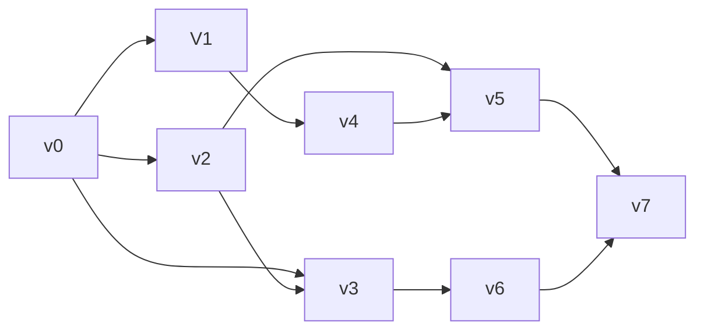

## $$面向考试的学习$$

### $逻辑结构$

数据的逻辑结构是指数据元素之间的逻辑关系和组织方式，它独立于数据的具体存储方式。数据的逻辑结构可以分为以下几种主要类型：

1. **集合结构 **
   - **定义**：集合结构是最简单的逻辑结构，数据元素之间没有特定的顺序和关系，只是简单地归为一组。
   - **特点**：数据元素无序且互不关联。
2. **线性结构**
   - **定义**：有且仅有一个开始节点和一个终端节点，并且除了头尾，每个数据元素都有一个直接前驱和直接后继，是1对1的关系
   - **特点**：数据元素之间存在一对一的顺序关系
   - **常见的线性结构**有：线性表、栈、队列、串（注意：这四种都是逻辑结构）
3. **非线性结构**
   - **定义**：一个节点可能有多个直接前驱和后继
   - **特点**：数据元素之间存在一对多的层次关系。
   - **常见的非线性结构有**：树、图

### $存储结构$

存储结构是指数据在计算机存储设备（如内存、磁盘等）中的实际组织和排列方式。

值得一提的是：存储密度$= ($结点数据本身所占的存储量$)/($结点结构所占的存储总量$)$，显而易见，链表储存密度＜1

根据数据元素在存储设备中的排列方式，存储结构主要可以分为以下几种类型：

1. **顺序存储结构 **
   - 在顺序存储结构中，数据元素按线性顺序存储在连续的内存空间中。这种结构的特点是可以通过元素的序号（索引）直接访问元素，访问效率高。
   - **优点**：
     - 访问效率高，可以通过索引直接访问元素，时间复杂度为 \(O(1)\)。
     - 内存空间紧凑，不存在指针存储开销。
   - **缺点**：
     - 插入和删除操作效率较低，尤其是在中间位置进行插入和删除时，可能需要移动大量元素，时间复杂度高。
     - 需要预先分配连续的内存空间，可能导致内存浪费或分配失败。
   - **例子**：
     - 顺序表
     - 基于数组实现的队列 (Queue) 和栈 (Stack)
2. **链式存储结构 **
   - 在链式存储结构中，数据元素存储在不连续的内存空间中，每个元素通过指针或引用链接在一起。链式存储结构的插入和删除操作是通过修改指针进行的。
   - **优点**：
     - 插入和删除操作效率高，时间复杂度为 \(O(1)\)，只需修改指针指向。
     - 不需要预先分配大块连续的内存空间。
   - **缺点**：
     - 访问效率低，必须通过指针逐个遍历元素，时间复杂度为 \(O(n)\)。
     - 需要额外的存储空间存储指针，增加了存储开销。
   - **例子**：
     - 单链表 (Singly Linked List)
     - 双链表 (Doubly Linked List)
     - 循环链表 (Circular Linked List)
3. **索引存储结构**
   - 在索引存储结构中，为了加快查找速度，在数据元素之外建立索引表，通过索引表来快速定位数据元素。索引存储结构常用于大规模数据的查找操作。
   - **优点**：
     - 查找效率高，可以快速定位数据元素。
   - **缺点**：
     - 需要额外的存储空间存储索引表。
     - 插入和删除操作较复杂，需要维护索引表。
   - **例子**：
     - 数据库索引 (B树、B+树)
     - 倒排表
4. **散列存储结构 **
   - 在散列存储结构中，通过散列函数将数据元素的关键字映射到存储地址，实现快速查找和存储。
   - **优点**：
     - 查找、插入和删除操作效率高，时间复杂度为 \(O(1)\)（平均情况下）。
   - **缺点**：
     - 需要设计良好的散列函数以减少冲突。
     - 处理冲突的方法（如开放地址法、链地址法）可能影响性能。
   - **例子**：
     - 哈希表 (Hash Table)
   - 歪楼：**处理冲突**
   - 开放地址法：线性探测法、二次探测法、随机探测法
   - **链地址法**：将所有关键字为同义词的记录存储在一个单链表中，在散列表中只存储所有同义词子表的头指针
     - 拉链法处理冲突简单，且无堆积现象，即非同义词决不会发生冲突，因此**平均查找长度较短**
     - 由于拉链法中各链表上的结点空间是动态申请的，故它更**适合于造表前无法确定表长**的情况
     - 开放定址法为减少冲突，要求装填因子α较小，故当结点规模较大时会浪费很多空间。而拉链法中可取α≥1，且结点较大时，拉链法中增加的指针域可忽略不计，因此节省空间
     - 在用拉链法构造的散列表中，**删除结点的操作易于实现**。只要简单地删去链表上相应的结点即可。而对开放地址法构造的散列表，删除结点不能简单地将被删结点的空间置为空，否则将截断在它之后填人散列表的同义词结点的查找路径。这是因为各种开放地址法中，空地址单元（即开放地址）都是查找失败的条件。因此在用开放地址法处理冲突的散列表上执行删除操作，只能在被删结点上做删除标记，而不能真正删除结点
     - 拉链法的**缺点**：指针需要额外的空间，故当结点规模较小时，开放定址法较为节省空间，而若将节省的指针空间用来扩大散列表的规模，可使装填因子变小，这又减少了开放定址法中的冲突，从而提高平均查找速度

### $题目中遇到的点$

一个逻辑结构可以有多种类型的存储结构，且不同类型的存储结构会直接影响到数据处理的效率

基于顺序表实现的逻辑结构也不一定是线性结构，比如堆

两种基本类型的索引：

- 顺序索引：基于值的顺序排序
- 散列索引：基于将值平均分道若干散列桶中。一个值所属的散列桶是由散列函数（hash function）决定的。

数据的最小单位：数据项

数据的基本单位：数据元素

数据结构：带有结构的各数据元素的集合

### $线性表$

线性表（$List$）的定义：零个或多个数据元素的**有限**序列。

​	线性表的数据集合为$\{a_1,a_2……a_n\}$，该序列有唯一的头元素和尾元素，除了头元素外，每个元素都有唯一的前驱元素，除了尾元素外，每个元素都有唯一的后继元素。

​	线性表中的元素属于相同的数据类型，即每个元素所占的空间相同。

​	注意：$Python$中的$List$存储的是引用，所以尽管数据类型多样，$List$中数据类型仍相同

框架：
$$
线性表\begin{cases}
顺序存储——顺序表\\
链式存储\begin{cases}
单链表\\
双链表\\
循环链表\end{cases}
\end{cases}
$$
有关时间复杂度：

生成、求表中元素个数、表尾添加/删除元素、返回/修改对应下标元素，均为$O(1)$；

而查找、删除、插入元素，均为$O(n)$。

### $链表$

##### 1、单链表

​	在链式结构中，除了要存储数据元素的信息外，还要存储它的后继元素的存储地址。存储数据元素信息的域称为数据域，存储直接后继位置的域称为指针域。指针域中存储的信息称做指针或链。

​	链表中第一个结点的存储位置叫做头指针。有时为了方便对对链表进行操作，会在单链表的第一个结点前附设一个节点，称为头结点，此时头指针指向的结点就是头结点。

​	空链表，头结点的直接后继为空。

##### 2、双链表

​	双向链表$$(Double$$ $$Linked$$ $$List)$$是在单链表的每个结点中，再设置一个指向其前驱结点的指针域。所以在双向链表中的结点都有两个指针域，一个指向直接后继，另一个指向直接前驱。

##### 3、循环链表

​	将单链表中终端节点的指针端由空指针改为指向头结点，就使整个单链表形成一个环，这种头尾相接的单链表称为单循环链表，简称循环链表。

### $堆$

实现方式：按完全二叉树的顺序存储方式把元素存储在一个一维数组中，满足根节点值大于（小于）所有子节点值

初始化：对分支节点从下往上依次向下冒泡调整，时间复杂度为$O(n)$

插入：将元素插入最后一位，再进行向上冒泡，时间复杂度为$O(logn)$

删除：删除堆的根节点，将最后一个节点补到根节点位置，再对根节点进行向下冒泡，时间复杂度为$O(logn)$

### $循环队列$

用长度为$n$的数组实现，认为rear指向末端元素下一个空位（新元素插入位置）时：

队空条件为：$rear==front$

队列长度为：$length=(rear-front+n)\%n$

队满：$(rear-front+1)\%n==0$

歪楼：用链接方式存储的队列，在进行删除运算时头、尾指针可能都要修改

### $排序$

$$
\begin{array}{|c|c|c|c|c|c|c|p{6cm}|}
\hline 
	名称 & 最佳 & 平均 & 最差 & 内存 & 稳定性 & 方法 & 其他备注 \\
\hline
	冒泡排序 & n & n^2 & n^2 & 1 & 是 & 交换 & 代码量极小 \\
\hline
	选择排序 & n^2 & n^2 & n^2 & 1 & 否 & 选择 & 当使用链表代替交换时，稳定,多了O(n)额外空间 \\
\hline
	快速排序 & nlogn & nlogn & n^2 & logn& 否 & 分区 & 通常原地进行，栈空间为O(logn) \\
\hline
	归并排序 & nlogn & nlogn & nlogn & n & 是 & 归并 & 高度可并行化(可优化至O(log n))\\
\hline
	插入排序 & n & n^2 & n^2 & 1 & 是 & 插入 & 最坏有d个逆序对，时间复杂度为O(n + d) \\
\hline
	希尔排序 & nlogn & n^{4/3}& n^{3/2}& 1 & 否 & 插入 & 代码量小 \\
\hline
	堆排序 & nlogn & nlogn & nlogn & 1 & 否 & 选择 & \\
\hline
\end{array}
$$

#### $1.冒泡排序(Bubble\ Sort)$

​	时间复杂度：$O(n^2)$；空间复杂度：$O(1)$​​。

​	原地排序，无需额外空间，稳定

#### $2.选择排序(Selection\ Sort)$

​	工作原理：从列表的未排序部分反复选择最小(或最大)元素，并将其移动到列表的已排序部分

​	时间复杂度：$O(n^2)$；空间复杂度：$O(1)$。

​	原地排序，无需额外空间，不稳定

简单选择排序每轮找到最值，然后交换

直接选择排序每遇到更大（小）值就交换

#### $3.快速排序(Quick\ Sort)$

##### $Hoare版$：

第一步，取某元素（通常第一个元素）为基准值，我们的目的是使基准值左边的数都比基准值小，基准值右边的数都比基准值大

第二步，定义两个下标变量，一个变量从右往左走（$R$），一个变量左往右走（$L$）。$R$和$L$交替向中间移动，每次得到一对$R、L$值进行一次交换，重复移动直到$R$和$L$相遇

##### $挖坑法$：

第一步，取某元素（通常第一个元素）为基准值，将索引设置为坑

第二步，定义两个下标变量，一个变量从右往左走（$R$），一个变量左往右走（$L$）。$R$和$L$交替向中间移动，每次交换都将变量对应的值填入坑中，并将变量设置为新坑，重复直到$R$和$L$相遇

​	时间复杂度：最好时为$O(nlogn)$，最差时为$O(n^2)$

​	空间复杂度：快排在原数组上操作，额外开栈$O(logn)$

​	不稳定

#### $4.归并排序(Merge\ Sort)$

​	原理：将数组划分为更小的子数组，对每个子数组进行排序，然后将排序后的子数组合并在一起，形成最终的排序数组

​	时间复杂度：$O(nlogn)$；空间复杂度：$O(n)$​

​	可并行化算法，稳定，适合大数据集，需要额外空间

#### $5.插入排序(Insertion\ Sort)$

​	原理：对已排好序的数组从后往前搜索得到目标插入元素的插入位置，从而不断排序

​	时间复杂度：$O(n^2)$；空间复杂度：$O(1)$

​	稳定，原地排序

#### $6.希尔排序(Shell\ Sort)$

​	希尔排序可以看作是插入排序的变种，也就相当于可以交换远项

​	时间复杂度：（最差）$O(n^2)$；空间复杂度：$O(1)$​。

​	不稳定

#### $7.堆排序(Heap\ Sort)$

​	原理：将待排序的元素构建成一个堆，然后利用堆的性质来实现排序

​	时间复杂度：$O(nlogn)$；空间复杂度：$O(1)$​​

​	适合处理大型数据集，原地排序，不稳定

### $二叉树的性质$

$$
高度+1 =深度
$$

1）第$i$层最个多$2^i$个结点（层数从0开始）
2）高为$h$的二叉树结点总数最多$2^{h+1}-1$
3）结点数为$n$的树，边的数目为$n-1$
4）$n$个结点的非空二叉树至少有$$\lceil log_2(n+1) \rceil$$层结点，即高度至少为 $\lceil log_2(n+1) \rceil - 1$
5）在任意一棵二叉树中，若叶子结点（度为0）的个数为$n_0$，度为2的结点个数为$n_2$，则
$$
\begin{eqnarray}
	n_0+n_1+n_2-1&=&边数\\
	n_1+2\ n_2&=&边数\\
	\Rightarrow n_2&=&n_0-1
\end{eqnarray}
$$
6）非空满二叉树叶结点数目等于分支结点数目加1。

>   ​	在满二叉树中，我们把有子节点的节点称为分支节点。每个分支节点都会产生两个新的叶节点。  
>   ​	但是，当我们添加一个新的分支节点时，原来的一个叶节点会变成分支节点。所以，实际上只增加了一个叶节点。 

​		a）**完全二叉树**中度为1的结点数目为0个或1个

​				结合$n_2=n_0-1$可以得到$\Rightarrow$有$n$个结点的完全二叉树有$\lfloor (n+1)/2 \rfloor$个叶结点

​		c）有$n$个叶结点的完全二叉树有$2n$或$2n-1$个结点（两种都可以构建）

​		d）有$n$个结点的非空完全二叉树的高度为$\lceil log_2(n+1)\rceil - 1$      （层数为$\lceil log_2(n+1)\rceil $）

对一个度为$2$的森林 ，叶子结点总数为$L$，度数为$2$结点总个数为$N$，那么树的个数为$L-N$

### $树的储存$

树的储存形式：双亲表示法、孩子链表表示法、孩子兄弟表示法

树的储存结构：顺序储存、链式储存

### $BST增删查改$

删：将删除的节点的值替换为左子树最大值或右子树最小值

增：递归搜索，新增的节点一定是叶子节点

### $Huffman算法$

真正存储的数据都在叶子结点

建树：使用$heapq$重复合并权值最小的两个节点（或子树），直到所有节点都合并为一棵树为止

带权外部路径长度：叶节点数值×节点深度（从0开始）

### $图的一些基本知识$

完全图（简单完全图）：任意两个顶点之间都有边
连通图（一般指无向图）：图中任意两顶点连通
连通分量：无向图的极大连通子图（类似全集的概念）
极小连通分量：在保持连通的情况下使边数最少的子图（暗指无向图）
强连通图（特指有向图）：任意一对顶点都是强连通的
强连通分量：有向图中的极大强连通子图
生成树：包含图中全部顶点的一个极小连通子图

强连通分支：局部极大强连通子图，一个图中可能不止一个强连通分支

有向图$D=(V,E)$的每个点位于且仅位于$D$的某个强连通分支中。这就是说，所有强连通分支包含所有顶点

对任意一个连通的、无环的无向图，从图中移除任何一条边得到的图均不连通。

### $邻接表\&邻接矩阵\&相邻矩阵\&路径矩阵$

**邻接表**与邻接入边表（或称逆邻接表）：

**邻接矩阵**：$n\times n$二维数组
$$
\begin{vmatrix} 
	0 & 7 & \infty & 4 & 2 \\ 
	7 & 0 & 9 & 1 & 5 \\ 
	\infty & 9 & 0 & 3 & \infty \\ 
	4 & 1 & 3 & 0 & 10 \\ 
	2 & 5 & \infty & 10 & 0 \\ 
\end{vmatrix}
$$
**相邻矩阵 $(A)$**：是一个 $n \times n$ 的矩阵，$A_{ij}$ 的值为1表示 $i$ 和 $j$ 节点之间有边，0表示没有边

**路径矩阵**：相邻矩阵的$m$次幂$ A^m $的 $i$ 行 $j$ 列的值表示 $i$ 和 $j$ 节点之间的路径的数量。如果该元素不为零，说明存在长度为$m$的路径。

### $拓扑排序$

一般对有向无环图使用，当然也可以用来判断环的存在

每次选择入度为$0$的节点入栈，相应邻接表中元素入度全部$-1$，重复直到全部节点入栈，最后输出栈中元素

AOV（Active On Vertex）网络：在有向图中，用顶点表示活动，用有向边表示前驱是后驱必要活动条件

例：

| 活动 | V0     | V1   | V2   | V3     | V4   | V5     | V6   | V7     |
| ---- | ------ | ---- | ---- | ------ | ---- | ------ | ---- | ------ |
| 前驱 | 无前驱 | V0   | V0   | V0, V2 | V1   | V2, V4 | V3   | V5, V6 |

对应AOV网络

拓扑排序（其中字典序的一种）：$V0,V1,V2,V3,V4,V5,V6,V7$

### $拉普拉斯矩阵$

度数矩阵是一个对角矩阵 ，其中包含的信息为的每一个顶点的度数

将度数矩阵与邻接矩阵逐位相减，可以求得图的拉普拉斯矩阵

### $Dijkstra$

带权BFS，用以求解图中特定两点间最短距离

Dijkstra算法的核心思想是贪心算法。从起始节点开始，逐步扩展到达图中所有其他节点的最短路径。算法维护两组节点集合：已经找到最短路径的节点集合和还没有找到最短路径的节点集合。初始时，起始节点的最短路径值设为0，其他所有节点的最短路径值设为无穷大。算法重复以下步骤直到所有节点的最短路径都被找到：

1. 从还没有找到最短路径的节点集合中选择一个与起始节点最短距离最小的节点。
2. 更新该节点相邻的节点的最短路径值：如果通过该节点到达相邻节点的路径比当前记录的路径更短，就更新这个最短路径值。
3. 将该节点移动到已经找到最短路径的节点集合中。
4. 重复上述步骤，直到所有节点的最短路径都被找到。

对负权边失效$\Rightarrow$贪心策略不再适用（$Prim$算法可以负权）

### $最小生成树$

在一给定的**无向图**$\ G = (V, E)$ 中，$(u, v)$ 代表连接顶点$u $与顶点$ v $的边，而$ w(u, v) $代表此的边权重，若存在$ T $为$ E $的子集（即）且为无循环图，使得$ w(T) $最小，则此$ T $为$ G $的最小生成树。最小生成树其实是最小权重生成树的简称。

$Prim$算法&$Kruskal$算法：

- **Prim 算法（适合稠密图）**：
  - 邻接矩阵 + 简单数组：$O(V^2)$
  - 邻接表 + 二叉堆：$O(Elog V)$
  - 邻接表 + 斐波那契堆：$O(Vlog V + E)$

- **Kruskal 算法（适合稀疏图）**
  - 并查集优化：$O(Elog V)$

### $KMP$

#### $前缀函数$

定义：给定一个长度为$n$的字符串$s$，其前缀函数被定义为一个长度为$n$的数组$\pi$。其中$\pi[i]$的定义是：

1. 如果子串$s[0…i]$有一对相等的真前缀与真后缀：$s[0…k-1]$和$s[i-(k-1)…i]$，那么$\pi[i]$就是这个相等的真前缀（或者真后缀，因为它们相等）的长度，也就是$\pi[i]=k$；
2. 如果不止有一对相等的，那么$\pi[i]$就是其中最长的那一对的长度；
3. 如果没有相等的，那么$\pi[i]=0$。

简单来说$\pi[i]$就是，子串$s[0…i]$最长的相等的真前缀与真后缀的长度。

用数学语言描述如下：
$$
\pi[i] = \max_{k=0..i} \{ k : s[0 \ldots k-1] = s[i-(k-1) \ldots i] \}
$$
特别地，规定$\pi[0]=0$。

#### $例子$

对于字符串 `abcabcd`

$\pi[0]=0$，因为 `a` 没有真前缀和真后缀，根据规定为 0

$\pi[1]=0$，因为 `ab` 无相等的真前缀和真后缀

$\pi[2]=0$，因为 `abc` 无相等的真前缀和真后缀

$\pi[3]=1$，因为 `abca` 只有一对相等的真前缀和真后缀：`a`，长度为 1

$\pi[4]=2$，因为 `abcab` 相等的真前缀和真后缀只有 `ab`，长度为 2

$\pi[5]=3$，因为 `abcabc` 相等的真前缀和真后缀只有 `abc`，长度为 3

$\pi[6]=0$，因为 `abcabcd` 无相等的真前缀和真后缀

同理可以计算字符串 `aabaaab` 的前缀函数为$[0,1,0,1,2,2,3]$。

#### $Next数组$

next数组用于存储模式字符串中每个位置之前（不包括此位置）的最大前缀长度，具体来说，next数组的含义如下：

- 对于模式字符串的每一个位置 $i$，$next$数组的值$ next[i]$ 表示模式字符串中从位置$0$到位置 $i$ 的子串的最长前缀，它同时也是该子串的后缀。即，$next$数组中的每一个值是指前缀的长度。

一种实操方法：$[-1]+$前缀数组$[:-1]$

例：$aabcaabbaa$的$next$数组为$[-1,0,1,0,0,1,2,3,0,1]$

#### $关于0开头还是-1开头$

$-1$开头与$0$开头的next数组本质是一样的。实际上，以$0$开头的$next$数组就是以$-1$开头的$next$数组每一项加$1$得到的。出现这种情况的原因在于模式串起始的索引值：在程序中，一个数组的索引的起始值为$0$；然而在考试和书中给的模式串起始值是多从$1$开始。

### $分治与DP$

#### $分治$

分治算法通常将原问题分解为几个规模较小但类似于原问题的子问题，求解这些子问题，然后再合并这些子问题的解来建立原问题的解。

注意：不必须要用递归。

#### $DP$

如果一个问题的最优解可以由其子问题的最优解有效地构造出来，那么称这个问题拥有**最优子结构(Optimal Substructure)**。最优子结构保证了动态规划中原问题的最优解可以由子问题的最优解推导而来。因此，一个问题必须拥有最优子结构，才能使用动态规划去解决。

分治和动态规划都是将问题分解为子问题，然后合并子问题的解得到原问题的解。但是不同的是，分治法分解出的子问题是不重叠的，因此分治法解决的问题不拥有重叠子问题，而动态规划解决的问题拥有**重叠子问题**。
