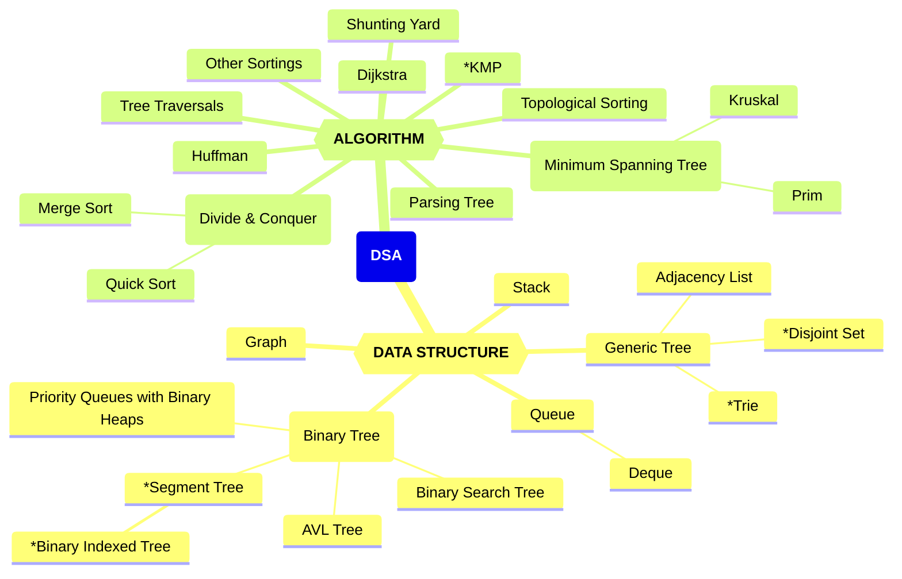
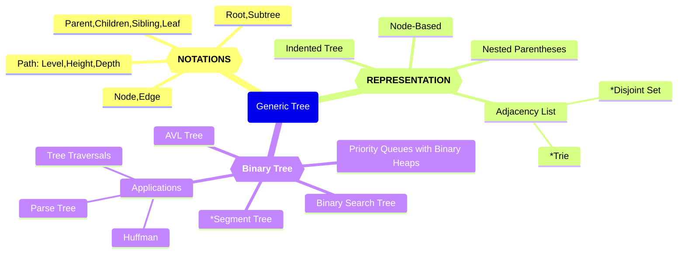

# 数算知识图谱

Updated 0058 GMT+8 March 20, 2024

2024 spring, Complied by Hongfei Yan

数算重点是树、图、和算法。因为栈、队列编程语言已经直接支持，可以直接使用。

义树及其构成。

图：数算知识图谱

图2 树的知识图谱

Prim's algorithm and Kruskal's algorithm are both used to find the minimum spanning tree (MST) of a connected, weighted graph. However, they have different approaches and are suitable for different scenarios. Here are the key differences and the typical use cases for each algorithm:

Prim's Algorithm:
- Approach: Prim's algorithm starts with a single vertex and gradually grows the MST by iteratively adding the edge with the minimum weight that connects a vertex in the MST to a vertex outside the MST.
- Suitable for: Prim's algorithm is often used when the graph is dense or when the number of edges is close to the number of vertices. It is efficient for finding the MST in such cases.
- Connectivity: Prim's algorithm always produces a connected MST.

Kruskal's Algorithm:
- Approach: Kruskal's algorithm sorts all the edges in the graph by their weights and then iteratively adds the edges with the minimum weight as long as they do not create a cycle in the MST.
- Suitable for: Kruskal's algorithm is often used when the graph is sparse or when the number of edges is much smaller than the number of vertices. It is efficient for finding the MST in such cases.
- Connectivity: Kruskal's algorithm may produce a forest of MSTs initially, and then it merges them into a single MST.

Key similarities and connections between Prim's and Kruskal's algorithms:
- Both algorithms find the minimum spanning tree of a graph.
- They are both greedy algorithms that make locally optimal choices in each step to achieve the overall minimum weight.
- The resulting MSTs produced by both algorithms have the same total weight.

In summary, you can choose between Prim's algorithm and Kruskal's algorithm based on the characteristics of the graph, such as density or sparsity, and the specific requirements of your problem.

