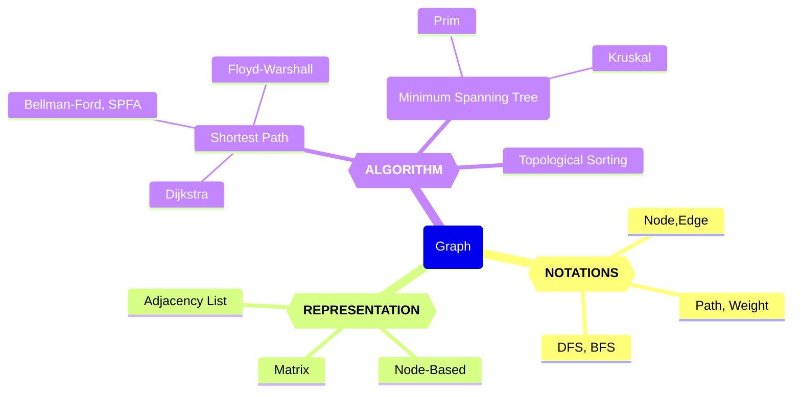

# 2024年4月 图

Updated 0120 GMT+8 March 30, 2024

2024 spring, Complied by Hongfei Yan


数算重点是树、图、和算法。计划4月份开始讲图。




图的知识图谱

# 1 图的概念

图是更通用的结构；事实上，可以把树看作一种特殊的图。图可以用来表示现实世界中很多有意思的事物，包括道路系统、城市之间的航班、互联网的连接，甚至是计算机专业的一系列必修课。你在本章中会看到，一旦有了很好的表示方法，就可以用一些标准的图算法来解决那些看起来非常困难的问题。

尽管我们能够轻易看懂路线图并理解其中不同地点之间的关系，但是计算机并不具备这样的能力。不过，我们也可以将路线图看成是一张图，从而使计算机帮我们做一些非常有意思的事情。用过互联网地图网站的人都知道，计算机可以帮助我们找到两地之间最短、最快、最便捷的路线。

计算机专业的学生可能会有这样的疑惑：自己需要学习哪些课程才能获得学位呢？图可以很好地表示课程之间的依赖关系。例如要获得计算机科学学位，所需学习课程的先后顺序。


**顶点Vertex**
顶点又称节点，是图的基础部分。它可以有自己的名字，我们称作“键”。顶点也可以带有附加信息，我们称作“有效载荷”。


**边Edge**
边是图的另一个基础部分。两个顶点通过一条边相连，表示它们之间存在关系。边既可以是单向的，也可以是双向的。如果图中的所有边都是单向的，我们称之为有向图。图7-1明显是一个有向图，因为必须修完某些课程后才能修后续的课程。

**权重Weight**
边可以带权重，用来表示从一个顶点到另一个顶点的成本。例如在路线图中，从一个城市到另一个城市，边的权重可以表示两个城市之间的距离。

有了上述定义之后，就可以正式地定义**图Graph**。图可以用G来表示，并且G = (V, E)。其中，V是一个顶点集合，E是一个边集合。每一条边是一个二元组(v, w)，其中w, v∈V。可以向边的二元组中再添加一个元素，用于表示权重。子图s是一个由边e和顶点v构成的集合，其中e⊂E且v⊂V。
图2展示了一个简单的带权有向图。我们可以用6个顶点和9条边的两个集合来正式地描述这个图：

$V = \left\{ V0,V1,V2,V3,V4,V5 \right\}$


$\begin{split}E = \left\{ \begin{array}{l}(v0,v1,5), (v1,v2,4), (v2,v3,9), (v3,v4,7), (v4,v0,1), \\
             (v0,v5,2),(v5,v4,8),(v3,v5,3),(v5,v2,1)
             \end{array} \right\}\end{split}$


图2 简单的带权有向图


图2中的例子还体现了其他两个重要的概念。

**路径Path**
路径是由边连接的顶点组成的序列。路径的正式定义为$w_1, w_2, ···, w_n$，其中对于所有的1≤i≤n-1，有$(w_i, w_{i+1})∈E$。无权重路径的长度是路径上的边数，有权重路径的长度是路径上的边的权重之和。以图7-2为例，从 V3到 V1的路径是顶点序列(V3, V4, V0, V1)，相应的边是{(v3, v4,7), (v4, v0,1), (v0, v1,5)}。

**环Cycle**
环是有向图中的一条起点和终点为同一个顶点的路径。例如，图2中的路径(V5, V2, V3, V5)就是一个环。没有环的图被称为无环图，没有环的有向图被称为有向无环图，简称为DAG。接下来会看到，DAG能帮助我们解决很多重要的问题。


# 2 图的表示方法

图的抽象数据类型
图的抽象数据类型由下列方法定义。
❏ Graph()新建一个空图。
❏ addVertex(vert)向图中添加一个顶点实例。
❏ addEdge(fromVert, toVert)向图中添加一条有向边，用于连接顶点fromVert和toVert。
❏ addEdge(fromVert, toVert, weight)向图中添加一条带权重weight的有向边，用于连接顶点fromVert和toVert。
❏ getVertex(vertKey)在图中找到名为vertKey的顶点。
❏ getVertices()以列表形式返回图中所有顶点。
❏ in通过vertex in graph这样的语句，在顶点存在时返回True，否则返回False。
根据图的正式定义，可以通过多种方式在Python中实现图的抽象数据类型。你会看到，在使用不同的表达方式来实现图的抽象数据类型时，需要做很多取舍。有两种非常著名的图实现，它们分别是邻接矩阵**adjacency matrix**和邻接表**adjacency list**。本节会解释这两种实现，并且用Python类来实现邻接表。


**dict的value如果是list，是邻接表。dici嵌套dict 是 字典树/前缀树/Trie**

是的，你提到的两种数据结构分别是邻接表和字典树（前缀树，Trie）。

1. **邻接表**：在图论中，邻接表是一种表示图的常见方式之一。如果你使用字典（`dict`）来表示图的邻接关系，并且将每个顶点的邻居顶点存储为列表（`list`），那么就构成了邻接表。例如：

```python
graph = {
    'A': ['B', 'C'],
    'B': ['A', 'D'],
    'C': ['A', 'D'],
    'D': ['B', 'C']
}
```

2. **字典树（前缀树，Trie）**：字典树是一种树形数据结构，用于高效地存储和检索字符串数据集中的键。如果你使用嵌套的字典来表示字典树，其中每个字典代表一个节点，键表示路径上的字符，而值表示子节点，那么就构成了字典树。例如：

```python
trie = {
    'a': {
        'p': {
            'p': {
                'l': {
                    'e': {'is_end': True}
                }
            }
        }
    },
    'b': {
        'a': {
            'l': {
                'l': {'is_end': True}
            }
        }
    },
    'c': {
        'a': {
            't': {'is_end': True}
        }
    }
}
```

这样的表示方式使得我们可以非常高效地搜索和插入字符串，特别是在大型数据集上。


**神奇的dict**

字典（dict）是Python中非常强大和灵活的数据结构之一，它可以用来存储键值对，是一种可变容器模型，可以存储任意数量的 Python 对象。

字典在 Python 中被广泛用于各种场景，例如：

1. **哈希映射**：字典提供了一种快速的键值查找机制，可以根据键快速地检索到相应的值。这使得字典成为了哈希映射（Hash Map）的理想实现。

2. **符号表**：在编程语言的实现中，字典常常被用作符号表，用来存储变量名、函数名等符号和它们的关联值。

3. **配置文件**：字典可以用来表示配置文件中的键值对，例如JSON文件就是一种常见的字典格式。

4. **缓存**：字典常常用于缓存中，可以将计算结果与其输入参数关联起来，以便后续快速地检索到相同参数的计算结果。

5. **图的表示**：如前文所述，字典可以用来表示图的邻接关系，是一种常见的图的表示方式。

由于其灵活性和高效性，字典在Python中被广泛应用于各种场景，并且被称为是Python中最常用的数据结构之一。


## 2.1 邻接矩阵

要实现图，最简单的方式就是使用二维矩阵。在矩阵实现中，每一行和每一列都表示图中的一个顶点。第v行和第w列交叉的格子中的值表示从顶点v到顶点w的边的权重。如果两个顶点被一条边连接起来，就称它们是相邻的。图3展示了图2对应的邻接矩阵。格子中的值表示从顶点v到顶点w的边的权重。


Figure 3: An Adjacency Matrix Representation for a Graph


邻接矩阵的优点是简单。对于小图来说，邻接矩阵可以清晰地展示哪些顶点是相连的。但是，图7-3中的绝大多数单元格是空的，我们称这种矩阵是“稀疏”的。对于存储稀疏数据来说，矩阵并不高效。事实上，要在Python中创建如图7-3所示的矩阵结构并不容易。
邻接矩阵适用于表示有很多条边的图。但是，“很多条边”具体是什么意思呢？要填满矩阵，共需要多少条边？由于每一行和每一列对应图中的每一个顶点，因此填满矩阵共需要|V|2条边。当每一个顶点都与其他所有顶点相连时，矩阵就被填满了。在现实世界中，很少有问题能够达到这种连接度。本章所探讨的问题都会用到稀疏连接的图。


## 2.2 邻接表

为了实现稀疏连接的图，更高效的方式是使用邻接表。在邻接表实现中，我们为图对象的所有顶点保存一个主列表，同时为每一个顶点对象都维护一个列表，其中记录了与它相连的顶点。在对Vertex类的实现中，我们使用字典（而不是列表），字典的键是顶点，值是权重。图4展示了图2所对应的邻接表


Figure 4: An Adjacency List Representation of a Graph

邻接表的优点是能够紧凑地表示稀疏图。此外，邻接表也有助于方便地找到与某一个顶点相连的其他所有顶点。


## 2.3 实现

在Python中，通过字典可以轻松地实现邻接表。我们要创建两个类：Graph类存储包含所有顶点的主列表，Vertex类表示图中的每一个顶点。
Vertex使用字典connectedTo来记录与其相连的顶点，以及每一条边的权重。代码清单7-1展示了Vertex类的实现，其构造方法简单地初始化id（它通常是一个字符串），以及字典connectedTo。addNeighbor方法添加从一个顶点到另一个的连接。getConnections方法返回邻接表中的所有顶点，由connectedTo来表示。getWeight方法返回从当前顶点到以参数传入的顶点之间的边的权重。
代码清单7-1 Vertex类


```python
class Vertex:
    def __init__(self,key):
        self.id = key
        self.connectedTo = {}

    def addNeighbor(self,nbr,weight=0):
        self.connectedTo[nbr] = weight

    def __str__(self):
        return str(self.id) + ' connectedTo: ' + str([x.id for x in self.connectedTo])

    def getConnections(self):
        return self.connectedTo.keys()

    def getId(self):
        return self.id

    def getWeight(self,nbr):
        return self.connectedTo[nbr]
```


Graph类的实现如代码清单7-2所示，其中包含一个将顶点名映射到顶点对象的字典。在图7-4中，该字典对象由灰色方块表示。Graph类也提供了向图中添加顶点和连接不同顶点的方法。getVertices方法返回图中所有顶点的名字。此外，我们还实现了__iter__方法，从而使遍历图中的所有顶点对象更加方便。总之，这两个方法使我们能够根据顶点名或者顶点对象本身遍历图中的所有顶点。
代码清单7-2 Graph类


```python
class Graph:
    def __init__(self):
        self.vertList = {}
        self.numVertices = 0

    def addVertex(self,key):
        self.numVertices = self.numVertices + 1
        newVertex = Vertex(key)
        self.vertList[key] = newVertex
        return newVertex

    def getVertex(self,n):
        if n in self.vertList:
            return self.vertList[n]
        else:
            return None

    def __contains__(self,n):
        return n in self.vertList

    def addEdge(self,f,t,weight=0):
        if f not in self.vertList:
            nv = self.addVertex(f)
        if t not in self.vertList:
            nv = self.addVertex(t)
        self.vertList[f].addNeighbor(self.vertList[t], weight)

    def getVertices(self):
        return self.vertList.keys()

    def __iter__(self):
        return iter(self.vertList.values())
```

下面的Python会话使用Graph类和Vertex类创建了如图7-2所示的图。首先创建6个顶点，依次编号为0～5。然后打印顶点字典。注意，对每一个键，我们都创建了一个Vertex实例。接着，添加将顶点连接起来的边。最后，用一个嵌套循环验证图中的每一条边都已被正确存储。请按照图2的内容检查会话的最终结果。


```
>>> g = Graph()
>>> for i in range(6):
...    g.addVertex(i)
>>> g.vertList
{0: <adjGraph.Vertex instance at 0x41e18>,
 1: <adjGraph.Vertex instance at 0x7f2b0>,
 2: <adjGraph.Vertex instance at 0x7f288>,
 3: <adjGraph.Vertex instance at 0x7f350>,
 4: <adjGraph.Vertex instance at 0x7f328>,
 5: <adjGraph.Vertex instance at 0x7f300>}
>>> g.addEdge(0,1,5)
>>> g.addEdge(0,5,2)
>>> g.addEdge(1,2,4)
>>> g.addEdge(2,3,9)
>>> g.addEdge(3,4,7)
>>> g.addEdge(3,5,3)
>>> g.addEdge(4,0,1)
>>> g.addEdge(5,4,8)
>>> g.addEdge(5,2,1)
>>> for v in g:
...    for w in v.getConnections():
...        print("( %s , %s )" % (v.getId(), w.getId()))
...
( 0 , 5 )
( 0 , 1 )
( 1 , 2 )
( 2 , 3 )
( 3 , 4 )
( 3 , 5 )
( 4 , 0 )
( 5 , 4 )
( 5 , 2 )
```


# 3 图的应用


## 3.1 宽度优先搜索

Breadth First Search (BFS), algorithm for traversing or searching graphs

O(|V| + |E|) time complexity, |V| number of nodes, |E| number of edges

Applications:

Shortest path between two nodes (unweighted Graph)

Ford-Fulkson algorithm (Maximum Flow in a network)


```python

```


## 3.2 深度优先搜索

```python

```


# 4 图的算法


## 4.1 拓扑排序

```python

```


## 4.2 强连通

```python

```


## 4.3 Dijkstra

```python

```


## 4.4 Prim

```python

```


Prim's algorithm and Kruskal's algorithm are both used to find the minimum spanning tree (MST) of a connected, weighted graph. However, they have different approaches and are suitable for different scenarios. Here are the key differences and the typical use cases for each algorithm:

Prim's Algorithm:
- Approach: Prim's algorithm starts with a single vertex and gradually grows the MST by iteratively adding the edge with the minimum weight that connects a vertex in the MST to a vertex outside the MST.
- Suitable for: Prim's algorithm is often used when the graph is dense or when the number of edges is close to the number of vertices. It is efficient for finding the MST in such cases.
- Connectivity: Prim's algorithm always produces a connected MST.

Kruskal's Algorithm:
- Approach: Kruskal's algorithm sorts all the edges in the graph by their weights and then iteratively adds the edges with the minimum weight as long as they do not create a cycle in the MST.
- Suitable for: Kruskal's algorithm is often used when the graph is sparse or when the number of edges is much smaller than the number of vertices. It is efficient for finding the MST in such cases.
- Connectivity: Kruskal's algorithm may produce a forest of MSTs initially, and then it merges them into a single MST.

Key similarities and connections between Prim's and Kruskal's algorithms:
- Both algorithms find the minimum spanning tree of a graph.
- They are both greedy algorithms that make locally optimal choices in each step to achieve the overall minimum weight.
- The resulting MSTs produced by both algorithms have the same total weight.

In summary, you can choose between Prim's algorithm and Kruskal's algorithm based on the characteristics of the graph, such as density or sparsity, and the specific requirements of your problem.


# 二、笔试题目

2022年5个大题：图Dijkstra，二叉树，排序，单链表，二叉树。

2021年6个大题：森林dfs、bfs，哈夫曼树，二叉树建堆，图prim，二叉树遍历，图走迷宫。

## 选择（30分，每题2分）

**Q:** 给定一个二叉树，若前序遍历序列与中序遍历序列相同，则二叉树是（ D ）。
A：根结点无左子树的二叉树
B：根结点无右子树的二叉树
C：只有根结点的二叉树或非叶子结点只有左子树的二叉树
**D：**只有根结点的二叉树或非叶子结点只有右子树的二叉树

因为在前序遍历中，根节点总是首先访问的，而在中序遍历中，根节点必然在中间。


## 判断（10分，每题1分）

对填写"Y"，错填写"N"

**Q:** （Y）


## 填空（20分，每题2分）

**Q:** 


## 简答（24分，每题6分）

**Q:** 


# 参考

Problem Solving with Algorithms and Data Structures using Python

https://runestone.academy/ns/books/published/pythonds/index.html


https://github.com/Yuqiu-Yang/problem_solving_with_algorithms_and_data_structures_using_python

https://github.com/wesleyjtann/Problem-Solving-with-Algorithms-and-Data-Structures-Using-Python

