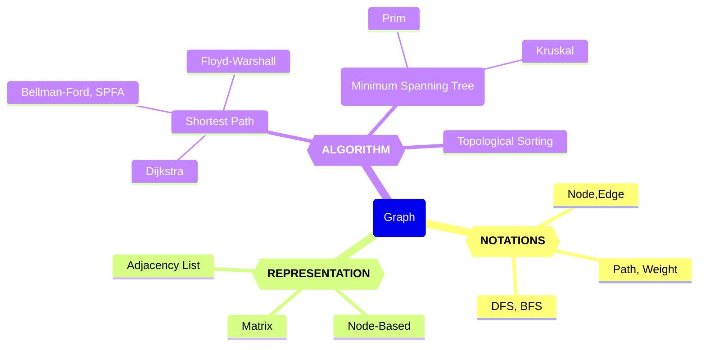

# 20240409～23-Week8~10 图算法

Updated 2215 GMT+8 Apr 5, 2024

2024 spring, Complied by Hongfei Yan


> Logs:
>
> 2024/4/5 数算重点是树、图、和算法。图这部分重点是算法，因为图的主要表示方式——邻接表，树也使用。
>
> 其中涉及到矩阵存储的图遍历，基本都是计概题目。




<center>图的知识图谱</center>


# 一、（Week8）图的概念、表示方法和遍历


## 1 术语和定义

图是更通用的结构；事实上，可以把树看作一种特殊的图。图可以用来表示现实世界中很多有意思的事物，包括道路系统、城市之间的航班、互联网的连接，甚至是计算机专业的一系列必修课。你在本章中会看到，一旦有了很好的表示方法，就可以用一些标准的图算法来解决那些看起来非常困难的问题。

尽管我们能够轻易看懂路线图并理解其中不同地点之间的关系，但是计算机并不具备这样的能力。不过，我们也可以将路线图看成是一张图，从而使计算机帮我们做一些非常有意思的事情。用过互联网地图网站的人都知道，计算机可以帮助我们找到两地之间最短、最快、最便捷的路线。

计算机专业的学生可能会有这样的疑惑：自己需要学习哪些课程才能获得学位呢？图可以很好地表示课程之间的依赖关系。图1展示了要获得计算机科学学位，所需学习课程的先后顺序。


<center>图1 计算机课程的学习顺序</center>


抽象出来看，**图（Graph）**由**顶点（Vertex）**和**边（Edge）**组成，每条边的两端都必须是图的两个顶点(可以是相同的顶点)。而记号 G(V,E)表示图 G 的顶点集为 V、边集为 E。图 2 是一个抽象出来的图。


<center>图2 抽象出来的图</center>


一般来说，图可分为有向图和无向图。有向图的所有边都有方向，即确定了顶点到顶点的一个指向;而无向图的所有边都是双向的，即无向边所连接的两个顶点可以互相到达。在一些问题中，可以把无向图当作所有边都是正向和负向的两条有向边组成，这对解决一些问题很有帮助。图 3是有向图和无向图的举例。


<center> 图3 无向图与有向图 </center>


**顶点Vertex**
顶点又称节点，是图的基础部分。它可以有自己的名字，我们称作“键”。顶点也可以带有附加信息，我们称作“有效载荷”。


**边Edge**
边是图的另一个基础部分。两个顶点通过一条边相连，表示它们之间存在关系。边既可以是单向的，也可以是双向的。如果图中的所有边都是单向的，我们称之为有向图。图1明显是一个有向图，因为必须修完某些课程后才能修后续的课程。


**度Degree**

顶点的度是指和该顶点相连的边的条数。特别是对于有向图来说，顶点的出边条数称为该顶点的出度，顶点的入边条数称为该顶点的入度。例如图 3 的无向图中，V的度为 2,Vs的度为 4;有向图例子中，V的出度为 1、入度为 2。


**权值Weight**

顶点和边都可以有一定属性，而量化的属性称为权值，顶点的权值和边的权值分别称为点权和边权。权值可以根据问题的实际背景设定，例如点权可以是城市中资源的数目，边权可以使两个城市之间来往所需要的时间、花费或距离。


有了上述定义之后，再来正式地定义**图Graph**。图可以用G来表示，并且G = (V, E)。其中，V是一个顶点集合，E是一个边集合。每一条边是一个二元组(v, w)，其中w, v∈V。可以向边的二元组中再添加一个元素，用于表示权重。子图s是一个由边e和顶点v构成的集合，其中e⊂E且v⊂V。
图4 展示了一个简单的带权有向图。我们可以用6个顶点和9条边的两个集合来正式地描述这个图：

$V = \left\{ V0,V1,V2,V3,V4,V5 \right\}$


$\begin{split}E = \left\{ \begin{array}{l}(v0,v1,5), (v1,v2,4), (v2,v3,9), (v3,v4,7), (v4,v0,1), \\
             (v0,v5,2),(v5,v4,8),(v3,v5,3),(v5,v2,1)
             \end{array} \right\}\end{split}$


<center>图4 简单的带权有向图</center>


图4中的例子还体现了其他两个重要的概念。

**路径Path**
路径是由边连接的顶点组成的序列。路径的正式定义为$w_1, w_2, ···, w_n$，其中对于所有的1≤i≤n-1，有$(w_i, w_{i+1})∈E$。无权重路径的长度是路径上的边数，有权重路径的长度是路径上的边的权重之和。以图7-2为例，从 V3到 V1的路径是顶点序列(V3, V4, V0, V1)，相应的边是{(v3, v4,7), (v4, v0,1), (v0, v1,5)}。

**环Cycle**
环是有向图中的一条起点和终点为同一个顶点的路径。例如，图2中的路径(V5, V2, V3, V5)就是一个环。没有环的图被称为无环图，没有环的有向图被称为有向无环图，简称为DAG。接下来会看到，DAG能帮助我们解决很多重要的问题。


### 1.1 编程题目

晴问题目练习网址，https://sunnywhy.com/sfbj

#### sy374: 无向图的度 简单

https://sunnywhy.com/sfbj/10/1/374

现有一个共n个顶点、m条边的无向图（假设顶点编号为从`0`到`n-1`），求每个顶点的度。

**输入**

第一行两个整数n、m（$1 \le n \le 100,0 \le m \le \frac{n(n-1)}2$），分别表示顶点数和边数；

接下来m行，每行两个整数u、v（$0 \le u \le n-1,0 \le v \le n-1, u \ne v$），表示一条边的两个端点的编号。数据保证不会有重边。

**输出**

在一行中输出n个整数，表示编号为从`0`到`n-1`的顶点的度。整数之间用空格隔开，行末不允许有多余的空格。

样例1

输入

```
3 2
0 1
0 2
```

输出

```
2 1 1
```

解释

对应的无向图如下图所示，`0`号顶点的度为`2`，`1`号和`2`号顶点的度为`1`。


为了求解每个顶点的度，我们可以创建一个列表来存储每个顶点的度，初始值都为0。然后，对于每条边，我们将边的两个端点的度都加1。

以下是实现这个过程的Python代码：

```python
n, m = map(int, input().split())
degrees = [0] * n
for _ in range(m):
    u, v = map(int, input().split())
    degrees[u] += 1
    degrees[v] += 1

print(' '.join(map(str, degrees)))
```

这段代码首先读取输入，然后创建一个列表来存储每个顶点的度。然后，它遍历每条边，将边的两个端点的度都加1。最后，它输出每个顶点的度。


#### sy375: 有向图的度 简单

https://sunnywhy.com/sfbj/10/1/375

现有一个共n个顶点、m条边的有向图（假设顶点编号为从`0`到`n-1`），求每个顶点的入度和出度。

**输入**

第一行两个整数n、m（$1 \le n \le 100,0 \le m \le n(n-1)$），分别表示顶点数和边数；

接下来m行，每行两个整数u、v（$0 \le u \le n-1,0 \le v \le n-1, u \ne v$），表示一条边的两个端点的编号。数据保证不会有重边。

**输出**

输出行，每行为编号从`0`到`n-1`的一个顶点的入度和出度，中间用空格隔开。

样例1

输入

```
3 3
0 1
0 2
2 1
```

输出

```
0 2
2 0
1 1
```

解释

对应的有向图如下图所示。

`0`号顶点有`0`条入边，`2`条出边，因此入度为`0`，出度为`2`；

`1`号顶点有`2`条入边，`0`条出边，因此入度为`2`，出度为`0`；

`2`号顶点有`1`条入边，`1`条出边，因此入度为`1`，出度为`1`。


为了求解每个顶点的入度和出度，我们可以创建两个列表来分别存储每个顶点的入度和出度，初始值都为0。然后，对于每条边，我们将起点的出度加1，终点的入度加1。

以下是实现这个过程的Python代码：

```python
n, m = map(int, input().split())
in_degrees = [0] * n
out_degrees = [0] * n
for _ in range(m):
    u, v = map(int, input().split())
    out_degrees[u] += 1
    in_degrees[v] += 1

for i in range(n):
    print(in_degrees[i], out_degrees[i])
```

这段代码首先读取输入，然后创建两个列表来存储每个顶点的入度和出度。然后，它遍历每条边，将边的起点的出度加1，终点的入度加1。最后，它输出每个顶点的入度和出度。


## 2 图的表示方法

图的抽象数据类型
图的抽象数据类型由下列方法定义。
❏ Graph()新建一个空图。
❏ addVertex(vert)向图中添加一个顶点实例。
❏ addEdge(fromVert, toVert)向图中添加一条有向边，用于连接顶点fromVert和toVert。
❏ addEdge(fromVert, toVert, weight)向图中添加一条带权重weight的有向边，用于连接顶点fromVert和toVert。
❏ getVertex(vertKey)在图中找到名为vertKey的顶点。
❏ getVertices()以列表形式返回图中所有顶点。
❏ in通过vertex in graph这样的语句，在顶点存在时返回True，否则返回False。
根据图的正式定义，可以通过多种方式在Python中实现图的抽象数据类型。你会看到，在使用不同的表达方式来实现图的抽象数据类型时，需要做很多取舍。有两种非常著名的图实现，它们分别是邻接矩阵**adjacency matrix**和邻接表**adjacency list**。本节会解释这两种实现，并且用Python类来实现邻接表。


> **dict的value如果是list，是邻接表。dici嵌套dict 是 字典树/前缀树/Trie**
>
> 是的，你提到的两种数据结构分别是邻接表和字典树（前缀树，Trie）。
>
> 1. **邻接表**：在图论中，邻接表是一种表示图的常见方式之一。如果你使用字典（`dict`）来表示图的邻接关系，并且将每个顶点的邻居顶点存储为列表（`list`），那么就构成了邻接表。例如：
>
> ```python
> graph = {
>     'A': ['B', 'C'],
>     'B': ['A', 'D'],
>     'C': ['A', 'D'],
>     'D': ['B', 'C']
> }
> ```
>
> 2. **字典树（前缀树，Trie）**：字典树是一种树形数据结构，用于高效地存储和检索字符串数据集中的键。如果你使用嵌套的字典来表示字典树，其中每个字典代表一个节点，键表示路径上的字符，而值表示子节点，那么就构成了字典树。例如：
>
> ```python
> trie = {
>     'a': {
>         'p': {
>             'p': {
>                 'l': {
>                     'e': {'is_end': True}
>                 }
>             }
>         }
>     },
>     'b': {
>         'a': {
>             'l': {
>                 'l': {'is_end': True}
>             }
>         }
>     },
>     'c': {
>         'a': {
>             't': {'is_end': True}
>         }
>     }
> }
> ```
>
> 这样的表示方式使得我们可以非常高效地搜索和插入字符串，特别是在大型数据集上。
>
> 
>
> **神奇的dict**
>
> 字典（dict）是Python中非常强大和灵活的数据结构之一，它可以用来存储键值对，是一种可变容器模型，可以存储任意数量的 Python 对象。
>
> 字典在 Python 中被广泛用于各种场景，例如：
>
> 1. **哈希映射**：字典提供了一种快速的键值查找机制，可以根据键快速地检索到相应的值。这使得字典成为了哈希映射（Hash Map）的理想实现。
>
> 2. **符号表**：在编程语言的实现中，字典常常被用作符号表，用来存储变量名、函数名等符号和它们的关联值。
>
> 3. **配置文件**：字典可以用来表示配置文件中的键值对，例如JSON文件就是一种常见的字典格式。
>
> 4. **缓存**：字典常常用于缓存中，可以将计算结果与其输入参数关联起来，以便后续快速地检索到相同参数的计算结果。
>
> 5. **图的表示**：如前文所述，字典可以用来表示图的邻接关系，是一种常见的图的表示方式。
>
> 由于其灵活性和高效性，字典在Python中被广泛应用于各种场景，并且被称为是Python中最常用的数据结构之一。


### 2.1 邻接矩阵

要实现图，最简单的方式就是使用二维矩阵。在矩阵实现中，每一行和每一列都表示图中的一个顶点。第v行和第w列交叉的格子中的值表示从顶点v到顶点w的边的权重。如果两个顶点被一条边连接起来，就称它们是相邻的。图3展示了图2对应的邻接矩阵。格子中的值表示从顶点v到顶点w的边的权重。


Figure 3: An Adjacency Matrix Representation for a Graph


邻接矩阵的优点是简单。对于小图来说，邻接矩阵可以清晰地展示哪些顶点是相连的。但是，图7-3中的绝大多数单元格是空的，我们称这种矩阵是“稀疏”的。对于存储稀疏数据来说，矩阵并不高效。事实上，要在Python中创建如图7-3所示的矩阵结构并不容易。
邻接矩阵适用于表示有很多条边的图。但是，“很多条边”具体是什么意思呢？要填满矩阵，共需要多少条边？由于每一行和每一列对应图中的每一个顶点，因此填满矩阵共需要|V|2条边。当每一个顶点都与其他所有顶点相连时，矩阵就被填满了。在现实世界中，很少有问题能够达到这种连接度。本章所探讨的问题都会用到稀疏连接的图。


### 2.2 邻接表

为了实现稀疏连接的图，更高效的方式是使用邻接表。在邻接表实现中，我们为图对象的所有顶点保存一个主列表，同时为每一个顶点对象都维护一个列表，其中记录了与它相连的顶点。在对Vertex类的实现中，我们使用字典（而不是列表），字典的键是顶点，值是权重。图4展示了图2所对应的邻接表


Figure 4: An Adjacency List Representation of a Graph

邻接表的优点是能够紧凑地表示稀疏图。此外，邻接表也有助于方便地找到与某一个顶点相连的其他所有顶点。


### 2.3 类实现

在Python中，通过字典可以轻松地实现邻接表。我们要创建两个类：Graph类存储包含所有顶点的主列表，Vertex类表示图中的每一个顶点。
Vertex使用字典connectedTo来记录与其相连的顶点，以及每一条边的权重。代码清单7-1展示了Vertex类的实现，其构造方法简单地初始化id（它通常是一个字符串），以及字典connectedTo。addNeighbor方法添加从一个顶点到另一个的连接。getConnections方法返回邻接表中的所有顶点，由connectedTo来表示。getWeight方法返回从当前顶点到以参数传入的顶点之间的边的权重。

代码清单7-1 Vertex类

```python
class Vertex:
    def __init__(self,key):
        self.id = key
        self.connectedTo = {}

    def addNeighbor(self,nbr,weight=0):
        self.connectedTo[nbr] = weight

    def __str__(self):
        return str(self.id) + ' connectedTo: ' + str([x.id for x in self.connectedTo])

    def getConnections(self):
        return self.connectedTo.keys()

    def getId(self):
        return self.id

    def getWeight(self,nbr):
        return self.connectedTo[nbr]
```


Graph类的实现如代码清单7-2所示，其中包含一个将顶点名映射到顶点对象的字典。在图4中，该字典对象由灰色方块表示。Graph类也提供了向图中添加顶点和连接不同顶点的方法。getVertices方法返回图中所有顶点的名字。此外，我们还实现了__iter__方法，从而使遍历图中的所有顶点对象更加方便。总之，这两个方法使我们能够根据顶点名或者顶点对象本身遍历图中的所有顶点。

代码清单7-2 Graph类

```python
class Graph:
    def __init__(self):
        self.vertList = {}
        self.numVertices = 0

    def addVertex(self,key):
        self.numVertices = self.numVertices + 1
        newVertex = Vertex(key)
        self.vertList[key] = newVertex
        return newVertex

    def getVertex(self,n):
        if n in self.vertList:
            return self.vertList[n]
        else:
            return None

    def __contains__(self,n):
        return n in self.vertList

    def addEdge(self,f,t,weight=0):
        if f not in self.vertList:
            nv = self.addVertex(f)
        if t not in self.vertList:
            nv = self.addVertex(t)
        self.vertList[f].addNeighbor(self.vertList[t], weight)

    def getVertices(self):
        return self.vertList.keys()

    def __iter__(self):
        return iter(self.vertList.values())
```

下面的Python会话使用Graph类和Vertex类创建了如图2所示的图。首先创建6个顶点，依次编号为0～5。然后打印顶点字典。注意，对每一个键，我们都创建了一个Vertex实例。接着，添加将顶点连接起来的边。最后，用一个嵌套循环验证图中的每一条边都已被正确存储。请按照图2的内容检查会话的最终结果。


```
>>> g = Graph()
>>> for i in range(6):
...    g.addVertex(i)
>>> g.vertList
{0: <adjGraph.Vertex instance at 0x41e18>,
 1: <adjGraph.Vertex instance at 0x7f2b0>,
 2: <adjGraph.Vertex instance at 0x7f288>,
 3: <adjGraph.Vertex instance at 0x7f350>,
 4: <adjGraph.Vertex instance at 0x7f328>,
 5: <adjGraph.Vertex instance at 0x7f300>}
>>> g.addEdge(0,1,5)
>>> g.addEdge(0,5,2)
>>> g.addEdge(1,2,4)
>>> g.addEdge(2,3,9)
>>> g.addEdge(3,4,7)
>>> g.addEdge(3,5,3)
>>> g.addEdge(4,0,1)
>>> g.addEdge(5,4,8)
>>> g.addEdge(5,2,1)
>>> for v in g:
...    for w in v.getConnections():
...        print("( %s , %s )" % (v.getId(), w.getId()))
...
( 0 , 5 )
( 0 , 1 )
( 1 , 2 )
( 2 , 3 )
( 3 , 4 )
( 3 , 5 )
( 4 , 0 )
( 5 , 4 )
( 5 , 2 )
```


上面类方式定义顶点和图，要求掌握，因为笔试可能出现。在机考中，也可以直接使用二维列表或者字典来表示邻接表。


### 2.4 编程题目

#### sy376: 无向图的邻接矩阵 简单

https://sunnywhy.com/sfbj/10/2/376

现有一个共n个顶点、m条边的无向图（假设顶点编号为从`0`到`n-1`），将其按邻接矩阵的方式存储（存在边的位置填充`1`，不存在边的位置填充`0`），然后输出整个邻接矩阵。

**输入**

第一行两个整数n、m（$1 \le n \le 100,0 \le m \le \frac{n(n-1)}2$），分别表示顶点数和边数；

接下来m行，每行两个整数u、v（$0 \le u \le n-1,0 \le v \le n-1, u \ne v$），表示一条边的两个端点的编号。数据保证不会有重边。

**输出**

输出n行n列，表示邻接矩阵。整数之间用空格隔开，行末不允许有多余的空格。

样例1

输入

```
3 2
0 1
0 2
```

输出

```
0 1 1
1 0 0
1 0 0
```

解释

对应的无向图如下图所示。

`0`号顶点有`2`条出边，分别到达`1`号顶点和`2`号顶点；

`1`号顶点有`1`条出边，到达`0`号顶点；

`2`号顶点有`1`条出边，到达`0`号顶点。


为了将无向图按邻接矩阵的方式存储，我们可以创建一个n*n的二维列表，初始值都为0。然后，对于每条边，我们将边的两个端点对应的位置填充为1。

以下是实现这个过程的Python代码：

```python
n, m = map(int, input().split())
adjacency_matrix = [[0]*n for _ in range(n)]
for _ in range(m):
    u, v = map(int, input().split())
    adjacency_matrix[u][v] = 1
    adjacency_matrix[v][u] = 1

for row in adjacency_matrix:
    print(' '.join(map(str, row)))
```

这段代码首先读取输入，然后创建一个n*n的二维列表来存储邻接矩阵。然后，它遍历每条边，将边的两个端点对应的位置填充为1。最后，它输出整个邻接矩阵。


#### sy377: 有向图的邻接矩阵 简单

https://sunnywhy.com/sfbj/10/2/377

现有一个共n个顶点、m条边的有向图（假设顶点编号为从`0`到`n-1`），将其按邻接矩阵的方式存储（存在边的位置填充`1`，不存在边的位置填充`0`），然后输出整个邻接矩阵。

**输入**

第一行两个整数n、m（$1 \le n \le 100,0 \le m \le n(n-1)$），分别表示顶点数和边数；

接下来m行，每行两个整数u、v（$0 \le u \le n-1,0 \le v \le n-1, u \ne v$），表示一条边的起点和终点的编号。数据保证不会有重边。

**输出**

输出n行n列，表示邻接矩阵。整数之间用空格隔开，行末不允许有多余的空格。

样例1

输入

```
3 3
0 1
0 2
2 1
```

输出

```
0 1 1
0 0 0
0 1 0
```

解释

对应的有向图如下图所示。

`0`号顶点有`2`条出边，分别到达`1`号顶点和`2`号顶点；

`1`号顶点有`0`条出边；

`2`号顶点有`1`条出边，到达`1`号顶点。


为了将有向图按邻接矩阵的方式存储，我们可以创建一个n*n的二维列表，初始值都为0。然后，对于每条边，我们将边的起点和终点对应的位置填充为1。

以下是实现这个过程的Python代码：

```python
n, m = map(int, input().split())
adjacency_matrix = [[0]*n for _ in range(n)]
for _ in range(m):
    u, v = map(int, input().split())
    adjacency_matrix[u][v] = 1

for row in adjacency_matrix:
    print(' '.join(map(str, row)))
```

这段代码首先读取输入，然后创建一个n*n的二维列表来存储邻接矩阵。然后，它遍历每条边，将边的起点和终点对应的位置填充为1。最后，它输出整个邻接矩阵。


#### sy378: 无向图的邻接表 简单

https://sunnywhy.com/sfbj/10/2/378

现有一个共n个顶点、m条边的无向图（假设顶点编号为从`0`到`n-1`），将其按邻接表的方式存储，然后输出整个邻接表。

**输入**

第一行两个整数n、m（$1 \le n \le 100,0 \le m \le \frac{n(n-1)}2$），分别表示顶点数和边数；

接下来m行，每行两个整数u、v（$0 \le u \le n-1,0 \le v \le n-1, u \ne v$），表示一条边的两个端点的编号。数据保证不会有重边。

**输出**

输出行，按顺序给出编号从`0`到`n-1`的顶点的所有出边，每行格式如下：

```text
id(k) v_1 v_2 ... v_k
```

其中表示当前顶点的编号，表示该顶点的出边数量，、、...、表示条出边的终点编号（按边输入的顺序输出）。行末不允许有多余的空格。

样例1

输入

```
3 2
0 1
0 2
```

输出

```
0(2) 1 2
1(1) 0
2(1) 0
```

解释

对应的无向图如下图所示。

`0`号顶点有`2`条出边，分别到达`1`号顶点和`2`号顶点；

`1`号顶点有`1`条出边，到达`0`号顶点；

`2`号顶点有`1`条出边，到达`0`号顶点。


为了将无向图按邻接表的方式存储，我们可以创建一个列表，其中每个元素都是一个列表，表示一个顶点的所有邻接顶点。然后，对于每条边，我们将边的两个端点添加到对方的邻接列表中。

以下是实现这个过程的Python代码：

```python
n, m = map(int, input().split())
adjacency_list = [[] for _ in range(n)]
for _ in range(m):
    u, v = map(int, input().split())
    adjacency_list[u].append(v)
    adjacency_list[v].append(u)

for i in range(n):
    num = len(adjacency_list[i])
    if num == 0:
        print(f"{i}({num})")
    else:
        print(f"{i}({num})", ' '.join(map(str, adjacency_list[i])))
```

这段代码首先读取输入，然后创建一个列表来存储邻接表。然后，它遍历每条边，将边的两个端点添加到对方的邻接列表中。最后，它输出整个邻接表。


#### sy379: 有向图的邻接表 简单

https://sunnywhy.com/sfbj/10/2/379

现有一个共n个顶点、m条边的有向图（假设顶点编号为从`0`到`n-1`），将其按邻接表的方式存储，然后输出整个邻接表。

**输入**

第一行两个整数n、m（$1 \le n \le 100,0 \le m \le n(n-1)$），分别表示顶点数和边数；

接下来m行，每行两个整数u、v（$0 \le u \le n-1,0 \le v \le n-1, u \ne v$），表示一条边的起点和终点的编号。数据保证不会有重边。

**输出**

输出行，按顺序给出编号从`0`到`n-1`的顶点的所有出边，每行格式如下：

```text
id(k) v_1 v_2 ... v_k
```

其中id表示当前顶点的编号，k表示该顶点的出边数量，v1、v2、...、vk表示k条出边的终点编号（按边输入的顺序输出）。行末不允许有多余的空格。

样例1

输入

```
3 3
0 1
0 2
2 1
```

输出

```
0(2) 1 2
1(0)
2(1) 1
```

解释

对应的有向图如下图所示。

`0`号顶点有`2`条出边，分别到达`1`号顶点和`2`号顶点；

`1`号顶点有`0`条出边；

`2`号顶点有`1`条出边，到达`1`号顶点。


为了将有向图按邻接表的方式存储，我们可以创建一个列表，其中每个元素都是一个列表，表示一个顶点的所有邻接顶点。然后，对于每条边，我们将边的终点添加到起点的邻接列表中。

以下是实现这个过程的Python代码：

```python
n, m = map(int, input().split())
adjacency_list = [[] for _ in range(n)]
for _ in range(m):
    u, v = map(int, input().split())
    adjacency_list[u].append(v)

for i in range(n):
    num = len(adjacency_list[i])
    if num == 0:
        print(f"{i}({num})")
    else:
        print(f"{i}({num})", ' '.join(map(str, adjacency_list[i])))
```

这段代码首先读取输入，然后创建一个列表来存储邻接表。然后，它遍历每条边，将边的终点添加到起点的邻接列表中。最后，它输出整个邻接表。


## 3 图的矩阵遍历

### 3.1 深度优先搜索(DFS)

设想我们现在以第一视角身处一个巨大的迷宫当中，没有上帝视角，没有通信设施，更没有热血动漫里的奇迹，有的只是四周长得一样的墙壁。于是，我们只能自己想办法走出去。如果迷失了内心，随便乱走，那么很可能被四周完全相同的景色绕晕在其中，这时只能放弃所谓的侥幸，而去采取下面这种看上去很盲目但实际上会很有效的方法。

以当前所在位置为起点，沿着一条路向前走，当碰到岔道口时，选择其中一个岔路前进如果选择的这个岔路前方是一条死路，就退回到这个岔道口，选择另一个岔路前进。如果岔路中存在新的岔道口，那么仍然按上面的方法枚举新岔道口的每一条岔路。这样，只要迷宫存在出口，那么这个方法一定能够找到它。可能有读者会问，如果在第一个岔道口处选择了一条没有出路的分支，而这个分支比较深，并且路上多次出现新的岔道口，那么当发现这个分支是个死分支之后，如何退回到最初的这个岔道口?其实方法很简单，只要让右手始终贴着右边的墙壁一路往前走，那么自动会执行上面这个走法，并且最终一定能找到出口。图 8-1 即为使用这个方法走一个简单迷宫的示例。


从图 8-1 可知，从起点开始前进，当碰到岔道口时，总是选择其中一条岔路前进(例如图中总是先选择最右手边的岔路)，在岔路上如果又遇到新的岔道口，仍然选择新岔道口的其中一条岔路前进，直到碰到死胡同才回退到最近的岔道口选择另一条岔路。也就是说，当碰到岔道口时，总是以“**深度**”作为前进的关键词，不碰到死胡同就不回头，因此把这种搜索的方式称为**深度优先搜索**(Depth First Search，**DFS**)。
从迷宫的例子还应该注意到，深度优先搜索会走遍所有路径，并且每次走到死胡同就代表一条完整路径的形成。这就是说，**深度优先搜索是一种枚举所有完整路径以遍历所有情况的搜索方法**。


深度优先搜索 (DFS)可以使用栈来实现。但是实现起来却并不轻松，有没有既容易理解又容易实现的方法呢?有的——递归。现在从 DFS 的角度来看当初求解 Fibonacci 数列的过程。

回顾一下 Fibonacci数列的定义: $F(0)=1,F(1)=1,F(n)=F(n-1)+F(n-2)(n≥2)$​​。可以从这个定义中挖掘到，每当将 F(n)分为两部分 F(n-1)与 F(n-2)时，就可以把 F(n)看作迷宫的岔道口，由它可以到达两个新的关键结点 F(n-1)与 F(n-2)。而之后计算 F(n-1)时，又可以把 F(n-1)当作在岔道口 F(n)之下的岔道口。

既然有岔道口，那么一定有死胡同。很容易想象，当访问到 F(0)和 F(1)时，就无法再向下递归下去，因此 F(0)和 F(1)就是死胡同。这样说来，==递归中的递归式就是岔道口，而递归边界就是死胡同==，这样就可以把如何用递归实现深度优先搜索的过程理解得很清楚。为了使上面的过程更清晰，可以直接来分析递归图 (见图 4-3)：可以在递归图中看到，只要n > 1，F(n)就有两个分支，即把 F(n)当作岔道口；而当n为1或0时，F(1)与F(0)就是迷宫的死胡同，在此处程序就需要返回结果。这样当遍历完所有路径（从顶端的 F(4)到底层的所有 F(1)与 F(0)）后，就可以得到 F(4)的值。


因此，使用递归可以很好地实现深度优先搜索。这个说法并不是说深度优先搜索就是递归，只能说递归是深度优先搜索的一种实现方式，因为使用非递归也是可以实现 DFS 的思想的，但是一般情况下会比递归麻烦。不过，使用递归时，系统会调用一个叫系统栈的东西来存放递归中每一层的状态，因此使用递归来实现 DFS 的本质其实还是栈。


### 3.2 DFS编程题目

#### sy313: 迷宫可行路径数

https://sunnywhy.com/sfbj/8/1/313

现有一个 n*m 大小的迷宫，其中`1`表示不可通过的墙壁，`0`表示平地。每次移动只能向上下左右移动一格（不允许移动到曾经经过的位置），且只能移动到平地上。求从迷宫左上角到右下角的所有可行路径的条数。

**输入**

第一行两个整数 $n、m \hspace{1em} (2 \le n \le5, 2 \le m \le 5)$，分别表示迷宫的行数和列数；

接下来 n 行，每行 m 个整数（值为`0`或`1`），表示迷宫。

**输出**

一个整数，表示可行路径的条数。

样例1

输入

```
3 3
0 0 0
0 1 0
0 0 0
```

输出

```
2
```

解释

假设左上角坐标是(1,1)，行数增加的方向为增长的方向，列数增加的方向为增长的方向。

可以得到从左上角到右下角有两条路径：

1. (1,1)=>(1,2)=>(1,3)=>(2,3)=>(3,3)
2. (1,1)=>(2,1)=>(3,1)=>(3,2)=>(3,3)


**加保护圈，原地修改**

```python
dx = [-1, 0, 1, 0]
dy = [ 0, 1, 0, -1]

def dfs(maze, x, y):
    global cnt
    
    for i in range(4):
        nx = x + dx[i]
        ny = y + dy[i]
            
        if maze[nx][ny] == 'e':
            cnt += 1
            continue
            
        if maze[nx][ny] == 0:
            maze[x][y] = 1
            dfs(maze, nx, ny)
            maze[x][y] = 0
    
    return
            
n, m = map(int, input().split())
maze = []
maze.append( [-1 for x in range(m+2)] )
for _ in range(n):
    maze.append([-1] + [int(_) for _ in input().split()] + [-1])
maze.append( [-1 for x in range(m+2)] )

maze[1][1] = 's'
maze[n][m] = 'e'

cnt = 0
dfs(maze, 1, 1)
print(cnt)
```


**辅助visited空间**

```python
# gpt translated version of the C++ code
MAXN = 5
n, m = map(int, input().split())
maze = []
for _ in range(n):
    row = list(map(int, input().split()))
    maze.append(row)

visited = [[False for _ in range(m)] for _ in range(n)]
counter = 0

MAXD = 4
dx = [0, 0, 1, -1]
dy = [1, -1, 0, 0]

def is_valid(x, y):
    return 0 <= x < n and 0 <= y < m and maze[x][y] == 0 and not visited[x][y]

def DFS(x, y):
    global counter
    if x == n - 1 and y == m - 1:
        counter += 1
        return
    visited[x][y] = True
    for i in range(MAXD):
        nextX = x + dx[i]
        nextY = y + dy[i]
        if is_valid(nextX, nextY):
            DFS(nextX, nextY)
    visited[x][y] = False

DFS(0, 0)
print(counter)

```


#### sy314: 指定步数的迷宫问题

https://sunnywhy.com/sfbj/8/1/314

现有一个 n*m 大小的迷宫，其中`1`表示不可通过的墙壁，`0`表示平地。每次移动只能向上下左右移动一格（不允许移动到曾经经过的位置），且只能移动到平地上。现从迷宫左上角出发，问能否在恰好第步时到达右下角。

**输入**

第一行三个整数$n、m、k \hspace{1em} (2 \le n \le5, 2 \le m \le 5, 2 \le k \le n*m)$，分别表示迷宫的行数、列数、移动的步数；

接下来行，每行个整数（值为`0`或`1`），表示迷宫。

**输出**

如果可行，那么输出`Yes`，否则输出`No`。

样例1

输入

```
3 3 4
0 1 0
0 0 0
0 1 0
```

输出

```
Yes
```

解释

假设左上角坐标是(1,1)，行数增加的方向为增长的方向，列数增加的方向为增长的方向。

可以得到从左上角到右下角的步数为`4`的路径为：(1,1)=>(2,1)=>(2,2)=>(2,3)=>(3,3)。

样例2

输入

```
3 3 6
0 1 0
0 0 0
0 1 0
```

输出

```
No
```

解释

由于不能移动到曾经经过的位置，因此无法在恰好第`6`步时到达右下角。


**加保护圈，原地修改**

```python
dx = [-1, 0, 1, 0]
dy = [ 0, 1, 0, -1]

canReach = False
def dfs(maze, x, y, step):
    global canReach
    if canReach:
        return
    
    for i in range(4):
        nx = x + dx[i]
        ny = y + dy[i]
        if maze[nx][ny] == 'e':
            if step==k-1:
                canReach = True
                return
            
            continue
            
        if maze[nx][ny] == 0:
            if step < k:
                maze[x][y] = -1
                dfs(maze, nx, ny, step+1)
                maze[x][y] = 0
    

n, m, k = map(int, input().split())
maze = []
maze.append( [-1 for x in range(m+2)] )
for _ in range(n):
    maze.append([-1] + [int(_) for _ in input().split()] + [-1])
maze.append( [-1 for x in range(m+2)] )

maze[1][1] = 's'
maze[n][m] = 'e'

dfs(maze, 1, 1, 0)
print("Yes" if canReach else "No")
```


**辅助visited空间**

```python
# gpt translated version of the C++ code
MAXN = 5
n, m, k = map(int, input().split())
maze = []
for _ in range(n):
    row = list(map(int, input().split()))
    maze.append(row)

visited = [[False for _ in range(m)] for _ in range(n)]
canReach = False

MAXD = 4
dx = [0, 0, 1, -1]
dy = [1, -1, 0, 0]

def is_valid(x, y):
    return 0 <= x < n and 0 <= y < m and maze[x][y] == 0 and not visited[x][y]

def DFS(x, y, step):
    global canReach
    if canReach:
        return
    if x == n - 1 and y == m - 1:
        if step == k:
            canReach = True
        return
    visited[x][y] = True
    for i in range(MAXD):
        nextX = x + dx[i]
        nextY = y + dy[i]
        if step < k and is_valid(nextX, nextY):
            DFS(nextX, nextY, step + 1)
    visited[x][y] = False

DFS(0, 0, 0)
print("Yes" if canReach else "No")

```


#### sy315: 矩阵最大权值

https://sunnywhy.com/sfbj/8/1/315

现有一个 n*m 大小的矩阵，矩阵中的每个元素表示该位置的权值。现需要从矩阵左上角出发到达右下角，每次移动只能向上下左右移动一格（不允许移动到曾经经过的位置）。求最后到达右下角时路径上所有位置的权值之和的最大值。

**输入**

第一行两个整数 $n、m \hspace{1em} (2 \le n \le5, 2 \le m \le 5)$，分别表示矩阵的行数和列数；

接下来 n 行，每行 m 个整数（$-100 \le 整数 \le 100$），表示矩阵每个位置的权值。

**输出**

一个整数，表示权值之和的最大值。

样例1

输入

```
2 2
1 2
3 4
```

输出

```
8
```

解释

从左上角到右下角的最大权值之和为。


**加保护圈，原地修改**

```python
dx = [-1, 0, 1, 0]
dy = [ 0, 1, 0, -1]

maxValue = float("-inf")
def dfs(maze, x, y, nowValue):
    global maxValue
    if x==n and y==m:
        if nowValue > maxValue:
            maxValue = nowValue
        
        return
  
    for i in range(4):
        nx = x + dx[i]
        ny = y + dy[i]
  
        if maze[nx][ny] != -9999:
            tmp = maze[x][y]
            maze[x][y] = -9999
            nextValue = nowValue + maze[nx][ny]
            dfs(maze, nx, ny, nextValue)
            maze[x][y] = tmp
    

n, m = map(int, input().split())
maze = []
maze.append( [-9999 for x in range(m+2)] )
for _ in range(n):
    maze.append([-9999] + [int(_) for _ in input().split()] + [-9999])
maze.append( [-9999 for x in range(m+2)] )


dfs(maze, 1, 1, maze[1][1])
print(maxValue)
```


**辅助visited空间**

```python
# gpt translated version of the C++ code
MAXN = 5
INF = float('inf')
n, m = map(int, input().split())
maze = []
for _ in range(n):
    row = list(map(int, input().split()))
    maze.append(row)

visited = [[False for _ in range(m)] for _ in range(n)]
maxValue = -INF

MAXD = 4
dx = [0, 0, 1, -1]
dy = [1, -1, 0, 0]

def is_valid(x, y):
    return 0 <= x < n and 0 <= y < m and not visited[x][y]

def DFS(x, y, nowValue):
    global maxValue
    if x == n - 1 and y == m - 1:
        if nowValue > maxValue:
            maxValue = nowValue
        return
    visited[x][y] = True
    for i in range(MAXD):
        nextX = x + dx[i]
        nextY = y + dy[i]
        if is_valid(nextX, nextY):
            nextValue = nowValue + maze[nextX][nextY]
            DFS(nextX, nextY, nextValue)
    visited[x][y] = False

DFS(0, 0, maze[0][0])
print(maxValue)

```


#### sy316: 矩阵最大权值路径

https://sunnywhy.com/sfbj/8/1/316

现有一个 n*m 大小的矩阵，矩阵中的每个元素表示该位置的权值。现需要从矩阵左上角出发到达右下角，每次移动只能向上下左右移动一格（不允许移动到曾经经过的位置）。假设左上角坐标是(1,1)，行数增加的方向为增长的方向，列数增加的方向为增长的方向。求最后到达右下角时路径上所有位置的权值之和最大的路径。

**输入**

第一行两个整数 $n、m \hspace{1em} (2 \le n \le5, 2 \le m \le 5)$，分别表示矩阵的行数和列数；

接下来 n 行，每行 m 个整数（$-100 \le 整数 \le 100$），表示矩阵每个位置的权值。

**输出**

从左上角的坐标开始，输出若干行（每行两个整数，表示一个坐标），直到右下角的坐标。

数据保证权值之和最大的路径存在且唯一。

样例1

输入

```
2 2
1 2
3 4
```

输出

```
1 1
2 1
2 2
```

解释

显然当路径是(1,1)=>(2,1)=>(2,2)时，权值之和最大，即 1+3+4 = 8。


**辅助visited空间**

```python
# gpt translated version of the C++ code
MAXN = 5
INF = float('inf')
n, m = map(int, input().split())
maze = []
for _ in range(n):
    row = list(map(int, input().split()))
    maze.append(row)

visited = [[False for _ in range(m)] for _ in range(n)]
maxValue = -INF
tempPath, optPath = [], []

MAXD = 4
dx = [0, 0, 1, -1]
dy = [1, -1, 0, 0]

def is_valid(x, y):
    return 0 <= x < n and 0 <= y < m and not visited[x][y]

def DFS(x, y, nowValue):
    global maxValue, tempPath, optPath
    if x == n - 1 and y == m - 1:
        if nowValue > maxValue:
            maxValue = nowValue
            optPath = list(tempPath)
        return
    visited[x][y] = True
    for i in range(MAXD):
        nextX = x + dx[i]
        nextY = y + dy[i]
        if is_valid(nextX, nextY):
            nextValue = nowValue + maze[nextX][nextY]
            tempPath.append((nextX, nextY))
            DFS(nextX, nextY, nextValue)
            tempPath.pop()
    visited[x][y] = False

tempPath.append((0, 0))
DFS(0, 0, maze[0][0])
for pos in optPath:
    print(pos[0] + 1, pos[1] + 1)
```


#### sy317: 迷宫最大权值

https://sunnywhy.com/sfbj/8/1/317

现有一个大小的迷宫，其中`1`表示不可通过的墙壁，`0`表示平地。现需要从迷宫左上角出发到达右下角，每次移动只能向上下左右移动一格（不允许移动到曾经经过的位置），且只能移动到平地上。假设迷宫中每个位置都有权值，求最后到达右下角时路径上所有位置的权值之和的最大值。

**输入**

第一行两个整数$n、m \hspace{1em} (2 \le n \le5, 2 \le m \le 5)$，分别表示矩阵的行数和列数；

接下来 n 行，每行个 m 整数（值为`0`或`1`），表示迷宫。

再接下来行，每行个整数（$-100 \le 整数 \le 100$），表示迷宫每个位置的权值。

**输出**

一个整数，表示权值之和的最大值。

样例1

输入

```
3 3
0 0 0
0 1 0
0 0 0
1 2 3
4 5 6
7 8 9
```

输出

```
29
```

解释：从左上角到右下角的最大权值之和为 1+4+7+8+9 = 29。


**加保护圈，原地修改**

```python
dx = [-1, 0, 1, 0]
dy = [ 0, 1, 0, -1]

maxValue = float("-inf")
def dfs(maze, x, y, nowValue):
    global maxValue
    if x==n and y==m:
        if nowValue > maxValue:
            maxValue = nowValue
        
        return
  
    for i in range(4):
        nx = x + dx[i]
        ny = y + dy[i]
  
        if maze[nx][ny] == 0:
            maze[nx][ny] = -1
            tmp = w[x][y]
            w[x][y] = -9999
            nextValue = nowValue + w[nx][ny]
            dfs(maze, nx, ny, nextValue)
            maze[nx][ny] = 0
            w[x][y] = tmp
    

n, m = map(int, input().split())
maze = []
maze.append( [-1 for x in range(m+2)] )
for _ in range(n):
    maze.append([-1] + [int(_) for _ in input().split()] + [-1])
maze.append( [-1 for x in range(m+2)] )

w = []
w.append( [-9999 for x in range(m+2)] )
for _ in range(n):
    w.append([-9999] + [int(_) for _ in input().split()] + [-9999])
w.append( [-9999 for x in range(m+2)] )


dfs(maze, 1, 1, w[1][1])
print(maxValue)
```


**辅助visited空间**

```python
# gpt translated version of the C++ code
MAXN = 5
INF = float('inf')
n, m = map(int, input().split())
maze = [list(map(int, input().split())) for _ in range(n)]
w = [list(map(int, input().split())) for _ in range(n)]
visited = [[False] * m for _ in range(n)]
maxValue = -INF

MAXD = 4
dx = [0, 0, 1, -1]
dy = [1, -1, 0, 0]

def is_valid(x, y):
    return 0 <= x < n and 0 <= y < m and not maze[x][y] and not visited[x][y]

def dfs(x, y, nowValue):
    global maxValue
    if x == n - 1 and y == m - 1:
        if nowValue > maxValue:
            maxValue = nowValue
        return
    visited[x][y] = True
    for i in range(MAXD):
        nextX = x + dx[i]
        nextY = y + dy[i]
        if is_valid(nextX, nextY):
            nextValue = nowValue + w[nextX][nextY]
            dfs(nextX, nextY, nextValue)
    visited[x][y] = False

dfs(0, 0, w[0][0])
print(maxValue)

```


### 3.3 广度优先搜索(BFS)

前面介绍了深度优先搜索，可知 DFS 是以深度作为第一关键词的，即当碰到岔道口时总是先选择其中的一条岔路前进,而不管其他岔路,直到碰到死胡同时才返回岔道口并选择其他岔路。接下来将介绍的**广度优先搜索** (Breadth FirstSearch,**BFS**)则是以广度为第一关键词，当碰到岔道口时,总是先依次访问从该岔道口能直接到达的所有结点,然后再按这些结点被访问的顺序去依次访问它们能直接到达的所有结点，以此类推,直到所有结点都被访问为止。这就跟平静的水面中投入一颗小石子一样,水花总是以石子落水处为中心,并以同心圆的方式向外扩散至整个水面(见图 8-2),从这点来看和 DFS 那种沿着一条线前进的思路是完全不同的。


广度优先搜索 (BFS)一般由队列实现,且总是按层次的顺序进行遍历，其基本写法如下(可作模板用):

```python
from collections import deque
  
def bfs(s, e):
    vis = set()
    vis.add(s)
      
    q = deque()
    q.append((0, s))

    while q:
        now, top = q.popleft() # 取出队首元素
        if top == e:
            return now # 返回需要的结果，如：步长、路径等信息

        # 将 top 的下一层结点中未曾入队的结点全部入队q，并加入集合vis设置为已入队
  
```


下面是对该模板中每一个步骤的说明,请结合代码一起看: 

① 定义队列 q，并将起点(0, s)入队，0表示步长目前是0。
② 写一个 while 循环，循环条件是队列q非空。
③ 在 while 循环中，先取出队首元素 top。
④ 将top 的下一层结点中所有**未曾入队**的结点入队，并标记它们的层号为 now 的层号加1，并加入集合vis设置为已入队。
⑤ 返回 ② 继续循环。


再强调一点,在BFS 中设置的 inq 数组的含义是判断结点是否已入过队，而不是**结点是否已被访问**。区别在于:如果设置成是否已被访问，有可能在某个结点正在队列中(但还未访问)时由于其他结点可以到达它而将这个结点再次入队，导致很多结点反复入队，计算量大大增加。因此BFS 中让每个结点只入队一次，故需要设置 inq 数组的含义为**结点是否已入过队**而非结点是否已被访问。


### 3.4 BFS编程题目

#### sy318: 数字操作（一维BFS）

https://sunnywhy.com/sfbj/8/2/318

从整数`1`开始，每轮操作可以选择将上轮结果加`1`或乘`2`。问至少需要多少轮操作才能达到指定整数。

输入描述

一个整数 $n \hspace{1em} (2 \le n \le 10^5)$，表示需要达到的整数。

输出描述

输出一个整数，表示至少需要的操作轮数。

样例1

输入

```
7
```

输出

```
4
```

解释

第`1`轮：1 + 1 = 2

第`2`轮：2 + 1 =3

第`3`轮：3 * 2 = 6

第`4`轮：6 + 1 = 7

因此至少需要操作`4`轮。


##### 数学思维

```python
'''
2023TA-陈威宇，思路：是n的二进制表示 里面 1的个数+1的个数+0的个数-2。
如果我们将 n 的二进制表示的每一位数从左到右依次编号为 0、1、2、...，那么：

1 的个数表示需要进行加 1 的操作次数；
0 的个数表示需要进行乘 2 的操作次数；
len(l) - 2 表示操作的总次数减去初始状态的操作次数 1，即剩余的操作次数；
sum(l) + len(l) - 2 表示所有操作次数之和。
'''
n = int(input())
s = bin(n)
l = [int(i) for i in s[2:]]
print(sum(l) + len(l) - 2)
```


##### 计算机思维

##### Python

```python
from collections import deque

def bfs(n):

    vis = set()
    vis.add(1)
    q = deque()
    q.append((1, 0))
    while q:
        front, step = q.popleft()
        if front == n:
            return step

        if front * 2 <= n and front * 2 not in vis:
            vis.add(front *2)
            q.append((front * 2, step+1))
        if front + 1 <= n and front + 1 not in vis:
            vis.add(front + 1)
            q.append((front + 1, step+1))


n = int(input())
print(bfs(n))

```


```python
# gpt translated version of the C++ code
from collections import deque

MAXN = 100000
in_queue = [False] * (MAXN + 1)

def get_step(n):
    step = 0
    q = deque()
    q.append(1)
    while True:
        cnt = len(q)
        for _ in range(cnt):
            front = q.popleft()
            if front == n:
                return step
            in_queue[front] = True
            if front * 2 <= n and not in_queue[front * 2]:
                q.append(front * 2)
            if front + 1 <= n and not in_queue[front + 1]:
                q.append(front + 1)
        step += 1

if __name__ == "__main__":
    n = int(input())
    print(get_step(n))
```


#### sy319: 矩阵中的块

https://sunnywhy.com/sfbj/8/2/319

现有一个 n*m 的矩阵，矩阵中的元素为`0`或`1`。然后进行如下定义：

1. 位置(x,y)与其上下左右四个位置 $(x,y + 1)、(x,y - 1)、(x + 1,y)、(x-1,y)$ 是相邻的；
2. 如果位置 (x1,y1) 与位置 (x2,y2) 相邻，且位置 (x2,y2) 与位置 (x3,y3) 相邻，那么称位置(x1,y1)与位置(x3,y3)也相邻；
3. 称个数尽可能多的相邻的`1`构成一个“块”。

求给定的矩阵中“块”的个数。

**输入**

第一行两个整数 n、m（$2 \le n \le 100, 2 \le m \le 100$），分别表示矩阵的行数和列数；

接下来 n 行，每行 m 个`0`或`1`（用空格隔开），表示矩阵中的所有元素。

**输出**

输出一个整数，表示矩阵中“块”的个数。

样例1

输入

```
6 7
0 1 1 1 0 0 1
0 0 1 0 0 0 0
0 0 0 0 1 0 0
0 0 0 1 1 1 0
1 1 1 0 1 0 0
1 1 1 1 0 0 0
```

输出

```
4
```

解释

矩阵中的`1`共有`4`块，如下图所示。


##### 加保护圈，inq_set集合判断是否入过队

```python
from collections import deque

# Constants
MAXD = 4
dx = [0, 0, 1, -1]
dy = [1, -1, 0, 0]

def bfs(x, y):
    q = deque([(x, y)])
    inq_set.add((x,y))
    while q:
        front = q.popleft()
        for i in range(MAXD):
            next_x = front[0] + dx[i]
            next_y = front[1] + dy[i]
            if matrix[next_x][next_y] == 1 and (next_x,next_y) not in inq_set:
                inq_set.add((next_x, next_y))
                q.append((next_x, next_y))

# Input
n, m = map(int, input().split())
matrix=[[-1]*(m+2)]+[[-1]+list(map(int,input().split()))+[-1] for i in range(n)]+[[-1]*(m+2)]
inq_set = set()

# Main process
counter = 0
for i in range(1,n+1):
    for j in range(1,m+1):
        if matrix[i][j] == 1 and (i,j) not in inq_set:
            bfs(i, j)
            counter += 1

# Output
print(counter)
```


##### inq 数组，结点是否已入过队

```python
# gpt translated version of the C++ code
from collections import deque

# Constants
MAXN = 100
MAXD = 4
dx = [0, 0, 1, -1]
dy = [1, -1, 0, 0]

# Functions
def can_visit(x, y):
    return 0 <= x < n and 0 <= y < m and matrix[x][y] == 1 and not in_queue[x][y]

def bfs(x, y):
    q = deque([(x, y)])
    in_queue[x][y] = True
    while q:
        front = q.popleft()
        for i in range(MAXD):
            next_x = front[0] + dx[i]
            next_y = front[1] + dy[i]
            if can_visit(next_x, next_y):
                in_queue[next_x][next_y] = True
                q.append((next_x, next_y))

# Input
n, m = map(int, input().split())
matrix = [list(map(int, input().split())) for _ in range(n)]
in_queue = [[False] * MAXN for _ in range(MAXN)]

# Main process
counter = 0
for i in range(n):
    for j in range(m):
        if matrix[i][j] == 1 and not in_queue[i][j]:
            bfs(i, j)
            counter += 1

# Output
print(counter)

```


#### sy320: 迷宫问题

https://sunnywhy.com/sfbj/8/2/320

现有一个 n*m 大小的迷宫，其中`1`表示不可通过的墙壁，`0`表示平地。每次移动只能向上下左右移动一格，且只能移动到平地上。求从迷宫左上角到右下角的最小步数。

**输入**

第一行两个整数 $n、m \hspace{1em} (2 \le n \le 100, 2 \le m \le 100)$，分别表示迷宫的行数和列数；

接下来 n 行，每行 m 个整数（值为`0`或`1`），表示迷宫。

**输出**

输出一个整数，表示最小步数。如果无法到达，那么输出`-1`。

样例1

输入

```
3 3
0 1 0
0 0 0
0 1 0
```

输出

```
4
```

解释: 假设左上角坐标是(1,1)，行数增加的方向为增长的方向，列数增加的方向为增长的方向。

可以得到从左上角到右下角的前进路线：(1,1)=>(2,1)=>(2,2)=>(2,3)=>(3,3)。

因此最少需要`4`步。

样例2

输入

```
3 3
0 1 0
0 1 0
0 1 0
```

输出

```
-1
```

解释: 显然从左上角无法到达右下角。


##### 加保护圈，inq_set集合判断是否入过队

```python
from collections import deque

# 声明方向变化的数组，代表上下左右移动
dx = [0, 0, 1, -1]
dy = [1, -1, 0, 0]

def bfs(x, y):
    q = deque()
    q.append((x, y))
    inq_set.add((x, y))
    step = 0
    while q:
        for _ in range(len(q)):
            cur_x, cur_y = q.popleft()
            if cur_x == n and cur_y == m:
                return step
            for direction in range(4):
                next_x = cur_x + dx[direction]
                next_y = cur_y + dy[direction]
                if maze[next_x][next_y] == 0 and (next_x,next_y) not in inq_set:
                    inq_set.add((next_x, next_y))
                    q.append((next_x, next_y))
        step += 1
    return -1

if __name__ == '__main__':

    n, m = map(int, input().split())
    maze = [[-1] * (m + 2)] + [[-1] + list(map(int, input().split())) + [-1] for i in range(n)] + [[-1] * (m + 2)]
    inq_set = set()

    step = bfs(1, 1)
    print(step)

```


##### inq 数组，结点是否已入过队

```python
# gpt translated version of the C++ code
from collections import deque

# 声明方向变化的数组，代表上下左右移动
dx = [0, 0, 1, -1]
dy = [1, -1, 0, 0]

# 检查是否可以访问位置 (x, y)
def can_visit(x, y):
    return 0 <= x < n and 0 <= y < m and maze[x][y] == 0 and not in_queue[x][y]

# BFS函数 实现广度优先搜索
def bfs(x, y):
    q = deque()
    q.append((x, y))
    in_queue[x][y] = True
    step = 0
    while q:
        for _ in range(len(q)):
            cur_x, cur_y = q.popleft()
            if cur_x == n - 1 and cur_y == m - 1:
                return step
            for direction in range(4):
                next_x = cur_x + dx[direction]
                next_y = cur_y + dy[direction]
                if can_visit(next_x, next_y):
                    in_queue[next_x][next_y] = True
                    q.append((next_x, next_y))
        step += 1
    return -1

# 主函数
if __name__ == '__main__':
    # 读取 n 和 m
    n, m = map(int, input().split())
    maze = []
    in_queue = [[False] * m for _ in range(n)]

    # 填充迷宫和访问状态数组
    for i in range(n):
        maze.append(list(map(int, input().split())))

    # 执行BFS并输出步数
    step = bfs(0, 0)
    print(step)

```


#### sy321: 迷宫最短路径

https://sunnywhy.com/sfbj/8/2/321

现有一个 n*m 大小的迷宫，其中`1`表示不可通过的墙壁，`0`表示平地。每次移动只能向上下左右移动一格，且只能移动到平地上。假设左上角坐标是(1,1)，行数增加的方向为增长的方向，列数增加的方向为增长的方向，求从迷宫左上角到右下角的最少步数的路径。

**输入**

第一行两个整数$n、m \hspace{1em} (2 \le n \le 100, 2 \le m \le 100)$，分别表示迷宫的行数和列数；

接下来 n 行，每行 m 个整数（值为`0`或`1`），表示迷宫。

**输出**

从左上角的坐标开始，输出若干行（每行两个整数，表示一个坐标），直到右下角的坐标。

数据保证最少步数的路径存在且唯一。

样例1

输入

```
3 3
0 1 0
0 0 0
0 1 0
```

输出

```
1 1
2 1
2 2
2 3
3 3
```

解释

假设左上角坐标是(1,)，行数增加的方向为增长的方向，列数增加的方向为增长的方向。

可以得到从左上角到右下角的最少步数的路径为：(1,1)=>(2,1)=>(2,2)=>(2,3)=>(3,3)。


##### inq 数组，结点是否已入过队

```python
# gpt translated version of the C++ code
from queue import Queue

MAXN = 100
MAXD = 4
dx = [0, 0, 1, -1]
dy = [1, -1, 0, 0]

def canVisit(x, y):
    return x >= 0 and x < n and y >= 0 and y < m and maze[x][y] == 0 and not inQueue[x][y]

def BFS(x, y):
    q = Queue()
    q.put((x, y))
    inQueue[x][y] = True
    while not q.empty():
        front = q.get()
        if front[0] == n - 1 and front[1] == m - 1:
            return
        for i in range(MAXD):
            nextX = front[0] + dx[i]
            nextY = front[1] + dy[i]
            if canVisit(nextX, nextY):
                pre[nextX][nextY] = (front[0], front[1])
                inQueue[nextX][nextY] = True
                q.put((nextX, nextY))

def printPath(p):
    prePosition = pre[p[0]][p[1]]
    if prePosition == (-1, -1):
        print(p[0] + 1, p[1] + 1)
        return
    printPath(prePosition)
    print(p[0] + 1, p[1] + 1)

n, m = map(int, input().split())
maze = []
for _ in range(n):
    row = list(map(int, input().split()))
    maze.append(row)

inQueue = [[False] * m for _ in range(n)]
pre = [[(-1, -1)] * m for _ in range(n)]

BFS(0, 0)
printPath((n - 1, m - 1))
```


#### sy322: 跨步迷宫

https://sunnywhy.com/sfbj/8/2/322

现有一个n*m大小的迷宫，其中`1`表示不可通过的墙壁，`0`表示平地。每次移动只能向上下左右移动一格或两格（两格为同向），且只能移动到平地上（不允许跨越墙壁）。求从迷宫左上角到右下角的最小步数（假设移动两格时算作一步）。

**输入**

第一行两个整数 $n、m \hspace{1em} (2 \le n \le 100, 2 \le m \le 100)$，分别表示迷宫的行数和列数；

接下来n行，每行m个整数（值为`0`或`1`），表示迷宫。

**输出**

输出一个整数，表示最小步数。如果无法到达，那么输出`-1`。

样例1

输入

```
3 3
0 1 0
0 0 0
0 1 0
```

输出

```
3
```

解释

假设左上角坐标是，行数增加的方向为增长的方向，列数增加的方向为增长的方向。

可以得到从左上角到右下角的前进路线：=>=>=>。

因此最少需要`3`步。

样例2

输入

```
3 3
0 1 0
0 1 0
0 1 0
```

输出

```
-1
```

解释

显然从左上角无法到达右下角。


```python
from queue import Queue

MAXN = 100
MAXD = 8

dx = [0, 0, 0, 0, 1, -1, 2, -2]
dy = [1, -1, 2, -2, 0, 0, 0, 0]

def canVisit(x, y):
    return x >= 0 and x < n and y >= 0 and y < m and maze[x][y] == 0 and not inQueue[x][y]

def BFS(x, y):
    q = Queue()
    q.put((x, y))
    inQueue[x][y] = True
    step = 0
    while not q.empty():
        cnt = q.qsize()
        while cnt > 0:
            front = q.get()
            cnt -= 1
            if front[0] == n - 1 and front[1] == m - 1:
                return step
            for i in range(MAXD):
                nextX = front[0] + dx[i]
                nextY = front[1] + dy[i]
                nextHalfX = front[0] + dx[i] // 2
                nextHalfY = front[1] + dy[i] // 2
                if canVisit(nextX, nextY) and maze[nextHalfX][nextHalfY] == 0:
                    inQueue[nextX][nextY] = True
                    q.put((nextX, nextY))
        step += 1
    return -1

n, m = map(int, input().split())
maze = []
inQueue = [[False] * m for _ in range(n)]
for _ in range(n):
    maze.append(list(map(int, input().split())))

step = BFS(0, 0)
print(step)
```


#### sy323: 字符迷宫

https://sunnywhy.com/sfbj/8/2/323

现有一个n*m大小的迷宫，其中`*`表示不可通过的墙壁，`.`表示平地。每次移动只能向上下左右移动一格，且只能移动到平地上。求从起点`S`到终点`T`的最小步数。

**输入**

第一行两个整数 $n、m \hspace{1em} (2 \le n \le 100, 2 \le m \le 100)$，分别表示迷宫的行数和列数；

接下来n行，每行一个长度为m的字符串，表示迷宫。

**输出**

输出一个整数，表示最小步数。如果无法从`S`到达`T`，那么输出`-1`。

样例1

输入

```
5 5
.....
.*.*.
.*S*.
.***.
...T*
```

输出

```
11
```

解释

假设左上角坐标是，行数增加的方向为增长的方向，列数增加的方向为增长的方向。

起点的坐标为，终点的坐标为。

可以得到从`S`到`T`的前进路线：=>=>=>=>=>=>=>=>=>=>=>。

样例2

输入

复制

```
5 5
.....
.*.*.
.*S*.
.***.
..*T*
```

输出

```
-1
```

解释

显然终点`T`被墙壁包围，无法到达。


```python
from queue import Queue

MAXN = 100
MAXD = 4

dx = [0, 0, 1, -1]
dy = [1, -1, 0, 0]

def canVisit(x, y):
    return x >= 0 and x < n and y >= 0 and y < m and maze[x][y] == 0 and not inQueue[x][y]

def BFS(start, target):
    q = Queue()
    q.put(start)
    inQueue[start[0]][start[1]] = True
    step = 0
    while not q.empty():
        cnt = q.qsize()
        while cnt > 0:
            front = q.get()
            cnt -= 1
            if front == target:
                return step
            for i in range(MAXD):
                nextX = front[0] + dx[i]
                nextY = front[1] + dy[i]
                if canVisit(nextX, nextY):
                    inQueue[nextX][nextY] = True
                    q.put((nextX, nextY))
        step += 1
    return -1

n, m = map(int, input().split())
maze = []
inQueue = [[False] * m for _ in range(n)]
start, target = None, None

for i in range(n):
    row = input()
    maze_row = []
    for j in range(m):
        if row[j] == '.':
            maze_row.append(0)
        elif row[j] == '*':
            maze_row.append(1)
        elif row[j] == 'S':
            start = (i, j)
            maze_row.append(0)
        elif row[j] == 'T':
            target = (i, j)
            maze_row.append(0)
    maze.append(maze_row)

step = BFS(start, target)
print(step)
```


#### sy324: 多终点迷宫问题

https://sunnywhy.com/sfbj/8/2/324

现有一个 n*m 大小的迷宫，其中`1`表示不可通过的墙壁，`0`表示平地。每次移动只能向上下左右移动一格，且只能移动到平地上。求从迷宫左上角到迷宫中每个位置的最小步数。

**输入**

第一行两个整数  $n、m \hspace{1em} (2 \le n \le 100, 2 \le m \le 100)$，分别表示迷宫的行数和列数；

接下来n行，每行m个整数（值为`0`或`1`），表示迷宫。

**输出**

输出n行m列个整数，表示从左上角到迷宫中每个位置需要的最小步数。如果无法到达，那么输出`-1`。注意，整数之间用空格隔开，行末不允许有多余的空格。

样例1

输入

```
3 3
0 0 0
1 0 0
0 1 0
```

输出

```
0 1 2
-1 2 3
-1 -1 4
```

解释

假设左上角坐标是，行数增加的方向为增长的方向，列数增加的方向为增长的方向。

可以得到从左上角到所有点的前进路线：=>=>或=>=>。

左下角的三个位置无法到达。


```python
from queue import Queue
import sys

INF = sys.maxsize
MAXN = 100
MAXD = 4

dx = [0, 0, 1, -1]
dy = [1, -1, 0, 0]

def canVisit(x, y):
    return x >= 0 and x < n and y >= 0 and y < m and maze[x][y] == 0 and not inQueue[x][y]

def BFS(x, y):
    minStep = [[-1] * m for _ in range(n)]
    q = Queue()
    q.put((x, y))
    inQueue[x][y] = True
    minStep[x][y] = 0
    step = 0
    while not q.empty():
        cnt = q.qsize()
        while cnt > 0:
            front = q.get()
            cnt -= 1
            for i in range(MAXD):
                nextX = front[0] + dx[i]
                nextY = front[1] + dy[i]
                if canVisit(nextX, nextY):
                    inQueue[nextX][nextY] = True
                    minStep[nextX][nextY] = step + 1
                    q.put((nextX, nextY))
        step += 1
    return minStep

n, m = map(int, input().split())
maze = []
inQueue = [[False] * m for _ in range(n)]

for _ in range(n):
    maze.append(list(map(int, input().split())))

minStep = BFS(0, 0)
for i in range(n):
    #for j in range(m):
    print(' '.join(map(str, minStep[i])))
#        print(minStep[i][j], end='')
#        if j < m - 1:
#            print(' ', end='')
#    print()
```


#### sy325: 迷宫问题-传送点

https://sunnywhy.com/sfbj/8/2/325

现有一个n*m大小的迷宫，其中`1`表示不可通过的墙壁，`0`表示平地，`2`表示传送点。每次移动只能向上下左右移动一格，且只能移动到平地或传送点上。当位于传送点时，可以选择传送到另一个`2`处（传送不计入步数），也可以选择不传送。求从迷宫左上角到右下角的最小步数。

**输入**

第一行两个整数$n、m \hspace{1em} (2 \le n \le 100, 2 \le m \le 100)$，分别表示迷宫的行数和列数；

接下来n行，每行m个整数（值为`0`或`1`或`2`），表示迷宫。数据保证有且只有两个`2`，且传送点不会在起始点出现。

**输出**

输出一个整数，表示最小步数。如果无法到达，那么输出`-1`。

样例1

输入

复制

```
3 3
0 1 2
0 1 0
2 1 0
```

输出

```
4
```

解释

假设左上角坐标是，行数增加的方向为增长的方向，列数增加的方向为增长的方向。

可以得到从左上角到右下角的前进路线：=>=>=>=>=>，其中=>属于传送，不计入步数。

因此最少需要`4`步。

样例2

输入

```
3 3
0 1 0
2 1 0
2 1 0
```

输出

```
-1
```

解释

显然从左上角无法到达右下角。


将 transVector 中的第一个位置映射到第二个位置，并将第二个位置映射到第一个位置。这样，就建立了传送门的双向映射关系。

在 BFS 函数中，当遇到传送门时，通过映射表 transMap 找到传送门的另一侧位置，并将其加入队列，以便继续进行搜索。

```python
from queue import Queue

MAXN = 100
MAXD = 4

dx = [0, 0, 1, -1]
dy = [1, -1, 0, 0]

def canVisit(x, y):
    return x >= 0 and x < n and y >= 0 and y < m and (maze[x][y] == 0 or maze[x][y] == 2) and not inQueue[x][y]

def BFS(x, y):
    q = Queue()
    q.put((x, y))
    inQueue[x][y] = True
    step = 0
    while not q.empty():
        cnt = q.qsize()
        while cnt > 0:
            front = q.get()
            cnt -= 1
            if front[0] == n - 1 and front[1] == m - 1:
                return step
            for i in range(MAXD):
                nextX = front[0] + dx[i]
                nextY = front[1] + dy[i]
                if canVisit(nextX, nextY):
                    inQueue[nextX][nextY] = True
                    q.put((nextX, nextY))
                    if maze[nextX][nextY] == 2:
                        transPosition = transMap[(nextX, nextY)]
                        inQueue[transPosition[0]][transPosition[1]] = True
                        q.put(transPosition)
        step += 1
    return -1

n, m = map(int, input().split())
maze = []
inQueue = [[False] * m for _ in range(n)]
transMap = {}
transVector = []
for i in range(n):
    row = list(map(int, input().split()))
    maze.append(row)

    if 2 in row:
        #transVector.append( (i, j) for j, val in enumerate(row) if val == 2)
        for j, val in enumerate(row):
            if val == 2:
                transVector.append((i,j))

        if len(transVector) == 2:
            transMap[transVector[0]] = transVector[1]
            transMap[transVector[1]] = transVector[0]

    #print(transMap)
step = BFS(0, 0)
print(step)
```


#### sy326: 中国象棋-马-无障碍

https://sunnywhy.com/sfbj/8/2/326 

现有一个n*m大小的棋盘，在棋盘的第行第列的位置放置了一个棋子，其他位置都未放置棋子。棋子的走位参照中国象棋的“马”。求该棋子到棋盘上每个位置的最小步数。

注：中国象棋中“马”的走位为“日”字形，如下图所示。


**输入**

四个整数$n、m、x、y \hspace{1em} (2 \le n \le 100, 2 \le m \le 100, 1 \le x \le n, 1\le y \le m)$，分别表示棋盘的行数和列数、棋子的所在位置。

**输出**

输出行列个整数，表示从棋子到棋盘上每个位置需要的最小步数。如果无法到达，那么输出`-1`。注意，整数之间用空格隔开，行末不允许有多余的空格。

样例1

输入

```
3 3 2 1
```

输出

```
3 2 1
0 -1 4
3 2 1
```

解释

共`3`行`3`列，“马”在第`2`行第`1`列的位置，由此可得“马”能够前进的路线如下图所示。


```python
from collections import deque

MAXN = 100
MAXD = 8

dx = [-2, -1, 1, 2, -2, -1, 1, 2]
dy = [1, 2, 2, 1, -1, -2, -2, -1]

def canVisit(x, y):
    return 0 <= x < n and 0 <= y < m and not inQueue[x][y]

def BFS(x, y):
    minStep = [[-1] * m for _ in range(n)]
    queue = deque()
    queue.append((x, y))
    inQueue[x][y] = True
    minStep[x][y] = 0
    step = 0
    while queue:
        cnt = len(queue)
        while cnt > 0:
            front = queue.popleft()
            cnt -= 1
            for i in range(MAXD):
                nextX = front[0] + dx[i]
                nextY = front[1] + dy[i]
                if canVisit(nextX, nextY):
                    inQueue[nextX][nextY] = True
                    minStep[nextX][nextY] = step + 1
                    queue.append((nextX, nextY))
        step += 1
    return minStep


n, m, x, y = map(int, input().split())
inQueue = [[False] * m for _ in range(n)]
minStep = BFS(x - 1, y - 1)
for row in minStep:
    print(' '.join(map(str, row)))
```


#### sy327: 中国象棋-马-有障碍

https://sunnywhy.com/sfbj/8/2/327

现有一个大小的棋盘，在棋盘的第行第列的位置放置了一个棋子，其他位置中的一部分放置了障碍棋子。棋子的走位参照中国象棋的“马”（障碍棋子将成为“马脚”）。求该棋子到棋盘上每个位置的最小步数。

注`1`：中国象棋中“马”的走位为“日”字形，如下图所示。


注`2`：与“马”**直接相邻**的棋子会成为“马脚”，“马”不能往以“马”=>“马脚”为**长边**的方向前进，如下图所示。


**输入**

第一行四个整数$n、m、x、y \hspace{1em} (2 \le n \le 100, 2 \le m \le 100, 1 \le x \le n, 1\le y \le m)$，分别表示棋盘的行数和列数、棋子的所在位置；

第二行一个整数$k（1 \le k \le 10）$，表示障碍棋子的个数；

接下来k行，每行两个整数$x_i、y_i（1 \le x_i \le n, 1 \le y_i \le m）$，表示第i个障碍棋子的所在位置。数据保证不存在相同位置的障碍棋子。

**输出**

输出n行m列个整数，表示从棋子到棋盘上每个位置需要的最小步数。如果无法到达，那么输出`-1`。注意，整数之间用空格隔开，行末不允许有多余的空格。

样例1

输入

复制

```
3 3 2 1
1
1 2
```

输出

复制

```
3 -1 1
0 -1 -1
-1 2 1
```

解释

共`3`行`3`列，“马”在第`2`行第`1`列的位置，障碍棋子在第`1`行第`2`列的位置，由此可得“马”能够前进的路线如下图所示。


```python
from collections import deque

MAXD = 8
dx = [-2, -1, 1, 2, -2, -1, 1, 2]
dy = [1, 2, 2, 1, -1, -2, -2, -1]


def canVisit(x, y):
    return x >= 0 and x < n and y >= 0 and y < m and not isBlock.get((x, y), False) and not inQueue[x][y]


def BFS(x, y):
    minStep = [[-1] * m for _ in range(n)]
    queue = deque()
    queue.append((x, y))
    inQueue[x][y] = True
    minStep[x][y] = 0
    step = 0
    while queue:
        cnt = len(queue)
        for _ in range(cnt):
            front = queue.popleft()
            for i in range(MAXD):
                nextX = front[0] + dx[i]
                nextY = front[1] + dy[i]
                if dx[i] == -1 and dy[i] == -1: #如果dx=-1，-1//2=-1，期望得到0
                    footX, footY = front[0], front[1]
                elif dx[i] == -1 and dy[i] != -1:
                    footX, footY = front[0], front[1] + dy[i] // 2
                elif dx[i] != -1 and dy[i] == -1:
                    footX, footY = front[0] + dx[i] // 2, front[1]
                else:
                    footX, footY = front[0] + dx[i] // 2, front[1] + dy[i] // 2

                if canVisit(nextX, nextY) and not isBlock.get((footX, footY), False):
                    inQueue[nextX][nextY] = True
                    minStep[nextX][nextY] = step + 1
                    queue.append((nextX, nextY))


        step += 1
    return minStep

n, m, x, y = map(int, input().split())
inQueue = [[False] * m for _ in range(n)]
isBlock = {}

k = int(input())
for _ in range(k):
    blockX, blockY = map(int, input().split())
    isBlock[(blockX - 1, blockY - 1)] = True

minStep = BFS(x - 1, y - 1)

for row in minStep:
    print(' '.join(map(str, row)))
```


## 4 图的邻接表遍历

### 4.1 宽度优先搜索

**Algorithm for BFS**

How to implement Breadth First Search algorithm in Python 

https://www.codespeedy.com/breadth-first-search-algorithm-in-python/

BFS is one of the traversing algorithm used in graphs. This algorithm is implemented using a queue data structure. In this algorithm, the main focus is on the vertices of the graph. Select a starting node or vertex at first, mark the starting node or vertex as visited and store it in a queue. Then visit the vertices or nodes which are adjacent to the starting node, mark them as visited and store these vertices or nodes in a queue. Repeat this process until all the nodes or vertices are completely visited.

**Advantages of BFS**

1. It can be useful in order to find whether the graph has connected components or not.
2. It always finds or returns the shortest path if there is more than one path between two vertices.

 

**Disadvantages of BFS**

1. The execution time of this algorithm is very slow because the time complexity of this algorithm is exponential.
2. This algorithm is not useful when large graphs are used.

 

**Implementation of BFS in Python ( Breadth First Search )**

**Source Code: BFS in Python**

```python
graph = {'A': ['B', 'C', 'E'],
         'B': ['A','D', 'E'],
         'C': ['A', 'F', 'G'],
         'D': ['B'],
         'E': ['A', 'B','D'],
         'F': ['C'],
         'G': ['C']}
         
         
def bfs(graph, initial):
    visited = []
    queue = [initial]
 
    while queue:
        node = queue.pop(0)
        if node not in visited:
            visited.append(node)
            neighbours = graph[node]
 
            for neighbour in neighbours:
                queue.append(neighbour)
    return visited
 
print(bfs(graph,'A'))
```


Explanation:

1. Create a graph.
2. Initialize a starting node.
3. Send the graph and initial node as parameters to the bfs function.
4. Mark the initial node as visited and push it into the queue.
5. Explore the initial node and add its neighbours to the queue and remove the initial node from the queue.
6. Check if the neighbours node of a neighbouring node is already visited.
7. If not, visit the neighbouring node neighbours and mark them as visited.
8. Repeat this process until all the nodes in a graph are visited and the queue becomes empty.

Output:

```
['A', 'B', 'C', 'E', 'D', 'F', 'G']
```


Breadth First Search (BFS), algorithm for traversing or searching graphs

O(|V| + |E|) time complexity, |V| number of nodes, |E| number of edges

Applications:

Shortest path between two nodes (unweighted Graph)

Ford-Fulkson algorithm (Maximum Flow in a network)


### 4.2 深度优先搜索

**Algorithm for DFS**

https://www.codespeedy.com/depth-first-search-algorithm-in-python/

This algorithm is a recursive algorithm which follows the concept of backtracking and implemented using stack data structure. But, what is backtracking.

Backtracking:-

It means whenever a tree or a graph is moving forward and there are no nodes along the existing path, the tree moves backwards along the same path which it went forward in order to find new nodes to traverse. This process keeps on iterating until all the unvisited nodes are visited.

How stack is implemented in DFS:-

1. Select a starting node, mark the starting node as visited and push it into the stack.
2. Explore any one of adjacent nodes of the starting node which are unvisited.
3. Mark the unvisited node as visited and push it into the stack.
4. Repeat this process until all the nodes in the tree or graph are visited.
5. Once all the nodes are visited, then pop all the elements in the stack until the stack becomes empty.

 

 Implementation of DFS in Python

**Source Code: DFS in Python**

```python
import sys

def ret_graph():
    return {
        'A': {'B':5.5, 'C':2, 'D':6},
        'B': {'A':5.5, 'E':3},
        'C': {'A':2, 'F':2.5},
        'D': {'A':6, 'F':1.5},
        'E': {'B':3, 'J':7},
        'F': {'C':2.5, 'D':1.5, 'K':1.5, 'G':3.5},
        'G': {'F':3.5, 'I':4},
        'H': {'J':2},
        'I': {'G':4, 'J':4},
        'J': {'H':2, 'I':4},
        'K': {'F':1.5}
    }

start = 'A'                 
dest = 'J'                  
visited = []                
stack = []                  
graph = ret_graph()
path = []


stack.append(start)                  
visited.append(start)                
while stack:                         
    curr = stack.pop()            
    path.append(curr)
    for neigh in graph[curr]:        
        if neigh not in visited:       
            visited.append(neigh)       
            stack.append(neigh)         
            if neigh == dest :            
                print("FOUND:", neigh)
                print(path)
                sys.exit(0)
print("Not found")
print(path)
```

Explanation:

1. First, create a graph in a function.
2. Intialize a starting node and destination node.
3. Create a list for the visited nodes and stack for the next node to be visited.
4. Call the graph function.
5. Initially, the stack is empty.Push the starting node into the stack (stack.append(start) ).
6. Mark the starting node as visited (visited.append(start) ).
7. Repeat this process until all the neighbours are visited in the stack till the destination node is found.
8. If the destination node is found exit the while loop.
9. If the destination node is not present then “Not found” is printed.
10. Finally, print the path from starting node to the destination node.


# 二、（Week9~10）图的算法

## 5 图的算法


### 5.1 拓扑排序

```python

```


### 5.2 强连通

```python

```


### 5.3 Dijkstra

```python

```


### 5.4 Prim

```python

```


Prim's algorithm and Kruskal's algorithm are both used to find the minimum spanning tree (MST) of a connected, weighted graph. However, they have different approaches and are suitable for different scenarios. Here are the key differences and the typical use cases for each algorithm:

Prim's Algorithm:

- Approach: Prim's algorithm starts with a single vertex and gradually grows the MST by iteratively adding the edge with the minimum weight that connects a vertex in the MST to a vertex outside the MST.
- Suitable for: Prim's algorithm is often used when the graph is dense or when the number of edges is close to the number of vertices. It is efficient for finding the MST in such cases.
- Connectivity: Prim's algorithm always produces a connected MST.

Kruskal's Algorithm:

- Approach: Kruskal's algorithm sorts all the edges in the graph by their weights and then iteratively adds the edges with the minimum weight as long as they do not create a cycle in the MST.
- Suitable for: Kruskal's algorithm is often used when the graph is sparse or when the number of edges is much smaller than the number of vertices. It is efficient for finding the MST in such cases.
- Connectivity: Kruskal's algorithm may produce a forest of MSTs initially, and then it merges them into a single MST.

Key similarities and connections between Prim's and Kruskal's algorithms:

- Both algorithms find the minimum spanning tree of a graph.
- They are both greedy algorithms that make locally optimal choices in each step to achieve the overall minimum weight.
- The resulting MSTs produced by both algorithms have the same total weight.

In summary, you can choose between Prim's algorithm and Kruskal's algorithm based on the characteristics of the graph, such as density or sparsity, and the specific requirements of your problem.


# 三、笔试题目

2023年有考到KMP，冒泡排序的优化。

2022年5个大题：图Dijkstra，二叉树，排序，单链表，二叉树。

2021年6个大题：森林dfs、bfs，哈夫曼树，二叉树建堆，图prim，二叉树遍历，图走迷宫。


## 选择（30分，每题2分）

**Q:** 


## 判断（10分，每题1分）

对填写"Y"，错填写"N"

**Q:** （Y）


## 填空（20分，每题2分）

**Q:** 


## 简答（24分，每题6分）

**Q:** 


# 参考

Problem Solving with Algorithms and Data Structures using Python

https://runestone.academy/ns/books/published/pythonds/index.html


https://github.com/Yuqiu-Yang/problem_solving_with_algorithms_and_data_structures_using_python

https://github.com/wesleyjtann/Problem-Solving-with-Algorithms-and-Data-Structures-Using-Python


晴问题目练习网址，https://sunnywhy.com/sfbj
