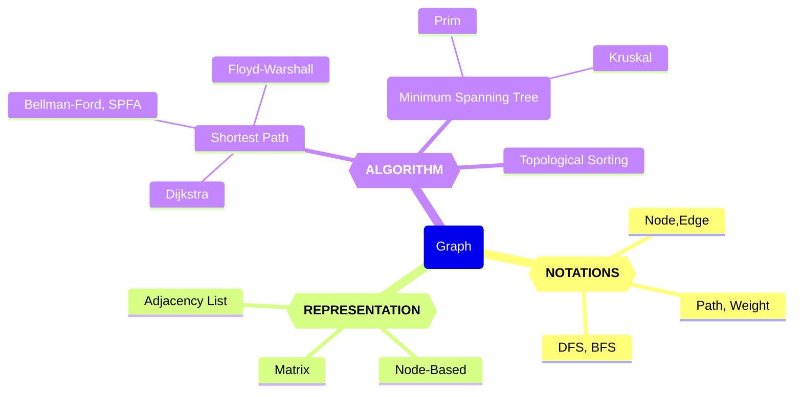

# 20240409～23-Week8~10 图论

Updated 1947 GMT+8 Apr 8, 2024

2024 spring, Complied by Hongfei Yan


> Logs:
>
> 2024/4/7 打*的章节，可以跳过，可能超纲了。
>
> 2024/4/5 数算重点是树、图、和算法。图这部分重点是算法，因为图的主要表示方式——邻接表，树也使用。
>
> 其中涉及到矩阵存储的图遍历，基本都是计概题目。




<center>图的知识图谱</center>


# 一、（Week8）图的概念、表示方法和遍历

图论是数学的一个分支，主要研究图的性质以及图之间的关系。在与数据结构和算法相关的内容中，图论涵盖了以下几个方面：

1. **图的表示**：图可以用不同的数据结构来表示，包括邻接矩阵、邻接表、~~关联矩阵~~等。这些表示方法影响着对图进行操作和算法实现的效率。

2. **图的遍历**：图的遍历是指从图中的某个顶点出发，访问图中所有顶点且不重复的过程。常见的图遍历算法包括深度优先搜索（DFS）和广度优先搜索（BFS）。

3. **最短路径**：最短路径算法用于找出两个顶点之间的最短路径，例如 Dijkstra 算法和 Floyd-Warshall 算法。这些算法在网络路由、路径规划等领域有广泛的应用。

4. **最小生成树**：最小生成树算法用于在一个连通加权图中找出一个权值最小的生成树，常见的算法包括 Prim 算法和 Kruskal 算法。最小生成树在网络设计、电力传输等领域有着重要的应用。

5. ~~**图的匹配**：图的匹配是指在一个图中找出一组边，使得没有两条边有一个公共顶点。匹配算法在任务分配、航线规划等问题中有着广泛的应用。~~

6. **拓扑排序**：拓扑排序算法用于对有向无环图进行排序，使得所有的顶点按照一定的顺序排列，并且保证图中的边的方向符合顺序关系。拓扑排序在任务调度、依赖关系分析等领域有重要的应用。

7. **图的连通性**：图的连通性算法用于判断图中的顶点是否连通，以及找出图中的连通分量。这对于网络分析、社交网络分析等具有重要意义。

8. ~~**图的颜色着色**：图的着色问题是指给图中的顶点赋予不同的颜色，使得相邻的顶点具有不同的颜色。这在调度问题、地图着色等方面有应用。~~

这些内容是图论在数据结构与算法领域的一些重要内容，它们在计算机科学和工程领域有广泛的应用。


## 1 术语和定义

图是更通用的结构；事实上，可以把树看作一种特殊的图。图可以用来表示现实世界中很多有意思的事物，包括道路系统、城市之间的航班、互联网的连接，甚至是计算机专业的一系列必修课。图一旦有了很好的表示方法，就可以用一些标准的图算法来解决那些看起来非常困难的问题。

尽管我们能够轻易看懂路线图并理解其中不同地点之间的关系，但是计算机并不具备这样的能力。不过，我们也可以将路线图看成是一张图，从而使计算机帮我们做一些非常有意思的事情。用过互联网地图网站的人都知道，计算机可以帮助我们找到两地之间最短、最快、最便捷的路线。

计算机专业的学生可能会有这样的疑惑：自己需要学习哪些课程才能获得学位呢？图可以很好地表示课程之间的依赖关系。图1展示了要获得计算机科学学位，所需学习课程的先后顺序。


<center>图1 计算机课程的学习顺序</center>


抽象出来看，**图（Graph）**由**顶点（Vertex）**和**边（Edge）**组成，每条边的两端都必须是图的两个顶点(可以是相同的顶点)。而记号 G(V,E)表示图 G 的顶点集为 V、边集为 E。图 2 是一个抽象出来的图。


<center>图2 抽象出来的图</center>


一般来说，图可分为有向图和无向图。有向图的所有边都有方向，即确定了顶点到顶点的一个指向；而无向图的所有边都是双向的，即无向边所连接的两个顶点可以互相到达。在一些问题中，可以把无向图当作所有边都是正向和负向的两条有向边组成，这对解决一些问题很有帮助。图 3是有向图和无向图的举例。


<center> 图3 无向图与有向图 </center>


**顶点Vertex**
顶点又称节点，是图的基础部分。它可以有自己的名字，我们称作“键”。顶点也可以带有附加信息，我们称作“有效载荷”。


**边Edge**
边是图的另一个基础部分。两个顶点通过一条边相连，表示它们之间存在关系。边既可以是单向的，也可以是双向的。如果图中的所有边都是单向的，我们称之为有向图。图1明显是一个有向图，因为必须修完某些课程后才能修后续的课程。


**度Degree**

顶点的度是指和该顶点相连的边的条数。特别是对于有向图来说，顶点的出边条数称为该顶点的出度，顶点的入边条数称为该顶点的入度。例如图 3 的无向图中，V1的度为 2,V5的度为 4；有向图例子中，V2的出度为 1、入度为 2。


**权值Weight**

顶点和边都可以有一定属性，而量化的属性称为权值，顶点的权值和边的权值分别称为点权和边权。权值可以根据问题的实际背景设定，例如点权可以是城市中资源的数目，边权可以使两个城市之间来往所需要的时间、花费或距离。


有了上述定义之后，再来正式地定义**图Graph**。图可以用G来表示，并且G = (V, E)。其中，V是一个顶点集合，E是一个边集合。每一条边是一个二元组(v, w)，其中w, v∈V。可以向边的二元组中再添加一个元素，用于表示权重。子图s是一个由边e和顶点v构成的集合，其中e⊂E且v⊂V。

图4 展示了一个简单的带权有向图。我们可以用6个顶点和9条边的两个集合来正式地描述这个图：

$V = \left\{ V0,V1,V2,V3,V4,V5 \right\}$


$\begin{split}E = \left\{ \begin{array}{l}(v0,v1,5), (v1,v2,4), (v2,v3,9), (v3,v4,7), (v4,v0,1), \\
             (v0,v5,2),(v5,v4,8),(v3,v5,3),(v5,v2,1)
             \end{array} \right\}\end{split}$


<center>图4 简单的带权有向图</center>


图4中的例子还体现了其他两个重要的概念。

**路径Path**
路径是由边连接的顶点组成的序列。路径的正式定义为$w_1, w_2, ···, w_n$，其中对于所有的1≤i≤n-1，有$(w_i, w_{i+1})∈E$。无权重路径的长度是路径上的边数，有权重路径的长度是路径上的边的权重之和。以图4为例，从 V3到 V1的路径是顶点序列(V3, V4, V0, V1)，相应的边是{(v3, v4,7), (v4, v0,1), (v0, v1,5)}。

**环Cycle**
环是有向图中的一条起点和终点为同一个顶点的路径。例如，图4中的路径(V5, V2, V3, V5)就是一个环。没有环的图被称为无环图，没有环的有向图被称为有向无环图，简称为DAG。接下来会看到，DAG能帮助我们解决很多重要的问题。


### 1.1 编程题目

晴问题目练习网址，https://sunnywhy.com/sfbj

#### sy374: 无向图的度 简单

https://sunnywhy.com/sfbj/10/1/374

现有一个共n个顶点、m条边的无向图（假设顶点编号为从`0`到`n-1`），求每个顶点的度。

**输入**

第一行两个整数n、m（$1 \le n \le 100,0 \le m \le \frac{n(n-1)}2$），分别表示顶点数和边数；

接下来m行，每行两个整数u、v（$0 \le u \le n-1,0 \le v \le n-1, u \ne v$），表示一条边的两个端点的编号。数据保证不会有重边。

**输出**

在一行中输出n个整数，表示编号为从`0`到`n-1`的顶点的度。整数之间用空格隔开，行末不允许有多余的空格。

样例1

输入

```
3 2
0 1
0 2
```

输出

```
2 1 1
```

解释

对应的无向图如下图所示，`0`号顶点的度为`2`，`1`号和`2`号顶点的度为`1`。


为了求解每个顶点的度，我们可以创建一个列表来存储每个顶点的度，初始值都为0。然后，对于每条边，我们将边的两个端点的度都加1。

以下是实现这个过程的Python代码：

```python
n, m = map(int, input().split())
degrees = [0] * n
for _ in range(m):
    u, v = map(int, input().split())
    degrees[u] += 1
    degrees[v] += 1

print(' '.join(map(str, degrees)))
```

这段代码首先读取输入，然后创建一个列表来存储每个顶点的度。然后，它遍历每条边，将边的两个端点的度都加1。最后，它输出每个顶点的度。


#### sy375: 有向图的度 简单

https://sunnywhy.com/sfbj/10/1/375

现有一个共n个顶点、m条边的有向图（假设顶点编号为从`0`到`n-1`），求每个顶点的入度和出度。

**输入**

第一行两个整数n、m（$1 \le n \le 100,0 \le m \le n(n-1)$），分别表示顶点数和边数；

接下来m行，每行两个整数u、v（$0 \le u \le n-1,0 \le v \le n-1, u \ne v$），表示一条边的两个端点的编号。数据保证不会有重边。

**输出**

输出行，每行为编号从`0`到`n-1`的一个顶点的入度和出度，中间用空格隔开。

样例1

输入

```
3 3
0 1
0 2
2 1
```

输出

```
0 2
2 0
1 1
```

解释

对应的有向图如下图所示。

`0`号顶点有`0`条入边，`2`条出边，因此入度为`0`，出度为`2`；

`1`号顶点有`2`条入边，`0`条出边，因此入度为`2`，出度为`0`；

`2`号顶点有`1`条入边，`1`条出边，因此入度为`1`，出度为`1`。


为了求解每个顶点的入度和出度，我们可以创建两个列表来分别存储每个顶点的入度和出度，初始值都为0。然后，对于每条边，我们将起点的出度加1，终点的入度加1。

以下是实现这个过程的Python代码：

```python
n, m = map(int, input().split())
in_degrees = [0] * n
out_degrees = [0] * n
for _ in range(m):
    u, v = map(int, input().split())
    out_degrees[u] += 1
    in_degrees[v] += 1

for i in range(n):
    print(in_degrees[i], out_degrees[i])
```

这段代码首先读取输入，然后创建两个列表来存储每个顶点的入度和出度。然后，它遍历每条边，将边的起点的出度加1，终点的入度加1。最后，它输出每个顶点的入度和出度。


## 2 图的表示方法

图的抽象数据类型
图的抽象数据类型由下列方法定义。

❏ Graph()新建一个空图。
❏ addVertex(vert)向图中添加一个顶点实例。
❏ addEdge(fromVert, toVert)向图中添加一条有向边，用于连接顶点fromVert和toVert。
❏ addEdge(fromVert, toVert, weight)向图中添加一条带权重weight的有向边，用于连接顶点fromVert和toVert。
❏ getVertex(vertKey)在图中找到名为vertKey的顶点。
❏ getVertices()以列表形式返回图中所有顶点。
❏ in通过vertex in graph这样的语句，在顶点存在时返回True，否则返回False。

根据图的正式定义，可以通过多种方式在Python中实现图的抽象数据类型。你会看到，在使用不同的表达方式来实现图的抽象数据类型时，需要做很多取舍。有两种非常著名的图实现，它们分别是邻接矩阵 **adjacency matrix** 和邻接表**adjacency list**。本节会解释这两种实现，并且用Python类来实现邻接表。


> dict套list, dict套queue，dict套dict，真好用啊！
>
> 确实，Python 中的字典（`dict`）是非常灵活和强大的数据结构，可以用于构建各种复杂的数据结构。
>
> 1. **Dict套List**：
>    - 可以用字典来表示多个对象的集合，其中每个对象都有一个唯一的键，而值则是一个列表，存储相关的数据。
>    - 例如，可以使用字典来表示学生和他们的成绩列表：`{"张三": [90, 85, 95], "李四": [88, 92, 90]}`。
>
> 2. **Dict套Queue**：
>    - 可以用字典来实现队列的功能，其中字典的键可以表示队列中的元素，而值则是用于实现队列操作的相关信息。
>    - 例如，可以使用字典来实现一个任务队列，其中键是任务名称，值是任务的优先级或其他相关信息。
>    - 例如，27925:小组队列，http://cs101.openjudge.cn/practice/27925/
>    
> 3. **Dict套Dict**：
>    - 可以用字典来表示更复杂的数据结构，例如树、图等。其中外层字典的键可以表示节点或顶点，而值则是另一个字典，存储该节点或顶点的属性以及与之相关联的其他节点或顶点。
>    - 例如，可以使用字典来表示图，其中外层字典的键是节点，内层字典的键是该节点与其他节点之间的边，值是边的权重或其他相关信息。
>
> 使用字典来构建这些复杂的数据结构，使得数据的组织和操作更加方便和高效，同时也提高了代码的可读性和可维护性。因此，dict套list、dict套queue、dict套dict等形式的数据结构在Python中确实是非常好用的。
>
> 
>
> **dict的value如果是list，是邻接表。dici嵌套dict 是 字典树/前缀树/Trie**
>
> 是的，你提到的两种数据结构分别是邻接表和字典树（前缀树，Trie）。
>
> 1. **邻接表**：在图论中，邻接表是一种表示图的常见方式之一。如果你使用字典（`dict`）来表示图的邻接关系，并且将每个顶点的邻居顶点存储为列表（`list`），那么就构成了邻接表。例如：
>
> ```python
> graph = {
>     'A': ['B', 'C'],
>     'B': ['A', 'D'],
>     'C': ['A', 'D'],
>     'D': ['B', 'C']
> }
> ```
>
> ## 27928: 遍历树
>
> http://cs101.openjudge.cn/practice/27928/
>
> 请你对输入的树做遍历。遍历的规则是：遍历到每个节点时，按照该节点和所有子节点的值从小到大进行遍历，例如：
>
> ```
>         7
>     /   |   \
>   10    3     6
> ```
>
> 对于这个树，你应该先遍历值为3的子节点，然后是值为6的子节点，然后是父节点7，最后是值为10的子节点。
>
> 本题中每个节点的值为互不相同的正整数，最大不超过9999999。
>
> **输入**
>
> 第一行：节点个数n (n<500)
>
> 接下来的n行：第一个数是此节点的值，之后的数分别表示它的所有子节点的值。每个数之间用空格隔开。如果没有子节点，该行便只有一个数。
>
> **输出**
>
> 输出遍历结果，一行一个节点的值。
>
> 样例输入
>
> ```
> sample1 input:
> 4
> 7 10 3 6
> 10
> 6
> 3
> 
> sample1 output:
> 3
> 6
> 7
> 10
> ```
>
> 样例输出
>
> ```
> sample2 input:
> 6
> 10 3 1
> 7
> 9 2 
> 2 10
> 3 7
> 1
> 
> sample2 output:
> 2
> 1
> 3
> 7
> 10
> 9
> ```
>
> 来源
>
> 2024spring zht
>
> 
>
> ```python
> # 李思哲 物理学院
> class TreeNode:
>     def __init__(self, value):
>         self.value = value
>         self.children = []
> 
> 
> def traverse_print(root, nodes):
>     if root.children == []:
>         print(root.value)
>         return
>     pac = {root.value: root}
>     for child in root.children:
>         pac[child] = nodes[child]
>     for value in sorted(pac.keys()):
>         if value in root.children:
>             traverse_print(pac[value], nodes)
>         else:
>             print(root.value)
> 
> 
> n = int(input())
> nodes = {}
> children_list = []
> for i in range(n):
>     info = list(map(int, input().split()))
>     nodes[info[0]] = TreeNode(info[0])
>     for child_value in info[1:]:
>         nodes[info[0]].children.append(child_value)
>         children_list.append(child_value)
> root = nodes[[value for value in nodes.keys() if value not in children_list][0]]
> traverse_print(root, nodes)
> 
> ```
>
> 
>
> 2. **字典树（前缀树，Trie）**：字典树是一种树形数据结构，用于高效地存储和检索字符串数据集中的键。如果你使用嵌套的字典来表示字典树，其中每个字典代表一个节点，键表示路径上的字符，而值表示子节点，那么就构成了字典树。例如：
>
> ```python
> trie = {
>     'a': {
>         'p': {
>             'p': {
>                 'l': {
>                     'e': {'is_end': True}
>                 }
>             }
>         }
>     },
>     'b': {
>         'a': {
>             'l': {
>                 'l': {'is_end': True}
>             }
>         }
>     },
>     'c': {
>         'a': {
>             't': {'is_end': True}
>         }
>     }
> }
> ```
>
> 这样的表示方式使得我们可以非常高效地搜索和插入字符串，特别是在大型数据集上。
>
> 例如，04089:电话号码，http://cs101.openjudge.cn/practice/04089/
>
> 
>
> **神奇的dict**
>
> 字典（dict）是Python中非常强大和灵活的数据结构之一，它可以用来存储键值对，是一种可变容器模型，可以存储任意数量的 Python 对象。
>
> 字典在 Python 中被广泛用于各种场景，例如：
>
> 1. **哈希映射**：字典提供了一种快速的键值查找机制，可以根据键快速地检索到相应的值。这使得字典成为了哈希映射（Hash Map）的理想实现。
>
> 2. **符号表**：在编程语言的实现中，字典常常被用作符号表，用来存储变量名、函数名等符号和它们的关联值。
>
> 3. **配置文件**：字典可以用来表示配置文件中的键值对，例如JSON文件就是一种常见的字典格式。
>
> 4. **缓存**：字典常常用于缓存中，可以将计算结果与其输入参数关联起来，以便后续快速地检索到相同参数的计算结果。
>
> 5. **图的表示**：如前文所述，字典可以用来表示图的邻接关系，是一种常见的图的表示方式。
>
> 由于其灵活性和高效性，字典在Python中被广泛应用于各种场景，并且被称为是Python中最常用的数据结构之一。


### 2.1 邻接矩阵

要实现图，最简单的方式就是使用二维矩阵。在矩阵实现中，每一行和每一列都表示图中的一个顶点。第v行和第w列交叉的格子中的值表示从顶点v到顶点w的边的权重。如果两个顶点被一条边连接起来，就称它们是相邻的。图5展示了图4对应的邻接矩阵。格子中的值表示从顶点v到顶点w的边的权重。


Figure 5: An Adjacency Matrix Representation for a Graph


邻接矩阵的优点是简单。对于小图来说，邻接矩阵可以清晰地展示哪些顶点是相连的。但是，图5中的绝大多数单元格是空的，我们称这种矩阵是“稀疏”的。对于存储稀疏数据来说，矩阵并不高效。

邻接矩阵适用于表示有很多条边的图。但是，“很多条边”具体是什么意思呢？要填满矩阵，共需要多少条边？由于每一行和每一列对应图中的每一个顶点，因此填满矩阵共需要|V|^2^条边。当每一个顶点都与其他所有顶点相连时，矩阵就被填满了。在现实世界中，很少有问题能够达到这种连接度。


### 2.2 邻接表

为了实现稀疏连接的图，更高效的方式是使用邻接表。在邻接表实现中，我们为图对象的所有顶点保存一个主列表，同时为每一个顶点对象都维护一个列表，其中记录了与它相连的顶点。在对Vertex类的实现中，我们使用字典（而不是列表），字典的键是顶点，值是权重。图6展示了图4所对应的邻接表


Figure 6: An Adjacency List Representation of a Graph

邻接表的优点是能够紧凑地表示稀疏图。此外，邻接表也有助于方便地找到与某一个顶点相连的其他所有顶点。


### *2.3 关联矩阵

关联矩阵是一种图的表示方法，通常用于表示有向图。在关联矩阵中，行代表顶点，列代表边，如果顶点与边相连，则在对应的位置填上1，否则填上0。

虽然关联矩阵和邻接表都可以用来表示图，但它们在内存消耗和操作效率上有所不同。关联矩阵的存储空间复杂度为O(V*E)，其中V是顶点数，E是边数。但是，邻接表的存储空间复杂度为O(V+E)，它通常比关联矩阵更节省空间。

另外，对于某些图的操作，如查找两个顶点之间是否存在边，邻接表的操作效率更高。而对于其他操作，如计算图的闭包或者判断两个图是否同构等，关联矩阵可能更方便。

因此，关联矩阵和邻接表都有各自的优势和适用场景，选择使用哪种数据结构取决于具体的应用需求和对内存和操作效率的考虑。

> 图的闭包是指对于一个有向图或无向图，将所有顶点对之间的可达路径都加入到图中的过程。闭包可以用于分析图中的传递性关系。
>
> 判断两个图是否同构是指确定两个图是否具有相同的结构，即它们的顶点和边的连接关系是否一致。同构性是图的一个重要性质，可以用于在不同图之间进行匹配、比较和分类。
>
> 图的闭包和判断两个图是否同构是两个不同的概念，它们在图论中具有不同的应用和研究方向。
>
> 图的闭包可以通过图的邻接矩阵或邻接表来计算。对于有向图，可以使用传递闭包算法，通过矩阵乘法或深度优先搜索来确定顶点对之间的可达性。对于无向图，可以使用传递闭包算法或者深度优先搜索来计算。
>
> 判断两个图是否同构是一个复杂的问题，没有简单的算法可以解决。通常使用图同构性的定义和算法来进行判断，其中一种常用的方法是通过图的特征向量或特征值来比较两个图的结构。其他方法包括基于图的同构性的哈希算法和子图同构性的算法。
>
> 判断两个图是否同构是一个重要的图论问题，它在许多领域中都有应用，包括网络分析、化学和生物信息学等。
>
> 当涉及到图的闭包和判断两个图是否同构时，以下是一些示例：
>
> 1. 图的闭包：
> 考虑一个有向图，表示人际关系网络。假设有以下关系：A认识B，B认识C，C认识D。闭包操作将在图中添加所有可达的路径。在这种情况下，闭包操作将在图中添加A到D的边，因为A通过B和C可以到达D。闭包操作后的图将包含A、B、C、D四个顶点，并存在A到D的边。
>
> 2. 判断两个图是否同构：
> 考虑两个无向图G1和G2。G1有三个顶点{A, B, C}和两条边{A-B, B-C}。G2有三个顶点{X, Y, Z}和两条边{X-Y, Y-Z}。通过比较两个图的边连接关系，我们可以发现G1和G2具有相同的结构。因此，可以判断G1和G2是同构的。
>
> 
>
> 尽管图的闭包和同构问题在理论上具有重要性，并且在某些应用领域中有实际意义，但在常见的编程题目中，它们并不是经常出现的主题。更常见的图相关编程题目包括广度优先搜索、深度优先搜索、拓扑排序、最短路径算法（如Dijkstra算法和Floyd-Warshall算法）、最小生成树算法（如Prim算法和Kruskal算法）等。
>
> 
>
> 闭包和最小生成树是两个不同的概念？
>
> 闭包是指对于一个有向图或无向图，将所有顶点对之间的可达路径都加入到图中的过程。闭包操作后的图包含了原图中所有顶点和它们之间的可达路径。闭包操作可以用于分析图中的传递性关系。
>
> 最小生成树是指在一个连通无向图中，选择一棵包含所有顶点且边权重之和最小的树。最小生成树可以用来找到连接图中所有顶点的最短路径。
>
> 闭包和最小生成树是针对不同类型的图的不同操作。闭包适用于有向图和无向图，而最小生成树适用于无向图。闭包操作是为了添加路径，以展示顶点之间的可达性，而最小生成树是为了找到一棵最小权重的树，以连接所有顶点。
>
> 因此，闭包和最小生成树是不同的概念，在图论中具有不同的应用和意义。


下面是一个用 Python 实现的关联矩阵示例：

```python
class Graph:
    def __init__(self, vertices, edges):
        self.vertices = vertices
        self.edges = edges
        self.adj_matrix = self.create_adj_matrix()

    def create_adj_matrix(self):
        # Create an empty adjacency matrix
        adj_matrix = [[0] * len(self.edges) for _ in range(len(self.vertices))]

        # Fill adjacency matrix based on edges
        for i, vertex in enumerate(self.vertices):
            for j, edge in enumerate(self.edges):
                if vertex in edge:
                    adj_matrix[i][j] = 1
        return adj_matrix

    def display_adj_matrix(self):
        for row in self.adj_matrix:
            print(row)


# Example usage
if __name__ == "__main__":
    vertices = ['A', 'B', 'C', 'D']
    edges = [('A', 'B'), ('B', 'C'), ('C', 'D'), ('D', 'A')]

    graph = Graph(vertices, edges)
    print("Adjacency Matrix:")
    graph.display_adj_matrix()
```

在这个示例中，定义了一个 `Graph` 类来表示图。在初始化时，传入顶点列表和边列表。然后，使用 `create_adj_matrix` 方法来创建关联矩阵。最后，调用 `display_adj_matrix` 方法来显示关联矩阵。

注意：这个示例假设了顶点和边的表示是字符串形式，可以根据需要调整表示方式。


### 2.4 编程题目

#### sy376: 无向图的邻接矩阵 简单

https://sunnywhy.com/sfbj/10/2/376

现有一个共n个顶点、m条边的无向图（假设顶点编号为从`0`到`n-1`），将其按邻接矩阵的方式存储（存在边的位置填充`1`，不存在边的位置填充`0`），然后输出整个邻接矩阵。

**输入**

第一行两个整数n、m（$1 \le n \le 100,0 \le m \le \frac{n(n-1)}2$），分别表示顶点数和边数；

接下来m行，每行两个整数u、v（$0 \le u \le n-1,0 \le v \le n-1, u \ne v$），表示一条边的两个端点的编号。数据保证不会有重边。

**输出**

输出n行n列，表示邻接矩阵。整数之间用空格隔开，行末不允许有多余的空格。

样例1

输入

```
3 2
0 1
0 2
```

输出

```
0 1 1
1 0 0
1 0 0
```

解释

对应的无向图如下图所示。

`0`号顶点有`2`条出边，分别到达`1`号顶点和`2`号顶点；

`1`号顶点有`1`条出边，到达`0`号顶点；

`2`号顶点有`1`条出边，到达`0`号顶点。


为了将无向图按邻接矩阵的方式存储，我们可以创建一个n*n的二维列表，初始值都为0。然后，对于每条边，我们将边的两个端点对应的位置填充为1。

以下是实现这个过程的Python代码：

```python
n, m = map(int, input().split())
adjacency_matrix = [[0]*n for _ in range(n)]
for _ in range(m):
    u, v = map(int, input().split())
    adjacency_matrix[u][v] = 1
    adjacency_matrix[v][u] = 1

for row in adjacency_matrix:
    print(' '.join(map(str, row)))
```

这段代码首先读取输入，然后创建一个n*n的二维列表来存储邻接矩阵。然后，它遍历每条边，将边的两个端点对应的位置填充为1。最后，它输出整个邻接矩阵。


#### sy377: 有向图的邻接矩阵 简单

https://sunnywhy.com/sfbj/10/2/377

现有一个共n个顶点、m条边的有向图（假设顶点编号为从`0`到`n-1`），将其按邻接矩阵的方式存储（存在边的位置填充`1`，不存在边的位置填充`0`），然后输出整个邻接矩阵。

**输入**

第一行两个整数n、m（$1 \le n \le 100,0 \le m \le n(n-1)$），分别表示顶点数和边数；

接下来m行，每行两个整数u、v（$0 \le u \le n-1,0 \le v \le n-1, u \ne v$），表示一条边的起点和终点的编号。数据保证不会有重边。

**输出**

输出n行n列，表示邻接矩阵。整数之间用空格隔开，行末不允许有多余的空格。

样例1

输入

```
3 3
0 1
0 2
2 1
```

输出

```
0 1 1
0 0 0
0 1 0
```

解释

对应的有向图如下图所示。

`0`号顶点有`2`条出边，分别到达`1`号顶点和`2`号顶点；

`1`号顶点有`0`条出边；

`2`号顶点有`1`条出边，到达`1`号顶点。


为了将有向图按邻接矩阵的方式存储，我们可以创建一个n*n的二维列表，初始值都为0。然后，对于每条边，我们将边的起点和终点对应的位置填充为1。

以下是实现这个过程的Python代码：

```python
n, m = map(int, input().split())
adjacency_matrix = [[0]*n for _ in range(n)]
for _ in range(m):
    u, v = map(int, input().split())
    adjacency_matrix[u][v] = 1

for row in adjacency_matrix:
    print(' '.join(map(str, row)))
```

这段代码首先读取输入，然后创建一个n*n的二维列表来存储邻接矩阵。然后，它遍历每条边，将边的起点和终点对应的位置填充为1。最后，它输出整个邻接矩阵。


#### sy378: 无向图的邻接表 简单

https://sunnywhy.com/sfbj/10/2/378

现有一个共n个顶点、m条边的无向图（假设顶点编号为从`0`到`n-1`），将其按邻接表的方式存储，然后输出整个邻接表。

**输入**

第一行两个整数n、m（$1 \le n \le 100,0 \le m \le \frac{n(n-1)}2$），分别表示顶点数和边数；

接下来m行，每行两个整数u、v（$0 \le u \le n-1,0 \le v \le n-1, u \ne v$），表示一条边的两个端点的编号。数据保证不会有重边。

**输出**

输出行，按顺序给出编号从`0`到`n-1`的顶点的所有出边，每行格式如下：

```text
id(k) v_1 v_2 ... v_k
```

其中表示当前顶点的编号，表示该顶点的出边数量，、、...、表示条出边的终点编号（按边输入的顺序输出）。行末不允许有多余的空格。

样例1

输入

```
3 2
0 1
0 2
```

输出

```
0(2) 1 2
1(1) 0
2(1) 0
```

解释

对应的无向图如下图所示。

`0`号顶点有`2`条出边，分别到达`1`号顶点和`2`号顶点；

`1`号顶点有`1`条出边，到达`0`号顶点；

`2`号顶点有`1`条出边，到达`0`号顶点。


为了将无向图按邻接表的方式存储，我们可以创建一个列表，其中每个元素都是一个列表，表示一个顶点的所有邻接顶点。然后，对于每条边，我们将边的两个端点添加到对方的邻接列表中。

以下是实现这个过程的Python代码：

```python
n, m = map(int, input().split())
adjacency_list = [[] for _ in range(n)]
for _ in range(m):
    u, v = map(int, input().split())
    adjacency_list[u].append(v)
    adjacency_list[v].append(u)

for i in range(n):
    num = len(adjacency_list[i])
    if num == 0:
        print(f"{i}({num})")
    else:
        print(f"{i}({num})", ' '.join(map(str, adjacency_list[i])))
```

这段代码首先读取输入，然后创建一个列表来存储邻接表。然后，它遍历每条边，将边的两个端点添加到对方的邻接列表中。最后，它输出整个邻接表。


#### sy379: 有向图的邻接表 简单

https://sunnywhy.com/sfbj/10/2/379

现有一个共n个顶点、m条边的有向图（假设顶点编号为从`0`到`n-1`），将其按邻接表的方式存储，然后输出整个邻接表。

**输入**

第一行两个整数n、m（$1 \le n \le 100,0 \le m \le n(n-1)$），分别表示顶点数和边数；

接下来m行，每行两个整数u、v（$0 \le u \le n-1,0 \le v \le n-1, u \ne v$），表示一条边的起点和终点的编号。数据保证不会有重边。

**输出**

输出行，按顺序给出编号从`0`到`n-1`的顶点的所有出边，每行格式如下：

```text
id(k) v_1 v_2 ... v_k
```

其中id表示当前顶点的编号，k表示该顶点的出边数量，v1、v2、...、vk表示k条出边的终点编号（按边输入的顺序输出）。行末不允许有多余的空格。

样例1

输入

```
3 3
0 1
0 2
2 1
```

输出

```
0(2) 1 2
1(0)
2(1) 1
```

解释

对应的有向图如下图所示。

`0`号顶点有`2`条出边，分别到达`1`号顶点和`2`号顶点；

`1`号顶点有`0`条出边；

`2`号顶点有`1`条出边，到达`1`号顶点。


为了将有向图按邻接表的方式存储，我们可以创建一个列表，其中每个元素都是一个列表，表示一个顶点的所有邻接顶点。然后，对于每条边，我们将边的终点添加到起点的邻接列表中。

以下是实现这个过程的Python代码：

```python
n, m = map(int, input().split())
adjacency_list = [[] for _ in range(n)]
for _ in range(m):
    u, v = map(int, input().split())
    adjacency_list[u].append(v)

for i in range(n):
    num = len(adjacency_list[i])
    if num == 0:
        print(f"{i}({num})")
    else:
        print(f"{i}({num})", ' '.join(map(str, adjacency_list[i])))
```

这段代码首先读取输入，然后创建一个列表来存储邻接表。然后，它遍历每条边，将边的终点添加到起点的邻接列表中。最后，它输出整个邻接表。


### 2.5 图的类实现（笔试）

在Python中，通过字典可以轻松地实现邻接表。我们要创建两个类：Graph类存储包含所有顶点的主列表，Vertex类表示图中的每一个顶点。
Vertex使用字典connectedTo来记录与其相连的顶点，以及每一条边的权重。代码清单7-1展示了Vertex类的实现，其构造方法简单地初始化id（它通常是一个字符串），以及字典connectedTo。addNeighbor方法添加从一个顶点到另一个的连接。getConnections方法返回邻接表中的所有顶点，由connectedTo来表示。getWeight方法返回从当前顶点到以参数传入的顶点之间的边的权重。

代码清单7-1 Vertex类

```python
class Vertex:
    def __init__(self,key):
        self.id = key
        self.connectedTo = {}

    def addNeighbor(self,nbr,weight=0):
        self.connectedTo[nbr] = weight

    def __str__(self):
        return str(self.id) + ' connectedTo: ' + str([x.id for x in self.connectedTo])

    def getConnections(self):
        return self.connectedTo.keys()

    def getId(self):
        return self.id

    def getWeight(self,nbr):
        return self.connectedTo[nbr]
```


Graph类的实现如代码清单7-2所示，其中包含一个将顶点名映射到顶点对象的字典。在图6中，该字典对象由灰色方块表示。Graph类也提供了向图中添加顶点和连接不同顶点的方法。getVertices方法返回图中所有顶点的名字。此外，我们还实现了__iter__方法，从而使遍历图中的所有顶点对象更加方便。总之，这两个方法使我们能够根据顶点名或者顶点对象本身遍历图中的所有顶点。

代码清单7-2 Graph类

```python
class Graph:
    def __init__(self):
        self.vertList = {}
        self.numVertices = 0

    def addVertex(self,key):
        self.numVertices = self.numVertices + 1
        newVertex = Vertex(key)
        self.vertList[key] = newVertex
        return newVertex

    def getVertex(self,n):
        if n in self.vertList:
            return self.vertList[n]
        else:
            return None

    def __contains__(self,n):
        return n in self.vertList

    def addEdge(self,f,t,weight=0):
        if f not in self.vertList:
            nv = self.addVertex(f)
        if t not in self.vertList:
            nv = self.addVertex(t)
        self.vertList[f].addNeighbor(self.vertList[t], weight)

    def getVertices(self):
        return self.vertList.keys()

    def __iter__(self):
        return iter(self.vertList.values())
```

下面的Python会话使用Graph类和Vertex类创建了如图6所示的图。首先创建6个顶点，依次编号为0～5。然后打印顶点字典。注意，对每一个键，我们都创建了一个Vertex实例。接着，添加将顶点连接起来的边。最后，用一个嵌套循环验证图中的每一条边都已被正确存储。请按照图6的内容检查会话的最终结果。


```
>>> g = Graph()
>>> for i in range(6):
...    g.addVertex(i)
>>> g.vertList
{0: <adjGraph.Vertex instance at 0x41e18>,
 1: <adjGraph.Vertex instance at 0x7f2b0>,
 2: <adjGraph.Vertex instance at 0x7f288>,
 3: <adjGraph.Vertex instance at 0x7f350>,
 4: <adjGraph.Vertex instance at 0x7f328>,
 5: <adjGraph.Vertex instance at 0x7f300>}
>>> g.addEdge(0,1,5)
>>> g.addEdge(0,5,2)
>>> g.addEdge(1,2,4)
>>> g.addEdge(2,3,9)
>>> g.addEdge(3,4,7)
>>> g.addEdge(3,5,3)
>>> g.addEdge(4,0,1)
>>> g.addEdge(5,4,8)
>>> g.addEdge(5,2,1)
>>> for v in g:
...    for w in v.getConnections():
...        print("( %s , %s )" % (v.getId(), w.getId()))
...
( 0 , 5 )
( 0 , 1 )
( 1 , 2 )
( 2 , 3 )
( 3 , 4 )
( 3 , 5 )
( 4 , 0 )
( 5 , 4 )
( 5 , 2 )
```


上面类方式定义顶点和图，要求掌握，**数算B-2021笔试出现在算法部分**。在机考中，也可以直接使用二维列表或者字典来表示邻接表。


**19943: 图的拉普拉斯矩阵**

http://cs101.openjudge.cn/practice/19943/

在图论中，度数矩阵是一个对角矩阵 ，其中包含的信息为的每一个顶点的度数，也就是说，每个顶点相邻的边数。邻接矩阵是图的一种常用存储方式。如果一个图一共有编号为0,1,2，…n-1的n个节点，那么邻接矩阵A的大小为n*n，对其中任一元素Aij，如果节点i，j直接有边，那么Aij=1；否则Aij=0。

将度数矩阵与邻接矩阵逐位相减，可以求得图的拉普拉斯矩阵。具体可见下图示意。


现给出一个图中的所有边的信息，需要你输出该图的拉普拉斯矩阵。


**输入**

第一行2个整数，代表该图的顶点数n和边数m。
接下m行，每行为空格分隔的2个整数a和b，代表顶点a和顶点b之间有一条无向边相连，a和b均为大小范围在0到n-1之间的整数。输入保证每条无向边仅出现一次（如1 2和2 1是同一条边，并不会在数据中同时出现）。

**输出**

共n行，每行为以空格分隔的n个整数，代表该图的拉普拉斯矩阵。

样例输入

```
4 5
2 1
1 3
2 3
0 1
0 2
```

样例输出

```
2 -1 -1 0
-1 3 -1 -1
-1 -1 3 -1
0 -1 -1 2
```

来源

cs101 2019 Final Exam


```python
class Vertex:	
    def __init__(self, key):
        self.id = key
        self.connectedTo = {}

    def addNeighbor(self, nbr, weight=0):
        self.connectedTo[nbr] = weight

    def __str__(self):
        return str(self.id) + ' connectedTo: ' + str([x.id for x in self.connectedTo])

    def getConnections(self):
        return self.connectedTo.keys()

    def getId(self):
        return self.id

    def getWeight(self, nbr):
        return self.connectedTo[nbr]

class Graph:
    def __init__(self):
        self.vertList = {}
        self.numVertices = 0

    def addVertex(self, key):
        self.numVertices = self.numVertices + 1
        newVertex = Vertex(key)
        self.vertList[key] = newVertex
        return newVertex

    def getVertex(self, n):
        if n in self.vertList:
            return self.vertList[n]
        else:
            return None

    def __contains__(self, n):
        return n in self.vertList

    def addEdge(self, f, t, weight=0):
        if f not in self.vertList:
            nv = self.addVertex(f)
        if t not in self.vertList:
            nv = self.addVertex(t)
        self.vertList[f].addNeighbor(self.vertList[t], weight)

    def getVertices(self):
        return self.vertList.keys()

    def __iter__(self):
        return iter(self.vertList.values())

def constructLaplacianMatrix(n, edges):
    graph = Graph()
    for i in range(n):	# 添加顶点
        graph.addVertex(i)
    
    for edge in edges:	# 添加边
        a, b = edge
        graph.addEdge(a, b)
        graph.addEdge(b, a)
    
    laplacianMatrix = []	# 构建拉普拉斯矩阵
    for vertex in graph:
        row = [0] * n
        row[vertex.getId()] = len(vertex.getConnections())
        for neighbor in vertex.getConnections():
            row[neighbor.getId()] = -1
        laplacianMatrix.append(row)

    return laplacianMatrix


n, m = map(int, input().split())	# 解析输入
edges = []
for i in range(m):
    a, b = map(int, input().split())
    edges.append((a, b))

laplacianMatrix = constructLaplacianMatrix(n, edges)	# 构建拉普拉斯矩阵

for row in laplacianMatrix:	# 输出结果
    print(' '.join(map(str, row)))
```


## 3 图的遍历

### 3.1 宽度优先搜索


#### 3.1.1 词梯问题

我们从词梯问题开始学习图算法。考虑这样一个任务：将单词FOOL转换成SAGE。在解决词梯问题时，必须每次只替换一个字母，并且每一步的结果都必须是一个单词，而不能是不存在的词。词梯问题由《爱丽丝梦游仙境》的作者刘易斯·卡罗尔于1878年提出。下面的单词转换序列是样例问题的一个解。

FOOL
POOL
POLL
POLE
PALE
SALE
SAGE

词梯问题有很多变体，例如在给定步数内完成转换，或者必须用到某个单词。在本节中，我们研究从起始单词转换到结束单词所需的最小步数。

由于主题是图，因此我们自然会想到使用图算法来解决这个问题。以下是大致步骤：
❏ 用图表示单词之间的关系；
❏ 用一种名为宽度优先搜索的图算法找到从起始单词到结束单词的最短路径。


#### 3.1.2 构建词梯图

第一个问题是如何用图来表示大的单词集合。如果两个单词的区别仅在于有一个不同的字母，就用一条边将它们相连。如果能创建这样一个图，那么其中的任意一条连接两个单词的路径就是词梯问题的一个解。图7-5展示了一个小型图，可用于解决从FOOL到SAGE的词梯问题。注意，它是无向图，并且边没有权重。


Figure 1: A Small Word Ladder Graph


创建这个图有多种方式。假设有一个单词列表，其中每个单词的长度都相同。首先，为每个单词创建顶点。为了连接这些顶点，可以将每个单词与列表中的其他所有单词进行比较。如果两个单词只相差一个字母，就可以在图中创建一条边，将它们连接起来。对于只有少量单词的情况，这个算法还不错。但是，假设列表中有3933个单词，将一个单词与列表中的其他所有单词进行比较，时间复杂度为O( n^2 )。对于3933个单词来说，这意味着要进行1500多万次比较。

采用下述方法，可以更高效地构建这个关系图。假设有数目巨大的桶，每一个桶上都标有一个长度为4的单词，但是某一个字母被下划线代替。图7-6展示了一些例子，如POP_。当处理列表中的每一个单词时，将它与桶上的标签进行比较。使用下划线作为通配符，我们将POPE和POPS放入同一个桶中。一旦将所有单词都放入对应的桶中之后，我们就知道，同一个桶中的单词一定是相连的。


Figure 2: Word Buckets for Words That are Different by One Letter


在Python中，可以通过字典来实现上述方法。字典的键就是桶上的标签，值就是对应的单词列表。一旦构建好字典，就能利用它来创建图。首先为每个单词创建顶点，然后在字典中对应同一个键的单词之间创建边。代码清单1展示了构建图所需的Python代码。

代码清单1 为词梯问题构建单词关系

```python
from pythonds.graphs import Graph

def buildGraph(wordFile):
    d = {}
    g = Graph()
    wfile = open(wordFile,'r')
    # create buckets of words that differ by one letter
    for line in wfile:
        word = line[:-1]		# 应该用 line.strip()
        for i in range(len(word)):
            bucket = word[:i] + '_' + word[i+1:]
            if bucket in d:
                d[bucket].append(word)		# list慢，之后改为set
            else:
                d[bucket] = [word]
    # add vertices and edges for words in the same bucket
    for bucket in d.keys():
        for word1 in d[bucket]:
            for word2 in d[bucket]:
                if word1 != word2:
                    g.addEdge(word1,word2)
    return g
```


这是我们在本节中遇到的第一个实际的图问题，你可能会好奇这个图的稀疏程度如何。本例中的单词列表文件 vocabulary.txt 包含 3,933个单词。如果使用邻接矩阵表示，就会有15,468,489个单元格（3933 ＊3933 = 15,468,489）。用buildGraph函数创建的图一共有42,600条边（用邻接表来表示图）。因此，只有0.27%的单元格被填充。这显然是一个非常稀疏的矩阵。


#### 3.1.3 实现宽度优先搜索

完成图的构建之后，就可以编写能帮我们找到最短路径的图算法。我们使用的算法叫作宽度优先搜索（breadth first search，以下简称BFS）。BFS是最简单的图搜索算法之一，也是后续要介绍的其他重要图算法的原型。

给定图G和起点s, BFS通过边来访问在G中与s之间存在路径的顶点。BFS的一个重要特性是，它会在访问完所有与s相距为k的顶点之后再去访问与s相距为k+1的顶点。为了理解这种搜索行为，可以想象BFS以每次生成一层的方式构建一棵树。它会在访问任意一个孙节点之前将起点的所有子节点都添加进来。

为了记录进度，BFS会将顶点标记成白色、灰色或黑色。在构建时，所有顶点都被初始化成白色。白色代表该顶点没有被访问过。当顶点第一次被访问时，它就会被标记为灰色；当BFS完成对该顶点的访问之后，它就会被标记为黑色。这意味着一旦顶点变为黑色，就没有白色顶点与之相连。灰色顶点仍然可能与一些白色顶点相连，这意味着还有额外的顶点可以访问。


来看看bfs函数如何构建对应于图1的宽度优先搜索树。从顶点fool开始，将所有与之相连的顶点都添加到树中。相邻的顶点有pool、foil、foul，以及cool。它们都被添加到队列中，作为之后要访问的顶点。

> **Algorithm for BFS**
>
> How to implement Breadth First Search algorithm in Python 
>
> https://www.codespeedy.com/breadth-first-search-algorithm-in-python/
>
> BFS is one of the traversing algorithm used in graphs. This algorithm is implemented using a queue data structure. In this algorithm, the main focus is on the vertices of the graph. Select a starting node or vertex at first, mark the starting node or vertex as visited and store it in a queue. Then visit the vertices or nodes which are adjacent to the starting node, mark them as visited and store these vertices or nodes in a queue. Repeat this process until all the nodes or vertices are completely visited.
>
> **Advantages of BFS**
>
> 1. It can be useful in order to find whether the graph has connected components or not.
> 2. It always finds or returns the shortest path if there is more than one path between two vertices.
>
> 
>
> **Disadvantages of BFS**
>
> 1. The execution time of this algorithm is very slow because the time complexity of this algorithm is exponential.
> 2. This algorithm is not useful when large graphs are used.
>
> 
>
> **Implementation of BFS in Python ( Breadth First Search )**
>
> **Source Code: BFS in Python**
>
> ```python
> graph = {'A': ['B', 'C', 'E'],
>          'B': ['A','D', 'E'],
>          'C': ['A', 'F', 'G'],
>          'D': ['B'],
>          'E': ['A', 'B','D'],
>          'F': ['C'],
>          'G': ['C']}
> 
> 
> def bfs(graph, initial):
>     visited = []
>     queue = [initial]
> 
>     while queue:
>         node = queue.pop(0)
>         if node not in visited:
>             visited.append(node)
>             neighbours = graph[node]
> 
>             for neighbour in neighbours:
>                 queue.append(neighbour)
>     return visited
> 
> print(bfs(graph,'A'))
> ```
>
> 
>
> Explanation:
>
> 1. Create a graph.
> 2. Initialize a starting node.
> 3. Send the graph and initial node as parameters to the bfs function.
> 4. Mark the initial node as visited and push it into the queue.
> 5. Explore the initial node and add its neighbours to the queue and remove the initial node from the queue.
> 6. Check if the neighbours node of a neighbouring node is already visited.
> 7. If not, visit the neighbouring node neighbours and mark them as visited.
> 8. Repeat this process until all the nodes in a graph are visited and the queue becomes empty.
>
> Output:
>
> ```
> ['A', 'B', 'C', 'E', 'D', 'F', 'G']
> ```
>
> 
>
> Breadth First Search (BFS), algorithm for traversing or searching graphs
>
> O(|V| + |E|) time complexity, |V| number of nodes, |E| number of edges
>
> Applications:
>
> Shortest path between two nodes (unweighted Graph)
>
> Ford-Fulkson algorithm (Maximum Flow in a network)


**BFS算法示例运行**

https://github.com/GMyhf/2024spring-cs201/tree/main/code

BFS 算法主体是两个循环的嵌套: while-for
    while 循环对图中每个顶点访问一次，所以是 O(|V|)；
    嵌套在 while 中的 for，由于每条边只有在其起始顶点u出队的时候才会被检查一次，
    而每个顶点最多出队1次，所以边最多被检查次，一共是 O(|E|)；
    综合起来 BFS 的时间复杂度为 0(V+|E|)

词梯问题还包括两个部分算法
    建立 BFS 树之后，回溯顶点到起始顶点的过程，最多为 O(|V|)
    创建单词关系图也需要时间，时间是 O(|V|+|E|) 的，因为每个顶点和边都只被处理一次


```python
#!/usr/bin/env python3
"""Solving Wordladder problem"""
import sys


class Queue:
    def __init__(self):
        self.items = []

    def isEmpty(self):
        return self.items == []

    def enqueue(self, item):
        self.items.insert(0, item)

    def dequeue(self):
        return self.items.pop()

    def size(self):
        return len(self.items)


class Graph:
    def __init__(self):
        self.vertices = {}
        self.numVertices = 0

    def addVertex(self, key):
        self.numVertices = self.numVertices + 1
        newVertex = Vertex(key)
        self.vertices[key] = newVertex
        return newVertex

    def getVertex(self, n):
        if n in self.vertices:
            return self.vertices[n]
        else:
            return None

    def __len__(self):
        return self.numVertices

    def __contains__(self, n):
        return n in self.vertices

    def addEdge(self, f, t, cost=0):
        if f not in self.vertices:
            nv = self.addVertex(f)
        if t not in self.vertices:
            nv = self.addVertex(t)
        self.vertices[f].addNeighbor(self.vertices[t], cost)

    def getVertices(self):
        return list(self.vertices.keys())

    def __iter__(self):
        return iter(self.vertices.values())


class Vertex:
    def __init__(self, num):
        self.id = num
        self.connectedTo = {}
        self.color = 'white'
        self.dist = sys.maxsize
        self.pred = None
        self.disc = 0
        self.fin = 0

    # def __lt__(self,o):
    #     return self.id < o.id

    def addNeighbor(self, nbr, weight=0):
        self.connectedTo[nbr] = weight

    def setColor(self, color):
        self.color = color

    def setDistance(self, d):
        self.dist = d

    def setPred(self, p):
        self.pred = p

    def setDiscovery(self, dtime):
        self.disc = dtime

    def setFinish(self, ftime):
        self.fin = ftime

    def getFinish(self):
        return self.fin

    def getDiscovery(self):
        return self.disc

    def getPred(self):
        return self.pred

    def getDistance(self):
        return self.dist

    def getColor(self):
        return self.color

    def getConnections(self):
        return self.connectedTo.keys()

    def getWeight(self, nbr):
        return self.connectedTo[nbr]

    def __str__(self):
        return str(self.id) + ":color " + self.color + ":disc " + str(self.disc) + ":fin " + str(
            self.fin) + ":dist " + str(self.dist) + ":pred \n\t[" + str(self.pred) + "]\n"

    def getId(self):
        return self.id


def build_graph(filename):
    buckets = {}
    the_graph = Graph()
    with open(filename, "r", encoding="utf8") as file_in:
        all_words = file_in.readlines()
    # all_words = ["bane", "bank", "bunk", "cane", "dale", "dunk", "foil", "fool", "kale",
    #              "lane", "male", "mane", "pale", "pole", "poll", "pool", "quip",
    #              "quit", "rain", "sage", "sale", "same", "tank", "vain", "wane"
    #              ]

    # create buckets of words that differ by 1 letter
    for line in all_words:
        word = line.strip()
        for i, _ in enumerate(word):
            bucket = f"{word[:i]}_{word[i + 1:]}"
            buckets.setdefault(bucket, set()).add(word)

    # connect different words in the same bucket
    for similar_words in buckets.values():
        for word1 in similar_words:
            for word2 in similar_words - {word1}:
                the_graph.addEdge(word1, word2)
    return the_graph


#g = build_graph("words_small")
g = build_graph("vocabulary.txt")
print(len(g))


def bfs(start):
    # start.distance = 0
    start.setDistance(0)
    start.setPred(None)
    # start.previous = None
    vert_queue = Queue()
    vert_queue.enqueue(start)
    while vert_queue.size() > 0:
        current = vert_queue.dequeue()  # 取队首作为当前顶点
        # for neighbor in current.get_neighbors():
        for neighbor in current.getConnections():   # 遍历当前顶点的邻接顶点
            if neighbor.color == "white":
                neighbor.color = "gray"
                # neighbor.distance = current.distance + 1
                neighbor.setDistance(current.getDistance() + 1)
                # neighbor.previous = current
                neighbor.setPred(current)
                vert_queue.enqueue(neighbor)
        current.color = "black" # 当前顶点已经处理完毕，设黑色

"""
BFS 算法主体是两个循环的嵌套: while-for
    while 循环对图中每个顶点访问一次，所以是 O(|V|)；
    嵌套在 while 中的 for，由于每条边只有在其起始顶点u出队的时候才会被检查一次，
    而每个顶点最多出队1次，所以边最多被检查次，一共是 O(|E|)；
    综合起来 BFS 的时间复杂度为 0(V+|E|)

词梯问题还包括两个部分算法
    建立 BFS 树之后，回溯顶点到起始顶点的过程，最多为 O(|V|)
    创建单词关系图也需要时间，时间是 O(|V|+|E|) 的，因为每个顶点和边都只被处理一次
"""


#bfs(g.getVertex("fool"))

# 以FOOL为起点，进行广度优先搜索, 从FOOL到SAGE的最短路径,
# 并为每个顶点着色、赋距离和前驱。
bfs(g.getVertex("FOOL"))


# def traverse(starting_vertex):
#     current = starting_vertex
#     while current:
#         print(current.key)
#         current = current.previous

def traverse(y):
    x = y
    while (x.getPred()):
        print(x.getId())
        x = x.getPred()
    print(x.getId())


# traverse(g.get_vertex("sage"))
#traverse(g.getVertex("sage"))
traverse(g.getVertex("SAGE")) # 从SAGE开始回溯，逆向打印路径，直到FOOL
"""
3867
SAGE
SALE
SALL
TALL
TOLL
TOOL
FOOL
"""

```


"vocabulary.txt"是 3933行单词，**但是build_graph，只有3867个顶点？**检查了vocabulary.txt，没有重复的。


#### 3.1.4 笔试题目

数算B-2021笔试最后一个算法题目（8分）

1）图的深度优先周游算法实现的迷宫探索。图采用邻接表表示，给出了Graph类和Vertex类的基本定义。2）从题面看基本上与书上提供的实现一样，稍作更改。3）这样不一定得到的是最短路径？纯粹是为了笔试吧。因为通常走迷宫，用BFS。


<u>下面是我给的答案，请同学自己完成上面算法填空，然后来对照，看我提供的答案是否正确。</u>

阅读下列程序，完成图的深度优先周游算法实现的迷宫探索。已知图采用邻接表表示，Graph 类和 Vertex 类基本定义如下：

```python
import sys
sys.setrecursionlimit(10000000)

class Graph:
    def __init__(self):
        self.vertices = {}

    def addVertex(self, key, label): #添加节点，id 为key，附带数据 label
        self.vertices[key] = Vertex(key, label)

    def getVertex(self, key): # 返回 id 为 key 的节点
        return self.vertices.get(key)

    def __contains__(self, key): # 判断 key 节点是否在图中
        return key in self.vertices

    def addEdge(self, f, t, cost=0): # 添加从节点 id==f 到 id==t 的边
        if f in self.vertices and t in self.vertices:
            self.vertices[f].addNeighbor(t, cost)

    def getVertices(self): # 返回所有的节点 key
        return self.vertices.keys()

    def __iter__(self): # 迭代每一个节点对象
        return iter(self.vertices.values())


class Vertex:
    def __init__(self, key, label=None): # 缺省颜色为"white“
        self.id = key
        self.label = label
        self.color = "white"
        self.connections = {}

    def addNeighbor(self, nbr, weight=0): # 添加到节点 nbr 的边
        self.connections[nbr] = weight

    def setColor(self, color): # 设置节点颜色标记
        self.color = color

    def getColor(self): # 返回节点颜色标记
        return self.color

    def getConnections(self): # 返回节点的所有邻接节点列表
        return self.connections.keys()

    def getId(self): # 返回节点的 id
        return self.id

    def getLabel(self): # 返回节点的附带数据 label
        return self.label


mazelist = [
    "++++++++++++++++++++++",
    "+   +   ++ ++        +",
    "E     +     ++++++++++",
    "+ +    ++  ++++ +++ ++",
    "+ +   + + ++    +++  +",
    "+          ++  ++  + +",
    "+++++ + +      ++  + +",
    "+++++ +++  + +  ++   +",
    "+         + + S+ +   +",
    "+++++ +  + + +     + +",
    "++++++++++++++++++++++",
]


def mazeGraph(mlist, rows, cols): # 从 mlist 创建图，迷宫有 rows 行 cols 列
    mGraph = Graph()
    vstart = None
    for row in range(rows):
        for col in range(cols):
            if mlist[row][col] != "+":
                mGraph.addVertex((row, col), mlist[row][col])
                if mlist[row][col] == "S":
                    vstart = mGraph.getVertex((row, col)) # 等号右侧填空（1分）

    for v in mGraph:
        row, col = v.getId()
        for i in [(-1, 0), (1, 0), (0, -1), (0, 1)]:
            if 0 <= row + i[0] < rows and 0 <= col + i[1] < cols:
                if (row + i[0], col + i[1]) in mGraph:
                    mGraph.addEdge((row, col), (row + i[0], col + i[1])) #括号中两个参数填空（1分）

    return mGraph, vstart # 返回图对象，和开始节点


def searchMaze(path, vcurrent, mGraph): # 从 vcurrent 节点开始 DFS 搜索迷宫，path 保存路径
    path.append(vcurrent.getId())
    vcurrent.setColor("gray")
    if vcurrent.getLabel() != "E":
        done = False
        for nbr in vcurrent.getConnections(): # in 后面部分填空（2分）
            nbr_vertex = mGraph.getVertex(nbr)
            if nbr_vertex.getColor() == "white":
                done = searchMaze(path, nbr_vertex, mGraph) # 参数填空（2分）
                if done:
                    break
        if not done:
            path.pop() # 这条语句空着，填空（2分）
            vcurrent.setColor("white")
    else:
        done = True
    return done # 返回是否成功找到通路


g, vstart = mazeGraph(mazelist, len(mazelist), len(mazelist[0]))
path = []
searchMaze(path, vstart, g)
print(path)

# [(8, 14), (7, 14), (6, 14), (5, 14), (4, 14), (4, 13), (5, 13), (6, 13), (6, 12), (6, 11), (6, 10), (5, 10), (5, 9), (4, 9), (3, 9), (2, 9), (2, 8), (2, 7), (1, 7), (1, 6), (1, 5), (2, 5), (3, 5), (4, 5), (5, 5), (5, 4), (4, 4), (3, 4), (2, 4), (2, 3), (1, 3), (1, 2), (2, 2), (2, 1), (2, 0)]

```


> #### sy321: 迷宫最短路径
>
> https://sunnywhy.com/sfbj/8/2/321
>
> 现有一个 n*m 大小的迷宫，其中`1`表示不可通过的墙壁，`0`表示平地。每次移动只能向上下左右移动一格，且只能移动到平地上。假设左上角坐标是(1,1)，行数增加的方向为增长的方向，列数增加的方向为增长的方向，求从迷宫左上角到右下角的最少步数的路径。
>
> **输入**
>
> 第一行两个整数$n、m \hspace{1em} (2 \le n \le 100, 2 \le m \le 100)$，分别表示迷宫的行数和列数；
>
> 接下来 n 行，每行 m 个整数（值为`0`或`1`），表示迷宫。
>
> **输出**
>
> 从左上角的坐标开始，输出若干行（每行两个整数，表示一个坐标），直到右下角的坐标。
>
> 数据保证最少步数的路径存在且唯一。
>
> 样例1
>
> 输入
>
> ```
> 3 3
> 0 1 0
> 0 0 0
> 0 1 0
> ```
>
> 输出
>
> ```
> 1 1
> 2 1
> 2 2
> 2 3
> 3 3
> ```
>
> 解释
>
> 假设左上角坐标是(1,)，行数增加的方向为增长的方向，列数增加的方向为增长的方向。
>
> 可以得到从左上角到右下角的最少步数的路径为：(1,1)=>(2,1)=>(2,2)=>(2,3)=>(3,3)。
>
> 
>
> **inq 数组，结点是否已入过队** 类似于 在图的类实现中，构建图时，所有顶点都被初始化成白色。白色代表该顶点没有被访问过。当顶点第一次被访问时，它就会被标记为灰色。
>
> ```python
> # gpt translated version of the C++ code
> from queue import Queue
> 
> MAXN = 100
> MAXD = 4
> dx = [0, 0, 1, -1]
> dy = [1, -1, 0, 0]
> 
> def canVisit(x, y):
>     return x >= 0 and x < n and y >= 0 and y < m and maze[x][y] == 0 and not inQueue[x][y]
> 
> def BFS(x, y):
>     q = Queue()
>     q.put((x, y))
>     inQueue[x][y] = True
>     while not q.empty():
>         front = q.get()
>         if front[0] == n - 1 and front[1] == m - 1:
>             return
>         for i in range(MAXD):
>             nextX = front[0] + dx[i]
>             nextY = front[1] + dy[i]
>             if canVisit(nextX, nextY):
>                 pre[nextX][nextY] = (front[0], front[1])
>                 inQueue[nextX][nextY] = True
>                 q.put((nextX, nextY))
> 
> def printPath(p):
>     prePosition = pre[p[0]][p[1]]
>     if prePosition == (-1, -1):
>         print(p[0] + 1, p[1] + 1)
>         return
>     printPath(prePosition)
>     print(p[0] + 1, p[1] + 1)
> 
> n, m = map(int, input().split())
> maze = []
> for _ in range(n):
>     row = list(map(int, input().split()))
>     maze.append(row)
> 
> inQueue = [[False] * m for _ in range(n)]
> pre = [[(-1, -1)] * m for _ in range(n)]
> 
> BFS(0, 0)
> printPath((n - 1, m - 1))
> ```
>


### 3.2 深度优先搜索

**Algorithm for DFS**

https://www.codespeedy.com/depth-first-search-algorithm-in-python/

This algorithm is a recursive algorithm which follows the concept of backtracking and implemented using stack data structure. But, what is backtracking.

Backtracking:-

It means whenever a tree or a graph is moving forward and there are no nodes along the existing path, the tree moves backwards along the same path which it went forward in order to find new nodes to traverse. This process keeps on iterating until all the unvisited nodes are visited.

How stack is implemented in DFS:-

1. Select a starting node, mark the starting node as visited and push it into the stack.
2. Explore any one of adjacent nodes of the starting node which are unvisited.
3. Mark the unvisited node as visited and push it into the stack.
4. Repeat this process until all the nodes in the tree or graph are visited.
5. Once all the nodes are visited, then pop all the elements in the stack until the stack becomes empty.

 

 Implementation of DFS in Python

**Source Code: DFS in Python**

```python
import sys

def ret_graph():
    return {
        'A': {'B':5.5, 'C':2, 'D':6},
        'B': {'A':5.5, 'E':3},
        'C': {'A':2, 'F':2.5},
        'D': {'A':6, 'F':1.5},
        'E': {'B':3, 'J':7},
        'F': {'C':2.5, 'D':1.5, 'K':1.5, 'G':3.5},
        'G': {'F':3.5, 'I':4},
        'H': {'J':2},
        'I': {'G':4, 'J':4},
        'J': {'H':2, 'I':4},
        'K': {'F':1.5}
    }

start = 'A'                 
dest = 'J'                  
visited = []                
stack = []                  
graph = ret_graph()
path = []


stack.append(start)                  
visited.append(start)                
while stack:                         
    curr = stack.pop()            
    path.append(curr)
    for neigh in graph[curr]:        
        if neigh not in visited:       
            visited.append(neigh)       
            stack.append(neigh)         
            if neigh == dest :            
                print("FOUND:", neigh)
                print(path)
                sys.exit(0)
print("Not found")
print(path)
```

Explanation:

1. First, create a graph in a function.
2. Intialize a starting node and destination node.
3. Create a list for the visited nodes and stack for the next node to be visited.
4. Call the graph function.
5. Initially, the stack is empty.Push the starting node into the stack (stack.append(start) ).
6. Mark the starting node as visited (visited.append(start) ).
7. Repeat this process until all the neighbours are visited in the stack till the destination node is found.
8. If the destination node is found exit the while loop.
9. If the destination node is not present then “Not found” is printed.
10. Finally, print the path from starting node to the destination node.


### 3.3 编程题目

#### sy380: 无向图的连通块 简单

https://sunnywhy.com/sfbj/10/3/380

现有一个共n个顶点、m条边的无向图（假设顶点编号为从`0`到`n-1`），求图中的连通块个数。

**输入**

第一行两个整数n、m（$1 \le n \le 100,0 \le m \le \frac{n(n-1)}2$），分别表示顶点数和边数；

接下来m行，每行两个整数u、v（$0 \le u \le n-1,0 \le v \le n-1, u \ne v$），表示一条边的两个端点的编号。数据保证不会有重边。

**输出**

输出一个整数，表示图中的连通块个数。

样例1

输入

```
6 5
0 1
0 3
3 5
2 4
1 5
```

输出

```
2
```

解释

对应的无向图如下图所示，共有两个连通块。


要解决这个问题，我们可以使用深度优先搜索（DFS）或广度优先搜索（BFS）来找出图中的所有连通块。我们首先创建一个邻接列表来表示图，然后对每个未访问的节点进行DFS或BFS，每次搜索都会找到一个连通块。搜索过程中，我们需要标记已访问的节点，以防止重复访问。

以下是使用DFS的Python代码：

```python
def dfs(node, visited, adjacency_list):
    visited[node] = True
    for neighbor in adjacency_list[node]:
        if not visited[neighbor]:
            dfs(neighbor, visited, adjacency_list)

n, m = map(int, input().split())
adjacency_list = [[] for _ in range(n)]
for _ in range(m):
    u, v = map(int, input().split())
    adjacency_list[u].append(v)
    adjacency_list[v].append(u)

visited = [False] * n
connected_components = 0
for i in range(n):
    if not visited[i]:
        dfs(i, visited, adjacency_list)
        connected_components += 1

print(connected_components)
```

在这段代码中，我们首先读取顶点数和边数，然后读取每条边的信息并在邻接列表中添加相应的边。然后我们初始化一个布尔数组`visited`来跟踪已访问的节点，并初始化连通块的数量为0。接着，我们遍历每个节点，如果它还未被访问，我们就从它开始进行DFS，并将连通块的数量加1。最后，我们输出连通块的数量。


#### sy381: 无向连通图 简单

https://sunnywhy.com/sfbj/10/3/381

现有一个共个顶点、条边的无向图（假设顶点编号为从`0`到`n-1`），判断其是否是连通图。

**输入**

第一行两个整数n、m（$1 \le n \le 100,0 \le m \le \frac{n(n-1)}2$），分别表示顶点数和边数；

接下来m行，每行两个整数u、v（$0 \le u \le n-1,0 \le v \le n-1, u \ne v$），表示一条边的起点和终点的编号。数据保证不会有重边。

**输出**

如果是连通图，那么输出`Yes`，否则输出`No`。

样例1

输入

```
6 5
0 1
0 3
3 5
2 4
1 5
```

输出

```
No
```

解释

对应的无向图如下图所示，不是连通图。


样例2

输入

```
6 6
0 1
0 3
3 5
2 4
1 5
3 4
```

输出

```
Yes
```

解释

对应的无向图如下图所示，是连通图。


要判断一个图是否是连通图，我们可以使用深度优先搜索（DFS）或广度优先搜索（BFS）来遍历图。如果在遍历结束后，所有的节点都被访问过，那么这个图就是连通图。否则，就不是连通图。

以下是使用DFS的Python代码：

```python
def dfs(node, visited, adjacency_list):
    visited[node] = True
    for neighbor in adjacency_list[node]:
        if not visited[neighbor]:
            dfs(neighbor, visited, adjacency_list)

n, m = map(int, input().split())
adjacency_list = [[] for _ in range(n)]
for _ in range(m):
    u, v = map(int, input().split())
    adjacency_list[u].append(v)
    adjacency_list[v].append(u)

visited = [False] * n
dfs(0, visited, adjacency_list)

if all(visited):
    print("Yes")
else:
    print("No")
```

在这段代码中，我们首先读取顶点数和边数，然后读取每条边的信息并在邻接列表中添加相应的边。然后我们初始化一个布尔数组`visited`来跟踪已访问的节点，并从第一个节点开始进行DFS。最后，我们检查是否所有的节点都被访问过，如果是，那么输出`Yes`，否则输出`No`。


#### sy382: 有向图判环 中等

https://sunnywhy.com/sfbj/10/3/382

现有一个共n个顶点、m条边的有向图（假设顶点编号为从`0`到`n-1`），如果从图中一个顶点出发，沿着图中的有向边前进，最后能回到这个顶点，那么就称其为图中的一个环。判断图中是否有环。

**输入**

第一行两个整数n、m（$1 \le n \le 100,0 \le m \le n(n-1)$），分别表示顶点数和边数；

接下来m行，每行两个整数u、v（$0 \le u \le n-1,0 \le v \le n-1, u \ne v$），表示一条边的起点和终点的编号。数据保证不会有重边。

**输出**

如果图中有环，那么输出`Yes`，否则输出`No`。

样例1

输入

```
4 4
1 0
0 3
3 2
2 1
```

输出

```
Yes
```

解释

对应的有向图如下图所示，存在`0->3->2->1->0`的环。


样例2

输入

```
4 4
1 0
0 3
2 3
2 1
```

输出

```
No
```

解释

对应的有向图如下图所示，图中不存在环。


在这个问题中，需要检查给定的有向图是否包含一个环。可以使用深度优先搜索（DFS）来解决这个问题。在DFS中，从一个节点开始，然后访问它的每一个邻居。如果在访问过程中，遇到了一个已经在当前路径中的节点，那么就存在一个环。**可以使用一个颜色数组来跟踪每个节点的状态：未访问（0），正在访问（1），已访问（2）。**

以下是解决这个问题的Python代码：

```python
def has_cycle(n, edges):
    graph = [[] for _ in range(n)]
    for u, v in edges:
        graph[u].append(v)

    color = [0] * n

    def dfs(node):
        if color[node] == 1:
            return True
        if color[node] == 2:
            return False

        color[node] = 1
        for neighbor in graph[node]:
            if dfs(neighbor):
                return True
        color[node] = 2
        return False

    for i in range(n):
        if dfs(i):
            return "Yes"
    return "No"

# 接收数据
n, m = map(int, input().split())
edges = []
for _ in range(m):
    u, v = map(int, input().split())
    edges.append((u, v))

# 调用函数
print(has_cycle(n, edges))
```

在这个函数中，我们首先构建了一个邻接列表来表示图。然后，我们对每个节点执行深度优先搜索。如果在搜索过程中，我们遇到了一个正在访问的节点，那么就存在一个环。如果我们遍历完所有的节点都没有找到环，那么就返回"No"。


#### sy383: 最大权值连通块 中等

https://sunnywhy.com/sfbj/10/3/383

现有一个共个顶点、条边的无向图（假设顶点编号为从`0`到`n-1`），每个顶点有各自的权值。我们把一个连通块中所有顶点的权值之和称为这个连通块的权值。求图中所有连通块的最大权值。

**输入**

第一行两个整数n、m（$1 \le n \le 100,0 \le m \le \frac{n(n-1)}2$​），分别表示顶点数和边数；

第二行个用空格隔开的正整数（每个正整数不超过`100`），表示个顶点的权值。

接下来m行，每行两个整数u、v（$0 \le u \le n-1,0 \le v \le n-1, u \ne v$），表示一条边的起点和终点的编号。数据保证不会有重边。

**输出**

输出一个整数，表示连通块的最大权值。

样例1

输入

```
6 5
2 3 4 1 3 2
0 1
0 3
3 5
2 4
1 5
```

输出

```
8
```

解释

对应的无向图如下图所示，左边连通块的权值为，右边连通块的权值为，因此最大权值为`8`。


需要找到给定无向图中所有连通块的最大权值。使用深度优先搜索（DFS）来解决这个问题。在DFS中，从一个节点开始，然后访问它的每一个邻居。可以使用一个visited数组来跟踪每个节点是否已经被访问过。对于每个连通块，可以计算其权值之和，并更新最大权值。

以下是解决这个问题的Python代码：

```python
def max_weight(n, m, weights, edges):
    graph = [[] for _ in range(n)]
    for u, v in edges:
        graph[u].append(v)
        graph[v].append(u)

    visited = [False] * n
    max_weight = 0

    def dfs(node):
        visited[node] = True
        total_weight = weights[node]
        for neighbor in graph[node]:
            if not visited[neighbor]:
                total_weight += dfs(neighbor)
        return total_weight

    for i in range(n):
        if not visited[i]:
            max_weight = max(max_weight, dfs(i))

    return max_weight

# 接收数据
n, m = map(int, input().split())
weights = list(map(int, input().split()))
edges = []
for _ in range(m):
    u, v = map(int, input().split())
    edges.append((u, v))

# 调用函数
print(max_weight(n, m, weights, edges))
```

在这段代码中，首先通过`input()`函数接收用户输入的顶点数`n`、边数`m`和每个顶点的权值，然后在一个循环中接收每条边的起点和终点，并将它们添加到`edges`列表中。然后，我们调用`max_weight`函数并打印结果。


#### sy384: 无向图的顶点层号

https://sunnywhy.com/sfbj/10/3/384

现有一个共n个顶点、m条边的无向连通图（假设顶点编号为从`0`到`n-1`）。我们称从s号顶点出发到达其他顶点经过的最小边数称为各顶点的层号。求图中所有顶点的层号。

**输入**

第一行三个整数n、m、s（$1 \le n \le 100,0 \le m \le \frac{n(n-1)}2, 0 \le s \le n -1$​），分别表示顶点数、边数、起始顶点编号；

接下来m行，每行两个整数u、v（$0 \le u \le n-1,0 \le v \le n-1, u \ne v$），表示一条边的起点和终点的编号。数据保证不会有重边。

**输出**

输出n个整数，分别为编号从`0`到`n-1`的顶点的层号。整数之间用空格隔开，行末不允许有多余的空格。

样例1

输入

```
6 6 0
0 1
0 3
3 5
2 4
1 5
3 4
```

输出

```
0 1 3 1 2 2
```

解释

对应的无向图和顶点层号如下图所示。


需要找到从给定的起始顶点到图中所有其他顶点的最短路径长度，这也被称为顶点的层号。可以使用广度优先搜索（BFS）来解决这个问题。在BFS中，从起始节点开始，然后访问它的所有邻居，然后再访问这些邻居的邻居，依此类推。我们可以使用一个队列来跟踪待访问的节点，并使用一个距离数组来记录从起始节点到每个节点的最短距离。

以下是解决这个问题的Python代码：

```python
from collections import deque

def bfs(n, m, s, edges):
    graph = [[] for _ in range(n)]
    for u, v in edges:
        graph[u].append(v)
        graph[v].append(u)

    distance = [-1] * n
    distance[s] = 0

    queue = deque([s])
    while queue:
        node = queue.popleft()
        for neighbor in graph[node]:
            if distance[neighbor] == -1:
                distance[neighbor] = distance[node] + 1
                queue.append(neighbor)

    return distance

# 接收数据
n, m, s = map(int, input().split())
edges = []
for _ in range(m):
    u, v = map(int, input().split())
    edges.append((u, v))

# 调用函数
distances = bfs(n, m, s, edges)
print(' '.join(map(str, distances)))
```

在这段代码中，我们首先通过`input()`函数接收用户输入的顶点数`n`、边数`m`和起始顶点`s`，然后在一个循环中接收每条边的起点和终点，并将它们添加到`edges`列表中。然后，我们调用`bfs`函数并打印结果。


#### sy385: 受限层号的顶点数 中等

https://sunnywhy.com/sfbj/10/3/385

现有一个共n个顶点、m条边的有向图（假设顶点编号为从`0`到`n-1`）。我们称从s号顶点出发到达其他顶点经过的最小边数称为各顶点的层号。求层号不超过的顶点个数。

**输入**

第一行四个整数n、m、s、k（$1 \le n \le 100,0 \le m \le \frac{n(n-1)}2, 0 \le s \le n -1, 0 \le k \le 100$​），分别表示顶点数、边数、起始顶点编号；

接下来m行，每行两个整数u、v（$0 \le u \le n-1,0 \le v \le n-1, u \ne v$），表示一条边的起点和终点的编号。数据保证不会有重边。

**输出**

输出一个整数，表示层号不超过的顶点个数。

样例1

输入

```
6 6 0 2
0 1
0 3
3 5
4 2
3 4
5 2
```

输出

```
5
```

解释

对应的有向图和顶点层号如下图所示，层号不超过`2`的顶点有`5`个。


需要找到从给定的起始顶点到图中所有其他顶点的最短路径长度（也被称为顶点的层号），并计算层号不超过k的顶点个数。可以使用广度优先搜索（BFS）来解决这个问题。在BFS中，从起始节点开始，然后访问它的所有邻居，然后再访问这些邻居的邻居，依此类推。可以使用一个队列来跟踪待访问的节点，并使用一个距离数组来记录从起始节点到每个节点的最短距离。

以下是解决这个问题的Python代码：

```python
from collections import deque

def bfs(n, m, s, k, edges):
    graph = [[] for _ in range(n)]
    for u, v in edges:
        graph[u].append(v)  # 只按照输入的方向添加边

    distance = [-1] * n
    distance[s] = 0

    queue = deque([s])
    while queue:
        node = queue.popleft()
        for neighbor in graph[node]:
            if distance[neighbor] == -1:
                distance[neighbor] = distance[node] + 1
                queue.append(neighbor)

    return sum(1 for d in distance if d <= k and d != -1)

# 接收数据
n, m, s, k = map(int, input().split())
edges = []
for _ in range(m):
    u, v = map(int, input().split())
    edges.append((u, v))

# 调用函数
count = bfs(n, m, s, k, edges)
print(count)
```

在这段代码中，首先通过`input()`函数接收用户输入的顶点数`n`、边数`m`、起始顶点`s`和层号上限`k`，然后在一个循环中接收每条边的起点和终点，并将它们添加到`edges`列表中。然后，调用`bfs`函数并打印结果。


# 二、（Week9~10）图的算法

## 5 图的算法


### 5.1 最短路径

在图论中，有两种常见的方法用于求解最短路径问题：**Dijkstra算法**和**Bellman-Ford算法**。这两种算法各有优劣，选择哪种算法取决于图的特性和问题要求。如果图中没有负权边，并且只需要求解单源最短路径，Dijkstra算法通常是一个较好的选择。如果图中存在负权边或需要检测负权回路，或者需要求解所有节点对之间的最短路径，可以使用Bellman-Ford算法。


#### 5.1.1 Dijkstra 算法

**Dijkstra算法**：Dijkstra算法用于解决单源最短路径问题，即从给定源节点到图中所有其他节点的最短路径。算法的基本思想是通过不断扩展离源节点最近的节点来逐步确定最短路径。具体步骤如下：

- 初始化一个距离数组，用于记录源节点到所有其他节点的最短距离。初始时，源节点的距离为0，其他节点的距离为无穷大。
- 选择一个未访问的节点中距离最小的节点作为当前节点。
- 更新当前节点的邻居节点的距离，如果通过当前节点到达邻居节点的路径比已知最短路径更短，则更新最短路径。
- 标记当前节点为已访问。
- 重复上述步骤，直到所有节点都被访问或者所有节点的最短路径都被确定。

Dijkstra算法的时间复杂度为O(V^2)，其中V是图中的节点数。当使用优先队列（如最小堆）来选择距离最小的节点时，可以将时间复杂度优化到O((V+E)logV)，其中E是图中的边数。


#### 5.1.2 Bellman-Ford算法

**Bellman-Ford算法**：Bellman-Ford算法用于解决单源最短路径问题，与Dijkstra算法不同，它可以处理带有负权边的图。算法的基本思想是通过松弛操作逐步更新节点的最短路径估计值，直到收敛到最终结果。具体步骤如下：

- 初始化一个距离数组，用于记录源节点到所有其他节点的最短距离。初始时，源节点的距离为0，其他节点的距离为无穷大。
- 进行V-1次循环（V是图中的节点数），每次循环对所有边进行松弛操作。如果从节点u到节点v的路径经过节点u的距离加上边(u, v)的权重比当前已知的从源节点到节点v的最短路径更短，则更新最短路径。
- 检查是否存在负权回路。如果在V-1次循环后，仍然可以通过松弛操作更新最短路径，则说明存在负权回路，因此无法确定最短路径。

Bellman-Ford算法的时间复杂度为O(V*E)，其中V是图中的节点数，E是图中的边数。


#### 5.1.3 多源最短路径Floyd-Warshall算法

求解所有顶点之间的最短路径可以使用**Floyd-Warshall算法**，它是一种多源最短路径算法。Floyd-Warshall算法可以在有向图或无向图中找到任意两个顶点之间的最短路径。

算法的基本思想是通过一个二维数组来存储任意两个顶点之间的最短距离。初始时，这个数组包含图中各个顶点之间的直接边的权重，对于不直接相连的顶点，权重为无穷大。然后，通过迭代更新这个数组，逐步求得所有顶点之间的最短路径。

具体步骤如下：

1. 初始化一个二维数组`dist`，用于存储任意两个顶点之间的最短距离。初始时，`dist[i][j]`表示顶点i到顶点j的直接边的权重，如果i和j不直接相连，则权重为无穷大。

2. 对于每个顶点k，在更新`dist`数组时，考虑顶点k作为中间节点的情况。遍历所有的顶点对(i, j)，如果通过顶点k可以使得从顶点i到顶点j的路径变短，则更新`dist[i][j]`为更小的值。

   `dist[i][j] = min(dist[i][j], dist[i][k] + dist[k][j])`

3. 重复进行上述步骤，对于每个顶点作为中间节点，进行迭代更新`dist`数组。最终，`dist`数组中存储的就是所有顶点之间的最短路径。

Floyd-Warshall算法的时间复杂度为O(V^3)，其中V是图中的顶点数。它适用于解决稠密图（边数较多）的最短路径问题，并且可以处理负权边和负权回路。

以下是一个使用Floyd-Warshall算法求解所有顶点之间最短路径的示例代码：

```python
def floyd_warshall(graph):
    n = len(graph)
    dist = [[float('inf')] * n for _ in range(n)]

    for i in range(n):
        for j in range(n):
            if i == j:
                dist[i][j] = 0
            elif j in graph[i]:
                dist[i][j] = graph[i][j]

    for k in range(n):
        for i in range(n):
            for j in range(n):
                dist[i][j] = min(dist[i][j], dist[i][k] + dist[k][j])

    return dist
```

在上述代码中，`graph`是一个字典，用于表示图的邻接关系。它的键表示起始顶点，值表示一个字典，其中键表示终点顶点，值表示对应边的权重。

你可以将你的图表示为一个邻接矩阵或邻接表，并将其作为参数传递给`floyd_warshall`函数。函数将返回一个二维数组，其中`dist[i][j]`表示从顶点i到顶点j的最短路径长度。


### 5.4 最小生成树 (MST) 

#### 5.4.1 Prim's algorithm


Prim's algorithm and Kruskal's algorithm are both used to find the minimum spanning tree (MST) of a connected, weighted graph. However, they have different approaches and are suitable for different scenarios. Here are the key differences and the typical use cases for each algorithm:

Prim's Algorithm:

- Approach: Prim's algorithm starts with a single vertex and gradually grows the MST by iteratively adding the edge with the minimum weight that connects a vertex in the MST to a vertex outside the MST.
- Suitable for: Prim's algorithm is often used when the graph is dense or when the number of edges is close to the number of vertices. It is efficient for finding the MST in such cases.
- Connectivity: Prim's algorithm always produces a connected MST.


在数据结构中，关键路径算法通常与有向加权图（有向图中每条边都有一个权重）相关。一种常用的关键路径算法是**AOV 网络关键路径算法**（Activity On Vertex Network Critical Path Algorithm），它适用于没有环路的有向加权图。

以下是 AOV 网络关键路径算法的基本步骤：

1. 根据项目的活动和依赖关系，构建有向加权图。图的顶点表示活动，边表示活动之间的依赖关系，边的权重表示活动的持续时间。

2. 对图进行拓扑排序，以确定活动的执行顺序。拓扑排序可以使用上述提到的拓扑排序算法（如 Kahn 算法）来实现。

3. 初始化两个数组：`earliest_start_time` 和 `latest_finish_time`，分别用于存储每个顶点的最早开始时间和最晚完成时间。

4. 从拓扑排序的第一个顶点开始，按照拓扑排序的顺序遍历每个顶点。

   - 对于当前顶点 u，计算其最早开始时间 `earliest_start_time[u]`，即前面所有依赖顶点的最晚完成时间中的最大值加上 u 的持续时间。

5. 从拓扑排序的最后一个顶点开始，按照逆拓扑排序的顺序遍历每个顶点。

   - 对于当前顶点 v，计算其最晚完成时间 `latest_finish_time[v]`，即后面所有依赖顶点的最早开始时间中的最小值减去 v 的持续时间。

6. 对于每条边 (u, v)，计算其总时差（Total Float）：

   - 总时差等于 `latest_finish_time[v] - earliest_start_time[u] - edge_weight(u, v)`。

7. 找到总时差为 0 的边，这些边构成了关键路径。关键路径上的活动是项目的关键活动，任何关键活动的延迟都会导致项目延迟。

关键路径算法可以使用图的邻接表或邻接矩阵来表示有向加权图，并以此作为输入进行计算。通过计算关键路径，可以确定项目的关键活动和项目的最长完成时间，有助于项目管理和资源分配。

请注意，这里介绍的是一种常见的关键路径算法，其他算法和技术也可用于求解关键路径问题，具体选择取决于实际情况和需求。


#### 5.4.2 Kruskal's Algorithm:

- Approach: Kruskal's algorithm sorts all the edges in the graph by their weights and then iteratively adds the edges with the minimum weight as long as they do not create a cycle in the MST.
- Suitable for: Kruskal's algorithm is often used when the graph is sparse or when the number of edges is much smaller than the number of vertices. It is efficient for finding the MST in such cases.
- Connectivity: Kruskal's algorithm may produce a forest of MSTs initially, and then it merges them into a single MST.

Key similarities and connections between Prim's and Kruskal's algorithms:

- Both algorithms find the minimum spanning tree of a graph.
- They are both greedy algorithms that make locally optimal choices in each step to achieve the overall minimum weight.
- The resulting MSTs produced by both algorithms have the same total weight.

In summary, you can choose between Prim's algorithm and Kruskal's algorithm based on the characteristics of the graph, such as density or sparsity, and the specific requirements of your problem.


Kruskal算法是一种用于解决最小生成树（Minimum Spanning Tree，简称MST）问题的贪心算法。给定一个连通的带权无向图，Kruskal算法可以找到一个包含所有顶点的最小生成树，即包含所有顶点且边权重之和最小的树。

以下是Kruskal算法的基本步骤：

1. 将图中的所有边按照权重从小到大进行排序。

2. 初始化一个空的边集，用于存储最小生成树的边。

3. 重复以下步骤，直到边集中的边数等于顶点数减一或者所有边都已经考虑完毕：

   - 选择排序后的边集中权重最小的边。
   - 如果选择的边不会导致形成环路（即加入该边后，两个顶点不在同一个连通分量中），则将该边加入最小生成树的边集中。

4. 返回最小生成树的边集作为结果。

Kruskal算法的核心思想是通过不断选择权重最小的边，并判断是否会形成环路来构建最小生成树。算法开始时，每个顶点都是一个独立的连通分量，随着边的不断加入，不同的连通分量逐渐合并为一个连通分量，直到最终形成最小生成树。

实现Kruskal算法时，一种常用的数据结构是并查集（Disjoint Set）。并查集可以高效地判断两个顶点是否在同一个连通分量中，并将不同的连通分量合并。

下面是一个使用Kruskal算法求解最小生成树的示例代码：

```python
class DisjointSet:
    def __init__(self, num_vertices):
        self.parent = list(range(num_vertices))
        self.rank = [0] * num_vertices

    def find(self, x):
        if self.parent[x] != x:
            self.parent[x] = self.find(self.parent[x])
        return self.parent[x]

    def union(self, x, y):
        root_x = self.find(x)
        root_y = self.find(y)

        if root_x != root_y:
            if self.rank[root_x] < self.rank[root_y]:
                self.parent[root_x] = root_y
            elif self.rank[root_x] > self.rank[root_y]:
                self.parent[root_y] = root_x
            else:
                self.parent[root_x] = root_y
                self.rank[root_y] += 1


def kruskal(graph):
    num_vertices = len(graph)
    edges = []

    # 构建边集
    for i in range(num_vertices):
        for j in range(i + 1, num_vertices):
            if graph[i][j] != 0:
                edges.append((i, j, graph[i][j]))

    # 按照权重排序
    edges.sort(key=lambda x: x[2])

    # 初始化并查集
    disjoint_set = DisjointSet(num_vertices)

    # 构建最小生成树的边集
    minimum_spanning_tree = []

    for edge in edges:
        u, v, weight = edge
        if disjoint_set.find(u) != disjoint_set.find(v):
            disjoint_set.union(u, v)
            minimum_spanning_tree.append((u, v, weight))

    return minimum_spanning_tree
```

在上述代码中，`graph` 是一个二维矩阵，表示带权无向图的邻接矩阵。`graph[i][j]` 表示顶点 i 和顶点 j 之间的边的权重。

Kruskal算法的时间复杂度为 O(ElogE)，其中 E 是边的数量。排序边集的时间复杂度为 O(ElogE)，并查集操作的时间复杂度为 O(Eα(V))，其中 α 是 Ackermann 函数的反函数，近似为常数。因此，总体上来说，Kruskal算法的时间复杂度可以近似为 O(ElogE)。


### 5.3 拓扑排序

拓扑排序（Topological Sorting）是对有向无环图（DAG）进行排序的一种算法。它将图中的顶点按照一种线性顺序进行排列，使得对于任意的有向边 (u, v)，顶点 u 在排序中出现在顶点 v 的前面。

拓扑排序可以用于解决一些依赖关系的问题，例如任务调度、编译顺序等。

下面是拓扑排序的一种常见算法，称为**Kahn算法**：

1. 计算每个顶点的入度（Indegree），即指向该顶点的边的数量。

2. 初始化一个空的结果列表 `result` 和一个队列 `queue`。

3. 将所有入度为 0 的顶点加入队列 `queue`。

4. 当队列 `queue` 不为空时，执行以下步骤：
   - 从队列中取出一个顶点 `u`。
   - 将 `u` 添加到 `result` 列表中。
   - 对于顶点 `u` 的每个邻接顶点 `v`，减少 `v` 的入度值。
   - 如果顶点 `v` 的入度变为 0，则将 `v` 加入队列 `queue`。

5. 如果 `result` 列表的长度等于图中顶点的数量，则拓扑排序成功，返回结果列表 `result`；否则，图中存在环，无法进行拓扑排序。

下面是一个使用 Kahn 算法进行拓扑排序的示例代码：

```python
from collections import defaultdict
from queue import Queue

def topological_sort(graph):
    indegree = defaultdict(int)
    result = []
    queue = Queue()

    # 计算每个顶点的入度
    for u in graph:
        for v in graph[u]:
            indegree[v] += 1

    # 将入度为 0 的顶点加入队列
    for u in graph:
        if indegree[u] == 0:
            queue.put(u)

    # 执行拓扑排序
    while not queue.empty():
        u = queue.get()
        result.append(u)

        for v in graph[u]:
            indegree[v] -= 1
            if indegree[v] == 0:
                queue.put(v)

    # 检查是否存在环
    if len(result) == len(graph):
        return result
    else:
        return None
```

在上述代码中，`graph` 是一个字典，用于表示有向图的邻接关系。它的键表示顶点，值表示一个列表，表示从该顶点出发的边所连接的顶点。

你可以将你的有向图表示为一个邻接矩阵或邻接表，并将其作为参数传递给 `topological_sort` 函数。如果存在拓扑排序，函数将返回一个列表，按照拓扑排序的顺序包含所有顶点。如果图中存在环，函数将返回 `None`，表示无法进行拓扑排序。


### 5.4 关键路径

在数据结构中，关键路径算法通常与有向加权图（有向图中每条边都有一个权重）相关。一种常用的关键路径算法是**AOV 网络关键路径算法**（Activity On Vertex Network Critical Path Algorithm），它适用于没有环路的有向加权图。

以下是 AOV 网络关键路径算法的基本步骤：

1. 根据项目的活动和依赖关系，构建有向加权图。图的顶点表示活动，边表示活动之间的依赖关系，边的权重表示活动的持续时间。

2. 对图进行拓扑排序，以确定活动的执行顺序。拓扑排序可以使用上述提到的拓扑排序算法（如 Kahn 算法）来实现。

3. 初始化两个数组：`earliest_start_time` 和 `latest_finish_time`，分别用于存储每个顶点的最早开始时间和最晚完成时间。

4. 从拓扑排序的第一个顶点开始，按照拓扑排序的顺序遍历每个顶点。

   - 对于当前顶点 u，计算其最早开始时间 `earliest_start_time[u]`，即前面所有依赖顶点的最晚完成时间中的最大值加上 u 的持续时间。

5. 从拓扑排序的最后一个顶点开始，按照逆拓扑排序的顺序遍历每个顶点。

   - 对于当前顶点 v，计算其最晚完成时间 `latest_finish_time[v]`，即后面所有依赖顶点的最早开始时间中的最小值减去 v 的持续时间。

6. 对于每条边 (u, v)，计算其总时差（Total Float）：

   - 总时差等于 `latest_finish_time[v] - earliest_start_time[u] - edge_weight(u, v)`。

7. 找到总时差为 0 的边，这些边构成了关键路径。关键路径上的活动是项目的关键活动，任何关键活动的延迟都会导致项目延迟。

关键路径算法可以使用图的邻接表或邻接矩阵来表示有向加权图，并以此作为输入进行计算。通过计算关键路径，可以确定项目的关键活动和项目的最长完成时间，有助于项目管理和资源分配。

请注意，这里介绍的是一种常见的关键路径算法，其他算法和技术也可用于求解关键路径问题，具体选择取决于实际情况和需求。


# 三、笔试题目

2023年有考到KMP，冒泡排序的优化。

2022年5个大题：图Dijkstra，二叉树，排序，单链表，二叉树。

2021年6个大题：森林dfs、bfs，哈夫曼树，二叉树建堆，图prim，二叉树遍历，图走迷宫。


## 选择（30分，每题2分）

**Q:** 


## 判断（10分，每题1分）

对填写"Y"，错填写"N"

**Q:** （Y）


## 填空（20分，每题2分）

**Q:** 


## 简答（24分，每题6分）

**Q:** 


# 参考

Problem Solving with Algorithms and Data Structures using Python

https://runestone.academy/ns/books/published/pythonds/index.html


https://github.com/Yuqiu-Yang/problem_solving_with_algorithms_and_data_structures_using_python

https://github.com/wesleyjtann/Problem-Solving-with-Algorithms-and-Data-Structures-Using-Python


晴问题目练习网址，https://sunnywhy.com/sfbj
