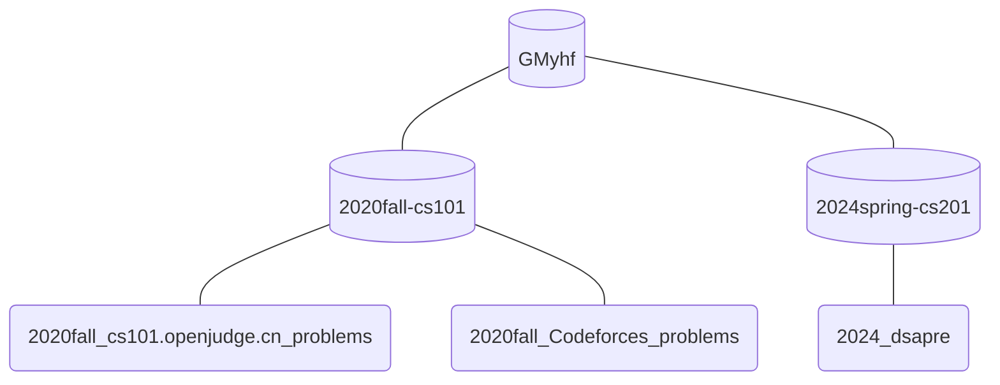
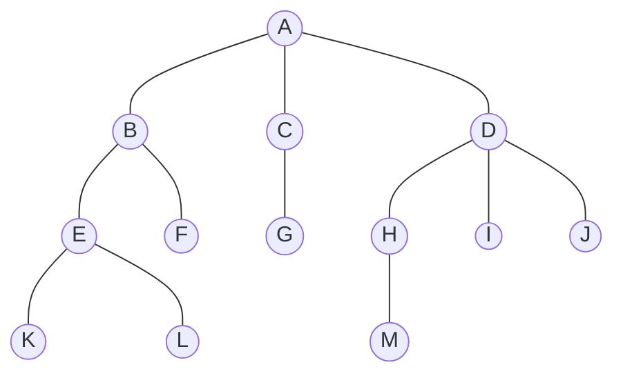

# 20240312-Week4-植树节（Arbor day）

Updated 0056 GMT+8 March 10, 2024

2024 spring, Complied by Hongfei Yan


说明：树相关内容准备在 Week4 ~6 讲。中间考虑穿插递归、dfs等内容。

**预计 Week4 覆盖 一 中的 1～3**，Week5覆盖 一中 的 4~6, Week6覆盖 一 中7，及附录内容


# 一、基本数据结构及其编程题目

# 1 术语及定义


My github, https://github.com/GMyhf




在看了一些树的例子之后，现在来正式地定义树及其构成。

**节点 Node**：节点是树的基础部分。
每个节点具有名称，或“键值”。节点还可以保存额外数据项，数据项根据不同的应用而变。

**边 Edge**：边是组成树的另一个基础部分。
每条边恰好连接两个节点，表示节点之间具有关联，边具有出入方向；
每个节点（除根节点）恰有一条来自另一节点的入边；
每个节点可以有零条/一条/多条连到其它节点的出边。<u>如果加限制不能有 “多条边”，这里树结构就特殊化为线性表</u>

**根节 Root**: 树中唯一没有入边的节点。

**路径 Path**：由边依次连接在一起的有序节点列表。比如，哺乳纲→食肉目→猫科→猫属→家猫就是一条路径。

**子节点 Children**：入边均来自于同一个节点的若干节点，称为这个节点的子节点。

**父节点 Parent**：一个节点是其所有出边连接节点的父节点。

**兄弟节点 Sibling**：具有同一父节点的节点之间为兄弟节点。

**子树 Subtree**：一个节点和其所有子孙节点，以及相关边的集合。

**叶节点 Leaf Node**：没有子节点的节点称为叶节点。

**层级 Level**：
从根节点开始到达一个节点的路径，所包含的边的数量，称为这个节点的层级。
如图 D 的层级为 2，根节点的层级为 0。


图1 


有时候，题目中会给出概念定义，如：

**高度 Height**：树中所有节点的最大层级称为树的高度，如图1所示树的高度为 2。

**二叉树深度**：从根结点到叶结点依次经过的结点（含根、叶结点）形成树的一条路径，最长路径的节点个数为树的深度


**树 Tree**:

定义基本术语后，就可以进一步给出树的正式定义。实际上，本书将提供两种定义，其中一种涉及节点和边，另一种涉及递归。<u>在后面会看到，递归定义很有用。</u>
**定义一：树**由节点及连接节点的边构成。树有以下属性：
❏ 有一个根节点；
❏ 除根节点外，其他每个节点都与其唯一的父节点相连；
❏ 从根节点到其他每个节点都有且仅有一条路径；
❏ 如果每个节点最多有两个子节点，我们就称这样的树为二叉树。
图2展示了一棵符合定义一的树。边的箭头表示连接方向。


图2 由节点和边构成的树


**定义二：**一棵树要么为空，要么由一个根节点和零棵或多棵子树构成，子树本身也是一棵树。每棵子树的根节点通过一条边连到父树的根节点。图3展示了树的递归定义。从树的递归定义可知，图中的树至少有4个节点，因为三角形代表的子树必定有一个根节点。这棵树或许有更多的节点，但必须更深入地查看子树后才能确定。


图3 树的递归定义


### 27638: 求二叉树的高度和叶子数目

http://cs101.openjudge.cn/practice/27638/

给定一棵二叉树，求该二叉树的高度和叶子数目二叉树**高度**定义：从根结点到叶结点依次经过的结点（含根、叶结点）形成树的一条路径，最长路径的结点数减1为树的高度。只有一个结点的二叉树，高度是0。

**输入**

第一行是一个整数n，表示二叉树的结点个数。二叉树结点编号从0到n-1，根结点n <= 100 接下来有n行，依次对应二叉树的编号为0,1,2....n-1的节点。 每行有两个整数，分别表示该节点的左儿子和右儿子的编号。如果第一个（第二个）数为-1则表示没有左（右）儿子

**输出**

在一行中输出2个整数，分别表示二叉树的高度和叶子结点个数

样例输入

```
3
-1 -1
0 2
-1 -1
```

样例输出

```
1 2
```


```python
class TreeNode:
    def __init__(self):
        self.left = None
        self.right = None

def tree_height(node):
    if node is None:
        return -1  # 根据定义，空树高度为-1
    return max(tree_height(node.left), tree_height(node.right)) + 1

def count_leaves(node):
    if node is None:
        return 0
    if node.left is None and node.right is None:
        return 1
    return count_leaves(node.left) + count_leaves(node.right)

n = int(input())  # 读取节点数量
nodes = [TreeNode() for _ in range(n)]
has_parent = [False] * n  # 用来标记节点是否有父节点

for i in range(n):
    left_index, right_index = map(int, input().split())
    if left_index != -1:
        nodes[i].left = nodes[left_index]
        has_parent[left_index] = True
    if right_index != -1:
        #print(right_index)
        nodes[i].right = nodes[right_index]
        has_parent[right_index] = True

# 寻找根节点，也就是没有父节点的节点
root_index = has_parent.index(False)
root = nodes[root_index]

# 计算高度和叶子节点数
height = tree_height(root)
leaves = count_leaves(root)

print(f"{height} {leaves}")
```


### 06646: 二叉树的深度

http://cs101.openjudge.cn/dsapre/06646/

给定一棵二叉树，求该二叉树的深度

二叉树**深度**定义：从根结点到叶结点依次经过的结点（含根、叶结点）形成树的一条路径，最长路径的节点个数为树的深度

**输入**

第一行是一个整数n，表示二叉树的结点个数。二叉树结点编号从1到n，根结点为1，n <= 10
接下来有n行，依次对应二叉树的n个节点。
每行有两个整数，分别表示该节点的左儿子和右儿子的节点编号。如果第一个（第二个）数为-1则表示没有左（右）儿子

**输出**

输出一个整型数，表示树的深度

样例输入

```
3
2 3
-1 -1
-1 -1
```

样例输出

```
2
```


```python
class TreeNode:
    def __init__(self):
        self.left = None
        self.right = None

def tree_depth(node):
    if node is None:
        return 0
    left_depth = tree_depth(node.left)
    right_depth = tree_depth(node.right)
    return max(left_depth, right_depth) + 1

n = int(input())  # 读取节点数量
nodes = [TreeNode() for _ in range(n)]

for i in range(n):
    left_index, right_index = map(int, input().split())
    if left_index != -1:
        nodes[i].left = nodes[left_index-1]
    if right_index != -1:
        nodes[i].right = nodes[right_index-1]

root = nodes[0]
depth = tree_depth(root)
print(depth)
```


# 2 树的表示方法

https://blog.csdn.net/qq_41891805/article/details/104473065

树是n (n>=0) 个结点的有限集。在任意一棵非空树中：
（1）有且仅有一个根结点；（2）除根结点外，其余的结点可分为m(m>=0)个互不相交的子树。


树的表示方法包括

（1）嵌套括号表示法

Nested parentheses representation


$(A(B(EK,L),F),C(G),D(H(M),I,J))$​


（2）树形表示

Node-Based or Node-Link structure
In computer science, a general tree is typically represented using this data structure. Each node in the tree contains information and references (links) to its child nodes.




（3）文氏图

文氏图（英语：Venn diagram），或译Venn图、温氏图、维恩图、范氏图，是在所谓的集合论（或者类的理论）数学分支中，在不太严格的意义下用以表示集合（或类）的一种草图。


（4）凹入表


## 2.1 嵌套括号表示法

### P0740: 括号嵌套树

http://dsbpython.openjudge.cn/dspythonbook/P0740/

可以用括号嵌套的方式来表示一棵树。表示方法如下：

1) 如果一棵树只有一个结点，则该树就用一个大写字母表示，代表其根结点。
2) 如果一棵树有子树，则用“树根(子树1,子树2,...,子树n)”的形式表示。树根是一个大写字母，子树之间用逗号隔开，没有空格。子树都是用括号嵌套法表示的树。

给出一棵不超过26个结点的树的括号嵌套表示形式，请输出其前序遍历序列和后序遍历序列。

输入样例代表的树如下图：


**输入**

一行，一棵树的括号嵌套表示形式

**输出**

两行。第一行是树的前序遍历序列，第二行是树的后序遍历序列


样例输入

```
A(B(E),C(F,G),D(H(I)))
```

样例输出

```
ABECFGDHI
EBFGCIHDA
```

来源：Guo Wei


题面提到了遍历，但是没有给出定义。定义如下：

**前序遍历**
在前序遍历中，先访问根节点，然后递归地前序遍历左子树，最后递归地前序遍历右子树。

**中序遍历**
在中序遍历中，先递归地中序遍历左子树，然后访问根节点，最后递归地中序遍历右子树。

**后序遍历**
在后序遍历中，先递归地后序遍历右子树，然后递归地后序遍历左子树，最后访问根节点。


下面两个代码。先给出用类表示node

```python
class TreeNode:
    def __init__(self, value):
        self.value = value
        self.children = []

def parse_tree(s):
    stack = []
    node = None
    for char in s:
        if char.isalpha():  # 如果是字母，创建新节点
            node = TreeNode(char)
            if stack:  # 如果栈不为空，把节点作为子节点加入到栈顶节点的子节点列表中
                stack[-1].children.append(node)
        elif char == '(':  # 遇到左括号，当前节点可能会有子节点
            if node:
                stack.append(node)  # 把当前节点推入栈中
                node = None
        elif char == ')':  # 遇到右括号，子节点列表结束
            if stack:
                node = stack.pop()  # 弹出当前节点
    return node  # 根节点


def preorder(node):
    output = [node.value]
    for child in node.children:
        output.extend(preorder(child))
    return ''.join(output)

def postorder(node):
    output = []
    for child in node.children:
        output.extend(postorder(child))
    output.append(node.value)
    return ''.join(output)

# 主程序
def main():
    s = input().strip()
    s = ''.join(s.split())  # 去掉所有空白字符
    root = parse_tree(s)  # 解析整棵树
    if root:
        print(preorder(root))  # 输出前序遍历序列
        print(postorder(root))  # 输出后序遍历序列
    else:
        print("input tree string error!")

if __name__ == "__main__":
    main()
```


用字典表示node

```python
def parse_tree(s):
    stack = []
    node = None
    for char in s:
        if char.isalpha():  # 如果是字母，创建新节点
            node = {'value': char, 'children': []}
            if stack:  # 如果栈不为空，把节点作为子节点加入到栈顶节点的子节点列表中
                stack[-1]['children'].append(node)
        elif char == '(':  # 遇到左括号，当前节点可能会有子节点
            if node:
                stack.append(node)  # 把当前节点推入栈中
                node = None
        elif char == ')':  # 遇到右括号，子节点列表结束
            if stack:
                node = stack.pop()  # 弹出当前节点
    return node  # 根节点


def preorder(node):
    output = [node['value']]
    for child in node['children']:
        output.extend(preorder(child))
    return ''.join(output)

def postorder(node):
    output = []
    for child in node['children']:
        output.extend(postorder(child))
    output.append(node['value'])
    return ''.join(output)

# 主程序
def main():
    s = input().strip()
    s = ''.join(s.split())  # 去掉所有空白字符
    root = parse_tree(s)  # 解析整棵树
    if root:
        print(preorder(root))  # 输出前序遍历序列
        print(postorder(root))  # 输出后序遍历序列
    else:
        print("input tree string error!")

if __name__ == "__main__":
    main()
```


# 3 二叉树的应用

## 3.1 解析树

现在来看看如何用树解决一些实际问题。本节介绍解析树，可以用它来表示现实世界中像句子（如图4所示）或数学表达式这样的构造。


图4 一个简单句子的解析树


图4展示了一个简单句子的层次结构。用树状结构表示句子让我们可以使用子树处理句子的独立部分。

我们也可以将` ( ( 7 + 3) * ( 5 - 2 ) )` 这样的数学表达式表示成解析树，如图5所示。这是完全括号表达式，乘法的优先级高于加法和减法，但因为有括号，所以在做乘法前必须先做括号内的加法和减法。树的层次性有助于理解整个表达式的计算次序。在计算顶层的乘法前，必须先计算子树中的加法和减法。加法（左子树）的结果是`10`，减法（右子树）的结果是`3`。利用树的层次结构，在计算完子树的表达式后，只需用一个节点代替整棵子树即可。应用这个替换过程后，便得到如图5所示的简化树。


图5 `( ( 7 + 3) * ( 5 - 2 ) )`的解析树


图6 `( ( 7 + 3 ) * ( 5 - 2 ) )`的简化解析树

本节的剩余部分将仔细考察解析树，重点如下：
	❏ 如何根据完全括号表达式构建解析树；
	❏ 如何计算解析树中的表达式；
	❏ 如何将解析树还原成最初的数学表达式。

> 将表达式表示为解析树是一种常见的操作，这个过程也称为表达式解析或者表达式解析树的构建。虽然没有一个特定的算法被称为“解析树算法”，但是构建解析树的过程通常涉及到递归下降解析、逆波兰表达式、算符优先法等技术。
>
> 1. **递归下降解析**：这是一种常见的自顶向下的解析方法，通过递归地从顶层开始处理表达式的各个部分，构建解析树。
> 2. **逆波兰表达式**：逆波兰表达式是一种将运算符置于操作数之后的表示方法，通过对逆波兰表达式的解析，可以直接构建解析树。
> 3. **算符优先法**：算符优先法是一种通过比较运算符优先级来构建表达式解析树的方法，它使用了一个运算符优先级表来决定操作的顺序。
>
> 这些方法在不同的场景下有不同的应用，但都可以用来构建表达式的解析树。

构建解析树的第一步是将表达式字符串拆分成标记列表。需要考虑4种标记：左括号、右括号、运算符和操作数。我们知道，左括号代表新表达式的起点，所以应该创建一棵对应该表达式的新树。反之，遇到右括号则意味着到达该表达式的终点。我们也知道，操作数既是叶子节点，也是其运算符的子节点。此外，每个运算符都有左右子节点。

有了上述信息，便可以定义以下4条规则：

(1) 如果当前标记是(，就为当前节点添加一个左子节点，并下沉至该子节点；
(2) 如果当前标记在列表`['+', '-', '/', '＊']`中，就将当前节点的值设为当前标记对应的运算符；为当前节点添加一个右子节点，并下沉至该子节点；
(3) 如果当前标记是数字，就将当前节点的值设为这个数并返回至父节点；
(4) 如果当前标记是)，就跳到当前节点的父节点。

编写Python代码前，我们先通过一个例子来理解上述规则。将表达式`(3 + (4 ∗ 5))`拆分成标记列表`['(', '3', '+', '(', '4', '＊', '5', ')', ')']`。起初，解析树只有一个空的根节点，随着对每个标记的处理，解析树的结构和内容逐渐充实，如图6所示。


图7 一步步地构建解析树

以图7为例，我们来一步步地构建解析树。

(a) 创建一棵空树。
(b) 读入第一个标记(。根据规则1，为根节点添加一个左子节点。
(c) 读入下一个标记3。根据规则3，将当前节点的值设为3，并回到父节点。
(d) 读入下一个标记+。根据规则2，将当前节点的值设为+，并添加一个右子节点。新节点成为当前节点。
(e) 读入下一个标记(。根据规则1，为当前节点添加一个左子节点，并将其作为当前节点。
(f) 读入下一个标记4。根据规则3，将当前节点的值设为4，并回到父节点。
(g) 读入下一个标记＊。根据规则2，将当前节点的值设为＊，并添加一个右子节点。新节点成为当前节点。
(h) 读入下一个标记5。根据规则3，将当前节点的值设为5，并回到父节点。
(i) 读入下一个标记)。根据规则4，将＊的父节点作为当前节点。
(j) 读入下一个标记)。根据规则4，将+的父节点作为当前节点。因为+没有父节点，所以工作完成。

本例表明，在构建解析树的过程中，需要追踪当前节点及其父节点。可以通过`getLeftChild`与`getRightChild`获取子节点，但如何追踪父节点呢？一个简单的办法就是在遍历这棵树时使用栈记录父节点。每当要下沉至当前节点的子节点时，先将当前节点压到栈中。当要返回到当前节点的父节点时，就将父节点从栈中弹出来。

利用前面描述的规则以及`Stack`和`BinaryTree`，就可以编写创建解析树的Python函数。

### 实现：解析树构建器


```python
class Stack(object):
    def __init__(self):
        self.items = []
        self.stack_size = 0

    def isEmpty(self):
        return self.stack_size == 0

    def push(self, new_item):
        self.items.append(new_item)
        self.stack_size += 1

    def pop(self):
        self.stack_size -= 1
        return self.items.pop()

    def peek(self):
        return self.items[self.stack_size - 1]

    def size(self):
        return self.stack_size


class BinaryTree:
    def __init__(self, rootObj):
        self.key = rootObj
        self.leftChild = None
        self.rightChild = None

    def insertLeft(self, newNode):
        if self.leftChild == None:
            self.leftChild = BinaryTree(newNode)
        else:  # 已经存在左子节点。此时，插入一个节点，并将已有的左子节点降一层。
            t = BinaryTree(newNode)
            t.leftChild = self.leftChild
            self.leftChild = t

    def insertRight(self, newNode):
        if self.rightChild == None:
            self.rightChild = BinaryTree(newNode)
        else:
            t = BinaryTree(newNode)
            t.rightChild = self.rightChild
            self.rightChild = t

    def getRightChild(self):
        return self.rightChild

    def getLeftChild(self):
        return self.leftChild

    def setRootVal(self, obj):
        self.key = obj

    def getRootVal(self):
        return self.key

    def traversal(self, method="preorder"):
        if method == "preorder":
            print(self.key, end=" ")
        if self.leftChild != None:
            self.leftChild.traversal(method)
        if method == "inorder":
            print(self.key, end=" ")
        if self.rightChild != None:
            self.rightChild.traversal(method)
        if method == "postorder":
            print(self.key, end=" ")


def buildParseTree(fpexp):
    fplist = fpexp.split()
    pStack = Stack()
    eTree = BinaryTree('')
    pStack.push(eTree)
    currentTree = eTree

    for i in fplist:
        if i == '(':
            currentTree.insertLeft('')
            pStack.push(currentTree)
            currentTree = currentTree.getLeftChild()
        elif i not in '+-*/)':
            currentTree.setRootVal(int(i))
            parent = pStack.pop()
            currentTree = parent
        elif i in '+-*/':
            currentTree.setRootVal(i)
            currentTree.insertRight('')
            pStack.push(currentTree)
            currentTree = currentTree.getRightChild()
        elif i == ')':
            currentTree = pStack.pop()
        else:
            raise ValueError("Unknown Operator: " + i)
    return eTree


exp = "( ( 7 + 3 ) * ( 5 - 2 ) )"
pt = buildParseTree(exp)
for mode in ["preorder", "postorder", "inorder"]:
    pt.traversal(mode)
    print()

"""
* + 7 3 - 5 2 
7 3 + 5 2 - * 
7 + 3 * 5 - 2 
"""

# 代码清单6-10
import operator

def evaluate(parseTree):
    opers = {'+':operator.add, '-':operator.sub, '*':operator.mul, '/':operator.truediv}

    leftC = parseTree.getLeftChild()
    rightC = parseTree.getRightChild()

    if leftC and rightC:
        fn = opers[parseTree.getRootVal()]
        return fn(evaluate(leftC),evaluate(rightC))
    else:
        return parseTree.getRootVal()

print(evaluate(pt))
# 30

#代码清单6-14 后序求值
def postordereval(tree):
    opers = {'+':operator.add, '-':operator.sub,
             '*':operator.mul, '/':operator.truediv}
    res1 = None
    res2 = None
    if tree:
        res1 = postordereval(tree.getLeftChild())
        res2 = postordereval(tree.getRightChild())
        if res1 and res2:
            return opers[tree.getRootVal()](res1,res2)
        else:
            return tree.getRootVal()

print(postordereval(pt))
# 30

#代码清单6-16 中序还原完全括号表达式
def printexp(tree):
    sVal = ""
    if tree:
        sVal = '(' + printexp(tree.getLeftChild())
        sVal = sVal + str(tree.getRootVal())
        sVal = sVal + printexp(tree.getRightChild()) + ')'
    return sVal

print(printexp(pt))
# (((7)+3)*((5)-2))
```


在代码清单中，第79、83、87和92行的`if`语句体现了构建解析树的4条规则，其中每条语句都通过调用`BinaryTree`和`Stack`的方法实现了前面描述的规则。这个函数中唯一的错误检查在`else`从句中，如果遇到一个不能识别的标记，就抛出一个`ValueError`异常。

有了一棵解析树之后，我们能对它做些什么呢？作为第一个例子，我们可以写一个函数计算解析树，并返回计算结果。要写这个函数，我们将利用树的层次性。<u>针对图5中的解析树，可以用图6中的简化解析树替换。由此可见，可以写一个算法，通过递归计算每棵子树得到整棵解析树的结果。</u>

> 因为两个图距离目前文字太远，复制粘贴


图5 `( ( 7 + 3 ) * ( 5 - 2 ) )`的解析树


图6 `( ( 7 + 3 ) * ( 5 - 2 ) )`的简化解析树

和之前编写递归函数一样，设计递归计算函数要从确定基本情况开始。就针对树进行操作的递归算法而言，一个很自然的基本情况就是检查叶子节点。解析树的叶子节点必定是操作数。由于像整数和浮点数这样的数值对象不需要进一步翻译，因此evaluate函数可以直接返回叶子节点的值。为了向**基本情况**靠近，算法将执行递归步骤，即对当前节点的左右子节点调用evaluate函数。递归调用可以有效地沿着各条边往叶子节点靠近。

若要结合两个递归调用的结果，只需将父节点中存储的运算符应用于子节点的计算结果即可。从图6中可知，根节点的两个子节点的计算结果就是它们自身，即`10`和`3`。应用乘号，得到最后的结果30。

递归函数evaluate的实现如代码清单所示。首先，获取指向当前节点的左右子节点的引用。如果左右子节点的值都是None，就说明当前节点确实是叶子节点。第7行执行这项检查。如果当前节点不是叶子节点，则查看当前节点中存储的运算符，并将其应用于左右子节点的递归计算结果。


### 实现：计算二叉解析树的递归函数

代码清单6-10。

```python
import operator

def evaluate(parseTree):
    opers = {'+':operator.add, '-':operator.sub, '*':operator.mul, '/':operator.truediv}

    leftC = parseTree.getLeftChild()
    rightC = parseTree.getRightChild()

    if leftC and rightC:
        fn = opers[parseTree.getRootVal()]
        return fn(evaluate(leftC),evaluate(rightC)) #先计算左子树，再计算右子树，最后通过根节点运算符的函数调用将两个结果结合起来。
    else:
        return parseTree.getRootVal()
```


我们使用具有键+、-、＊和/的字典实现。字典中存储的值是`operator`模块的函数。该模块给我们提供了常用运算符的函数版本。在字典中查询运算符时，对应的函数对象被取出。既然取出的对象是函数，就可以用普通的方式`function(param1, param2)`调用。因此，`opers\['+'](2, 2)`等价于`operator.add(2, 2)`。

最后，让我们通过图6-12中的解析树构建过程来理解evaluate函数。第一次调用evaluate函数时，将整棵树的根节点作为参数parseTree传入。然后，获取指向左右子节点的引用，检查它们是否存在。第11行进行递归调用。从查询根节点的运算符开始，该运算符是+，对应operator.add函数，要传入两个参数。和普通的Python函数调用一样，Python做的第一件事是计算入参的值。本例中，两个入参都是对evaluate函数的递归调用。由于入参的计算顺序是从左到右，因此第一次递归调用是在左边。对左子树递归调用evaluate函数，发现节点没有左右子节点，所以这是一个叶子节点。处于叶子节点时，只需返回叶子节点的值作为计算结果即可。本例中，返回整数3。

至此，我们已经为顶层的`operator.add`调用计算出一个参数的值了，但还没完。继续从左到右的参数计算过程，现在进行一个递归调用，计算根节点的右子节点。我们发现，该节点不仅有左子节点，还有右子节点，所以检查节点存储的运算符——是＊，将左右子节点作为参数调用函数。这时可以看到，两个调用都已到达叶子节点，计算结果分别是4和5。算出参数之后，返回operator.mul(4, 5)的结果。至此，我们已经算出了顶层运算符（+）的操作数，剩下的工作就是完成对operator.add(3, 20)的调用。因此，表达式(3 + (4 ∗ 5))的计算结果就是23。


### P0580:根据后序表达式建立队列表达式

http://dsbpython.openjudge.cn/dspythonbook/P0580/

后序算术表达式可以通过栈来计算其值，做法就是从左到右扫描表达式，碰到操作数就入栈，碰到运算符，就取出栈顶的2个操作数做运算(先出栈的是第二个操作数，后出栈的是第一个)，并将运算结果压入栈中。最后栈里只剩下一个元素，就是表达式的值。

有一种算术表达式不妨叫做“队列表达式”，它的求值过程和后序表达式很像，只是将栈换成了队列：从左到右扫描表达式，碰到操作数就入队列，碰到运算符，就取出队头2个操作数做运算（先出队的是第2个操作数，后出队的是第1个），并将运算结果加入队列。最后队列里只剩下一个元素，就是表达式的值。

给定一个后序表达式，请转换成等价的队列表达式。例如，`3 4 + 6 5 * -`的等价队列表达式就是`5 6 4 3 * + -` 。

**输入**

第一行是正整数n(n<100)。接下来是n行，每行一个由字母构成的字符串，长度不超过100,表示一个后序表达式，其中小写字母是操作数，大写字母是运算符。运算符都是需要2个操作数的。

**输出**

对每个后序表达式，输出其等价的队列表达式。

样例输入

```
2
xyPzwIM
abcABdefgCDEF
```

样例输出

```
wzyxIPM
gfCecbDdAaEBF
```

提示

建立起表达式树，按层次遍历表达式树的结果前后颠倒就得到队列表达式

来源：Guo Wei modified from Ulm Local 2007


The problem is asking to convert a postfix expression to an equivalent queue expression. The queue expression is obtained by reversing the level order traversal of the expression tree built from the postfix expression.  

Here is a step-by-step plan:  
1.Create a TreeNode class to represent each node in the tree.
2.Create a function build_tree that takes the postfix expression as input and returns the root of the constructed tree.
	Use a stack to store the nodes.
	Iterate over the characters in the postfix expression.
	If the character is an operand, create a new node and push it onto the stack.
	If the character is an operator, pop two nodes from the stack, make them the children of a new node, and push the new node onto the stack.
3.Create a function level_order_traversal that takes the root of the tree as input and returns the level order traversal of the tree.
	Use a queue `traversal` to store the nodes to be visited.
	While the queue is not empty, dequeue a node, visit it, and enqueue its children.
4.For each postfix expression, construct the tree, perform the level order traversal, reverse the result, and output it.

```python
class TreeNode:
    def __init__(self, value):
        self.value = value
        self.left = None
        self.right = None

def build_tree(postfix):
    stack = []
    for char in postfix:
        node = TreeNode(char)
        if char.isupper():
            node.right = stack.pop()
            node.left = stack.pop()
        stack.append(node)
    return stack[0]

def level_order_traversal(root):
    queue = [root]
    traversal = []
    while queue:
        node = queue.pop(0)
        traversal.append(node.value)
        if node.left:
            queue.append(node.left)
        if node.right:
            queue.append(node.right)
    return traversal

n = int(input().strip())
for _ in range(n):
    postfix = input().strip()
    root = build_tree(postfix)
    queue_expression = level_order_traversal(root)[::-1]
    print(''.join(queue_expression))
```


## 3.2 树的遍历

我们已经了解了树的基本功能，现在是时候看看一些附加的使用模式了。这些使用模式可以按节点的访问方式分为3种。我们将对所有节点的访问称为“遍历”，共有3种遍历方式，分别为前序遍历、中序遍历和后序遍历。接下来，我们先仔细地定义这3种遍历方式，然后通过一些例子看看它们的用法。

**前序遍历**
在前序遍历中，先访问根节点，然后递归地前序遍历左子树，最后递归地前序遍历右子树。

**中序遍历**
在中序遍历中，先递归地中序遍历左子树，然后访问根节点，最后递归地中序遍历右子树。

**后序遍历**
在后序遍历中，先递归地后序遍历右子树，然后递归地后序遍历左子树，最后访问根节点。

让我们通过几个例子来理解这3种遍历方式。首先看看前序遍历。我们将一本书的内容结构表示为一棵树，整本书是根节点，每一章是根节点的子节点，每一章中的每一节是这章的子节点，每小节又是这节的子节点，依此类推。图8 展示了一本书的树状结构，它包含两章。注意，遍历算法对每个节点的子节点数没有要求，但本例只针对二叉树。


图8 一本书的树状结构

假设我们从前往后阅读这本书，那么阅读顺序就符合前序遍历的次序。从根节点“书”开始，遵循前序遍历指令，对左子节点“第1章”递归调用preorder函数。然后，对“第1章”的左子节点递归调用preorder函数，得到节点“1.1节”。由于该节点没有子节点，因此不必再进行递归调用。沿着树回到节点“第1章”，接下来访问它的右子节点，即“1.2节”。和前面一样，先访问左子节点“1.2.1节”，然后访问右子节点“1.2.2节”。访问完“1.2节”之后，回到“第1章”。接下来，回到根节点，以同样的方式访问节点“第2章”。

<u>遍历树的代码格外简洁，这主要是因为遍历是递归的。</u>

你可能会想，前序遍历算法的最佳实现方式是什么呢？是一个将树用作数据结构的函数，还是树本身的一个方法？代码清单6-11给出了前序遍历算法的外部函数版本，该函数将二叉树作为参数，其代码尤为简洁，这是因为算法的基本情况仅仅是检查树是否存在。如果参数tree是None，函数直接返回。

代码清单6-11 将前序遍历算法实现为外部函数

```python
def preorder(tree):
    if tree:
        print(tree.getRootVal())
        preorder(tree.getLeftChild())
        preorder(tree.getRightChild())
```


我们也可以将preorder实现为BinaryTree类的方法，如代码清单6-12所示。请留意将代码从外部移到内部后有何变化。通常来说，不仅需要用self代替tree，还需要修改基本情况。内部方法必须在递归调用preorder前，检查左右子节点是否存在。
代码清单6-12 将前序遍历算法实现为BinaryTree类的方法

```python
def preorder(self):
    print(self.key)
    if self.leftChild:
        self.leftChild.preorder()
    if self.rightChild:
        self.rightChild.preorder()
```


哪种实现方式更好呢？在本例中，将preorder实现为外部函数可能是更好的选择。原因在于，很少会仅执行遍历操作，在大多数情况下，还要通过基本的遍历模式实现别的目标。在下一个例子中，我们就会通过后序遍历来计算解析树。所以，我们在此采用外部函数版本。

在代码清单6-13中，后序遍历函数postorder与前序遍历函数preorder几乎相同，只不过对print的调用被移到了函数的末尾。
代码清单6-13 后序遍历函数

```python
def postorder(tree):
    if tree != None:
        postorder(tree.getLeftChild())
        postorder(tree.getRightChild())
        print(tree.getRootVal())
```


我们已经见识过后序遍历的一个常见用途，那就是计算解析树。<u>回顾代码清单6-10，我们所做的就是先计算左子树，再计算右子树，最后通过根节点运算符的函数调用将两个结果结合起来。</u>假设二叉树只存储一个表达式的数据。让我们来重写计算函数，使之更接近于代码清单6-13中的后序遍历函数。

### 代码清单6-14 后序求值

```python
def postordereval(tree):
    opers = {'+':operator.add, '-':operator.sub, 
             '*':operator.mul, '/':operator.truediv}
    res1 = None
    res2 = None
    if tree:
        res1 = postordereval(tree.getLeftChild())
        res2 = postordereval(tree.getRightChild())
        if res1 and res2:
            return opers[tree.getRootVal()](res1,res2)
        else:
            return tree.getRootVal()
```

注意，代码清单6-14与代码清单6-13在形式上很相似，只不过求值函数最后不是打印节点，而是返回节点。这样一来，就可以保存从第7行和第8行的递归调用返回的值，然后在第10行使用这些值和运算符进行计算。

最后来了解中序遍历。中序遍历的访问顺序是左子树、根节点、右子树。代码清单6-15给出了中序遍历函数的代码。注意，3个遍历函数的区别仅在于print语句与递归调用语句的相对位置。

代码清单6-15 中序遍历函数

```python
def inorder(tree):
    if tree != None:
        inorder(tree.getLeftChild())
        print(tree.getRootVal())
        inorder(tree.getRightChild())
```

<u>通过中序遍历解析树，可以还原不带括号的表达式。</u>接下来修改中序遍历算法，以得到完全括号表达式。唯一要做的修改是：在递归调用左子树前打印一个左括号，在递归调用右子树后打印一个右括号。代码清单6-16是修改后的函数。

### 代码清单6-16 中序还原完全括号表达式

```python
def printexp(tree):
    sVal = ""
    if tree:
        sVal = '(' + printexp(tree.getLeftChild())
        sVal = sVal + str(tree.getRootVal())
        sVal = sVal + printexp(tree.getRightChild()) + ')'
    return sVal

print(printexp(pt))
# (((7)+3)*((5)-2))
```


注意，printexp函数给每个数字都加上了括号。尽管不能算错误，但这些括号显然是多余的。请修改printexp函数，移除这些括号。


### 20576: printExp（逆波兰表达式建树）

http://cs101.openjudge.cn/dsapre/20576/

输出中缀表达式（去除不必要的括号）

**输入**

一个字串

**输出**

一个字串

样例输入

```
( not ( True or False ) ) and ( False or True and True )
```

样例输出

```
not ( True or False ) and ( False or True and True )
```


这三个操作符：`not`：优先级最高，`and`：其次，`or`：优先级最低。

```python
class BinaryTree:
    def __init__(self, root, left=None, right=None):
        self.root = root
        self.leftChild = left
        self.rightChild = right

    def getrightchild(self):
        return self.rightChild

    def getleftchild(self):
        return self.leftChild

    def getroot(self):
        return self.root

def postorder(string):    #中缀改后缀 Shunting yard algorightm
    opStack = []
    postList = []
    inList = string.split()
    prec = { '(': 0, 'or': 1,'and': 2,'not': 3}

    for word in inList:
        if word == '(':
            opStack.append(word)
        elif word == ')':
            topWord = opStack.pop()
            while topWord != '(':
                postList.append(topWord)
                topWord = opStack.pop()
        elif word == 'True' or word == 'False':
            postList.append(word)
        else:
            while opStack and prec[word] <= prec[opStack[-1]]:
                postList.append(opStack.pop())
            opStack.append(word)
    while opStack:
        postList.append(opStack.pop())
    return postList

def buildParseTree(infix):       #以后缀表达式为基础建树
    postList = postorder(infix)
    stack = []
    for word in postList:
        if word == 'not':  
            newTree = BinaryTree(word)
            newTree.leftChild = stack.pop()
            stack.append(newTree)
        elif word == 'True' or word == 'False':
            stack.append(BinaryTree(word))
        else:
            right = stack.pop()
            left = stack.pop()
            newTree = BinaryTree(word)
            newTree.leftChild = left
            newTree.rightChild = right
            stack.append(newTree)
    currentTree = stack[-1]
    return currentTree

def printTree(parsetree: BinaryTree):
    if parsetree.getroot() == 'or':
        return printTree(parsetree.getleftchild()) + ['or'] + printTree(parsetree.getrightchild())
    elif parsetree.getroot() == 'not':
        return ['not'] + (['('] + printTree(parsetree.getleftchild()) + [')'] if parsetree.leftChild.getroot() not in ['True', 'False'] else printTree(parsetree.getleftchild()))
    elif parsetree.getroot() == 'and':
        leftpart = ['('] + printTree(parsetree.getleftchild()) + [')'] if parsetree.leftChild.getroot() == 'or' else printTree(parsetree.getleftchild())
        rightpart = ['('] + printTree(parsetree.getrightchild()) + [')'] if parsetree.rightChild.getroot() == 'or' else printTree(parsetree.getrightchild())
        return leftpart + ['and'] + rightpart
    else:
        return [str(parsetree.getroot())]

def main():
    infix = input()
    Tree = buildParseTree(infix)
    print(' '.join(printTree(Tree)))

main()
```


`printTree`函数是一个递归函数，接收一个`BinaryTree`对象作为参数，然后根据树的结构和节点的值生成一个字符串列表。

函数的工作方式如下：

1. 首先，检查树的根节点的值。根据值的不同，函数会执行不同的操作。

2. 如果根节点的值为"or"，函数会递归地调用自身来处理左子树和右子树，然后将结果合并，并在两个结果之间插入"or"。

3. 如果根节点的值为"not"，函数会递归地调用自身来处理左子树。如果左子树的根节点的值不是"True"或"False"，则会在左子树的结果周围添加括号。

4. 如果根节点的值为"and"，函数会递归地调用自身来处理左子树和右子树。如果左子树或右子树的根节点的值为"or"，则会在相应子树的结果周围添加括号。

5. 如果根节点的值为"True"或"False"，函数会直接返回一个包含该值的列表。

6. 最后，函数会将生成的字符串列表合并为一个字符串，并返回。


### 24750: 根据二叉树中后序序列建树

http://cs101.openjudge.cn/practice/24750/

假设二叉树的节点里包含一个大写字母，每个节点的字母都不同。

给定二叉树的中序遍历序列和后序遍历序列(长度均不超过26)，请输出该二叉树的前序遍历序列。

**输入**

2行，均为大写字母组成的字符串，表示一棵二叉树的中序遍历序列与后序遍历排列。

**输出**

表示二叉树的前序遍历序列。

样例输入

```
BADC
BDCA
```

样例输出

```
ABCD
```

来源

Lou Yuke


```python
"""
后序遍历的最后一个元素是树的根节点。然后，在中序遍历序列中，根节点将左右子树分开。
可以通过这种方法找到左右子树的中序遍历序列。然后，使用递归地处理左右子树来构建整个树。
"""

def build_tree(inorder, postorder):
    if not inorder or not postorder:
        return []

    root_val = postorder[-1]
    root_index = inorder.index(root_val)

    left_inorder = inorder[:root_index]
    right_inorder = inorder[root_index + 1:]

    left_postorder = postorder[:len(left_inorder)]
    right_postorder = postorder[len(left_inorder):-1]

    root = [root_val]
    root.extend(build_tree(left_inorder, left_postorder))
    root.extend(build_tree(right_inorder, right_postorder))

    return root


def main():
    inorder = input().strip()
    postorder = input().strip()
    preorder = build_tree(inorder, postorder)
    print(''.join(preorder))


if __name__ == "__main__":
    main()

```


```python
"""
定义一个递归函数。在这个递归函数中，我们将后序遍历的最后一个元素作为当前的根节点，然后在中序遍历序列中找到这个根节点的位置，
这个位置将中序遍历序列分为左子树和右子树。
"""
class TreeNode:
    def __init__(self, x):
        self.val = x
        self.left = None
        self.right = None


def buildTree(inorder, postorder):
    if not inorder or not postorder:
        return None

    # 后序遍历的最后一个元素是当前的根节点
    root_val = postorder.pop()
    root = TreeNode(root_val)

    # 在中序遍历中找到根节点的位置
    root_index = inorder.index(root_val)

    # 构建右子树和左子树
    root.right = buildTree(inorder[root_index + 1:], postorder)
    root.left = buildTree(inorder[:root_index], postorder)

    return root


def preorderTraversal(root):
    result = []
    if root:
        result.append(root.val)
        result.extend(preorderTraversal(root.left))
        result.extend(preorderTraversal(root.right))
    return result


# 读取输入
inorder = input().strip()
postorder = input().strip()

# 构建树
root = buildTree(list(inorder), list(postorder))

# 输出前序遍历序列
print(''.join(preorderTraversal(root)))
```


### P0570: 根据二叉树前中序序列建树

http://dsbpython.openjudge.cn/dspythonbook/P0570/

假设二叉树的节点里包含一个大写字母，每个节点的字母都不同。

给定二叉树的前序遍历序列和中序遍历序列(长度均不超过26)，请输出该二叉树的后序遍历序列

**输入**

多组数据
每组数据2行，第一行是前序遍历序列，第二行是中序遍历序列

**输出**

对每组序列建树，输出该树的后序遍历序列

样例输入

```
DURPA
RUDPA
XTCNB
CTBNX
```

样例输出

```
RUAPD
CBNTX
```

来源：郭炜


The problem is asking to construct a binary tree from given preorder and inorder traversal sequences, and then output the postorder traversal sequence of the constructed tree.  

Here is a step-by-step plan:  
1.Create a TreeNode class to represent each node in the tree.
2.Create a function build_tree that takes the preorder and inorder sequences as input and returns the root of the constructed tree.
	The first character of the preorder sequence is the root of the tree.
	Find the position of the root in the inorder sequence.
	Recursively construct the left subtree using the left part of the inorder sequence and the corresponding part of the preorder sequence.
	Recursively construct the right subtree using the right part of the inorder sequence and the corresponding part of the preorder sequence.
3.Create a function postorder_traversal that takes the root of the tree as input and returns the postorder traversal sequence of the tree.
4.For each pair of preorder and inorder sequences, construct the tree and output the postorder traversal sequence.
Here is the Python code that implements this plan:

```python
class TreeNode:
    def __init__(self, value):
        self.value = value
        self.left = None
        self.right = None

def build_tree(preorder, inorder):
    if not preorder or not inorder:
        return None
    root_value = preorder[0]
    root = TreeNode(root_value)
    root_index_inorder = inorder.index(root_value)
    root.left = build_tree(preorder[1:1+root_index_inorder], inorder[:root_index_inorder])
    root.right = build_tree(preorder[1+root_index_inorder:], inorder[root_index_inorder+1:])
    return root

def postorder_traversal(root):
    if root is None:
        return ''
    return postorder_traversal(root.left) + postorder_traversal(root.right) + root.value

while True:
    try:
        preorder = input().strip()
        inorder = input().strip()
        root = build_tree(preorder, inorder)
        print(postorder_traversal(root))
    except EOFError:
        break
```


### P0650: 猜二叉树（按层次遍历）

http://dsbpython.openjudge.cn/dspythonbook/P0650/

一棵二叉树，结点都是大写英文字母，且不重复。

给出它的中序遍历序列和后序遍历序列，求其按层次遍历的序列。

 

**输入**

第一行是整数n, n <=30，表示有n棵二叉树
接下来每两行代表一棵二叉树，第一行是其中序遍历序列，第二行是后序遍历序列

**输出**

对每棵二叉树输出其按层次遍历序列

样例输入

```
2
LZGD
LGDZ
BKTVQP
TPQVKB
```

样例输出

```
ZLDG
BKVTQP
```

来源: Guo Wei


```python
from collections import deque

class Node:
    def __init__(self, data):
        self.data = data
        self.left = None
        self.right = None

def build_tree(inorder, postorder):
    if inorder:
        root = Node(postorder.pop())
        root_index = inorder.index(root.data)
        root.right = build_tree(inorder[root_index+1:], postorder)
        root.left = build_tree(inorder[:root_index], postorder)
        return root

def level_order_traversal(root):
    if root is None:
        return []
    result = []
    queue = deque([root])
    while queue:
        node = queue.popleft()
        result.append(node.data)
        if node.left:
            queue.append(node.left)
        if node.right:
            queue.append(node.right)
    return result

n = int(input())
for _ in range(n):
    inorder = list(input().strip())
    postorder = list(input().strip())
    root = build_tree(inorder, postorder)
    print(''.join(level_order_traversal(root)))
```


### 27637: 括号嵌套二叉树

http://cs101.openjudge.cn/practice/27637/

可以用括号嵌套的方式来表示一棵二叉树。

方法如下：`*`表示空的二叉树。

如果一棵二叉树只有一个结点，则该树就用一个非`*`字符表示，代表其根结点。

如果一棵二叉左右子树都非空，则用`树根(左子树,右子树)`的形式表示。树根是一个非`*`字符,左右子树之间用逗号隔开，没有空格。左右子树都用括号嵌套法表示。如果左子树非空而右子树为空，则用`树根(左子树)`形式表示；如果左子树为空而右子树非空，则用`树根(*,右子树)`形式表示。

给出一棵树的括号嵌套表示形式，请输出其前序遍历序列、中序遍历序列、后序遍历序列。例如，`A(B(*,C),D(E))`表示的二叉树如图所示


**输入**

第一行是整数n表示有n棵二叉树(n<100) 接下来有n行，每行是1棵二叉树的括号嵌套表示形式

**输出**

对每棵二叉树，输出其前序遍历序列和中序遍历序列

样例输入

```
2
A
A(B(*,C),D(E))
```

样例输出

```
A
A
ABCDE
BCAED
```

来源

http://dsbpython.openjudge.cn/dspythonbook/P0680/


```python
class TreeNode:
    def __init__(self, value):
        self.value = value
        self.left = None
        self.right = None


def parse_tree(s):
    if s == '*':
        return None
    if '(' not in s:
        return TreeNode(s)

    # Find the root value and the subtrees
    root_value = s[0]
    subtrees = s[2:-1]  # Remove the root and the outer parentheses

    # Use a stack to find the comma that separates the left and right subtrees
    stack = []
    comma_index = None
    for i, char in enumerate(subtrees):
        if char == '(':
            stack.append(char)
        elif char == ')':
            stack.pop()
        elif char == ',' and not stack:
            comma_index = i
            break

    left_subtree = subtrees[:comma_index] if comma_index is not None else subtrees
    right_subtree = subtrees[comma_index + 1:] if comma_index is not None else None

    # Parse the subtrees
    root = TreeNode(root_value)
    root.left = parse_tree(left_subtree)
    root.right = parse_tree(right_subtree) if right_subtree else None
    return root


# Define the traversal functions
def preorder_traversal(root):
    if root is None:
        return ""
    return root.value + preorder_traversal(root.left) + preorder_traversal(root.right)


def inorder_traversal(root):
    if root is None:
        return ""
    return inorder_traversal(root.left) + root.value + inorder_traversal(root.right)


# Input reading and processing
n = int(input().strip())
for _ in range(n):
    tree_string = input().strip()
    tree = parse_tree(tree_string)
    preorder = preorder_traversal(tree)
    inorder = inorder_traversal(tree)
    print(preorder)
    print(inorder)
```


# 4 Huffman 算法

> 2013-book-Data Structures And Algorithms In Python

In this section, we consider an important text-processing task, text compression. In this problem, we are given a string X defined over some alphabet, such as the ASCII  character sets, and we want to efficiently encode X into a small binary string Y (using only the characters 0 and 1). Text compression is useful in any situation where we wish to reduce bandwidth for digital communications, soas to minimize the time needed to transmit our text. Likewise, text compression is useful for storing large documents more efficiently, so as to allow a fixed-capacity storage device to contain as many documents as possible.

The method for text compression explored in this section is the **Huffman code**. Standard encoding schemes, such as ASCII, use fixed-length binary strings to encode characters (with 7 or 8 bits in the traditional or extended ASCII systems, respectively). The Huffman code saves space over a fixed-length encoding by using short code-word strings to encode high-frequency characters and long code-word strings to encode low-frequency characters. Furthermore, the Huffman code uses a variable-length encoding specifically optimized for a given string X over any alphabet. The optimization is based on the use of character **frequencies**, where we have, for each character c, a count f(c) of the number of times c appears in the string X.

To encode the string X, we convert each character in X to a variable-length code-word, and we concatenate all these code-words in order to produce the encoding Y for X. In order to avoid ambiguities, we insist that no code-word in our encoding be a prefix of another code-word in our encoding. Such a code is called a **prefix code**, and it simplifies the decoding of Y to retrieve X. (See Figure 13.9.) Even with this restriction, the savings produced by a variable-length prefix code can be significant, particularly if there is a wide variance in character frequencies (as is the case for natural language text in almost every written language).

Huffman’s algorithm for producing an optimal variable-length prefix code for X is based on the construction of a binary tree T that represents the code. Each edge in T represents a bit in a code-word, with an edge to a left child representing a “0” and an edge to a right child representing a “1.” Each leaf v is associated with a specific character, and the code-word for that character is defined by the sequence of bits associated with the edges in the path from the root of T to v. (See Figure 13.9.) Each leaf v has a frequency, f(v), which is simply the frequency in X of the character associated with v. In addition, we give each internal node v in T
a frequency, f(v), that is the sum of the frequencies of all the leaves in the subtree rooted at v.


Figure 13.9: An illustration of an example Huffman code for the input string X = "a fast runner need never be afraid of the dark": (a) frequency of each character of X; (b) Huffman tree T for string X. The code for a character c is obtained by tracing the path from the root of T to the leaf where c is stored, and associating a left child with 0 and a right child with 1. For example, the code for “r” is 011, and the code for “h” is 10111.


## 4.1 The Huffman Coding Algorithm

The Huffman coding algorithm begins with each of the d distinct characters of the string X to encode being the root node of a single-node binary tree. The algorithm proceeds in a series of rounds. In each round, the algorithm takes the two binary
trees with the smallest frequencies and merges them into a single binary tree. It repeats this process until only one tree is left. 

Each iteration of the **while** loop in Huffman’s algorithm can be implemented in O(logd) time using a priority queue represented with a heap. In addition, each iteration takes two nodes out of Q and adds one in, a process that will be repeated d − 1 times before exactly one node is left in Q. Thus, this algorithm runs in O(n+ d logd) time. Although a full justification of this algorithm’s correctness is beyond our scope here, we note that its intuition comes from a simple idea—any
optimal code can be converted into an optimal code in which the code-words for the two lowest-frequency characters, a and b, differ only in their last bit. Repeating the argument for a string with a and b replaced by a character c, gives the following:

**Proposition** : Huffman’s algorithm constructs an optimal prefix code for a string of length n with d distinct characters in $O(n+d logd)$​ time.


## 4.2 The Greedy Method

Huffman’s algorithm for building an optimal encoding is an example application of an algorithmic design pattern called the greedy method. This design pattern is applied to optimization problems, where we are trying to construct some structure
while minimizing or maximizing some property of that structure. 

The general formula for the greedy method pattern is almost as simple as that for the brute-force method. In order to solve a given optimization problem using the greedy method, we proceed by a sequence of choices. The sequence starts from some well-understood starting condition, and computes the cost for that initial condition. The pattern then asks that we iteratively make additional choices by identifying the decision that achieves the best cost improvement from all of the choices that are currently possible. This approach does not always lead to an optimal solution.

But there are several problems that it does work for, and such problems are said to possess the **greedy-choice** property. This is the property that a global optimal condition can be reached by a series of locally optimal choices (that is, choices that are each the current best from among the possibilities available at the time), starting from a well-defined starting condition. The problem of computing an optimal variable-length prefix code is just one example of a problem that possesses the greedy-choice property.


## 4.3 哈夫曼编码实现

要构建一个最优的哈夫曼编码树，首先需要对给定的字符及其权值进行排序。然后，通过重复合并权值最小的两个节点（或子树），直到所有节点都合并为一棵树为止。

下面是用 Python 实现的代码：

```python
import heapq

class Node:
    def __init__(self, char, freq):
        self.char = char
        self.freq = freq
        self.left = None
        self.right = None

    def __lt__(self, other):
        return self.freq < other.freq

def huffman_encoding(char_freq):
    heap = [Node(char, freq) for char, freq in char_freq.items()]
    heapq.heapify(heap)

    while len(heap) > 1:
        left = heapq.heappop(heap)
        right = heapq.heappop(heap)
        merged = Node(None, left.freq + right.freq) # note: 合并之后 char 字典是空
        merged.left = left
        merged.right = right
        heapq.heappush(heap, merged)

    return heap[0]

def external_path_length(node, depth=0):
    if node is None:
        return 0
    if node.left is None and node.right is None:
        return depth * node.freq
    return (external_path_length(node.left, depth + 1) +
            external_path_length(node.right, depth + 1))

def main():
    char_freq = {'a': 3, 'b': 4, 'c': 5, 'd': 6, 'e': 8, 'f': 9, 'g': 11, 'h': 12}
    huffman_tree = huffman_encoding(char_freq)
    external_length = external_path_length(huffman_tree)
    print("The weighted external path length of the Huffman tree is:", external_length)

if __name__ == "__main__":
    main()

# Output:
# The weighted external path length of the Huffman tree is: 169 
```

这段代码首先定义了一个 `Node` 类来表示哈夫曼树的节点。然后，使用最小堆来构建哈夫曼树，每次从堆中取出两个频率最小的节点进行合并，直到堆中只剩下一个节点，即哈夫曼树的根节点。接着，使用递归方法计算哈夫曼树的带权外部路径长度（weighted external path length）。最后，输出计算得到的带权外部路径长度。

你可以运行这段代码来得到该最优二叉编码树的带权外部路径长度。


### 22161: 哈夫曼编码树

http://cs101.openjudge.cn/practice/22161/

根据字符使用频率(权值)生成一棵唯一的哈夫曼编码树。生成树时需要遵循以下规则以确保唯一性：

选取最小的两个节点合并时，节点比大小的规则是:

1) 权值小的节点算小。权值相同的两个节点，字符集里最小字符小的，算小。

例如 （{'c','k'},12) 和 ({'b','z'},12)，后者小。

2) 合并两个节点时，小的节点必须作为左子节点
3) 连接左子节点的边代表0,连接右子节点的边代表1

然后对输入的串进行编码或解码


**输入**

第一行是整数n，表示字符集有n个字符。
接下来n行，每行是一个字符及其使用频率（权重）。字符都是英文字母。
再接下来是若干行，有的是字母串，有的是01编码串。

**输出**

对输入中的字母串，输出该字符串的编码
对输入中的01串,将其解码，输出原始字符串

样例输入

```
3
g 4
d 8
c 10
dc
110
```

样例输出

```
110
dc
```

提示: 数据规模很小，不用在乎效率

来源: 郭炜


```python
import heapq

class Node:
    def __init__(self, weight, char=None):
        self.weight = weight
        self.char = char
        self.left = None
        self.right = None

    def __lt__(self, other):
        if self.weight == other.weight:
            return self.char < other.char
        return self.weight < other.weight

def build_huffman_tree(characters):
    heap = []
    for char, weight in characters.items():
        heapq.heappush(heap, Node(weight, char))

    while len(heap) > 1:
        left = heapq.heappop(heap)
        right = heapq.heappop(heap)
        merged = Node(left.weight + right.weight) #note: 合并后，char 字段默认值是空
        merged.left = left
        merged.right = right
        heapq.heappush(heap, merged)

    return heap[0]

def encode_huffman_tree(root):
    codes = {}

    def traverse(node, code):
        if node.char:
            codes[node.char] = code
        else:
            traverse(node.left, code + '0')
            traverse(node.right, code + '1')

    traverse(root, '')
    return codes

def huffman_encoding(codes, string):
    encoded = ''
    for char in string:
        encoded += codes[char]
    return encoded

def huffman_decoding(root, encoded_string):
    decoded = ''
    node = root
    for bit in encoded_string:
        if bit == '0':
            node = node.left
        else:
            node = node.right

        if node.char:
            decoded += node.char
            node = root
    return decoded

# 读取输入
n = int(input())
characters = {}
for _ in range(n):
    char, weight = input().split()
    characters[char] = int(weight)

#string = input().strip()
#encoded_string = input().strip()

# 构建哈夫曼编码树
huffman_tree = build_huffman_tree(characters)

# 编码和解码
codes = encode_huffman_tree(huffman_tree)

strings = []
while True:
    try:
        line = input()
        if line:
            strings.append(line)
        else:
            break
    except EOFError:
        break

results = []
#print(strings)
for string in strings:
    if string[0] in ('0','1'):
        results.append(huffman_decoding(huffman_tree, string))
    else:
        results.append(huffman_encoding(codes, string))

for result in results:
    print(result)
```


### 18164: 剪绳子

greedy/huffman, http://cs101.openjudge.cn/practice/18164/

小张要将一根长度为L的绳子剪成N段。准备剪的绳子的长度为L1,L2,L3...,LN，未剪的绳子长度恰好为剪后所有绳子长度的和。 

每次剪断绳子时，需要的开销是此段绳子的长度。

比如，长度为10的绳子要剪成长度为2,3,5的三段绳子。长度为10的绳子切成5和5的两段绳子时，开销为10。再将5切成长度为2和3的绳子，开销为5。因此总开销为15。


请按照目标要求将绳子剪完最小的开销时多少。

已知，1<=N <= 20000，0<=Li<= 50000

**输入**

第一行：N，将绳子剪成的段数。
第二行：准备剪成的各段绳子的长度。

**输出**

最小开销

样例输入

```
3
2 3 5
```

样例输出

```
15
```

来源：cs101-2017 期末机考备选


与 05333: Fence Repair 一样。http://cs101.openjudge.cn/practice/05333

思路： 剪绳子，实际上是 Huffman编码/树，https://zhuanlan.zhihu.com/p/42238580

```python
# OJ18164
import sys
try: fin = open('test.in','r').readline
except: fin = sys.stdin.readline

n = int(fin())
import heapq
a = list(map(int, fin().split()))
heapq.heapify(a)
ans = 0
for i in range(n-1):
    x = heapq.heappop(a)
    y = heapq.heappop(a)
    z = x + y
    heapq.heappush(a, z)
    ans += z
print(ans)
```


bisect.insort时间复杂度？sorted时间复杂度？

`bisect.insort`函数的时间复杂度为O(N)，其中N是列表的长度。在最坏情况下，需要在列表中插入元素时，需要移动N个元素来完成插入操作。

`sorted`函数的时间复杂度为O(NlogN)，其中N是列表的长度。它使用的是Timsort算法（一种混合了插入排序和归并排序的排序算法），在平均情况下具有O(NlogN)的时间复杂度。

需要注意的是，这些时间复杂度是基于比较排序的情况。如果列表中的元素具有固定长度，可以使用线性时间复杂度的排序算法，如计数排序或基数排序，来优化排序过程。但对于一般的比较排序算法，以上给出的时间复杂度是适用的。


heapq时间复杂度？

`heapq`模块中的主要操作函数的时间复杂度如下：

- `heapify`: 将列表转换为堆的时间复杂度为O(N)，其中N是列表的长度。
- `heappush`: 向堆中插入元素的时间复杂度为O(logN)，其中N是堆的大小。
- `heappop`: 从堆中弹出最小元素的时间复杂度为O(logN)，其中N是堆的大小。
- `heappushpop`: 向堆中插入元素并弹出最小元素的时间复杂度为O(logN)，其中N是堆的大小。
- `heapreplace`: 弹出最小元素并插入新元素的时间复杂度为O(logN)，其中N是堆的大小。

这些操作的时间复杂度都是基于二叉堆的实现方式。二叉堆是一种完全二叉树的数据结构，具有良好的堆特性，可以在O(logN)的时间内进行插入、删除最小元素等操作。

需要注意的是，以上给出的时间复杂度是基于堆的大小的，而不是输入列表的大小。因此，在使用`heapq`模块时，操作的时间复杂度与堆的大小相关，而不是与输入列表的大小相关。

```python
#23-叶子涵-工院
import bisect
N=int(input())
ribbons=sorted(list(map(lambda x:-int(x),input().split())))
mini=0
for i in [0]*(N-1):
    A=ribbons.pop()
    B=ribbons.pop()
    mini-=A+B
    bisect.insort(ribbons,A+B)
print(mini)
```


### 笔试题目举例

**Q:** 用 Huffman 算法构造一个最优二叉编码树，待编码的字符权值分别为{3，4，5，6，8，9，11，12}，请问该最优二叉编码树的带权外部路径长度为（ B ）。（补充说明：树的带权外部路径长度定义为树中所有叶子结点的带权路径长度之和；其中，结点的带权路径长度定义为该结点到树根之间的路径长度与该结点权值的乘积）
A：58	B：169	C：72	D：18


解释：为了构造哈夫曼树，我们遵循一个重复的选择过程，每次选择两个最小的权值创建一个新的节点，直到只剩下一个节点为止。我们可以按照以下步骤操作：

1. 将给定的权值排序：{3, 4, 5, 6, 8, 9, 11, 12}。

2. 选择两个最小的权值：3 和 4，将它们组合成一个新的权值为 7 的节点。

   现在权值变为：{5, 6, 7, 8, 9, 11, 12}。

3. 再次选择两个最小的权值：5 和 6，将它们组合成一个新的权值为 11 的节点。

   现在权值变为：{7, 8, 9, 11, 11, 12}。

4. 选择两个最小的权值：7 和 8，将它们组合成一个新的权值为 15 的节点。

   现在权值变为：{9, 11, 11, 12, 15}。

5. 选择两个最小的权值：9 和 11，将它们合并成一个新的权值为 20 的节点。

   现在权值变为：{11, 12, 15, 20}。

6. 选择两个最小的权值：11 和 12，合并成一个新的权值为 23 的节点。

   现在权值变为：{15, 20, 23}。

7. 选择两个最小的权值：15 和 20，合并成一个新的权值为 35 的节点。

   现在权值变为：{23, 35}。

8. 最后，合并这两个节点得到根节点，权值为 23 + 35 = 58。

现在我们可以计算哈夫曼树的带权外部路径长度（WPL）。

```
          (58)
        /      \
     (23)       (35)
     /  \       /   \
   (11)(12)  (20)    (15) 
             / \       / \
            (9)(11)   (7)(8)
                / \   / \  
               (5)(6)(3) (4)
```

现在让我们计算每个叶子节点的带权路径长度：

- 权值 3 的节点路径长度为 4，WPL部分为 3 * 4 = 12。
- 权值 4 的节点路径长度为 4，WPL部分为 4 * 4 = 16。
- 权值 5 的节点路径长度为 4，WPL部分为 5 * 4 = 20。
- 权值 6 的节点路径长度为 4，WPL部分为 6 * 4 = 24。
- 权值 9 的节点路径长度为 3，WPL部分为 9 * 3 = 27。
- 权值 11（左侧）的节点路径长度为 3，WPL部分为 8 * 3 = 24。
- 权值 11（右侧）的节点路径长度为 2，WPL部分为 11 * 2 = 22。
- 权值 12 的节点路径长度为 2，WPL部分为 12 * 2 = 24。

将所有部分的 WPL 相加，我们得到整棵哈夫曼树的 WPL：

WPL = 12 + 16 + 20 + 24 + 27 + 24 + 22 + 24 = 169


# 5 利用二叉堆实现优先级队列

我们学习过队列这一先进先出的数据结构。队列有一个重要的变体，叫作优先级队列。和队列一样，优先级队列从头部移除元素，不过元素的逻辑顺序是由优先级决定的。优先级最高的元素在最前，优先级最低的元素在最后。因此，当一个元素入队时，它可能直接被移到优先级队列的头部。后续学习图相关内容时会看到，对于一些图算法来说，优先级队列是一个有用的数据结构。

你或许可以想到一些使用排序函数和列表实现优先级队列的简单方法。但是，就时间复杂度而言，列表的插入操作是 O(n) ，排序操作是 O(nlogn) 。其实，效率可以更高。实现优先级队列的经典方法是使用叫作二叉堆的数据结构。二叉堆的入队操作和出队操作均可达到 O(logn) 。

二叉堆学起来很有意思，它画出来很像一棵树，但实现时只用一个列表作为内部表示。我们将实现最小堆（最小的元素一直在队首）。

## 5.1 二叉堆的实现

1. 结构性

为了使二叉堆能高效地工作，我们利用树的对数性质来表示它。为了保证对数性能，必须维持树的平衡。平衡的二叉树是指，其根节点的左右子树含有数量大致相等的节点。在实现二叉堆时，我们通过创建一棵**完全二叉树**来维持树的平衡。在完全二叉树中，除了最底层，其他每一层的节点都是满的。在最底层，我们从左往右填充节点。图 6-14 展示了完全二叉树的一个例子。


图 6-14 完全二叉树


完全二叉树的另一个有趣之处在于，可以用一个列表来表示它，而不需要采用“列表之列表”或“节点与引用”表示法。由于树是完全的，因此对于在列表中处于位置 p 的节点来说，它的左子节点正好处于位置 2p；同理，右子节点处于位置 2p+1。若要找到树中任意节点的父节点，只需使用 Python 的整数除法即可。给定列表中位置 n 处的节点，其父节点的位置就是 n/2。图 6-15 展示了
一棵完全二叉树，并给出了列表表示。树的列表表示——加上这个“完全”的结构性质——让我们得以通过一些简单的数学运算遍历完全二叉树。我们会看到，这也有助于高效地实现二叉堆。


图 6-15 一棵完全二叉树及其列表表示


2. 堆的有序性

我们用来存储堆元素的方法依赖于堆的有序性。 堆的有序性是指：对于堆中任意元素 x 及其父元素 p， p 都不大于 x。图 6-15 也展示出完全二叉树具备堆的有序性。

3. 堆操作

首先实现二叉堆的构造方法。既然用一个列表就可以表示整个二叉堆，那么构造方法要做的就是初始化这个列表与属性 currentSize，用于记录堆的当前大小。代码清单 6-17 给出了构造方法的 Python 代码。列表 heapList 的第一个元素是 0，它的唯一用途是为了使后续的方法可以使用整数除法。


# 6 二叉搜索树

二叉搜索树（Binary Search Tree，BST），它是映射的另一种实现。我们感兴趣的不是元素在树中的确切位置，而是如何利用二叉树结构提供高效的搜索。

二叉搜索树依赖于这样一个性质：小于父节点的键都在左子树中，大于父节点的键则都在右子树中。我们称这个性质为二叉搜索性。


### 22275: 二叉搜索树的遍历

http://cs101.openjudge.cn/practice/22275/

给出一棵二叉搜索树的前序遍历，求它的后序遍历

**输入**

第一行一个正整数n（n<=2000）表示这棵二叉搜索树的结点个数
第二行n个正整数，表示这棵二叉搜索树的前序遍历
保证第二行的n个正整数中，1~n的每个值刚好出现一次

**输出**

一行n个正整数，表示这棵二叉搜索树的后序遍历

样例输入

```
5
4 2 1 3 5
```

样例输出

```
1 3 2 5 4
```

提示

树的形状为
   4  
  / \ 
  2  5 
 / \  
 1  3  

```python
def post_order(pre_order):
    if not pre_order:
        return []
    root = pre_order[0]
    left_subtree = [x for x in pre_order if x < root]
    right_subtree = [x for x in pre_order if x > root]
    return post_order(left_subtree) + post_order(right_subtree) + [root]

n = int(input())
pre_order = list(map(int, input().split()))
print(' '.join(map(str, post_order(pre_order))))
```


### P1320: 二叉搜索树的层次遍历

http://dsbpython.openjudge.cn/dspythonbook/P1320/

二叉搜索树在动态查表中有特别的用处，一个无序序列可以通过构造一棵二叉搜索树变成一个有序序列，

构造树的过程即为对无序序列进行排序的过程。每次插入的新的结点都是二叉搜索树上新的叶子结点，在进行

插入操作时，不必移动其它结点，只需改动某个结点的指针，由空变为非空即可。

   这里，我们想探究二叉树的建立和层次输出。

**输入**

只有一行，包含若干个数字，中间用空格隔开。（数字可能会有重复，对于重复的数字，只计入一个）

**输出**

输出一行，对输入数字建立二叉搜索树后进行按层次周游的结果。

样例输入

```
51 45 59 86 45 4 15 76 60 20 61 77 62 30 2 37 13 82 19 74 2 79 79 97 33 90 11 7 29 14 50 1 96 59 91 39 34 6 72 7
```

样例输出

```
51 45 59 4 50 86 2 15 76 97 1 13 20 60 77 90 11 14 19 30 61 82 96 7 29 37 62 79 91 6 33 39 74 34 72
```

提示

输入输出的最后都不带空格和回车换行


The problem is asking to construct a binary search tree (BST) from a sequence of numbers and then perform a level order traversal (also known as breadth-first search) on the BST.

Here is a step-by-step plan:
1. Create a TreeNode class to represent each node in the tree.
2. Create a function `insert` that takes a node and a value as input and inserts the value into the BST rooted at the node.
3. Create a function `level_order_traversal` that takes the root of the tree as input and returns the level order traversal of the tree.
   - Use a queue to store the nodes to be visited.
   - While the queue is not empty, dequeue a node, visit it, and enqueue its children.
4. Read the sequence of numbers from the input, construct the BST, perform the level order traversal, and output the result.

Here is the Python code that implements this plan:

```python
class TreeNode:
    def __init__(self, value):
        self.value = value
        self.left = None
        self.right = None

def insert(node, value):
    if node is None:
        return TreeNode(value)
    if value < node.value:
        node.left = insert(node.left, value)
    elif value > node.value:
        node.right = insert(node.right, value)
    return node

def level_order_traversal(root):
    queue = [root]
    traversal = []
    while queue:
        node = queue.pop(0)
        traversal.append(node.value)
        if node.left:
            queue.append(node.left)
        if node.right:
            queue.append(node.right)
    return traversal

numbers = list(map(int, input().strip().split()))
numbers = list(dict.fromkeys(numbers))  # remove duplicates
root = None
for number in numbers:
    root = insert(root, number)
traversal = level_order_traversal(root)
print(' '.join(map(str, traversal)))
```

This code reads the sequence of numbers from the input, removes duplicates, constructs the BST, performs the level order traversal, and prints the result.


## 4.2 二叉搜索树实现快排

快速排序是一种基于分治法的排序算法，它通过选择一个元素作为基准（pivot），将数组分割为两个子数组，其中一个子数组的元素都小于基准，另一个子数组的元素都大于基准。然后，对两个子数组递归地应用相同的排序过程，直到排序完成。

二叉搜索树是一种有序的二叉树，它满足以下性质：
- 左子树中的所有节点的值都小于根节点的值。
- 右子树中的所有节点的值都大于根节点的值。
- 左子树和右子树也分别是二叉搜索树。

可以使用二叉搜索树来实现快速排序的过程。具体步骤如下：
1. 选择数组中的一个元素作为基准。
2. 创建一个空的二叉搜索树。
3. 将数组中的其他元素逐个插入二叉搜索树中。
4. 按照二叉搜索树的中序遍历（左子树、根节点、右子树）得到排序后的结果。

这种方法的时间复杂度为 O(n log n)，其中 n 是数组的长度。每次插入操作都需要 O(log n) 的时间复杂度，总共进行 n-1 次插入操作。

需要注意的是，二叉搜索树的性能取决于树的平衡性。如果二叉搜索树变得不平衡，性能可能会下降到 O(n^2) 的时间复杂度。因此，在实际应用中，为了确保性能，通常会使用平衡二叉搜索树（如红黑树、AVL树）来实现快速排序。

```python
class TreeNode:
    def __init__(self, val):
        self.val = val
        self.left = None
        self.right = None

def insert(root, val):
    if root is None:
        return TreeNode(val)
    if val < root.val:
        root.left = insert(root.left, val)
    else:
        root.right = insert(root.right, val)
    return root

def inorder_traversal(root, result):
    if root:
        inorder_traversal(root.left, result)
        result.append(root.val)
        inorder_traversal(root.right, result)

def quicksort(nums):
    if not nums:
        return []
    root = TreeNode(nums[0])
    for num in nums[1:]:
        insert(root, num)
    result = []
    inorder_traversal(root, result)
    return result

# 示例输入
nums = [5, 2, 7, 1, 8, 3]

# 使用二叉搜索树实现快速排序
sorted_nums = quicksort(nums)

# 打印排序结果
print(sorted_nums)
```


# 7 平衡二叉搜索树

在6.7节中，我们了解了二叉搜索树的构建过程。我们已经知道，当二叉搜索树不平衡时，get和put等操作的性能可能降到O(n)。本节将介绍一种特殊的二叉搜索树，它能自动维持平衡。这种树叫作 AVL树，以其发明者G. M. Adelson-Velskii和E. M. Landis的姓氏命名。

AVL树实现映射抽象数据类型的方式与普通的二叉搜索树一样，唯一的差别就是性能。实现AVL树时，要记录每个节点的平衡因子。我们通过查看每个节点左右子树的高度来实现这一点。更正式地说，我们将平衡因子定义为左右子树的高度之差。

$balance Factor = height (left SubTree) - height(right SubTree)$

根据上述定义，如果平衡因子大于零，我们称之为左倾；如果平衡因子小于零，就是右倾；如果平衡因子等于零，那么树就是完全平衡的。为了实现AVL树并利用平衡树的优势，我们将平衡因子为-1、0和1的树都定义为平衡树。一旦某个节点的平衡因子超出这个范围，我们就需要通过一个过程让树恢复平衡。图6-26展示了一棵右倾树及其中每个节点的平衡因子。


图6-26 带平衡因子的右倾树

## 5.1 AVL树的性能

我们先看看限定平衡因子带来的结果。我们认为，保证树的平衡因子为-1、0或1，可以使关键操作获得更好的大 O 性能。首先考虑平衡因子如何改善最坏情况。有左倾与右倾这两种可能性。如果考虑高度为0、1、2和3的树，图6-27展示了应用新规则后最不平衡的左倾树。


图6-27 左倾AVL树的最坏情况

查看树中的节点数之后可知，高度为0时有1个节点，高度为1时有2个节点（1 + 1 = 2），高度为2时有4个节点（1 + 1 + 2 = 4），高度为3时有7个节点（1 + 2 + 4 = 7）。也就是说，当高度为h时，节点数$N_h$是：

$N_h = 1 + N_{h-1} + N_{h-2}$​


> ### P1350: AVL树至少有几个结点
>
> http://cs101.openjudge.cn/practice/27625/
>
> 输入n(0<n<50),输出一个n层的AVL树至少有多少个结点。
>
> **输入**
>
> n
>
> **输出**
>
> 答案
>
> 样例输入
>
> ```
> 4
> ```
>
> 样例输出
>
> ```
> 7
> ```
>
> 来源：Guo Wei
>
> 
>
> ```python
> from functools import lru_cache
> 
> @lru_cache(maxsize=None)
> def avl_min_nodes(n):
>     if n == 0:
>         return 0
>     elif n == 1:
>         return 1
>     else:
>         return avl_min_nodes(n-1) + avl_min_nodes(n-2) + 1
> 
> n = int(input())
> min_nodes = avl_min_nodes(n)
> print(min_nodes)
> ```
>
> 
>
> ```python
> def avl_min_nodes(n, memo):
>     if n == 0:
>         return 0
>     elif n == 1:
>         return 1
>     elif memo[n] != 0:  # 如果已经计算过，直接返回保存的结果
>         return memo[n]
>     else:
>         memo[n] = avl_min_nodes(n-1, memo) + avl_min_nodes(n-2, memo) + 1
>         return memo[n]
> 
> n = int(input())
> memo = [0] * (n+1)  # 创建一个数组来保存已计算的结果
> min_nodes = avl_min_nodes(n, memo)
> print(min_nodes)
> ```


> 
>
> ## AVL树最多有几层
>
> http://cs101.openjudge.cn/practice/27626/
>
> n个结点的AVL树最多有多少层？
>
> 输入
>
> 整数n 。 0< n < 50,000,000
>
> 输出
>
> AVL树最多有多少层
>
> 样例输入
>
> ```
> 20
> ```
>
> 样例输出
>
> ```
> 6
> ```
>
> 来源：Guo Wei
>
> 
>
> AVL树是一种自平衡的二叉搜索树，其中每个节点的左右子树的高度最多相差1。为了确定具有`n`个节点的AVL树的最大高度，我们可以使用一个递归关系，该关系描述了给定高度的AVL树所能包含的最少节点数。
>
> 设`N(h)`表示高度为`h`的AVL树的最少节点数，那么有如下递归关系：
>
> ```
> N(h) = N(h-1) + N(h-2) + 1
> ```
>
> 这里，`N(h-1)`是较高子树的最少节点数，`N(h-2)`是较矮子树的最少节点数，`+1`是根节点自身。
>
> 基本情况是：
>
> ```
> N(1) = 1  （单个节点的树）
> N(0) = 0  （空树）
> ```
>
> 可以使用这个递归关系来计算任何高度的AVL树的最少节点数。然后，我们可以通过递增高度，直到计算出的节点数超过输入的`n`，来找出具有`n`个节点的AVL树的最大高度。
>
> 用于计算具有`n`个节点的AVL树的最大高度：
>
> ```python
> from functools import lru_cache
> 
> @lru_cache(maxsize=None)
> def min_nodes(h):
>     if h == 0: return 0
>     if h == 1: return 1
>     return min_nodes(h-1) + min_nodes(h-2) + 1
> 
> def max_height(n):
>     h = 0
>     while min_nodes(h) <= n:
>         h += 1
>     return h - 1
> 
> n = int(input())
> print(max_height(n))
> ```
>
> 


你或许觉得这个公式很眼熟，因为它与斐波那契数列很相似。可以根据它推导出由AVL树的节点数计算高度的公式。在斐波那契数列中，第i个数是：


$\begin{split}F_0 = 0 \\
F_1 = 1 \\
F_i = F_{i-1} + F_{i-2}  \text{ for all } i \ge 2\end{split}$​


一个重要的事实是，随着斐波那契数列的增长，$F_i/F_{i-1}$逐渐逼近黄金分割比例$\Phi$，$ \Phi = \frac{1 + \sqrt{5}}{2}$。如果你好奇这个等式的推导过程，可以找一本数学书看看。我们在此直接使用这个等式，将$F_i$近似为$F_i =
\Phi^i/\sqrt{5}$。

> ```python
> def fibonacci_recursive(n):
>     if n <= 1:
>         return n
>     else:
>         return fibonacci_recursive(n-1) + fibonacci_recursive(n-2)
> 
> 
> def fibonacci_iterative(n):
>     if n <= 1:
>         return n
>     else:
>         a, b = 0, 1
>         for _ in range(2, n+1):
>             a, b = b, a + b
>         return b
> 
> 
> phi = (1+5**0.5)/2
> 
> dp = [0]
> print("The ith Fibonacci number, \t With golden ratio approximation")
> for i in range(10):
>     result_recursive = fibonacci_recursive(i)
>     print(f"F{i}: {result_recursive}, ", end='')
>     print(f'{phi**i/(5**0.5)}')
> 
> """
> The ith Fibonacci number, 	 With golden ratio approximation
> F0: 0, 0.4472135954999579
> F1: 1, 0.7236067977499789
> F2: 1, 1.1708203932499368
> F3: 2, 1.8944271909999157
> F4: 3, 3.065247584249853
> F5: 5, 4.959674775249769
> F6: 8, 8.024922359499623
> F7: 13, 12.984597134749393
> F8: 21, 21.009519494249016
> F9: 34, 33.99411662899841
> """
> ```
>
> 

$\begin{split} N_0 = 1 \\
N_1 = 2 \quad F_3 = 3 \\
N_2 = 4 \quad F_4 = 5 \\
N_3 = 7 \quad F_5 = 8 
\end{split}$


由此，可以将$N_h$的等式重写为：

$N_h = F_{h+2} - 1, h \ge 1$

用黄金分割近似替换，得到：

$N_h = \frac{\Phi^{h+2}}{\sqrt{5}} - 1$

移项，两边以2为底取对数，求h，得到：

$\begin{split}\log{(N_h+1)} = (h+2)\log{\Phi} - \frac{1}{2} \log{5} \\
h = \frac{\log{(N_h+1)} - 2 \log{\Phi} + \frac{1}{2} \log{5}}{\log{\Phi}} \\
h = 1.44 \log{N_h}\end{split}$​​​​

在任何时间，AVL树的高度都等于节点数取对数再乘以一个常数（1.44）。对于搜索AVL树来说，这是一件好事，因为时间复杂度被限制为$O(\log{N})$。

## 5.2 AVL树的实现

我们已经证明，保持AVL树的平衡会带来很大的性能优势，现在看看如何往树中插入一个键。所有新键都是以叶子节点插入的，因为新叶子节点的平衡因子是零，所以新插节点没有什么限制条件。但插入新节点后，必须更新父节点的平衡因子。新的叶子节点对其父节点平衡因子的影响取决于它是左子节点还是右子节点。如果是右子节点，父节点的平衡因子减一。如果是左子节点，则父节点的平衡因子加一。这个关系可以递归地应用到每个祖先，直到根节点。既然更新平衡因子是递归过程，就来检查以下两种基本情况：

❏ 递归调用抵达根节点；
❏ 父节点的平衡因子调整为零；可以确信，如果子树的平衡因子为零，那么祖先节点的平衡因子将不会有变化。

我们将AVL树实现为BinarySearchTree的子类。首先重载\_put方法，然后新写updateBalance辅助方法，如代码清单6-37所示。可以看到，除了在第10行和第16行调用updateBalance以外，\_put方法的定义和代码清单6-25中的几乎一模一样。

代码清单6-37 更新平衡因子

```python
class AVLTree(BinarySearchTree):
    def __init__(self):
        super().__init__()
    def _put(self, key, val, currentNode):
        if key < currentNode.key:
            if currentNode.hasLeftChild():
                self._put(key, val, currentNode.leftChild)
            else:
                currentNode.leftChild = TreeNode(key, val, parent = currentNode)
                self.updateBalance(currentNode.leftChild)
        else:
            if currentNode.hasRightChild():
                self._put(key, val, currentNode.rightChild)
            else:
                currentNode.rightChild = TreeNode(key, val, parent = currentNode)
                self.updateBalance(currentNode.rightChild)
    def updateBalance(self, node, mode = 'put'):
        if mode == 'put':
            if node.balanceFactor > 1 or node.balanceFactor < -1:
                self.rebalance(node)
                return
            # if we want to put node
            if node.parent != None:
                if node.isLeftChild():
                    node.parent.balanceFactor += 1
                else:
                    node.parent.balanceFactor -= 1
                if node.parent.balanceFactor != 0:
                    self.updateBalance(node.parent)
```


码清单6-25 二叉树插入新节点

```python
class BinarySearchTree:
    ...
    def put(self, key, val):
        if self.root:
            self._put(key, val, self.root)
        else:
            self.root = TreeNode(key, val)
        self.size += 1
    def _put(self, key, val, currentNode):
        if key < currentNode.key:
            if currentNode.hasLeftChild():
                self._put(key, val, currentNode.leftChild)
            else:
                currentNode.leftChild = TreeNode(key, val, parent = currentNode)
        elif key > currentNode.key:
            if currentNode.hasRightChild():
                self._put(key, val, currentNode.rightChild)
            else:
                currentNode.rightChild = TreeNode(key, val, parent = currentNode)
        else:
            currentNode.replaceNodeData(key, val, currentNode.leftChild, currentNode.rightChild)
```

新方法updateBalance做了大部分工作，它实现了前面描述的递归过程。updateBalance方法先检查当前节点是否需要再平衡（第18行）。如果符合判断条件，就进行再平衡，不需要更新父节点；如果当前节点不需要再平衡，就调整父节点的平衡因子。如果父节点的平衡因子非零，那么沿着树往根节点的方向递归调用updateBalance方法。

如果需要进行再平衡，该怎么做呢？高效的再平衡是让AVL树发挥作用同时不损性能的关键。为了让AVL树恢复平衡，需要在树上进行一次或多次旋转。

要理解什么是旋转，来看一个简单的例子。考虑图6-28中左边的树。这棵树失衡了，平衡因子是-2。要让它恢复平衡，我们围绕以节点A为根节点的子树做一次左旋。


图6-28 通过左旋让失衡的树恢复平衡

本质上，左旋包括以下步骤。

❏ 将右子节点（节点B）提升为子树的根节点。
❏ 将旧根节点（节点A）作为新根节点的左子节点。
❏ 如果新根节点（节点B）已经有一个左子节点，将其作为新左子节点（节点A）的右子节点。注意，因为节点B之前是节点A的右子节点，所以此时节点A必然没有右子节点。因此，可以为它添加新的右子节点，而无须过多考虑。

左旋过程在概念上很简单，但代码细节有点复杂，因为需要将节点挪来挪去，以保证二叉搜索树的性质。另外，还要保证正确地更新父指针。
我们来看一棵稍微复杂一点的树，并理解右旋过程。图6-29左边的是一棵左倾的树，根节点的平衡因子是2。右旋步骤如下。


图6-29 通过右旋让失衡的树恢复平衡

❏ 将左子节点（节点C）提升为子树的根节点。
❏ 将旧根节点（节点E）作为新根节点的右子节点。
❏ 如果新根节点（节点C）已经有一个右子节点（节点D），将其作为新右子节点（节点E）的左子节点。注意，因为节点C之前是节点E的左子节点，所以此时节点E必然没有左子节点。因此，可以为它添加新的左子节点，而无须过多考虑。
了解旋转的基本原理之后，来看看代码。代码清单6-38给出了左旋的代码。第2行创建一个临时变量，用于记录子树的新根节点。如前所述，新根节点是旧根节点的右子节点。既然临时变量存储了指向右子节点的引用，便可以将旧根节点的右子节点替换为新根节点的左子节点。

下一步是调整这两个节点的父指针。如果新根节点有左子节点，那么这个左子节点的新父节点就是旧根节点。将新根节点的父指针指向旧根节点的父节点。如果旧根节点是整棵树的根节点，那么必须将树的根节点设为新根节点；如果不是，则当旧根节点是左子节点时，将左子节点的父指针指向新根节点；当旧根节点是右子节点时，将右子节点的父指针指向新根节点（第10～13行）。最后，将旧根节点的父节点设为新根节点。这一系列描述很复杂，所以建议你根据图6-28的例子运行一遍函数。rotateRight与rotateLeft对称，所以留作练习。


根据图6-28的例子运行的例子程序

```python
# 使用 ch6_avl_tree.py 程序的例子
if __name__=='__main__' :
    # 创建一个AVL树对象
    avl_tree = AVLTree()

    # 向树中插入键值对
    avl_tree.put(ord('A'), 'Apple')
    avl_tree.put(ord('B'), 'Banana')
    avl_tree.put(ord('C'), 'Cat')


    # 获取键对应的值
    print(avl_tree.get(ord('B')))  # 输出: Banana

    # 使用索引运算符也可以获取键对应的值
    print(avl_tree[ord('B')])  # 输出: Orange

    # 检查键是否存在于树中
    print(ord('A') in avl_tree)  # 输出: True
    print(ord('D') in avl_tree)  # 输出: False

    # 删除键值对
    avl_tree.delete(ord('A'))   # 输出：balance subtract 1

    # 遍历树中的键
    for key in avl_tree:
        print(chr(key))  # 输出: B, C
```


代码清单6-38 左旋

```python
    def rotateLeft(self, rotRoot):
        newRoot = rotRoot.rightChild
        rotRoot.rightChild = newRoot.leftChild
        if newRoot.leftChild != None:
            newRoot.leftChild.parent = rotRoot
        newRoot.parent = rotRoot.parent
        if rotRoot.isRoot():
            self.root = newRoot
        else:
            if rotRoot.isLeftChild():
                rotRoot.parent.leftChild = newRoot
            else:
                rotRoot.parent.rightChild = newRoot
        newRoot.leftChild = rotRoot
        rotRoot.parent = newRoot
        rotRoot.balanceFactor = rotRoot.balanceFactor + 1\
                                - min(newRoot.balanceFactor, 0)
        newRoot.balanceFactor = newRoot.balanceFactor + 1\
                                + max(rotRoot.balanceFactor, 0)
```


第16～19行需要特别解释一下。这几行更新了旧根节点和新根节点的平衡因子。由于其他移动操作都是针对整棵子树，因此旋转后其他节点的平衡因子都不受影响。但在没有完整地重新计算新子树高度的情况下，怎么能更新平衡因子呢？下面的推导过程能证明，这些代码是对的。
图6-30展示了左旋结果。B和D是关键节点，A、C、E是它们的子树。针对根节点为x的子树，将其高度记为hx。由定义可知：


图6-30 左旋


$\begin{split}newBal(B) = h_A - h_C \\
oldBal(B) = h_A - h_D\end{split}$​

D的旧高度也可以定义为$1 + max(h_C,h_E)$，即D的高度等于两棵子树的高度的大值加一。因为$h_c$与$h_E$不变，所以代入第2个等式，得到

$oldBal(B) = h_A - (1 + max(h_C,h_E))$

然后，将两个等式相减，并运用代数知识简化$newBal(B)$的等式。

$$
\begin{split}newBal(B) - oldBal(B) = h_A - h_C - (h_A - (1 + max(h_C,h_E))) \\
newBal(B) - oldBal(B) = h_A - h_C - h_A + (1 + max(h_C,h_E)) \\
newBal(B) - oldBal(B) = h_A  - h_A + 1 + max(h_C,h_E) - h_C  \\
newBal(B) - oldBal(B) =  1 + max(h_C,h_E) - h_C\end{split}
$$
下面将$oldBal(B)$移到等式右边，并利用性质$max(a,b)-c = max(a-c, b-c)$得到：
$\begin{split}newBal(B) = oldBal(B) + 1 + max(h_C - h_C ,h_E - h_C) \\\end{split}$
由于$h_E - h_C$就等于$-oldBal(D)$，因此可以利用另一个性质$max(-a, -b)=-min(a, b)$​。最后几步推导如下：
$$
\begin{split}newBal(B) = oldBal(B) + 1 + max(0 , -oldBal(D)) \\
newBal(B) = oldBal(B) + 1 - min(0 , oldBal(D)) \\\end{split}
$$

至此，我们已经做好所有准备了。如果还记得B是rotRoot而D是newRoot，那么就能看到以上等式对应于代码清单6-38中的第16行：

```
rotRoot.balanceFactor = rotRoot.balanceFactor + 1 - min(0,newRoot.balanceFactor)
```

通过类似的推导，可以得到节点D的等式，以及右旋后的平衡因子。这个推导过程留作练习。
现在你可能认为大功告成了。我们已经知道如何左旋和右旋，也知道应该在什么时候旋转，但请看看图6-31。节点A的平衡因子为-2，应该做一次左旋。但是，围绕节点A左旋后会怎样呢？


图6-31 更难平衡的树

左旋后得到另一棵失衡的树，如图6-32所示。如果在此基础上做一次右旋，就回到了图6-31的状态。


图6-32 左旋后，树朝另一个方向失衡

要解决这种问题，必须遵循以下规则。
❏ 如果子树需要左旋，首先检查右子树的平衡因子。如果右子树左倾，就对右子树做一次右旋，再围绕原节点做一次左旋。
❏ 如果子树需要右旋，首先检查左子树的平衡因子。如果左子树右倾，就对左子树做一次左旋，再围绕原节点做一次右旋。
图6-33展示了如何通过以上规则解决图6-31和图6-32中的困境。围绕节点C做一次右旋，再围绕节点A做一次左旋，就能让子树恢复平衡。


图6-33 先右旋，再左旋

rebalance方法实现了上述规则，如代码清单6-39所示。第2行的if语句实现了规则1，第8行的elif语句实现了规则2。
在6.11节中，你将尝试通过先左旋再右旋的方式恢复一棵树的平衡，还会试着为一些更复杂的树恢复平衡。

代码清单6-39 实现再平衡

```python
def rebalance(self, node):
    if node.balanceFactor < 0:
        if node.rightChild.balanceFactor > 0:
            self.rotateRight(node.rightChild)
            self.rotateLeft(node)
        else:
            self.rotateLeft(node)
    elif node.balanceFactor > 0:
        if node.leftChild.balanceFactor < 0:
            self.rotateLeft(node.leftChild)
            self.rotateRight(node)
        else:
            self.rotateRight(node)
```

通过维持树的平衡，可以保证get方法的时间复杂度为$O(log_2(n))$。但这会给put操作的性能带来多大影响呢？我们来看看put操作。因为新节点作为叶子节点插入，所以更新所有父节点的平衡因子最多需要$log_2(n)$次操作——每一层一次。如果树失衡了，恢复平衡最多需要旋转两次。每次旋转的时间复杂度是O(1)，所以put操作的时间复杂度仍然是$O(log_2(n))$​。
至此，我们已经实现了一棵可用的AVL树，不过还没有实现删除节点的功能。我们将删除节点及后续的更新和再平衡的实现留作练习。


## 5.3 映射实现总结

本章和第5章介绍了可以用来实现映射这一抽象数据类型的多种数据结构，包括有序列表、散列表、二叉搜索树以及AVL树。表6-1总结了每个数据结构的性能。

表6-1 映射的不同实现间的性能对比

| operation | Sorted List    | Hash Table | Binary Search Tree | AVL Tree       |
| :-------- | :------------- | :--------- | :----------------- | :------------- |
| put       | $O(n)$         | $O(1)$     | $O(n)$             | $O(\log_2{n})$ |
| get       | $O(\log_2{n})$ | $O(1)$     | $O(n)$             | $O(\log_2{n})$ |
| in        | $O(\log_2{n})$ | $O(1)$     | $O(n)$             | $O(\log_2{n})$ |
| del       | $O(n)$         | $O(1)$     | $O(n)$             | $O(\log_2{n})$ |


# 8 小结

本章介绍了树这一数据结构。有了树，我们可以写出很多有趣的算法。我们用树做了以下这些事。
❏ 用二叉树解析并计算表达式。
❏ 用二叉树实现映射。
❏ 用平衡二叉树（AVL树）实现映射。
❏ 用二叉树实现最小堆。
❏ 用最小堆实现优先级队列。


# 二、笔试题目

2022年5个大题：图Dijkstra，二叉树，排序，单链表，二叉树。

2021年6个大题：森林dfs、bfs，哈夫曼树，二叉树建堆，图prim，二叉树遍历，图走迷宫。


## 选择（30分，每题2分）

**Q:** 给定一个二叉树，若前序遍历序列与中序遍历序列相同，则二叉树是（ D ）。
A：根结点无左子树的二叉树
B：根结点无右子树的二叉树
C：只有根结点的二叉树或非叶子结点只有左子树的二叉树
**D：**只有根结点的二叉树或非叶子结点只有右子树的二叉树

因为在前序遍历中，根节点总是首先访问的，而在中序遍历中，根节点必然在中间。


## 判断（10分，每题1分）

对填写"Y"，错填写"N"

**Q:** （Y）


## 填空（20分，每题2分）

**Q:** 


## 简答（24分，每题6分）

**Q:** 


## 算法（16～20分，每题8～10分）

1.填空完成下列程序：输入一棵二叉树的扩充二叉树的先根周游（前序遍历）序列，构建该二叉树，并输出它的中根周游（中序遍历）序列。这里定义一棵扩充二叉树是指将原二叉树中的所有空引用增加一个表示为@的虚拟叶结点。譬如下图所示的一棵二叉树，
输入样例：
ABD@G@@@CE@@F@@
输出样例：
DGBAECF


```python
s = input()
ptr = 0

class BinaryTree:
    def __init__(self, data, left=None, right=None):
        self.data, self.left, self.right = data, left, right

    def addLeft(self, tree):
        self.left = tree

    def addRight(self, tree):
        self.right = tree

    def inorderTraversal(self):
        if self.left:
            self.left.inorderTraversal()    # (1分) 
        print(self.data, end="")
        if self.right:
            self.right.inorderTraversal()   # (1分) 

def buildTree():
    global ptr
    if s[ptr] == "@":
        ptr += 1
        return None             # (2分) 
    tree = BinaryTree(s[ptr])   # (1分) 
    ptr += 1
    tree.addLeft(buildTree())   # (2分) 
    tree.addRight(buildTree())  # (2分) 

    return tree

tree = buildTree()
tree.inorderTraversal()

"""
sample input:
ABD@G@@@CE@@F@@

sample output:
DGBAECF
"""
```


笔试中，对于程序阅读理解，要求还是挺高的。因为AC的代码通常有多种写法，如果考出来写的不规范代码，就有点难受。例如：上面程序，递归程序带着全局变量，难受。

较好的写法是：

```python
class TreeNode:
    def __init__(self, data):
        self.data = data
        self.left = None
        self.right = None

def buildTree(preorder):
    if not preorder:
        return None

    data = preorder.pop(0)
    if data == "@":
        return None

    node = TreeNode(data)
    node.left = buildTree(preorder)
    node.right = buildTree(preorder)

    return node

def inorderTraversal(node):
    if node is None:
        return []

    result = []
    result.extend(inorderTraversal(node.left))
    result.append(node.data)
    result.extend(inorderTraversal(node.right))

    return result

preorder = input()
tree = buildTree(list(preorder))

inorder = inorderTraversal(tree)
print(''.join(inorder))

"""
sample input:
ABD@G@@@CE@@F@@

sample output:
DGBAECF
"""
```


# 附录

## Ch6 树这章程序对应类图

### 生成类图

https://github.com/Yuqiu-Yang/problem_solving_with_algorithms_and_data_structures_using_python

下载后，到ch6目录，生成类图。


> https://stackoverflow.com/questions/260165/whats-the-best-way-to-generate-a-uml-diagram-from-python-source-code
>
> You may have heard of [Pylint](http://www.pylint.org/) that helps statically checking Python code. Few people know that it comes with a tool named [Pyreverse](https://pylint.pycqa.org/en/latest/pyreverse.html) that draws UML diagrams from the Python code it reads. Pyreverse uses Graphviz as a backend.
>
> It is used like this:
>
> ```none
> pyreverse -o png -p yourpackage .
> ```
>
> where the `.` can also be a single file.


Generating UML Diagrams

https://www.bhavaniravi.com/python/generate-uml-diagrams-from-python-code

brew install pylint

brew install Graphviz 


在 ch6目录下运行

% pyreverse -o png *.py                     

> Format png is not supported natively. Pyreverse will try to generate it using Graphviz...
>
> Analysed 12 modules with a total of 6 imports

产生俩文件


图 packages.png


图 classes.png


### 在UML类图中，常见的连线和符号


在UML（统一建模语言）类图中，常见的连线和符号包括以下这些：

1. 关联(Association)

   - 普通关联：用一条直线表示两个类之间的关系，通常在关联的两端可以有箭头，箭头指向被关联的类，表示导航方向。

   - 双向关联：一条简单的线，表示两个类相互知道对方。

   - 聚合关系(Aggregation)：用一个空心的菱形加一条线来表示，空心菱形位于整体的一端。表示一个类是另一个类的部分，但它们之间没有强耦合关系，部分可以存在独立于整体的情况。菱形指向整体类。例如：

     

   - 组合关系(Composition)：用一个实心的菱形加一条线来表示，实心菱形位于整体的一端。表示一个类是另一个类的整体部分，它们具有生命周期上的整体关系。菱形指向整体类。例如：

     

2. 泛化(Generalization)

   - 用一条带有空心箭头的直线表示，箭头指向父类，表示子类继承自父类。表示继承关系，一个类是另一个类的子类，继承了父类的属性和方法。例如：

     

3. 实现(Implementation)

   - 用一条带有空心箭头的虚线表示，箭头指向接口，表示类实现了接口。

4. 依赖(Dependency)

   - 用一条带有箭头的虚线表示，箭头指向被依赖的类。

在类图中，类通常用带有三个部分的矩形来表示：

- 顶部部分：显示类名，如果是抽象类，则用斜体表示。
- 中间部分：显示类的属性或字段。
- 底部部分：显示类的方法或操作。

还有一些其他的符号和约定，比如表示多重性的数字（例如，1…* 表示一个到多个），以及用来表示接口、抽象类等的特殊图标。在类图中，你也可以使用注释框（用一条虚线连接的矩形框）来添加对关系或类的额外说明。


## Introduction to Disjoint Set (Union-Find Algorithm)

https://www.geeksforgeeks.org/introduction-to-disjoint-set-data-structure-or-union-find-algorithm/

### What is a Disjoint set data structure?

> Two sets are called **disjoint sets** if they don’t have any element in common, the intersection of sets is a null set.

A data structure that stores non overlapping or disjoint subset of elements is called disjoint set data structure. The disjoint set data structure supports following operations:

- Adding new sets to the disjoint set.
- Merging disjoint sets to a single disjoint set using **Union** operation.
- Finding representative of a disjoint set using **Find** operation.
- Check if two sets are disjoint or not. 

Consider a situation with a number of persons and the following tasks to be performed on them:

- Add a **new friendship relation**, i.e. a person x becomes the friend of another person y i.e adding new element to a set.
- Find whether individual **x is a friend of individual y** (direct or indirect friend)

**Examples:** 

> We are given 10 individuals say, a, b, c, d, e, f, g, h, i, j
>
> Following are relationships to be added:
> a <-> b  
> b <-> d
> c <-> f
> c <-> i
> j <-> e
> g <-> j
>
> Given queries like whether a is a friend of d or not. We basically need to create following 4 groups and maintain a quickly accessible connection among group items:
> G1 = {a, b, d}
> G2 = {c, f, i}
> G3 = {e, g, j}
> G4 = {h}


**Find whether x and y belong to the same group or not, i.e. to find if x and y are direct/indirect friends.**

Partitioning the individuals into different sets according to the groups in which they fall. This method is known as a **Disjoint set Union** which maintains a collection of **Disjoint sets** and each set is represented by one of its members.

**To answer the above question two key points to be considered are:**

- **How to Resolve sets?** Initially, all elements belong to different sets. After working on the given relations, we select a member as a **representative**. There can be many ways to select a representative, a simple one is to select with the biggest index.
- **Check if 2 persons are in the same group?** If representatives of two individuals are the same, then they’ll become friends.


**Data Structures used are:** 

**Array:** An array of integers is called **Parent[]**. If we are dealing with **N** items, i’th element of the array represents the i’th item. More precisely, the i’th element of the Parent[] array is the parent of the i’th item. These relationships create one or more virtual trees.

**Tree:** It is a **Disjoint set**. If two elements are in the same tree, then they are in the same **Disjoint set**. The root node (or the topmost node) of each tree is called the **representative** of the set. There is always a single **unique representative** of each set. A simple rule to identify a representative is if ‘i’ is the representative of a set, then **Parent[i] = i**. If i is not the representative of his set, then it can be found by traveling up the tree until we find the representative.


### **Operations on Disjoint Set Data Structures:**

1. Find
2. Union

#### **1. Find:**

Can be implemented by recursively traversing the parent array until we hit a node that is the parent of itself.


```python
# Finds the representative of the set
# that i is an element of

def find(i):

	# If i is the parent of itself
	if (parent[i] == i):

		# Then i is the representative of
		# this set
		return i
	else:

		# Else if i is not the parent of
		# itself, then i is not the
		# representative of his set. So we
		# recursively call Find on its parent
		return find(parent[i])

# The code is contributed by Nidhi goel

```


**Time complexity**: This approach is inefficient and can take O(n) time in worst case.


#### **2. Union:** 

It takes **two elements** as input and finds the representatives of their sets using the **Find** operation, and finally puts either one of the trees (representing the set) under the root node of the other tree.

```python
# Unites the set that includes i
# and the set that includes j

def union(parent, rank, i, j):
	# Find the representatives
	# (or the root nodes) for the set
	# that includes i
	irep = find(parent, i)
	
	# And do the same for the set
	# that includes j
	jrep = find(parent, j)
	
	# Make the parent of i’s representative
	# be j’s representative effectively
	# moving all of i’s set into j’s set)
	
	parent[irep] = jrep

```

**Time complexity**: This approach is inefficient and could lead to tree of length O(n) in worst case.


**Optimizations (Union by Rank/Size and Path Compression):**

The efficiency depends heavily on which tree get attached to the other***\*.\**** There are 2 ways in which it can be done. First is Union by Rank, which considers height of the tree as the factor and Second is Union by Size, which considers size of the tree as the factor while attaching one tree to the other . This method along with Path Compression gives complexity of nearly constant time.


**[Path Compression](https://www.geeksforgeeks.org/union-find-algorithm-set-2-union-by-rank/) (Modifications to Find()):**

It speeds up the data structure by **compressing the height** of the trees. It can be achieved by inserting a small caching mechanism into the **Find** operation. Take a look at the code for more details:

```python
# Finds the representative of the set that i
# is an element of.


def find(i):

	# If i is the parent of itself
	if Parent[i] == i:

		# Then i is the representative 
		return i
	else:

		# Recursively find the representative.
		result = find(Parent[i])

		# We cache the result by moving i’s node 
		# directly under the representative of this
		# set
		Parent[i] = result
	
		# And then we return the result
		return result

# The code is contributed by Arushi Jindal. 

```


**Time Complexity**: O(log n) on average per call.


### Union by Rank

First of all, we need a new array of integers called **rank[]**. The size of this array is the same as the parent array **Parent[]**. If i is a representative of a set, **rank[i]** is the height of the tree representing the set. 
Now recall that in the Union operation, it doesn’t matter which of the two trees is moved under the other. Now what we want to do is minimize the height of the resulting tree. If we are uniting two trees (or sets), let’s call them left and right, then it all depends on the **rank of left** and the **rank of right**. 

- If the rank of **left** is less than the rank of **right**, then it’s best to move **left under right**, because that won’t change the rank of right (while moving right under left would increase the height). In the same way, if the rank of right is less than the rank of left, then we should move right under left.
- If the ranks are equal, it doesn’t matter which tree goes under the other, but the rank of the result will always be one greater than the rank of the trees.


```python
class DisjointSet:
	def __init__(self, size):
		self.parent = [i for i in range(size)]
		self.rank = [0] * size

	# Function to find the representative (or the root node) of a set
	def find(self, i):
		# If i is not the representative of its set, recursively find the representative
		if self.parent[i] != i:
			self.parent[i] = self.find(self.parent[i]) # Path compression
		return self.parent[i]

	# Unites the set that includes i and the set that includes j by rank
	def union_by_rank(self, i, j):
		# Find the representatives (or the root nodes) for the set that includes i and j
		irep = self.find(i)
		jrep = self.find(j)

		# Elements are in the same set, no need to unite anything
		if irep == jrep:
			return

		# Get the rank of i's tree
		irank = self.rank[irep]

		# Get the rank of j's tree
		jrank = self.rank[jrep]

		# If i's rank is less than j's rank
		if irank < jrank:
			# Move i under j
			self.parent[irep] = jrep
		# Else if j's rank is less than i's rank
		elif jrank < irank:
			# Move j under i
			self.parent[jrep] = irep
		# Else if their ranks are the same
		else:
			# Move i under j (doesn't matter which one goes where)
			self.parent[irep] = jrep
			# Increment the result tree's rank by 1
			self.rank[jrep] += 1

	def main(self):
		# Example usage
		size = 5
		ds = DisjointSet(size)

		# Perform some union operations
		ds.union_by_rank(0, 1)
		ds.union_by_rank(2, 3)
		ds.union_by_rank(1, 3)

		# Find the representative of each element
		for i in range(size):
			print(f"Element {i} belongs to the set with representative {ds.find(i)}")


# Creating an instance and calling the main method
ds = DisjointSet(size=5)
ds.main()

```


### Union by Size

Again, we need a new array of integers called **size[]**. The size of this array is the same as the parent array **Parent[]**. If i is a representative of a set, **size[i]** is the number of the elements in the tree representing the set. 
Now we are uniting two trees (or sets), let’s call them left and right, then in this case it all depends on the **size of left** and the **size of right** tree (or set).

- If the size of **left** is less than the size of **right**, then it’s best to move **left under right** and increase size of right by size of left. In the same way, if the size of right is less than the size of left, then we should move right under left. and increase size of left by size of right.
- If the sizes are equal, it doesn’t matter which tree goes under the other.

```python
# Python program for the above approach
class UnionFind:
	def __init__(self, n):
		# Initialize Parent array
		self.Parent = list(range(n))

		# Initialize Size array with 1s
		self.Size = [1] * n

	# Function to find the representative (or the root node) for the set that includes i
	def find(self, i):
		if self.Parent[i] != i:
			# Path compression: Make the parent of i the root of the set
			self.Parent[i] = self.find(self.Parent[i])
		return self.Parent[i]

	# Unites the set that includes i and the set that includes j by size
	def unionBySize(self, i, j):
		# Find the representatives (or the root nodes) for the set that includes i
		irep = self.find(i)

		# And do the same for the set that includes j
		jrep = self.find(j)

		# Elements are in the same set, no need to unite anything.
		if irep == jrep:
			return

		# Get the size of i’s tree
		isize = self.Size[irep]

		# Get the size of j’s tree
		jsize = self.Size[jrep]

		# If i’s size is less than j’s size
		if isize < jsize:
			# Then move i under j
			self.Parent[irep] = jrep

			# Increment j's size by i's size
			self.Size[jrep] += self.Size[irep]
		# Else if j’s size is less than i’s size
		else:
			# Then move j under i
			self.Parent[jrep] = irep

			# Increment i's size by j's size
			self.Size[irep] += self.Size[jrep]

# Example usage
n = 5
unionFind = UnionFind(n)

# Perform union operations
unionFind.unionBySize(0, 1)
unionFind.unionBySize(2, 3)
unionFind.unionBySize(0, 4)

# Print the representative of each element after unions
for i in range(n):
	print("Element {}: Representative = {}".format(i, unionFind.find(i)))

# This code is contributed by Susobhan Akhuli

```


**Time complexity**: O(log n) without Path Compression.


**Below is the complete implementation of disjoint set with path compression and union by rank.**

```python
# Python3 program to implement Disjoint Set Data
# Structure.

class DisjSet:
	def __init__(self, n):
		# Constructor to create and
		# initialize sets of n items
		self.rank = [1] * n
		self.parent = [i for i in range(n)]


	# Finds set of given item x
	def find(self, x):
		
		# Finds the representative of the set
		# that x is an element of
		if (self.parent[x] != x):
			
			# if x is not the parent of itself
			# Then x is not the representative of
			# its set,
			self.parent[x] = self.find(self.parent[x])
			
			# so we recursively call Find on its parent
			# and move i's node directly under the
			# representative of this set

		return self.parent[x]


	# Do union of two sets represented
	# by x and y.
	def Union(self, x, y):
		
		# Find current sets of x and y
		xset = self.find(x)
		yset = self.find(y)

		# If they are already in same set
		if xset == yset:
			return

		# Put smaller ranked item under
		# bigger ranked item if ranks are
		# different
		if self.rank[xset] < self.rank[yset]:
			self.parent[xset] = yset

		elif self.rank[xset] > self.rank[yset]:
			self.parent[yset] = xset

		# If ranks are same, then move y under
		# x (doesn't matter which one goes where)
		# and increment rank of x's tree
		else:
			self.parent[yset] = xset
			self.rank[xset] = self.rank[xset] + 1

# Driver code
obj = DisjSet(5)
obj.Union(0, 2)
obj.Union(4, 2)
obj.Union(3, 1)
if obj.find(4) == obj.find(0):
	print('Yes')
else:
	print('No')
if obj.find(1) == obj.find(0):
	print('Yes')
else:
	print('No')

# This code is contributed by ng24_7.

```

```
Yes
No
```


**Time complexity**: O(n) for creating n single item sets . The two techniques -path compression with the union by rank/size, the time complexity will reach nearly constant time. It turns out, that the final[ amortized time complexity](https://www.geeksforgeeks.org/introduction-to-amortized-analysis/) is O(α(n)), where α(n) is the inverse Ackermann function, which grows very steadily (it does not even exceed for $n<10^{600}$  approximately).

**Space complexity:** O(n) because we need to store n elements in the Disjoint Set Data Structure.


### 并查集例题

#### 01182: 食物链

并查集, http://cs101.openjudge.cn/practice/01182

动物王国中有三类动物A,B,C，这三类动物的食物链构成了有趣的环形。A吃B， B吃C，C吃A。
现有N个动物，以1－N编号。每个动物都是A,B,C中的一种，但是我们并不知道它到底是哪一种。
有人用两种说法对这N个动物所构成的食物链关系进行描述：
第一种说法是"1 X Y"，表示X和Y是同类。
第二种说法是"2 X Y"，表示X吃Y。
此人对N个动物，用上述两种说法，一句接一句地说出K句话，这K句话有的是真的，有的是假的。当一句话满足下列三条之一时，这句话就是假话，否则就是真话。
1） 当前的话与前面的某些真的话冲突，就是假话；
2） 当前的话中X或Y比N大，就是假话；
3） 当前的话表示X吃X，就是假话。
你的任务是根据给定的N（1 <= N <= 50,000）和K句话（0 <= K <= 100,000），输出假话的总数。

**输入**

第一行是两个整数N和K，以一个空格分隔。
以下K行每行是三个正整数 D，X，Y，两数之间用一个空格隔开，其中D表示说法的种类。
若D=1，则表示X和Y是同类。
若D=2，则表示X吃Y。

**输出**

只有一个整数，表示假话的数目。

样例输入

```
100 7
1 101 1 
2 1 2
2 2 3 
2 3 3 
1 1 3 
2 3 1 
1 5 5
```

样例输出

```
3
```

来源: Noi 01


## Introduction to Trie – Data Structure and Algorithm Tutorials

https://www.geeksforgeeks.org/introduction-to-trie-data-structure-and-algorithm-tutorials/


## 线段树和树状数组


## Regular expression

正则表达式是对字符串操作的一种逻辑公式，就是用事先定义好的一些特定字符、及这些特定字符的组合，组成一个“规则字符串”，这个“规则字符串”用来表达对字符串的一种过滤逻辑。

**正则表达式**，又称规则表达式**,**（Regular Expression，在代码中常简写为regex、regexp或RE），是一种[文本模式](https://baike.baidu.com/item/文本模式/7355156?fromModule=lemma_inlink)，包括普通字符（例如，a 到 z 之间的字母）和[特殊字符](https://baike.baidu.com/item/特殊字符/112715?fromModule=lemma_inlink)（称为"[元字符](https://baike.baidu.com/item/元字符/6062776?fromModule=lemma_inlink)"），是[计算机科学](https://baike.baidu.com/item/计算机科学/9132?fromModule=lemma_inlink)的一个概念。正则表达式使用单个[字符串](https://baike.baidu.com/item/字符串/1017763?fromModule=lemma_inlink)来描述、匹配一系列匹配某个[句法规则](https://baike.baidu.com/item/句法规则/53352483?fromModule=lemma_inlink)的字符串，通常被用来检索、替换那些符合某个模式（规则）的文本。


## FAQ

Q: 树用递归实现才简洁易懂吧？

A: 是的，递归实现通常更简洁易懂，特别是在处理树这种递归结构时。递归的思想与树的结构自然契合，因为树的定义本身就是递归的：树由根节点和若干子树组成，每个子树也可以看作是一棵树。

递归实现的优点包括：

1. 自然而直观：递归实现能够直接模拟树的结构，更符合我们对树的直觉认知，使代码更易理解和编写。

2. 代码简洁：递归实现通常比迭代实现代码更为简洁，因为递归能够利用函数的自身调用来处理子树。

3. 逻辑清晰：递归实现能够清晰地表达树的遍历和处理逻辑，使代码更易读。

然而，递归实现也有一些潜在的缺点，例如在处理大规模的树时可能导致栈溢出（Stack Overflow）的问题。此外，递归实现有时可能会导致性能较差，因为在递归过程中可能会进行重复的计算。


Q:树的规模较小，较大，具体大概指多少个节点呢？

A:一般来说，树的规模较小和较大是相对的概念，具体的节点数量取决于问题的上下文和实际需求。以下是一些常见的节点数量范围，尽管这只是一种常见的划分，并不是严格的界定：

1. 小型树：通常指节点数量在几十到几百个之间的树。在这种情况下，递归实现往往是简洁易懂的选择，并且性能方面的差异可能并不明显。

2. 中型树：通常指节点数量在几百到几千个之间的树。对于中型树，递归实现仍然可以考虑使用，但在性能方面可能需要更加谨慎，以避免潜在的栈溢出问题。在这种情况下，迭代实现可能是更好的选择。

3. 大型树：通常指节点数量在几千到几百万（甚至更多）之间的树。对于大型树，递归实现可能会面临栈溢出的风险，并且性能方面的差异可能会更加明显。在这种情况下，迭代实现通常是更可靠和高效的选择。


# 参考

Problem Solving with Algorithms and Data Structures using Python

https://runestone.academy/ns/books/published/pythonds/index.html


https://github.com/Yuqiu-Yang/problem_solving_with_algorithms_and_data_structures_using_python

https://github.com/wesleyjtann/Problem-Solving-with-Algorithms-and-Data-Structures-Using-Python

【小沐学Python】UML类图的箭头连线关系总结（python+graphviz）

https://blog.csdn.net/hhy321/article/details/132651062