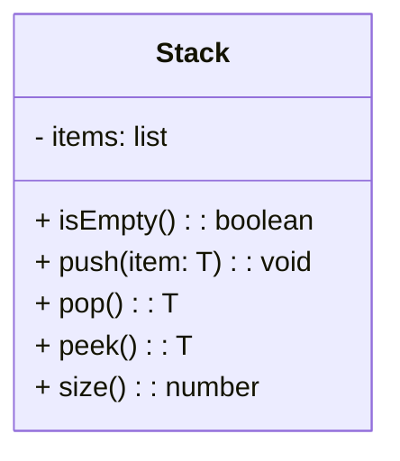
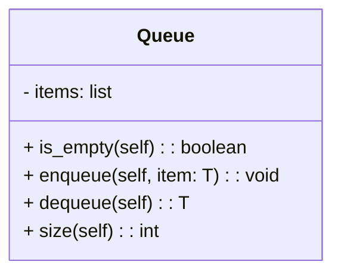
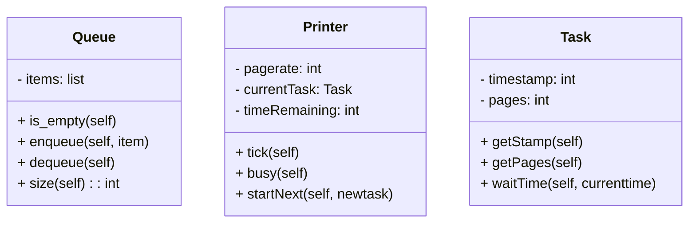

# 20240305-Week3-基本数据结构


Updated 2200 GMT+8 March 17, 2024

2024 spring, Complied by Hongfei Yan


说明：

1）栈（stack）和队列（queue）是两个容易理解的数据结构，但一旦开始学习它们，就像打开了潘多拉魔盒一样，会引出很多相关的题目。此外三月的树（3月12日植树节）近在咫尺，注定三月份会迎来惊涛骇浪。Plan: March Tree, April Graph, May Review, June Excellent work. 

2月份拉平大家Python编程技术，3月份树为主，4月份图为主，5月份复习，6月份优秀！

2）3月1日Canvas开了，5位助教/我负责批改大家的作业（已经分配好），前3次作业的截止时间都是3月12日 23:59，之后每周作业都是下周二23:59截止（就是每次作业持续一周）。

3）assignment3 是三月份月考题目（简单dp,greedy,递归等6个题目），3月6日17:00发布。


**本周发布作业：**

todo: assignment3, https://github.com/GMyhf/2024spring-cs201


目标：

- 会用类实现Stack, Queue，为了笔试。但是实际编程时候，直接使用系统的list, queue更好，OJ支持.

- 理解基础线性数据结构的性能——时间复杂度，如：list, set, dict.
- 理解前序、中序和后序表达式.
- 掌握Shunting Yard 算法，是一种使用栈将中序表达式转换成后序表达式的算法.
- 使用栈来计算后序表达式，培养题目关联的习惯，如：哈夫曼编码，与 stack 实现 波兰表达式 类似；快排与二叉树搜索树.
- 链表（LinkedList）实现，为笔试，更为3月12日（植树节）树的理解做准备.
- 掌握经典题目：如 八皇后、约瑟夫.
- 能读懂长一点的程序，能看懂UML类图，如：模拟打印机，理解其中的随机产生数就是生成OJ测试数据的方法.

# 一、基本数据结构及其编程题目

**What Are Linear Structures?**

We will begin our study of data structures by considering four simple but very powerful concepts. Stacks, queues, deques, and lists are examples of data collections whose items are ordered depending on how they are added or removed. Once an item is added, it stays in that position relative to the other elements that came before and came after it. Collections such as these are often referred to as **linear data structures**.

Linear structures can be thought of as having two ends. Sometimes these ends are referred to as the “left” and the “right” or in some cases the “front” and the “rear.” You could also call them the “top” and the “bottom.” The names given to the ends are not significant. What distinguishes one linear structure from another is the way in which items are added and removed, in particular the location where these additions and removals occur. For example, a structure might allow new items to be added at only one end. Some structures might allow items to be removed from either end.

These variations give rise to some of the most useful data structures in computer science. They appear in many algorithms and can be used to solve a variety of important problems.


**What is a Stack?**

A **stack** (sometimes called a “push-down stack”) is an ordered collection of items where the addition of new items and the removal of existing items always takes place at the same end. This end is commonly referred to as the “top.” The end opposite the top is known as the “base.”

The base of the stack is significant since items stored in the stack that are closer to the base represent those that have been in the stack the longest. The most recently added item is the one that is in position to be removed first. This ordering principle is sometimes called **LIFO**, **last-in first-out**. It provides an ordering based on length of time in the collection. Newer items are near the top, while older items are near the base.

Many examples of stacks occur in everyday situations. Almost any cafeteria has a stack of trays or plates where you take the one at the top, uncovering a new tray or plate for the next customer in line.


**What Is a Queue?**

A queue is an ordered collection of items where the addition of new items happens at one end, called the “rear,” and the removal of existing items occurs at the other end, commonly called the “front.” As an element enters the queue it starts at the rear and makes its way toward the front, waiting until that time when it is the next element to be removed.

The most recently added item in the queue must wait at the end of the collection. The item that has been in the collection the longest is at the front. This ordering principle is sometimes called **FIFO**, **first-in first-out**. It is also known as “first-come first-served.”


**线性表**是一种逻辑结构，描述了元素按线性顺序排列的规则。常见的线性表存储方式有**数组**和**链表**，它们在不同场景下具有各自的优势和劣势。

数组是一种连续存储结构，它将线性表的元素按照一定的顺序依次存储在内存中的连续地址空间上。数组需要预先分配一定的内存空间，每个元素占用相同大小的内存空间，并可以通过索引来进行快速访问和操作元素。访问元素的时间复杂度为O(1)，因为可以直接计算元素的内存地址。然而，插入和删除元素的时间复杂度较高，平均为O(n)，因为需要移动其他元素来保持连续存储的特性。

**链表**是一种存储结构，它是线性表的链式存储方式。链表通过节点的相互链接来实现元素的存储。每个节点包含元素本身以及指向下一个节点的指针。链表的插入和删除操作非常高效，时间复杂度为O(1)，因为只需要调整节点的指针。然而，访问元素的时间复杂度较高，平均为O(n)，因为必须从头节点开始遍历链表直到找到目标元素。

选择使用数组还是链表作为存储方式取决于具体问题的需求和限制。如果需要频繁进行随机访问操作，数组是更好的选择。如果需要频繁进行插入和删除操作，链表更适合。通过了解它们的特点和性能，可以根据实际情况做出选择。


在Python中，list 更接近于数组的存储结构。


## 概念题目练习

### OJ04099: 队列和栈

http://cs101.openjudge.cn/practice/04099/

队列和栈是两种重要的数据结构，它们具有push k和pop操作。push k是将数字k加入到队列或栈中，pop则是从队列和栈取一个数出来。队列和栈的区别在于取数的位置是不同的。

队列是先进先出的：把队列看成横向的一个通道，则push k是将k放到队列的最右边，而pop则是从队列的最左边取出一个数。

栈是后进先出的：把栈也看成横向的一个通道，则push k是将k放到栈的最右边，而pop也是从栈的最右边取出一个数。

假设队列和栈当前从左至右都含有1和2两个数，则执行push 5和pop操作示例图如下：

​     push 5     pop

队列 1 2 -------> 1 2 5 ------> 2 5

​     push 5     pop

栈  1 2 -------> 1 2 5 ------> 1 2

现在，假设队列和栈都是空的。给定一系列push k和pop操作之后，输出队列和栈中存的数字。若队列或栈已经空了，仍然接收到pop操作，则输出error。


**输入**

第一行为m，表示有m组测试输入，m<100。
每组第一行为n，表示下列有n行push k或pop操作。（n<150）
接下来n行，每行是push k或者pop，其中k是一个整数。
（输入保证同时在队列或栈中的数不会超过100个）

**输出**

对每组测试数据输出两行，正常情况下，第一行是队列中从左到右存的数字，第二行是栈中从左到右存的数字。若操作过程中队列或栈已空仍然收到pop，则输出error。输出应该共2*m行。

样例输入

```
2
4
push 1
push 3
pop
push 5
1
pop
```

样例输出

```
3 5
1 5
error
error
```


"若操作过程中队列或栈已空仍然收到pop，则输出error。输出应该共`2*m`行"。就是：如果错了，先输出error，然后把正确的输出，凑够`2*m`。

```python
m = int(input())
for _ in range(m):
    queue = []
    stack = []
    error = False
    n = int(input())
    for _ in range(n):
        operation = input().split()
        if operation[0] == 'push':
            queue.append(int(operation[1]))
            stack.append(int(operation[1]))
        elif operation[0] == 'pop':
            if queue:
                queue.pop(0)
            else:
                error = True
            if stack:
                stack.pop()
            else:
                error = True
    if error:
        print('error')
        print('error')
    else:
        print(' '.join(map(str, queue)))
        print(' '.join(map(str, stack)))
```


### OJ02694:波兰表达式。要求用stack实现

http://cs101.openjudge.cn/practice/02694/

### OJ22068:合法出栈序列

http://cs101.openjudge.cn/practice/22068/


**What Is a Deque?**

A **deque**, also known as a double-ended queue, is an ordered collection of items similar to the queue. It has two ends, a front and a rear, and the items remain positioned in the collection. What makes a deque different is the unrestrictive nature of adding and removing items. New items can be added at either the front or the rear. Likewise, existing items can be removed from either end. In a sense, this hybrid linear structure provides all the capabilities of stacks and queues in a single data structure. 


# 1. The Stack Abstract Data Type

The stack abstract data type is defined by the following structure and operations. A stack is structured, as described above, as an ordered collection of items where items are added to and removed from the end called the “top.” Stacks are ordered LIFO. The stack operations are given below.

- `Stack()` creates a new stack that is empty. It needs no parameters and returns an empty stack.
- `push(item)` adds a new item to the top of the stack. It needs the item and returns nothing.
- `pop()` removes the top item from the stack. It needs no parameters and returns the item. The stack is modified.
- `peek()` returns the top item from the stack but does not remove it. It needs no parameters. The stack is not modified.
- `isEmpty()` tests to see whether the stack is empty. It needs no parameters and returns a boolean value.
- `size()` returns the number of items on the stack. It needs no parameters and returns an integer.

For example, if `s` is a stack that has been created and starts out empty, then Table 1 shows the results of a sequence of stack operations. Under stack contents, the top item is listed at the far right.


Table 1: Sample Stack Operations

| **Stack Operation** | **Stack Contents**   | **Return Value** |
| :------------------ | :------------------- | :--------------- |
| `s.isEmpty()`       | `[]`                 | `True`           |
| `s.push(4)`         | `[4]`                |                  |
| `s.push('dog')`     | `[4,'dog']`          |                  |
| `s.peek()`          | `[4,'dog']`          | `'dog'`          |
| `s.push(True)`      | `[4,'dog',True]`     |                  |
| `s.size()`          | `[4,'dog',True]`     | `3`              |
| `s.isEmpty()`       | `[4,'dog',True]`     | `False`          |
| `s.push(8.4)`       | `[4,'dog',True,8.4]` |                  |
| `s.pop()`           | `[4,'dog',True]`     | `8.4`            |
| `s.pop()`           | `[4,'dog']`          | `True`           |
| `s.size()`          | `[4,'dog']`          | `2`              |


## 1.1 Implementing a Stack in Python

Now that we have clearly defined the stack as an abstract data type we will turn our attention to using Python to implement the stack. Recall that when we give an abstract data type a physical implementation we refer to the implementation as a data structure.

As we described in Chapter 1, in Python, as in any object-oriented programming language, the implementation of choice for an abstract data type such as a stack is the creation of a new class. The stack operations are implemented as methods. Further, to implement a stack, which is a collection of elements, it makes sense to utilize the power and simplicity of the primitive collections provided by Python. We will use a list.




```python
class Stack:
    def __init__(self):
        self.items = []
    
    def is_empty(self):
        return self.items == []
    
    def push(self, item):
        self.items.append(item)
    
    def pop(self):
        return self.items.pop()
    
    def peek(self):
        return self.items[len(self.items)-1]
    
    def size(self):
        return len(self.items)

s = Stack()

print(s.is_empty())
s.push(4)
s.push('dog')

print(s.peek())
s.push(True)
print(s.size())
print(s.is_empty())
s.push(8.4)
print(s.pop())
print(s.pop())
print(s.size())

"""
True
dog
3
False
8.4
True
2
"""
```


要求自己会用类实现Stack，但是实际编程时候，直接使用系统的list更好。

```python
#function rev_string(my_str) that uses a stack to reverse the characters in a string.
def rev_string(my_str):
    s = [] # Stack()
    rev = []
    for c in my_str:
        s.append(c) # push(c)

    #while not s.is_empty():
    while s:
        rev.append(s.pop())
    return "".join(rev)

test_string = "cutie"

print(rev_string(test_string))

# output: eituc
    
```


## 1.2 匹配括号

We now turn our attention to using stacks to solve real computer science problems. You have no doubt written arithmetic expressions such as

(5+6)∗(7+8)/(4+3)

where parentheses are used to order the performance of operations. You may also have some experience programming in a language such as Lisp with constructs like

```
(defun square(n)
     (* n n))
```

This defines a function called `square` that will return the square of its argument `n`. Lisp is notorious for using lots and lots of parentheses.

In both of these examples, parentheses must appear in a balanced fashion. **Balanced parentheses** means that each opening symbol has a corresponding closing symbol and the pairs of parentheses are properly nested. Consider the following correctly balanced strings of parentheses:

```
(()()()())

(((())))

(()((())()))
```

Compare those with the following, which are not balanced:

```
((((((())

()))

(()()(()
```

The ability to differentiate between parentheses that are correctly balanced and those that are unbalanced is an important part of recognizing many programming language structures.

The challenge then is to write an algorithm that will read a string of parentheses from left to right and decide whether the symbols are balanced. To solve this problem we need to make an important observation. As you process symbols from left to right, the most recent opening parenthesis must match the next closing symbol (see Figure 4). Also, the first opening symbol processed may have to wait until the very last symbol for its match. Closing symbols match opening symbols in the reverse order of their appearance; they match from the inside out. This is a clue that stacks can be used to solve the problem.


Figure 4: Matching Parentheses


```python
#returns a boolean result as to whether the string of parentheses is balanced
def par_checker(symbol_string):
    s = [] # Stack()
    balanced = True
    index = 0
    while index < len(symbol_string) and balanced:
        symbol = symbol_string[index]
        if symbol == "(":
            s.append(symbol) # push(symbol)
        else:
            #if s.is_empty():
            if not s:
                balanced = False
            else:
                s.pop()
        index = index + 1
    
    #if balanced and s.is_empty():
    if balanced and not s:
        return True
    else:
        return False

print(par_checker('((()))'))
print(par_checker('(()'))

# True
# False
```


### 1.2.1 Balanced Symbols (A General Case)

The balanced parentheses problem shown above is a specific case of a more general situation that arises in many programming languages. The general problem of balancing and nesting different kinds of opening and closing symbols occurs frequently. For example, in Python square brackets, `[` and `]`, are used for lists; curly braces, `{` and `}`, are used for dictionaries; and parentheses, `(` and `)`, are used for tuples and arithmetic expressions. It is possible to mix symbols as long as each maintains its own open and close relationship. Strings of symbols such as

```
{ { ( [ ] [ ] ) } ( ) }

[ [ { { ( ( ) ) } } ] ]

[ ] [ ] [ ] ( ) { }
```

are properly balanced in that not only does each opening symbol have a corresponding closing symbol, but the types of symbols match as well.

Compare those with the following strings that are not balanced:

```
( [ ) ]

( ( ( ) ] ) )

[ { ( ) ]
```

The simple parentheses checker from the previous section can easily be extended to handle these new types of symbols. Recall that each opening symbol is simply pushed on the stack to wait for the matching closing symbol to appear later in the sequence. When a closing symbol does appear, the only difference is that we must check to be sure that it correctly matches the type of the opening symbol on top of the stack. If the two symbols do not match, the string is not balanced. Once again, if the entire string is processed and nothing is left on the stack, the string is correctly balanced.


```python
def par_checker(symbol_string):
    s = [] # Stack()
    balanced = True
    index = 0 
    while index < len(symbol_string) and balanced:
        symbol = symbol_string[index] 
        if symbol in "([{":
            s.append(symbol) # push(symbol)
        else:
            top = s.pop()
            if not matches(top, symbol):
                balanced = False
        index += 1
        #if balanced and s.is_empty():
        if balanced and not s:
            return True 
        else:
            return False
        
def matches(open, close):
    opens = "([{"
    closes = ")]}"
    return opens.index(open) == closes.index(close)

print(par_checker('{{}}[]]'))

# output: False
```


#### OJ03704: 括号匹配问题

stack, http://cs101.openjudge.cn/practice/03704

在某个字符串（长度不超过100）中有左括号、右括号和大小写字母；规定（与常见的算数式子一样）任何一个左括号都从内到外与在它右边且距离最近的右括号匹配。写一个程序，找到无法匹配的左括号和右括号，输出原来字符串，并在下一行标出不能匹配的括号。不能匹配的左括号用"$"标注，不能匹配的右括号用"?"标注.

**输入**

输入包括多组数据，每组数据一行，包含一个字符串，只包含左右括号和大小写字母，**字符串长度不超过100**
**注意：cin.getline(str,100)最多只能输入99个字符！**

**输出**

对每组输出数据，输出两行，第一行包含原始输入字符，第二行由"\$","?"和空格组成，"$"和"?"表示与之对应的左括号和右括号不能匹配。

样例输入

```
((ABCD(x)
)(rttyy())sss)(
```

样例输出

```
((ABCD(x)
$$
)(rttyy())sss)(
?            ?$
```


```python
# https://www.cnblogs.com/huashanqingzhu/p/6546598.html

lines = []
while True:
    try:
        lines.append(input())
    except EOFError:
        break
    
ans = []
for s in lines:
    stack = []
    Mark = []
    for i in range(len(s)):
        if s[i] == '(':
            stack.append(i)
            Mark += ' '
        elif s[i] == ')':
            if len(stack) == 0:
                Mark += '?'
            else:
                Mark += ' '
                stack.pop()
        else:
            Mark += ' '
    
    while(len(stack)):
        Mark[stack[-1]] = '$'
        stack.pop()
    
    print(s)
    print(''.join(map(str, Mark)))
```


## 1.3 进制转换

### 1.3.1 将十进制数转换成二进制数

In your study of computer science, you have probably been exposed in one way or another to the idea of a binary number. Binary representation is important in computer science since all values stored within a computer exist as a string of binary digits, a string of 0s and 1s. Without the ability to convert back and forth between common representations and binary numbers, we would need to interact with computers in very awkward ways.

Integer values are common data items. They are used in computer programs and computation all the time. We learn about them in math class and of course represent them using the decimal number system, or base 10. The decimal number $233_{10}$ and its corresponding binary equivalent $11101001_2$ are interpreted respectively as

$2×10^2+3×10^1+3×10^0$

and

$1×2^7+1×2^6+1×2^5+0×2^4+1×2^3+0×2^2+0×2^1+1×2^0$

But how can we easily convert integer values into binary numbers? The answer is an algorithm called “Divide by 2” that uses a stack to keep track of the digits for the binary result.

The Divide by 2 algorithm assumes that we start with an integer greater than 0. A simple iteration then continually divides the decimal number by 2 and keeps track of the remainder. The first division by 2 gives information as to whether the value is even or odd. An even value will have a remainder of 0. It will have the digit 0 in the ones place. An odd value will have a remainder of 1 and will have the digit 1 in the ones place. We think about building our binary number as a sequence of digits; the first remainder we compute will actually be the last digit in the sequence. As shown in Figure 5, we again see the reversal property that signals that a stack is likely to be the appropriate data structure for solving the problem.


Figure 5: Decimal-to-Binary Conversion


```python
def divide_by_2(dec_num):
    rem_stack = [] # Stack()
    
    while dec_num > 0:
        rem  = dec_num % 2
        rem_stack.append(rem) # push(rem)
        dec_num = dec_num // 2
    
    bin_string = ""
    #while not rem_stack.is_empty():
    while rem_stack:
        bin_string = bin_string + str(rem_stack.pop())
        
    return bin_string

print(divide_by_2(233))

# output: 11101001
```


```python
def base_converter(dec_num, base):
    digits = "0123456789ABCDEF"
    
    rem_stack = [] # Stack()
    
    while dec_num > 0:
        rem = dec_num % base
        #rem_stack.push(rem)
        rem_stack.append(rem)
        dec_num = dec_num // base
        
    new_string = ""
    #while not rem_stack.is_empty():
    while rem_stack:
        new_string = new_string + digits[rem_stack.pop()]
        
    return new_string

print(base_converter(25, 2))
print(base_converter(2555, 16))

# 11001
# 9FB
```


#### OJ02734: 十进制到八进制

http://cs101.openjudge.cn/practice/02734/

把一个十进制正整数转化成八进制。

**输入**

一行，仅含一个十进制表示的整数a(0 < a < 65536)。

**输出**

一行，a的八进制表示。

样例输入

`9`

样例输出

`11`


使用栈来实现十进制到八进制的转换可以通过不断除以8并将余数压入栈中的方式来实现。然后，将栈中的元素依次出栈，构成八进制数的各个位。

```python
decimal = int(input())  # 读取十进制数

# 创建一个空栈
stack = []

# 特殊情况：如果输入的数为0，直接输出0
if decimal == 0:
    print(0)
else:
    # 不断除以8，并将余数压入栈中
    while decimal > 0:
        remainder = decimal % 8
        stack.append(remainder)
        decimal = decimal // 8

    # 依次出栈，构成八进制数的各个位
    octal = ""
    while stack:
        octal += str(stack.pop())

    print(octal)
```


## 1.4 中序、前序和后序表达式

When you write an arithmetic expression such as B * C, the form of the expression provides you with information so that you can interpret it correctly. In this case we know that the variable B is being multiplied by the variable C since the multiplication operator * appears between them in the expression. This type of notation is referred to as **infix** since the operator is *in between* the two operands that it is working on.

Consider another infix example, A + B * C. The operators + and * still appear between the operands, but there is a problem. Which operands do they work on? Does the + work on A and B or does the * take B and C? The expression seems ambiguous.

In fact, you have been reading and writing these types of expressions for a long time and they do not cause you any problem. The reason for this is that you know something about the operators + and *. Each operator has a **precedence** level. Operators of higher precedence are used before operators of lower precedence. The only thing that can change that order is the presence of parentheses. The precedence order for arithmetic operators places multiplication and division above addition and subtraction. If two operators of equal precedence appear, then a left-to-right ordering or associativity is used.

Let’s interpret the troublesome expression A + B * C using operator precedence. B and C are multiplied first, and A is then added to that result. (A + B) * C would force the addition of A and B to be done first before the multiplication. In expression A + B + C, by precedence (via associativity), the leftmost + would be done first.

Although all this may be obvious to you, remember that computers need to know exactly what operators to perform and in what order. One way to write an expression that guarantees there will be no confusion with respect to the order of operations is to create what is called a **fully parenthesized** expression. This type of expression uses one pair of parentheses for each operator. The parentheses dictate the order of operations; there is no ambiguity. There is also no need to remember any precedence rules.

The expression A + B * C + D can be rewritten as ((A + (B * C)) + D) to show that the multiplication happens first, followed by the leftmost addition. A + B + C + D can be written as (((A + B) + C) + D) since the addition operations associate from left to right.

There are two other very important expression formats that may not seem obvious to you at first. Consider the infix expression A + B. What would happen if we moved the operator before the two operands? The resulting expression would be + A B. Likewise, we could move the operator to the end. We would get A B +. These look a bit strange.

These changes to the position of the operator with respect to the operands create two new expression formats, **prefix** and **postfix**. Prefix expression notation requires that all operators precede the two operands that they work on. Postfix, on the other hand, requires that its operators come after the corresponding operands. A few more examples should help to make this a bit clearer (see Table 2).

A + B * C would be written as + A * B C in prefix. The multiplication operator comes immediately before the operands B and C, denoting that * has precedence over +. The addition operator then appears before the A and the result of the multiplication.

In postfix, the expression would be A B C * +. Again, the order of operations is preserved since the * appears immediately after the B and the C, denoting that * has precedence, with + coming after. Although the operators moved and now appear either before or after their respective operands, the order of the operands stayed exactly the same relative to one another.

Table 2: Exmples of Infix, Prefix, and Postfix

| **Infix Expression** | **Prefix Expression** | **Postfix Expression** |
| :------------------- | :-------------------- | :--------------------- |
| A + B                | + A B                 | A B +                  |
| A + B * C            | + A * B C             | A B C * +              |

Now consider the infix expression (A + B) * C. Recall that in this case, infix requires the parentheses to force the performance of the addition before the multiplication. However, when A + B was written in prefix, the addition operator was simply moved before the operands, + A B. The result of this operation becomes the first operand for the multiplication. The multiplication operator is moved in front of the entire expression, giving us * + A B C. Likewise, in postfix A B + forces the addition to happen first. The multiplication can be done to that result and the remaining operand C. The proper postfix expression is then A B + C *.

Consider these three expressions again (see Table 3). Something very important has happened. Where did the parentheses go? Why don’t we need them in prefix and postfix? The answer is that the operators are no longer ambiguous with respect to the operands that they work on. Only infix notation requires the additional symbols. The order of operations within prefix and postfix expressions is completely determined by the position of the operator and nothing else. In many ways, this makes infix the least desirable notation to use.


Table 3: An Expression with Parentheses

| **Infix Expression** | **Prefix Expression** | **Postfix Expression** |
| :------------------- | :-------------------- | :--------------------- |
| (A + B) * C          | * + A B C             | A B + C *              |

Table 4 shows some additional examples of infix expressions and the equivalent prefix and postfix expressions. Be sure that you understand how they are equivalent in terms of the order of the operations being performed.

Table 4: Additional Examples of Infix, Prefix and Postfix

| **Infix Expression** | **Prefix Expression** | **Postfix Expression** |
| :------------------- | :-------------------- | :--------------------- |
| A + B * C + D        | + + A * B C D         | A B C * + D +          |
| (A + B) * (C + D)    | * + A B + C D         | A B + C D + *          |
| A * B + C * D        | + * A B * C D         | A B * C D * +          |
| A + B + C + D        | + + + A B C D         | A B + C + D +          |


### 1.4.1 Conversion of Infix Expressions to Prefix and Postfix

So far, we have used ad hoc methods to convert between infix expressions and the equivalent prefix and postfix expression notations. As you might expect, there are algorithmic ways to perform the conversion that allow any expression of any complexity to be correctly transformed.

The first technique that we will consider uses the notion of a fully parenthesized expression that was discussed earlier. Recall that A + B * C can be written as (A + (B * C)) to show explicitly that the multiplication has precedence over the addition. On closer observation, however, you can see that each parenthesis pair also denotes the beginning and the end of an operand pair with the corresponding operator in the middle.

Look at the right parenthesis in the subexpression (B * C) above. If we were to move the multiplication symbol to that position and remove the matching left parenthesis, giving us B C *, we would in effect have converted the subexpression to postfix notation. If the addition operator were also moved to its corresponding right parenthesis position and the matching left parenthesis were removed, the complete postfix expression would result (see Figure 6).


Figure 6: Moving Operators to the Right for Postfix Notation

If we do the same thing but instead of moving the symbol to the position of the right parenthesis, we move it to the left, we get prefix notation (see Figure 7). The position of the parenthesis pair is actually a clue to the final position of the enclosed operator.


Figure 7: Moving Operators to the Left for Prefix Notation

So in order to convert an expression, no matter how complex, to either prefix or postfix notation, fully parenthesize the expression using the order of operations. Then move the enclosed operator to the position of either the left or the right parenthesis depending on whether you want prefix or postfix notation.

Here is a more complex expression: (A + B) * C - (D - E) * (F + G). Figure 8 shows the conversion to postfix and prefix notations.


Figure 8: Converting a Complex Expression to Prefix and Postfix Notations


### 1.4.2 通用的中缀转后缀算法

We need to develop an algorithm to convert any infix expression to a postfix expression. To do this we will look closer at the conversion process.

Consider once again the expression A + B * C. As shown above, A B C * + is the postfix equivalent. We have already noted that the operands A, B, and C stay in their relative positions. It is only the operators that change position. Let’s look again at the operators in the infix expression. The first operator that appears from left to right is +. However, in the postfix expression, + is at the end since the next operator, *, has precedence over addition. The order of the operators in the original expression is reversed in the resulting postfix expression.

As we process the expression, the operators have to be saved somewhere since their corresponding right operands are not seen yet. Also, the order of these saved operators may need to be reversed due to their precedence. This is the case with the addition and the multiplication in this example. Since the addition operator comes before the multiplication operator and has lower precedence, it needs to appear after the multiplication operator is used. Because of this reversal of order, it makes sense to consider using a stack to keep the operators until they are needed.

What about (A + B) * C? Recall that A B + C * is the postfix equivalent. Again, processing this infix expression from left to right, we see + first. In this case, when we see *, + has already been placed in the result expression because it has precedence over * by virtue of the parentheses. We can now start to see how the conversion algorithm will work. When we see a left parenthesis, we will save it to denote that another operator of high precedence will be coming. That operator will need to wait until the corresponding right parenthesis appears to denote its position (recall the fully parenthesized technique). When that right parenthesis does appear, the operator can be popped from the stack.

As we scan the infix expression from left to right, we will use a stack to keep the operators. This will provide the reversal that we noted in the first example. The top of the stack will always be the most recently saved operator. Whenever we read a new operator, we will need to consider how that operator compares in precedence with the operators, if any, already on the stack.

Assume the infix expression is a string of tokens delimited by spaces. The operator tokens are *, /, +, and -, along with the left and right parentheses, ( and ). The operand tokens are the single-character identifiers A, B, C, and so on. The following steps will produce a string of tokens in postfix order.

1. Create an empty stack called `opstack` for keeping operators. Create an empty list for output.
2. Convert the input infix string to a list by using the string method `split`.
3. Scan the token list from left to right.
   - If the token is an operand, append it to the end of the output list.
   - If the token is a left parenthesis, push it on the `opstack`.
   - If the token is a right parenthesis, pop the `opstack` until the corresponding left parenthesis is removed. Append each operator to the end of the output list.
   - If the token is an operator, *, /, +, or -, push it on the `opstack`. However, first remove any operators already on the `opstack` that have higher or equal precedence and append them to the output list.
4. When the input expression has been completely processed, check the `opstack`. Any operators still on the stack can be removed and appended to the end of the output list.


```python
def infixToPostfix(infixexpr):
    prec = {}
    prec["*"] = 3
    prec["/"] = 3
    prec["+"] = 2
    prec["-"] = 2
    prec["("] = 1
    opStack = [] # Stack()
    postfixList = []
    tokenList = infixexpr.split()

    for token in tokenList:
        if token in "ABCDEFGHIJKLMNOPQRSTUVWXYZ" or token in "0123456789":
            postfixList.append(token)
        elif token == '(':
            #opStack.push(token)
            opStack.append(token)
        elif token == ')':
            topToken = opStack.pop()
            while topToken != '(':
                postfixList.append(topToken)
                topToken = opStack.pop()
        else:
            #while (not opStack.is_empty()) and (prec[opStack.peek()] >= prec[token]):
            while opStack and (prec[opStack[-1]] >= prec[token]):
                postfixList.append(opStack.pop())
            #opStack.push(token)
            opStack.append(token)

    #while not opStack.is_empty():
    while opStack:
        postfixList.append(opStack.pop())
    return " ".join(postfixList)

print(infixToPostfix("A * B + C * D"))
print(infixToPostfix("( A + B ) * C - ( D - E ) * ( F + G )"))

print(infixToPostfix("( A + B ) * ( C + D )"))
print(infixToPostfix("( A + B ) * C"))
print(infixToPostfix("A + B * C"))

"""
A B * C D * +
A B + C * D E - F G + * -
A B + C D + *
A B + C *
A B C * +
"""
```


#### OJ24591:中序表达式转后序表达式

http://cs101.openjudge.cn/practice/24591/

中序表达式是运算符放在两个数中间的表达式。乘、除运算优先级高于加减。可以用"()"来提升优先级 --- 就是小学生写的四则算术运算表达式。中序表达式可用如下方式递归定义：

1）一个数是一个中序表达式。该表达式的值就是数的值。

2) 若a是中序表达式，则"(a)"也是中序表达式(引号不算)，值为a的值。
3) 若a,b是中序表达式，c是运算符，则"acb"是中序表达式。"acb"的值是对a和b做c运算的结果，且a是左操作数，b是右操作数。

输入一个中序表达式，要求转换成一个后序表达式输出。

**输入**

第一行是整数n(n<100)。接下来n行，每行一个中序表达式，数和运算符之间没有空格，长度不超过700。

**输出**

对每个中序表达式，输出转成后序表达式后的结果。后序表达式的数之间、数和运算符之间用一个空格分开。

样例输入

```
3
7+8.3 
3+4.5*(7+2)
(3)*((3+4)*(2+3.5)/(4+5)) 
```

样例输出

```
7 8.3 +
3 4.5 7 2 + * +
3 3 4 + 2 3.5 + * 4 5 + / *
```

来源: Guo wei


Shunting yard algorightm（调度场算法）是一种用于将中缀表达式转换为后缀表达式的算法。它由荷兰计算机科学家 Edsger Dijkstra 在1960年代提出，用于解析和计算数学表达式。


Shunting Yard 算法的主要思想是使用两个栈（运算符栈和输出栈）来处理表达式的符号。算法按照运算符的优先级和结合性，将符号逐个处理并放置到正确的位置。最终，输出栈中的元素就是转换后的后缀表达式。

以下是 Shunting Yard 算法的基本步骤：

1. 初始化运算符栈和输出栈为空。
2. 从左到右遍历中缀表达式的每个符号。
   - 如果是操作数（数字），则将其添加到输出栈。
   - 如果是左括号，则将其推入运算符栈。
   - 如果是运算符：
     - 如果运算符的优先级大于运算符栈顶的运算符，或者运算符栈顶是左括号，则将当前运算符推入运算符栈。
     - 否则，将运算符栈顶的运算符弹出并添加到输出栈中，直到满足上述条件（或者运算符栈为空）。
     - 将当前运算符推入运算符栈。
   - 如果是右括号，则将运算符栈顶的运算符弹出并添加到输出栈中，直到遇到左括号。将左括号弹出但不添加到输出栈中。
3. 如果还有剩余的运算符在运算符栈中，将它们依次弹出并添加到输出栈中。
4. 输出栈中的元素就是转换后的后缀表达式。


接收浮点数，是number buffer技巧。

```python
def infix_to_postfix(expression):
    precedence = {'+':1, '-':1, '*':2, '/':2}
    stack = []
    postfix = []
    number = ''

    for char in expression:
        if char.isnumeric() or char == '.':
            number += char
        else:
            if number:
                num = float(number)
                postfix.append(int(num) if num.is_integer() else num)
                number = ''
            if char in '+-*/':
                while stack and stack[-1] in '+-*/' and precedence[char] <= precedence[stack[-1]]:
                    postfix.append(stack.pop())
                stack.append(char)
            elif char == '(':
                stack.append(char)
            elif char == ')':
                while stack and stack[-1] != '(':
                    postfix.append(stack.pop())
                stack.pop()

    if number:
        num = float(number)
        postfix.append(int(num) if num.is_integer() else num)

    while stack:
        postfix.append(stack.pop())

    return ' '.join(str(x) for x in postfix)

n = int(input())
for _ in range(n):
    expression = input()
    print(infix_to_postfix(expression))
```


接收数据，还可以用re处理。

```python
# 24591:中序表达式转后序表达式
# http://cs101.openjudge.cn/practice/24591/

def inp(s):
    #s=input().strip()
    import re
    s=re.split(r'([\(\)\+\-\*\/])',s)
    s=[item for item in s if item.strip()]
    return s

exp = "(3)*((3+4)*(2+3.5)/(4+5)) "
print(inp(exp))
```


### 1.4.3 Postfix Evaluation

As a final stack example, we will consider the evaluation of an expression that is already in postfix notation. In this case, a stack is again the data structure of choice. However, as you scan the postfix expression, it is the operands that must wait, not the operators as in the conversion algorithm above. Another way to think about the solution is that whenever an operator is seen on the input, the two most recent operands will be used in the evaluation.

```python
def postfixEval(postfixExpr):
    operandStack = []
    tokenList = postfixExpr.split()

    for token in tokenList:
        if token in "0123456789":
            operandStack.append(int(token))
        else:
            operand2 = operandStack.pop()
            operand1 = operandStack.pop()
            result = doMath(token,operand1,operand2)
            operandStack.append(result)
    return operandStack.pop()

def doMath(op, op1, op2):
    if op == "*":
        return op1 * op2
    elif op == "/":
        return op1 / op2
    elif op == "+":
        return op1 + op2
    else:
        return op1 - op2

print(postfixEval('7 8 + 3 2 + /'))

# output: 3.0
```


#### OJ24588: 后序表达式求值

http://cs101.openjudge.cn/practice/24588/

后序表达式由操作数和运算符构成。操作数是整数或小数，运算符有 + - * / 四种，其中 * / 优先级高于 + -。后序表达式可用如下方式递归定义：

1) 一个操作数是一个后序表达式。该表达式的值就是操作数的值。
2) 若a,b是后序表达式，c是运算符，则"a b c"是后序表达式。“a b c”的值是 (a) c (b),即对a和b做c运算，且a是第一个操作数，b是第二个操作数。下面是一些后序表达式及其值的例子(操作数、运算符之间用空格分隔)：

3.4       值为：3.4
5        值为：5
5 3.4 +     值为：5 + 3.4
5 3.4 + 6 /   值为：(5+3.4)/6
5 3.4 + 6 * 3 + 值为：(5+3.4)*6+3


**输入**

第一行是整数n(n<100)，接下来有n行，每行是一个后序表达式，长度不超过1000个字符

**输出**

对每个后序表达式，输出其值，保留小数点后面2位

样例输入

```
3
5 3.4 +
5 3.4 + 6 /
5 3.4 + 6 * 3 +
```

样例输出

```
8.40
1.40
53.40
```

来源: Guo wei


要解决这个问题，需要理解如何计算后序表达式。后序表达式的计算可以通过使用一个栈来完成，按照以下步骤：

1. 从左到右扫描后序表达式。
2. 遇到数字时，将其压入栈中。
3. 遇到运算符时，从栈中弹出两个数字，先弹出的是右操作数，后弹出的是左操作数。将这两个数字进行相应的运算，然后将结果压入栈中。
4. 当表达式扫描完毕时，栈顶的数字就是表达式的结果。

```python
def evaluate_postfix(expression):
    stack = []
    tokens = expression.split()
    
    for token in tokens:
        if token in '+-*/':
            # 弹出栈顶的两个元素
            right_operand = stack.pop()
            left_operand = stack.pop()
            # 执行运算
            if token == '+':
                stack.append(left_operand + right_operand)
            elif token == '-':
                stack.append(left_operand - right_operand)
            elif token == '*':
                stack.append(left_operand * right_operand)
            elif token == '/':
                stack.append(left_operand / right_operand)
        else:
            # 将操作数转换为浮点数后入栈
            stack.append(float(token))
    
    # 栈顶元素就是表达式的结果
    return stack[0]

# 读取输入行数
n = int(input())

# 对每个后序表达式求值
for _ in range(n):
    expression = input()
    result = evaluate_postfix(expression)
    # 输出结果，保留两位小数
    print(f"{result:.2f}")
```

这个程序将读取输入行数，然后对每行输入的后序表达式求值，并按要求保留两位小数输出结果。


## 1.5 经典八皇后用递归或者栈实现

### OJ02754: 八皇后

dfs and similar, http://cs101.openjudge.cn/practice/02754

描述：会下国际象棋的人都很清楚：皇后可以在横、竖、斜线上不限步数地吃掉其他棋子。如何将8个皇后放在棋盘上（有8 * 8个方格），使它们谁也不能被吃掉！这就是著名的八皇后问题。
		对于某个满足要求的8皇后的摆放方法，定义一个皇后串a与之对应，即$a=b_1b_2...b_8~$,其中$b_i$为相应摆法中第i行皇后所处的列数。已经知道8皇后问题一共有92组解（即92个不同的皇后串）。
		给出一个数b，要求输出第b个串。串的比较是这样的：皇后串x置于皇后串y之前，当且仅当将x视为整数时比y小。

​	八皇后是一个古老的经典问题：**如何在一张国际象棋的棋盘上，摆放8个皇后，使其任意两个皇后互相不受攻击。**该问题由一位德国**国际象棋排局家** **Max Bezzel** 于 1848年提出。严格来说，那个年代，还没有“德国”这个国家，彼时称作“普鲁士”。1850年，**Franz Nauck** 给出了第一个解，并将其扩展成了“ **n皇后** ”问题，即**在一张 n** x **n 的棋盘上，如何摆放 n 个皇后，使其两两互不攻击**。历史上，八皇后问题曾惊动过“数学王子”高斯(Gauss)，而且正是 Franz Nauck 写信找高斯请教的。

**输入**

第1行是测试数据的组数n，后面跟着n行输入。每组测试数据占1行，包括一个正整数b(1 ≤  b ≤  92)

**输出**

输出有n行，每行输出对应一个输入。输出应是一个正整数，是对应于b的皇后串。

样例输入

```
2
1
92
```

样例输出

```
15863724
84136275
```


先给出两个dfs回溯实现的八皇后，接着给出两个stack迭代实现的八皇后。

八皇后思路：回溯算法通过尝试不同的选择，逐步构建解决方案，并在达到某个条件时进行回溯，以找到所有的解决方案。从第一行第一列开始放置皇后，然后在每一行的不同列都放置，如果与前面不冲突就继续，有冲突则回到上一行继续下一个可能性。

```python
def solve_n_queens(n):
    solutions = []  # 存储所有解决方案的列表
    queens = [-1] * n  # 存储每一行皇后所在的列数
    
    def backtrack(row):
        if row == n:  # 找到一个合法解决方案
            solutions.append(queens.copy())
        else:
            for col in range(n):
                if is_valid(row, col):  # 检查当前位置是否合法
                    queens[row] = col  # 在当前行放置皇后
                    backtrack(row + 1)  # 递归处理下一行
                    queens[row] = -1  # 回溯，撤销当前行的选择
    
    def is_valid(row, col):
        for r in range(row):
            if queens[r] == col or abs(row - r) == abs(col - queens[r]):
                return False
        return True
    
    backtrack(0)  # 从第一行开始回溯
    
    return solutions


# 获取第 b 个皇后串
def get_queen_string(b):
    solutions = solve_n_queens(8)
    if b > len(solutions):
        return None
    queen_string = ''.join(str(col + 1) for col in solutions[b - 1])
    return queen_string


test_cases = int(input())  # 输入的测试数据组数
for _ in range(test_cases):
    b = int(input())  # 输入的 b 值
    queen_string = get_queen_string(b)
    print(queen_string)
```


```python
def is_safe(board, row, col):
    # 检查当前位置是否安全
    # 检查同一列是否有皇后
    for i in range(row):
        if board[i] == col:
            return False
    # 检查左上方是否有皇后
    i = row - 1
    j = col - 1
    while i >= 0 and j >= 0:
        if board[i] == j:
            return False
        i -= 1
        j -= 1
    # 检查右上方是否有皇后
    i = row - 1
    j = col + 1
    while i >= 0 and j < 8:
        if board[i] == j:
            return False
        i -= 1
        j += 1
    return True

def queen_dfs(board, row):
    if row == 8:
        # 找到第b个解，将解存储到result列表中
        ans.append(''.join([str(x+1) for x in board]))
        return
    for col in range(8):
        if is_safe(board, row, col):
            # 当前位置安全，放置皇后
            board[row] = col
            # 继续递归放置下一行的皇后
            queen_dfs(board, row + 1)
            # 回溯，撤销当前位置的皇后
            board[row] = 0

ans = []
queen_dfs([None]*8, 0)
#print(ans)
for _ in range(int(input())):
    print(ans[int(input()) - 1])
```


如果要使用栈来实现八皇后问题，可以采用迭代的方式，模拟递归的过程。在每一步迭代中，使用栈来保存状态，并根据规则进行推进和回溯。

```python
def queen_stack(n):
    stack = []  # 用于保存状态的栈
    solutions = [] # 存储所有解决方案的列表

    stack.append((0, []))  # 初始状态为第一行，所有列都未放置皇后,栈中的元素是 (row, queens) 的元组

    while stack:
        row, cols = stack.pop() # 从栈中取出当前处理的行数和已放置的皇后位置
        if row == n:    # 找到一个合法解决方案
            solutions.append(cols)
        else:
            for col in range(n):
                if is_valid(row, col, cols): # 检查当前位置是否合法
                    stack.append((row + 1, cols + [col]))

    return solutions

def is_valid(row, col, queens):
    for r in range(row):
        if queens[r] == col or abs(row - r) == abs(col - queens[r]):
            return False
    return True


# 获取第 b 个皇后串
def get_queen_string(b):
    solutions = queen_stack(8)
    if b > len(solutions):
        return None
    b = len(solutions) + 1 - b

    queen_string = ''.join(str(col + 1) for col in solutions[b - 1])
    return queen_string

test_cases = int(input())  # 输入的测试数据组数
for _ in range(test_cases):
    b = int(input())  # 输入的 b 值
    queen_string = get_queen_string(b)
    print(queen_string)
```


```python
def solve_n_queens(n):
    stack = []  # 用于保存状态的栈
    solutions = []  # 存储所有解决方案的列表

    stack.append((0, [-1] * n))  # 初始状态为第一行，所有列都未放置皇后

    while stack:
        row, queens = stack.pop()

        if row == n:  # 找到一个合法解决方案
            solutions.append(queens.copy())
        else:
            for col in range(n):
                if is_valid(row, col, queens):  # 检查当前位置是否合法
                    new_queens = queens.copy()
                    new_queens[row] = col  # 在当前行放置皇后
                    stack.append((row + 1, new_queens))  # 推进到下一行

    return solutions


def is_valid(row, col, queens):
    for r in range(row):
        if queens[r] == col or abs(row - r) == abs(col - queens[r]):
            return False
    return True


# 获取第 b 个皇后串
def get_queen_string(b):
    solutions = solve_n_queens(8)
    if b > len(solutions):
        return None
    b = len(solutions) + 1 - b

    queen_string = ''.join(str(col + 1) for col in solutions[b - 1])
    return queen_string


test_cases = int(input())  # 输入的测试数据组数
for _ in range(test_cases):
    b = int(input())  # 输入的 b 值
    queen_string = get_queen_string(b)
    print(queen_string)

```


# 2. The Queue Abstract Data Type

Like a stack, the queue is a linear data structure that stores items in a First In First Out (FIFO) manner. With a queue, the least recently added item is removed first. A good example of a queue is any queue of consumers for a resource where the consumer that came first is served first.


Operations associated with queue are: 

- Enqueue: Adds an item to the queue. If the queue is full, then it is said to be an Overflow condition – Time Complexity : O(1)
- Dequeue: Removes an item from the queue. The items are popped in the same order in which they are pushed. If the queue is empty, then it is said to be an Underflow condition – Time Complexity : O(1)
- Front: Get the front item from queue – Time Complexity : O(1)
- Rear: Get the last item from queue – Time Complexity : O(1)


The queue abstract data type is defined by the following structure and operations. A queue is structured, as described above, as an ordered collection of items which are added at one end, called the “rear,” and removed from the other end, called the “front.” Queues maintain a FIFO ordering property. The queue operations are given below.

- `Queue()` creates a new queue that is empty. It needs no parameters and returns an empty queue.
- `enqueue(item)` adds a new item to the rear of the queue. It needs the item and returns nothing.
- `dequeue()` removes the front item from the queue. It needs no parameters and returns the item. The queue is modified.
- `isEmpty()` tests to see whether the queue is empty. It needs no parameters and returns a boolean value.
- `size()` returns the number of items in the queue. It needs no parameters and returns an integer.

As an example, if we assume that `q` is a queue that has been created and is currently empty, then [Table 1](https://runestone.academy/ns/books/published/pythonds/BasicDS/TheQueueAbstractDataType.html#tbl-queueoperations) shows the results of a sequence of queue operations. The queue contents are shown such that the front is on the right. 4 was the first item enqueued so it is the first item returned by dequeue.


| **Queue Operation** | **Queue Contents**   | **Return Value** |
| :------------------ | :------------------- | :--------------- |
| `q.isEmpty()`       | `[]`                 | `True`           |
| `q.enqueue(4)`      | `[4]`                |                  |
| `q.enqueue('dog')`  | `['dog',4]`          |                  |
| `q.enqueue(True)`   | `[True,'dog',4]`     |                  |
| `q.size()`          | `[True,'dog',4]`     | `3`              |
| `q.isEmpty()`       | `[True,'dog',4]`     | `False`          |
| `q.enqueue(8.4)`    | `[8.4,True,'dog',4]` |                  |
| `q.dequeue()`       | `[8.4,True,'dog']`   | `4`              |
| `q.dequeue()`       | `[8.4,True]`         | `'dog'`          |
| `q.size()`          | `[8.4,True]`         | `2`              |


## 2.1 Implementing a Queue in Python

It is again appropriate to create a new class for the implementation of the abstract data type queue. As before, we will use the power and simplicity of the list collection to build the internal representation of the queue.

We need to decide which end of the list to use as the rear and which to use as the front. The implementation shown in Listing 1 assumes that the rear is at position 0 in the list. This allows us to use the `insert` function on lists to add new elements to the rear of the queue. The `pop` operation can be used to remove the front element (the last element of the list). Recall that this also means that enqueue will be O(n) and dequeue will be O(1).




Listing 1

```python
class Queue:
    def __init__(self):
        self.items = []

    def is_empty(self):
        return self.items == []

    def enqueue(self, item):
        self.items.insert(0, item)

    def dequeue(self):
        return self.items.pop()

    def size(self):
        return len(self.items)


q = Queue()

q.enqueue('hello')
q.enqueue('dog')
q.enqueue(3)
print(q.items)

q.dequeue()
print(q.items)
# output:
# [3, 'dog', 'hello']
# [3, 'dog']
```


**Q:** Suppose you have the following series of queue operations.

```
q = Queue()
q.enqueue('hello')
q.enqueue('dog')
q.enqueue(3)
q.dequeue()
```

What items are left on the queue? (B)

A. 'hello', 'dog'
**B. 'dog', 3**
C. 'hello', 3
D. 'hello', 'dog', 3


## 2.2 OJ02746: 约瑟夫问题

implementation, http://cs101.openjudge.cn/practice/02746

约瑟夫问题：有ｎ只猴子，按顺时针方向围成一圈选大王（编号从１到ｎ），从第１号开始报数，一直数到ｍ，数到ｍ的猴子退出圈外，剩下的猴子再接着从1开始报数。就这样，直到圈内只剩下一只猴子时，这个猴子就是猴王，编程求输入ｎ，ｍ后，输出最后猴王的编号。

**输入**

每行是用空格分开的两个整数，第一个是 n, 第二个是 m ( 0 < m,n <=300)。最后一行是：

0 0

**输出**

对于每行输入数据（最后一行除外)，输出数据也是一行，即最后猴王的编号

样例输入

```
6 2
12 4
8 3
0 0
```

样例输出

```
5
1
7
```


说明：使用 队列queue 这种数据结构会方便。它有三种实现方式，我们最常用的 list 就支持，说明，https://www.geeksforgeeks.org/queue-in-python/


用list实现队列，O(n)

```python
# 先使用pop从列表中取出，如果不符合要求再append回列表，相当于构成了一个圈
def hot_potato(name_list, num):
    queue = []
    for name in name_list:
        queue.append(name)

    while len(queue) > 1:
        for i in range(num):
            queue.append(queue.pop(0))	# O(N)
        queue.pop(0)										# O(N)
    return queue.pop(0)									# O(N)


while True:
    n, m = map(int, input().split())
    if {n,m} == {0}:
        break
    monkey = [i for i in range(1, n+1)]
    print(hot_potato(monkey, m-1))

```


用内置deque，O(1)

```python
from collections import deque

# 先使用pop从列表中取出，如果不符合要求再append回列表，相当于构成了一个圈
def hot_potato(name_list, num):
    queue = deque()
    for name in name_list:
        queue.append(name)

    while len(queue) > 1:
        for i in range(num):
            queue.append(queue.popleft()) # O(1)
        queue.popleft()
    return queue.popleft()


while True:
    n, m = map(int, input().split())
    if {n,m} == {0}:
        break
    monkey = [i for i in range(1, n+1)]
    print(hot_potato(monkey, m-1))
```


## 2.3 模拟器打印机

一个更有趣的例子是模拟打印任务队列。学生向共享打印机发送打印请求，这些打印任务被存在一个队列中，并且按照先到先得的顺序执行。这样的设定可能导致很多问题。其中最重要的是，打印机能否处理一定量的工作。如果不能，学生可能会由于等待过长时间而错过
要上的课。
考虑计算机科学实验室里的这样一个场景：在任何给定的一小时内，实验室里都有约 10 个学生。他们在这一小时内最多打印 2 次，并且打印的页数从 1 到 20 不等。实验室的打印机比较老旧，每分钟只能以低质量打印 10 页。可以将打印质量调高，但是这样做会导致打印机每分钟只能打印 5 页。降低打印速度可能导致学生等待过长时间。那么，应该如何设置打印速度呢？
可以通过构建一个实验室模型来解决该问题。我们需要为学生、打印任务和打印机构建对象，如图 3-15 所示。当学生提交打印任务时，我们需要将它们加入等待列表中，该列表是打印机上的打印任务队列。当打印机执行完一个任务后，它会检查该队列，看看其中是否还有需要处理的任务。我们感兴趣的是学生平均需要等待多久才能拿到打印好的文章。这个时间等于打印任务在队列中的平均等待时间。


Figure 4: Computer Science Laboratory Printing Queue

在模拟时，需要应用一些概率学知识。举例来说，学生打印的文章可能有 1~20 页。如果各页数出现的概率相等，那么打印任务的实际时长可以通过 1~20 的一个随机数来模拟。
如果实验室里有 10 个学生，并且在一小时内每个人都打印两次，那么每小时平均就有 20 个打印任务。在任意一秒，创建一个打印任务的概率是多少？回答这个问题需要考虑任务与时间的比值。每小时 20 个任务相当于每 180 秒 1 个任务。


$\frac {20\ tasks}{1\ hour} \times \frac {1\ hour}  {60\ minutes} \times \frac {1\ minute} {60\ seconds}=\frac {1\ task} {180\ seconds}$


1．主要模拟步骤
下面是主要的模拟步骤。
(1) 创建一个打印任务队列。每一个任务到来时都会有一个时间戳。一开始，队列是空的。

(2) 针对每一秒（currentSecond），执行以下操作。
❏ 是否有新创建的打印任务？如果是，以currentSecond作为其时间戳并将该任务加入到队列中。
❏ 如果打印机空闲，并且有正在等待执行的任务，执行以下操作：
■ 从队列中取出第一个任务并提交给打印机；
■ 用currentSecond减去该任务的时间戳，以此计算其等待时间；
■ 将该任务的等待时间存入一个列表，以备后用；
■ 根据该任务的页数，计算执行时间。
❏ 打印机进行一秒的打印，同时从该任务的执行时间中减去一秒。
❏ 如果打印任务执行完毕，或者说任务需要的时间减为0，则说明打印机回到空闲状态。

(3) 当模拟完成之后，根据等待时间列表中的值计算平均等待时间。

2. Python实现
    我们创建3个类：Printer、Task和PrintQueue。它们分别模拟打印机、打印任务和队列。

Printer类需要检查当前是否有待完成的任务。如果有，那么打印机就处于工作状态（busy方法），并且其工作所需的时间可以通过要打印的页数来计算。其构造方法会初始化打印速度，即每分钟打印多少页。tick方法会减量计时，并且在执行完任务之后将打印机设置成空闲状态None。

Task类代表单个打印任务。当任务被创建时，随机数生成器会随机提供页数，取值范围是1～20。我们使用random模块中的randrange函数来生成随机数。





代码清单3-11 Printer类

```python
import random

class Queue:
    def __init__(self):
        self.items = []

    def is_empty(self):
        return self.items == []

    def enqueue(self, item):
        self.items.insert(0, item)

    def dequeue(self):
        return self.items.pop()

    def size(self):
        return len(self.items)


class Printer:
    def __init__(self, ppm):
        self.pagerate = ppm
        self.currentTask = None
        self.timeRemaining = 0

    def tick(self):
        if self.currentTask != None:
            self.timeRemaining = self.timeRemaining - 1
            if self.timeRemaining <= 0:
                self.currentTask = None

    def busy(self):
        if self.currentTask != None:
            return True
        else:
            return False

    def startNext(self, newtask):
        self.currentTask = newtask
        self.timeRemaining = newtask.getPages() * 60 / self.pagerate


class Task:
    def __init__(self, time):
        self.timestamp = time
        self.pages = random.randrange(1, 21)

    def getStamp(self):
        return self.timestamp

    def getPages(self):
        return self.pages

    def waitTime(self, currenttime):
        return currenttime - self.timestamp


def simulation(numSeconds, pagesPerMinute):
    labprinter = Printer(pagesPerMinute)
    printQueue = Queue()
    waitingtimes = []

    for currentSecond in range(numSeconds):

        if newPrintTask():
            task = Task(currentSecond)
            printQueue.enqueue(task)

        if (not labprinter.busy()) and (not printQueue.is_empty()):
            nexttask = printQueue.dequeue()
            waitingtimes.append(nexttask.waitTime(currentSecond))
            labprinter.startNext(nexttask)

        labprinter.tick()

    averageWait = sum(waitingtimes) / len(waitingtimes)
    print("Average Wait %6.2f secs %3d tasks remaining." % (averageWait, printQueue.size()))


def newPrintTask():
    num = random.randrange(1, 181)
    if num == 180:
        return True
    else:
        return False


for i in range(10):
    simulation(3600, 10) # 设置总时间和打印机每分钟打印多少页

"""
Average Wait  20.05 secs   0 tasks remaining.
Average Wait  20.12 secs   0 tasks remaining.
Average Wait  28.32 secs   0 tasks remaining.
Average Wait   7.65 secs   0 tasks remaining.
Average Wait  13.17 secs   1 tasks remaining.
Average Wait  45.97 secs   0 tasks remaining.
Average Wait  14.94 secs   0 tasks remaining.
Average Wait   1.81 secs   0 tasks remaining.
Average Wait   0.00 secs   0 tasks remaining.
Average Wait   6.71 secs   0 tasks remaining.
"""
```


每一个任务都需要保存一个时间戳，用于计算等待时间。这个时间戳代表任务被创建并放入打印任务队列的时间。 waitTime 方法可以获得任务在队列中等待的时间。

主模拟程序simulation实现了之前描述的算法。 printQueue 对象是队列抽象数据类型的实例。布尔辅助函数newPrintTask判断是否有新创建的打印任务。我们再一次使用random模块中的 randrange 函数来生成随机数，不过这一次的取值范围是 1~180。平均每 180 秒有一个打印任务。通过从随机数中选取 180，可以模拟这个随机事件。

每次模拟的结果不一定相同。对此，我们不需要在意。这是由于随机数的本质导致的。我们感兴趣的是当参数改变时结果出现的趋势。

首先，模拟 60 分钟（ 3600 秒）内打印速度为每分钟 5 页。并且，我们进行 10 次这样的模拟。由于模拟中使用了随机数，因此每次返回的结果都不同。
在模拟 10 次之后，可以看到平均等待时间是 122.092 秒，并且等待时间的差异较大，从最短的 17.27 秒到最长的 376.05 秒。此外，只有 2 次在给定时间内完成了所有任务。
现在把打印速度改成每分钟 10 页，然后再模拟 10 次。由于加快了打印速度，因此我们希望一小时内能完成更多打印任务。


3. 讨论
在之前的内容中，我们试图解答这样一个问题：如果提高打印质量并降低打印速度，打印机能否及时完成所有任务？我们编写了一个程序来模拟随机提交的打印任务，待打印的页数也是随机的。

上面的输出结果显示，按每分钟5页的打印速度，任务的等待时间在17.27秒和376.05秒之间，相差约6分钟。提高打印速度之后，等待时间在1.29秒和28.96秒之间。此外，在每分钟5页的速度下，10次模拟中有8次没有按时完成所有任务。

可见，降低打印速度以提高打印质量，并不是明智的做法。学生不能等待太长时间，当他们要赶去上课时尤其如此。6分钟的等待时间实在是太长了。

这种模拟分析能帮助我们回答很多“如果”问题。只需改变参数，就可以模拟感兴趣的任意行为。以下是几个例子。
  ❏ 如果实验室里的学生增加到20个，会怎么样？
  ❏ 如果是周六，学生不需要上课，他们是否愿意等待？
  ❏ 如果每个任务的页数变少了，会怎么样？

这些问题都能通过修改本例中的模拟程序来解答。但是，模拟的准确度取决于它所基于的假设和参数。真实的打印任务数量和学生数目是准确构建模拟程序必不可缺的数据。


# 3. 双端队列

与栈和队列不同的是，双端队列的限制很少。双端队列是与队列类似的有序集合。它有一前、一后两端，元素在其中保持自己的位置。与队列不同的是，双端队列对在哪一端添加和移除元素没有任何限制。新元素既可以被添加到前端，也可以被添加到后端。同理，已有的元素也能从任意一端移除。

The deque abstract data type is defined by the following structure and operations. A deque is structured, as described above, as an ordered collection of items where items are added and removed from either end, either front or rear. The deque operations are given below.

- `Deque()` creates a new deque that is empty. It needs no parameters and returns an empty deque.
- `addFront(item)` adds a new item to the front of the deque. It needs the item and returns nothing.
- `addRear(item)` adds a new item to the rear of the deque. It needs the item and returns nothing.
- `removeFront()` removes the front item from the deque. It needs no parameters and returns the item. The deque is modified.
- `removeRear()` removes the rear item from the deque. It needs no parameters and returns the item. The deque is modified.
- `isEmpty()` tests to see whether the deque is empty. It needs no parameters and returns a boolean value.
- `size()` returns the number of items in the deque. It needs no parameters and returns an integer.

As an example, if we assume that `d` is a deque that has been created and is currently empty, then Table {dequeoperations} shows the results of a sequence of deque operations. Note that the contents in front are listed on the right. It is very important to keep track of the front and the rear as you move items in and out of the collection as things can get a bit confusing.


| **Deque Operation** | **Deque Contents**         | **Return Value** |
| :------------------ | :------------------------- | :--------------- |
| `d.isEmpty()`       | `[]`                       | `True`           |
| `d.addRear(4)`      | `[4]`                      |                  |
| `d.addRear('dog')`  | `['dog',4,]`               |                  |
| `d.addFront('cat')` | `['dog',4,'cat']`          |                  |
| `d.addFront(True)`  | `['dog',4,'cat',True]`     |                  |
| `d.size()`          | `['dog',4,'cat',True]`     | `4`              |
| `d.isEmpty()`       | `['dog',4,'cat',True]`     | `False`          |
| `d.addRear(8.4)`    | `[8.4,'dog',4,'cat',True]` |                  |
| `d.removeRear()`    | `['dog',4,'cat',True]`     | `8.4`            |
| `d.removeFront()`   | `['dog',4,'cat']`          | `True`           |


## 3.1 实现双端队列


```python
class Deque:
    def __init__(self):
        self.items = []

    def isEmpty(self):
        return self.items == []

    def addFront(self, item):
        self.items.append(item)

    def addRear(self, item):
        self.items.insert(0, item)

    def removeFront(self):
        return self.items.pop()

    def removeRear(self):
        return self.items.pop(0)

    def size(self):
        return len(self.items)


d = Deque()
print(d.isEmpty())
d.addRear(4)
d.addRear('dog')
d.addFront('cat')
d.addFront(True)
print(d.size())
print(d.isEmpty())
d.addRear(8.4)
print(d.removeRear())
print(d.removeFront())
"""
True
4
False
8.4
True
"""
```

在双端队列的Python实现中，在前端进行的添加操作和移除操作的时间复杂度是O(1)，在后端的则是O( )n。


## 05902: 双端队列

http://cs101.openjudge.cn/practice/05902/

定义一个双端队列，进队操作与普通队列一样，从队尾进入。出队操作既可以从队头，也可以从队尾。编程实现这个数据结构。

**输入**
第一行输入一个整数t，代表测试数据的组数。
每组数据的第一行输入一个整数n，表示操作的次数。
接着输入n行，每行对应一个操作，首先输入一个整数type。
当type=1，进队操作，接着输入一个整数x，表示进入队列的元素。
当type=2，出队操作，接着输入一个整数c，c=0代表从队头出队，c=1代表从队尾出队。
n <= 1000

**输出**
对于每组测试数据，输出执行完所有的操作后队列中剩余的元素,元素之间用空格隔开，按队头到队尾的顺序输出，占一行。如果队列中已经没有任何的元素，输出NULL。

样例输入

```
2
5
1 2
1 3
1 4
2 0
2 1
6
1 1
1 2
1 3
2 0
2 1
2 0
```

样例输出

```
3
NULL
```


```python
from collections import deque

for _ in range(int(input())):
    n=int(input())
    q=deque([])
    for i in range(n):
        a,b=map(int,input().split())
        if a==1:
            q.append(b)
        else:
            if b==0:
                q.popleft()
            else:
                q.pop()
    if q:
        print(*q)
    else:
        print('NULL')
```


## 04067: 回文数字（Palindrome Number）

http://cs101.openjudge.cn/practice/04067/

给出一系列非负整数，判断是否是一个回文数。回文数指的是正着写和倒着写相等的数。

**输入**

若干行，每行是一个非负整数（不超过99999999）

**输出**

对每行输入，如果其是一个回文数，输出YES。否则输出NO。

样例输入

```
11
123
0
14277241
67945497
```

样例输出

```
YES
NO
YES
YES
NO
```


Use the deque from the collections module. The is_palindrome function checks if a number is a palindrome by converting it to a string, storing it in a deque, and then comparing the first and last elements until the deque is empty or only contains one element.

```python
from collections import deque

def is_palindrome(num):
    num_str = str(num)
    num_deque = deque(num_str)
    while len(num_deque) > 1:
        if num_deque.popleft() != num_deque.pop():
            return "NO"
    return "YES"

while True:
    try:
        num = int(input())
        print(is_palindrome(num))
    except EOFError:
        break
```


## 04099: 队列和栈

http://cs101.openjudge.cn/practice/04099/

```python
from collections import deque
for _ in range(int(input())):
    queue = deque()
    stack = deque()
    stop = False
    for _ in range(int(input())):
        s = input()
        if s=='pop':
            try:
                queue.popleft()
                stack.pop()
            except IndexError:
                stop = True
        else:
            a = int(s.split()[1])
            queue.append(a)
            stack.append(a)
    if not stop:
        print(' '.join(list(map(str,queue))))
        print(' '.join(list(map(str,stack))))
    elif stop:
        print('error')
        print('error')
```


# 4. LinkedList 链表

链表是一种常见的数据结构，用于存储和组织数据。它由一系列节点组成，每个节点包含一个数据元素和一个指向下一个节点（或前一个节点）的指针。

在链表中，每个节点都包含两部分：

1. 数据元素（或数据项）：这是节点存储的实际数据。可以是任何数据类型，例如整数、字符串、对象等。

2. 指针（或引用）：该指针指向链表中的下一个节点（或前一个节点）。它们用于建立节点之间的连接关系，从而形成链表的结构。

根据指针的类型和连接方式，链表可以分为不同类型，包括：

1. 单向链表（单链表）：每个节点只有一个指针，指向下一个节点。链表的头部指针指向第一个节点，而最后一个节点的指针为空（指向 `None`）。

2. 双向链表：每个节点有两个指针，一个指向前一个节点，一个指向后一个节点。双向链表可以从头部或尾部开始遍历，并且可以在任意位置插入或删除节点。

3. 循环链表：最后一个节点的指针指向链表的头部，形成一个环形结构。循环链表可以从任意节点开始遍历，并且可以无限地循环下去。

链表相对于数组的一个重要特点是，链表的大小可以动态地增长或缩小，而不需要预先定义固定的大小。这使得链表在需要频繁插入和删除元素的场景中更加灵活。

然而，链表的访问和搜索操作相对较慢，因为需要遍历整个链表才能找到目标节点。与数组相比，链表的优势在于插入和删除操作的效率较高，尤其是在操作头部或尾部节点时。因此，链表在需要频繁插入和删除元素而不关心随机访问的情况下，是一种常用的数据结构。


> 
>
> 在 Python 中，`list` 是使用动态数组（Dynamic Array）实现的，而不是链表。动态数组是一种连续的、固定大小的内存块，可以在需要时自动调整大小。这使得 `list` 支持快速的随机访问和高效的尾部操作，例如附加（append）和弹出（pop）。
>
> 与链表不同，动态数组中的元素在内存中是连续存储的。这允许通过索引在 `list` 中的任何位置进行常数时间（O(1)）的访问。此外，动态数组还具有较小的内存开销，因为它们不需要为每个元素存储额外的指针。
>
> 当需要在 `list` 的中间进行插入或删除操作时，动态数组需要进行元素的移动，因此这些操作的时间复杂度是线性的（O(n)）。如果频繁地插入或删除元素，而不仅仅是在尾部进行操作，那么链表可能更适合，因为链表的插入和删除操作在平均情况下具有常数时间复杂度。
>
> 总结起来，Python 中的 `list` 是使用动态数组实现的，具有支持快速随机访问和高效尾部操作的优点。但是，如果需要频繁进行插入和删除操作，可能需要考虑使用链表或其他数据结构。
>
> 
>
> Python 中的 list 和 C++ 中的 STL（Standard Template Library）中的 vector 具有相似的实现和用法。vector 也是使用动态数组实现的，提供了类似于 list 的功能，包括随机访问、尾部插入和删除等操作。
>
> 
>
> 链表在某种意义上可以给树打基础。


## 4.1 单向链表实现

```python
class Node:
    def __init__(self, value):
        self.value = value
        self.next = None

class LinkedList:
    def __init__(self):
        self.head = None

    def insert(self, value):
        new_node = Node(value)
        if self.head is None:
            self.head = new_node
        else:
            current = self.head
            while current.next:
                current = current.next
            current.next = new_node

    def delete(self, value):
        if self.head is None:
            return

        if self.head.value == value:
            self.head = self.head.next
        else:
            current = self.head
            while current.next:
                if current.next.value == value:
                    current.next = current.next.next
                    break
                current = current.next

    def display(self):
        current = self.head
        while current:
            print(current.value, end=" ")
            current = current.next
        print()

# 使用示例
linked_list = LinkedList()
linked_list.insert(1)
linked_list.insert(2)
linked_list.insert(3)
linked_list.display()  # 输出：1 2 3
linked_list.delete(2)
linked_list.display()  # 输出：1 3
```


## 4.2 双向链表实现

```python
class Node:
    def __init__(self, value):
        self.value = value
        self.prev = None
        self.next = None

class DoublyLinkedList:
    def __init__(self):
        self.head = None
        self.tail = None

    def insert_before(self, node, new_node):
        if node is None:  # 如果链表为空，将新节点设置为头部和尾部
            self.head = new_node
            self.tail = new_node
        else:
            new_node.next = node
            new_node.prev = node.prev
            if node.prev is not None:
                node.prev.next = new_node
            else:  # 如果在头部插入新节点，更新头部指针
                self.head = new_node
            node.prev = new_node

    def display_forward(self):
        current = self.head
        while current is not None:
            print(current.value, end=" ")
            current = current.next
        print()

    def display_backward(self):
        current = self.tail
        while current is not None:
            print(current.value, end=" ")
            current = current.prev
        print()

# 使用示例
linked_list = DoublyLinkedList()

# 创建节点
node1 = Node(1)
node2 = Node(2)
node3 = Node(3)

# 将节点插入链表
linked_list.insert_before(None, node1)  # 在空链表中插入节点1
linked_list.insert_before(node1, node2)  # 在节点1前插入节点2
linked_list.insert_before(node1, node3)  # 在节点1前插入节点3

# 显示链表内容
linked_list.display_forward()  # 输出：3 2 1
linked_list.display_backward()  # 输出：1 2 3
```

在这个示例中，定义了一个 `Node` 类表示双向链表中的节点。每个节点都有一个 `value` 值，以及一个指向前一个节点的 `prev` 指针和一个指向后一个节点的 `next` 指针。

`DoublyLinkedList` 类表示双向链表，它具有 `head` 和 `tail` 两个指针，分别指向链表的头部和尾部。可以使用 `insert_before` 方法在给定节点 `node` 的前面插入新节点 `new_node`。如果 `node` 为 `None`，表示在空链表中插入新节点，将新节点设置为头部和尾部。否则，将新节点的 `next` 指针指向 `node`，将新节点的 `prev` 指针指向 `node.prev`，并更新相邻节点的指针，把新节点插入到链表中。

`display_forward` 方法用于正向遍历并显示链表中的所有节点。它从头部开始，依次打印每个节点的值。

`display_backward` 方法用于反向遍历并显示链表中的所有节点。它从尾部开始，依次打印每个节点的值。

在示例的最后，创建了一个空的 `DoublyLinkedList` 对象，并创建了三个节点 `node1`、`node2` 和 `node3`。然后，我们按照顺序将这些节点插入到链表中，并调用 `display_forward` 和 `display_backward` 方法来显示链表的内容。输出结果应为 `3 2 1` 和 `1 2 3`，分别表示正向和反向遍历链表时节点的值。


## 4.3 颠倒链表

http://dsbpython.openjudge.cn/dspythonbook/P0040/

程序填空题目，需要掌握“补充代码”题型，例如写出某个函数的实现代码，如 def reverse(self):

```python
class Node:
    def __init__(self, data, next=None):
        self.data, self.next = data, next

class LinkList:
    def __init__(self, lst):
        self.head = Node(lst[0])
        p = self.head
        for i in lst[1:]:
            node = Node(i)
            p.next = node
            p = p.next

    def reverse(self):  # 填空：实现函数
        prev = None
        curr = self.head
        while curr:
            next_node = curr.next
            curr.next = prev
            prev = curr
            curr = next_node
        self.head = prev

    def print(self):
        p = self.head
        while p:
            print(p.data, end=" ")
            p = p.next
        print()

a = list(map(int, input().split()))
a = LinkList(a)
a.reverse()
a.print()
```


## 4.4 删除链表元素

http://dsbpython.openjudge.cn/dspythonbook/P0020/

程序填空题目，需要掌握“补充代码”题型，例如写出某个函数的实现代码，如 def remove(self,data):

```python
class Node:
    def __init__(self, data, next=None):
        self.data, self.next = data, next


class LinkList:  # 循环链表
    def __init__(self):
        self.tail = None
        self.size = 0

    def isEmpty(self):
        return self.size == 0

    def pushFront(self, data):
        nd = Node(data)
        if self.tail == None:
            self.tail = nd
            nd.next = self.tail
        else:
            nd.next = self.tail.next
            self.tail.next = nd
        self.size += 1

    def pushBack(self, data):
        self.pushFront(data)
        self.tail = self.tail.next

    def popFront(self):
        if self.size == 0:
            return None
        else:
            nd = self.tail.next
            self.size -= 1
            if self.size == 0:
                self.tail = None
            else:
                self.tail.next = nd.next
        return nd.data

    def printList(self):
        if self.size > 0:
            ptr = self.tail.next
            while True:
                print(ptr.data, end=" ")
                if ptr == self.tail:
                    break
                ptr = ptr.next
            print("")

    def remove(self, data):  # 填空：实现函数
        if self.size == 0:
            return None
        else:
            ptr = self.tail
            while ptr.next.data != data:
                ptr = ptr.next
                if ptr == self.tail:
                    return False
            self.size -= 1
            if ptr.next == self.tail:
                self.tail = ptr
            ptr.next = ptr.next.next
            return True


t = int(input())
for i in range(t):
    lst = list(map(int, input().split()))
    lkList = LinkList()
    for x in lst:
        lkList.pushBack(x)
    lst = list(map(int, input().split()))
    for a in lst:
        result = lkList.remove(a)
        if result == True:
            lkList.printList()
        elif result == False:
            print("NOT FOUND")
        else:
            print("EMPTY")
    print("----------------")

"""
样例输入
2
1 2 3
3 2 2 9 5 1 1 4
1
9 88 1 23

样例输出
1 2 
1 
NOT FOUND
NOT FOUND
NOT FOUND
EMPTY
EMPTY
----------------
NOT FOUND
NOT FOUND
EMPTY
----------------
"""
```


## 4.5 插入链表元素

http://dsbpython.openjudge.cn/2024allhw/004/

程序填空题目，需要掌握“补充代码”题型，例如写出某个函数的实现代码，如 def insertCat(self):

```python
class Node:
    def __init__(self, data, next=None):
        self.data, self.next = data, next

class LinkList:
    def __init__(self):
        self.head = None

    def initList(self, data):
        self.head = Node(data[0])
        p = self.head
        for i in data[1:]:
            node = Node(i)
            p.next = node
            p = p.next

    def insertCat(self):
        # 计算链表的长度
        length = 0
        p = self.head
        while p:
            length += 1
            p = p.next

        # 找到插入位置
        position = length // 2 if length % 2 == 0 else (length // 2) + 1
        p = self.head
        for _ in range(position - 1):
            p = p.next

        # 在插入位置处插入数字6
        node = Node(6)
        node.next = p.next
        p.next = node

    def printLk(self):
        p = self.head
        while p:
            print(p.data, end=" ")
            p = p.next
        print()

lst = list(map(int, input().split()))
lkList = LinkList()
lkList.initList(lst)
lkList.insertCat()
lkList.printLk()

"""
### 样例输入1
8 1 0 9 7 5
### 样例输入2
1 2 3

### 样例输出1
8 1 0 6 9 7 5
### 样例输出2
1 2 6 3
"""
```


# 5 其他

## 5.1 练习写类——运算符的实现

http://dsbpython.openjudge.cn/2024allhw/002/

程序填空题目，需要掌握“补充代码”题型，例如写出某个函数的实现代码，如 def insertCat(self):

```python
class A:
    def __init__(self, x):
        self.x = x

    def __lt__(self, other):
        if isinstance(other, A):
            return self.x < other.x
        elif isinstance(other, int):
            return self.x < other
        else:
            return NotImplemented

    def __ge__(self, other):
        if isinstance(other, A):
            return self.x >= other.x
        elif isinstance(other, int):
            return self.x >= other
        else:
            return NotImplemented


a, b, c = map(int, input().split())
print(isinstance(A(2), A))
print(A(a) < A(b))
print(A(a) >= A(c))
print(A(a) < c)

"""
1 2 3
True
True
False
True
"""
```


## 5.2 Python语法——复合函数

http://dsbpython.openjudge.cn/2024allhw/001/

下面程序输入一个整数n，输出(n+1)2，请填空

```python
def combine(f,g):
    return lambda x: g(f(x))	# 补充这句代码
def inc(x):
    return x + 1
def square(x):
    return x * x
c  = int(input())
fx = combine(inc,square)
print(fx(c))

"""
3
16
"""
```

**输入**

整数n

**输出**

(n+1)的平方

样例输入

```
3
```

样例输出

```
16
```

提示

返回一个lambda表达式

来源：Guo Wei


**Q.** 双向链表中的每个结点有两个引用域，prev 和 next，分别引用当前结点的前驱与后继，设 p 引用
链表中的一个结点，q 引用一待插入结点，现要求在 p 前插入 q，则正确的插入操作为（ D  ）。
A：p.prev=q; q.next=p; p.prev.next=q; q.prev=p.prev;
B：q.prev=p.prev; p.prev.next=q; q.next=p; p.prev=q.next;
C：q.next=p; p.next=q; p.prev.next=q; q.next=p;
**D：p.prev.next=q; q.next=p; q.prev=p.prev; p.prev=q.**


假设链表是 *A*<−>*B*<−>*C*，要在 B 前插入 Q，那么会得到 *A*<−>*Q*<−>*B*<−>*C*的链表。这是在结点 B 前插入 Q 结点的步骤：

1. `p.prev.next = q;` 这一步是把 p 的前一个结点的 next 指针指向 q。在例子中，是把 A 的 next 指针指向 Q。
2. `q.next = p;` 这一步是把 q 的 next 指针指向 p。在例子中，是把 Q 的 next 指针指向 B。
3. `q.prev = p.prev;` 这一步是把 q 的 prev 指针指向 p 的前一个结点。在例子中，是把 Q 的 prev 指针指向 A。
4. `p.prev = q;` 这一步是把 p 的 prev 指针指向 q。在例子中，是把 B 的 prev 指针指向 Q。


**Q:** 数据结构有三个基本要素:逻辑结构、存储结构以及基于结构定义的行为(运算)。下列概念中( B )属于存储结构。
A:线性表	B:**链表**	C:字符串	D:二叉树


解释：在这些选项中，有些描述的是数据的逻辑结构，而有些是存储结构。逻辑结构指的是数据对象中数据元素之间的相互关系，而存储结构是指数据结构在计算机中的表示（也就是内存中的存储形式）。

A: **线性表** - 这是一种逻辑结构，它描述元素按线性顺序排列的规则。
B: 链表 - 这是一种存储结构，它是线性表的链式存储方式，通过节点的相互链接来实现。

正确答案是 B: 链表，因为它指的是数据的物理存储方式，即内存中的链式存储结构。


**Q:** 线性表的**顺序存储**与**链式存储**是两种常见存储形式；当表元素有序排序进行二分检索时，应采用哪种存储形式？顺序存储 


# 6 关键术语

|                           |                          |                       |
| ------------------------- | ------------------------ | --------------------- |
| balanced parentheses      | data field               | deque                 |
| first-in first-out (FIFO) | fully parenthesized      | head                  |
| infix                     | last-in first-out (LIFO) | linear data structure |
| linked list               | linked list traversal    | list                  |
| node                      | palindrome               | postfix               |
| precedence                | prefix                   | queue                 |
| simulation                | stack                    |                       |


# 二、笔试题目

2022年5个大题：图Dijkstra，二叉树，排序，单链表，二叉树。

2021年6个大题：森林dfs、bfs，哈夫曼树，二叉树建堆，图prim，二叉树遍历，图走迷宫。


## 选择（30分，每题2分）

**Q:** 链表不具有的特点是（ A ）。
**A: 可随机访问任意元素**		B: 插入和删除不需要移动元素
C: 不必事先估计存储空间		D: 所需空间与线性表长度成正比


**Q:** 设有三个元素 X， Y， Z 顺序进栈（进的过程中允许出栈），下列得不到的出栈排列是？（C）

A： XYZ 	B： YZX 	**C： ZXY** 	D： ZYX


**Q:** 允许表达式内多种括号混合嵌套，检查表达式中括号是否正确配对的算法，通常选用? (A)

**A： 栈** 	B： 线性表 	C： 队列 	D： 二叉排序树


**Q:** 设栈 S 和队列 Q 的初始状态为空，元素 a， b， c， d， e 依次通过栈 S，一个元素出栈后即进队列 Q，若 5 个元素出队的序列是 c， e， d， b， a 则栈 S 的容量至少应该是? (C)

A: 2	B: 3	**C: 4**	D:5


**Q:** 为了实现一个循环队列（或称环形队列），采用数组 Q[0..m-1]作为存储结构,其中变量 rear 表示这个循环队列中队尾元素的实际位置，添加结点时按 rear=(rear+1) % m 进行指针移动，变量length 表示当前队列中的元素个数，请问这个循环队列的队列首位元素的实际位置是（ B ）。
A：rear-length	**B：(1+rear+m-length) % m**	C：(rear-length+m) % m	D：m-length


length = rear - head + 1，再对环形队列的特点做调整，得到B。 


**Q:** 判定一个无序表 Q（链表实现）为空的条件是（A）。
**A： Q.head == None**	B： Q == None
C： Q.head == 0	D： Q.head != None


Q不是None，是LinkList类的实例对象


## 判断（10分，每题1分）

对填写"Y"，错填写"N"

**Q:** （Y）考虑一个长度为 n 的顺序表中各个位置插入新元素的概率是相同的，则顺序表的插入算法平均时间复杂度为 O(n) 。

**Q:** （Y）队列是动态集合，其定义的出队列操作所移除的元素总是在集合中存在时间最长的元素。


**Q:** （Y）分治算法通常将原问题分解为几个规模较小但类似于原问题的子问题，并要求算法实现写成某种递归形式，递归地求解这些子问题，然后再合并这些子问题的解来建立原问题的解。


**Q:** （Y）考察某个具体问题是否适合应用动态规划算法，必须判定它是否具有最优子结构性质。


## 填空（20分，每题2分）

**Q:** 线性表的顺序存储与链式存储是两种常见存储形式；当表元素有序排序进行二分检索时，应采用（**顺序存储**）存储形式。


**Q:** 现有中缀表达式 $E=((20+5)/5+5*(30-7))*4$， 与 E 等价的后缀表达式为?

**20 5 + 5 / 5 30 7 - * + 4 ***


找程序跑一下，最烦这种纸上跑程序的题目了

```python
def infix_to_postfix(expression):
    precedence = {'+':1, '-':1, '*':2, '/':2}
    stack = []
    postfix = []
    number = ''

    for char in expression:
        if char.isnumeric() or char == '.':
            number += char
        else:
            if number:
                num = float(number)
                postfix.append(int(num) if num.is_integer() else num)
                number = ''
            if char in '+-*/':
                while stack and stack[-1] in '+-*/' and precedence[char] <= precedence[stack[-1]]:
                    postfix.append(stack.pop())
                stack.append(char)
            elif char == '(':
                stack.append(char)
            elif char == ')':
                while stack and stack[-1] != '(':
                    postfix.append(stack.pop())
                stack.pop()

    if number:
        num = float(number)
        postfix.append(int(num) if num.is_integer() else num)

    while stack:
        postfix.append(stack.pop())

    return ' '.join(str(x) for x in postfix)

n = int(input())
for _ in range(n):
    expression = input()
    print(infix_to_postfix(expression))

"""
sample input:
((20+5)/5+5*(30-7))*4

sample output:
20 5 + 5 / 5 30 7 - * + 4 *
"""
```


**Q.** 删除长度为 n 的顺序表的第 i 个数据元素需要移动表中的 个数据元素。（1<=i<=n）？n - i

当删除顺序表中的第 i 个数据元素时，通常需要将位于 i 之后的数据元素向前移动一个位置，以填补被删除元素的空缺。由于顺序表是有序的，每个元素的位置是固定的，因此需要移动的数据元素数量为 n - i 个。


## 简答（24分，每题6分）

**Q:** 什么是 Python 的特殊方法（Magic Method） ? 请简述`__str__`, `__iter__`， `__contains__`三种特
殊方法的作用？

Python的特殊方法（也称为魔术方法或魔法方法）是一组在类中使用双下划线（__）包围的预定义方法。这些方法提供了一种自定义类行为的机制，用于重载运算符、实现迭代、访问属性等。

`__str__(self)`：
`__str__`方法用于返回对象的字符串表示形式。当我们使用print函数或者在字符串中引用对象时，会自动调用该方法。它通常被用于提供有意义的对象描述。例如，当我们定义一个名为Person的类并实现`__str__`方法时，可以返回该对象的姓名和年龄的字符串表示。

`__iter__(self)`：
`__iter__`方法用于返回一个迭代器对象，使得我们可以在自定义的类上实现迭代功能。迭代器对象提供了`__next__`方法，用于按照定义的规则返回下一个值。通过实现`__iter__`方法，我们可以使用for循环等迭代器相关操作来遍历自定义类的实例。

`__contains__(self, item)`：
`__contains__`方法用于确定对象是否包含特定的元素。当我们使用in运算符来检查一个对象是否包含某个元素时，会调用该方法。我们可以在自定义的类中实现`__contains__`方法来定义对象的包含逻辑。例如，当我们定义一个名为MyList的类，并实现`__contains__`方法时，可以检查列表中是否包含特定元素。

这些是Python中的三种特殊方法的简要解释。通过实现这些特殊方法，我们可以自定义类的行为，使其更符合我们的需求。


**Q:** 奇偶交换排序如下所述：对于原始记录序列 {a1, a2, a3, ……, an}，第一趟对所有奇数 i，将ai 和 ai+1 进行比较，若 ai > ai+1，则将二者交换；第二趟对所有偶数 i；第三趟对所有奇数 i;第四趟对所有偶数 i，…，依次类推直到整个记录序列有序为止。伪代码如下：

```python
def ExSort(a, n):  # a[1..n]为待排序记录，n为记录数目

    change1 = change2 = True  # 标志变量, bool型
    if n <= 0:
        return "Error"
    while (change1 or change2):

        change1 = False  # 奇数，
        for i in range(1, n, 2):
            if a[i] > a[i+1]:
               a[i], a[i+1] = a[i+1], a[i]
               change1 = True

        if not change1 and not change2:
            break

        change2 = False  # 偶数
        for i in range(2, n, 2):
            if a[i] > a[i+1]:
                a[i], a[i+1] = a[i+1], a[i]
                change2 = True
```

a) 请写出序列 {18，73，5，10，68，99，27，10} 在前 4 趟排序中每趟排序后的结果。（2 分）
b) 奇偶交换排序是否是稳定的排序？（1 分）
c) 在序列为初始状态为“正序”和“逆序”两种情况下，试给出序列长度为 n 的情况下，排序过程所需进行的关键码比较次数和记录的交换次数？（4 分）


a) 序列 {18, 73, 5, 10, 68, 99, 27, 10} 在前4趟排序中每趟排序后的结果如下：

```python
def ExSort(a, n):  # a[1..n]为待排序记录，n为记录数目
    change1 = change2 = True  # 标志变量, bool型
    if n <= 0:
        return "Error"
    cnt = 0
    while (change1 or change2):
        change1 = False  # 奇数，
        for i in range(1, n, 2):
            if a[i] > a[i+1]:
               a[i], a[i+1] = a[i+1], a[i]
               change1 = True

        cnt += 1; print(f"pass {cnt}: {a[1:]}")
        if not change1 and not change2:
            break

        change2 = False  # 偶数
        for i in range(2, n, 2):
            if a[i] > a[i+1]:
                a[i], a[i+1] = a[i+1], a[i]
                change2 = True

        cnt += 1; print(f"pass {cnt}: {a[1:]}")
        if cnt == 4:
            break

# 题面是奇数第一趟，偶数是第二趟，这也没有都都比较，才一半，怎么算一趟？题面有问题吧
a = [0] + [18, 73, 5, 10, 68, 99, 27, 10]
ExSort(a, len(a)-1)
"""
pass 1: [18, 73, 5, 10, 68, 99, 10, 27]
pass 2: [18, 5, 73, 10, 68, 10, 99, 27]
pass 3: [5, 18, 10, 73, 10, 68, 27, 99]
pass 4: [5, 10, 18, 10, 73, 27, 68, 99]
"""
```


b) 奇偶交换排序是稳定的排序。稳定排序是指如果两个元素相等，在排序后它们的相对顺序仍然保持不变。奇偶交换排序在交换过程中只涉及相邻的两个元素，因此相等元素之间的相对顺序不会改变。

c) 在初始状态为“正序”和“逆序”两种情况下，奇偶交换排序的关键码比较次数和记录交换次数如下：

- 正序情况下：
  关键码比较次数：每趟排序将比较 *n*/2 
  记录交换次数：0。由于序列已经有序，不需要进行交换，

- 逆序情况下：
  关键码比较次数：每趟排序将比较 *n*/2 
  记录交换次数：n/2


## 算法（16～20分，每题8～10分）

1.填空完成下列程序：读入一个整数序列，用单链表存储之，然后将该单链表颠倒后输出该单链表内容。算法输入的一行行是 n 个整数，即要存入单链表的整数序列。

样例输入
1 2 3 4 5
样例输出
5 4 3 2 1


```python
class Node:
    def __init__(self, data, next = None):
        self.data, self.next = data, next

class LinkedList:
    def __init__(self, lst):
        self.head = Node(lst[0])
        p = self.head
        for i in lst[1:]:
            p.next = Node(i)    # 等号右侧填空（1分）
            p = p.next  				# 等号右侧填空（2分）

    def reverse(self): # 把head当pre用，天才 said by 胡睿诚
        p = self.head.next
        self.head.next = None   # 等号右侧填空（2分）
        while p is not None:
            q = p
            p = p.next  				# 等号右侧填空（1分）
            q.next = self.head  # 等号右侧填空（2分）
            self.head = q    		# 留空行，此行代码需要填写（2分）

    def reverse_3p(self): # 常规思维：三个指针来反转链表的指针指向关系
        prev = None
        current = self.head
        while current:
            next_node = current.next
            current.next = prev
            prev = current
            current = next_node
        self.head = prev

    def print_list(self):
        p = self.head
        while p:
            print(p.data, end=" ")
            p = p.next
        print()

#a = list(map(int, input().split()))
a = [1, 2, 3, 4, 5]
b = a.copy()
a = LinkedList(a)
b = LinkedList(b)
a.reverse()
b.reverse_3p()
a.print_list()
b.print_list()
"""
5 4 3 2 1 
5 4 3 2 1 
"""

"""
5 4 3 2 1 
"""
```


# 参考

Python数据结构与算法分析(第2版)，布拉德利·米勒 戴维·拉努姆/吕能,刁寿钧译，出版时间:2019-09

Brad Miller and David Ranum, Problem Solving with Algorithms and Data Structures using Python, https://runestone.academy/ns/books/published/pythonds/index.html


https://github.com/wesleyjtann/Problem-Solving-with-Algorithms-and-Data-Structures-Using-Python


Complexity of Python Operations 数据类型操作时间复杂度

https://www.ics.uci.edu/~pattis/ICS-33/lectures/complexitypython.txt
