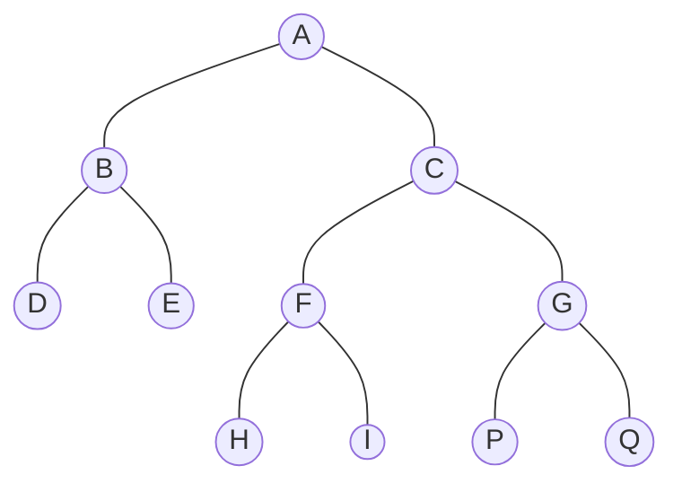
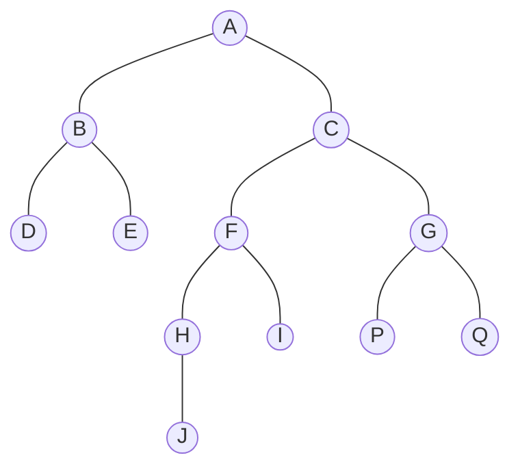
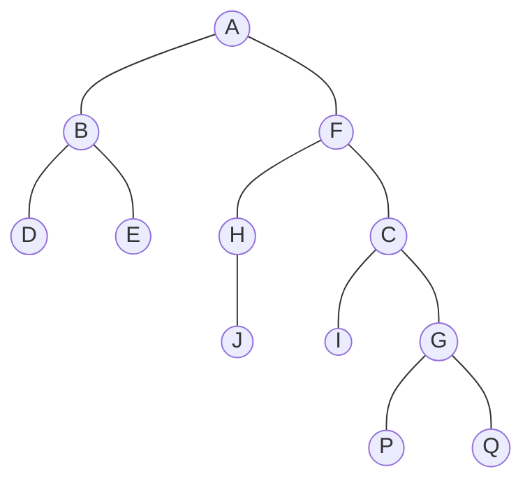
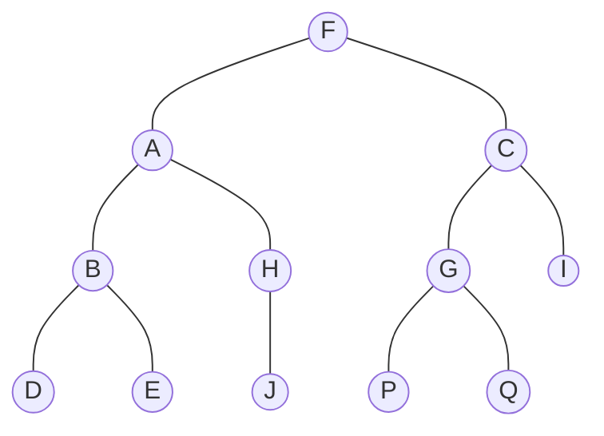
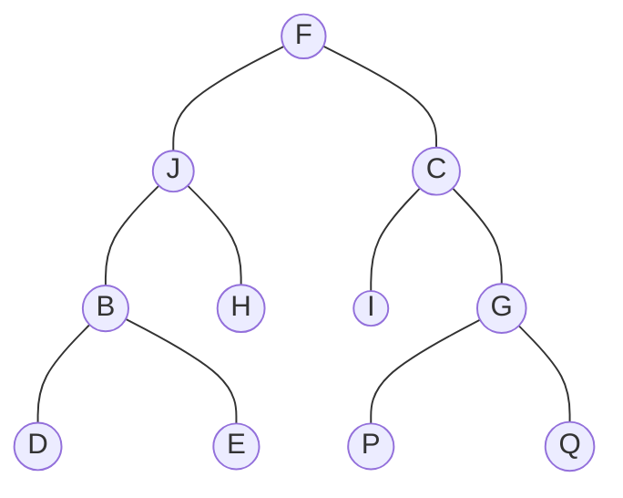

# 笔试样题2

Updated 1651 GMT+8 May 19, 2024

2024 spring, Complied by Hongfei Yan


Logs:

2024/5/19，题目来自“笔试样题2”，我没有标准答案，现有答案是自己做的。


# 一．选择题

（每题 2 分，每题可能有多于 1 个的正确选项）

1. 下列不属于线性结构的是（ A, D ）。
   A：树  B：列表  C：栈  D：图

2. 下面关于线性表的叙述中， 错误的是（ C ）。
   A: 线性表采用顺序存储，必须占用一片连续的存储单元。 

   B: 线性表采用链接存储，不必占用一片连续的存储单元。
   C: 线性表采用顺序存储，便于进行插入和删除操作。

   D: 线性表采用链接存储，便于插入和删除操作。

3. 设栈 S 和队列 Q 的初始状态为空，元素 a， b， c， d， e 依次通过栈 S，一个元素出栈后即进队列 Q，若 5 个元素出队的序列是 c， e， d， b， a 则栈 S 的容量至少应该是（ C ）。
   A：2   B：3   C：4   D：5

4. 下列关于二叉搜索树的说法正确的有（ D ）。
   A：从根结点一直沿右儿子向下找一定能找到该二叉搜索树值最大的结点。

   B：二叉搜索树一定是满二叉树。
   C：二叉搜索树一定是完全二叉树。

   D：二叉搜索树按照中序遍历将各结点打印出来，将得到按照由小到大的排列。

5. 下列关于堆的说法正确的有（ B, D ）。
   A：最小堆中，最下面一层最靠右的结点一定是权值最大的结点。

   B：堆一定是完全二叉树。
   C：最小堆中，某个结点左子树中最大的结点可能比右子树中最小的结点小。 

   D：使用“下沉” 法建堆要比将元素一个一个插入堆来建堆效率高。

6. 以下关于“算法”说法正确的有（ A, D ） 。

   A： 算法一定是在有限步骤以内结束的 

   B： 算法一定是保证是正确的
   C： 算法中不能有任何的随机成分 

   D： 算法的每一步都必须是明确的

7. 在各种查找方法中，平均比对次数与元素个数 n 无关的查找方法是（ A ）。

   A: 散列查找
   B: 顺序查找
   C: 二分查找
   D: 没有这样的查找方法使得平均查找长度和 n 无关

   

   #二分查找是一种对有序序列进行查找的方法，通过不断地将查找区间划分为两半，并比较中间元素来确定查找区间，最终找到目标元素。平均情况下，二分查找的比对次数与元素个数 n 的对数相关。

8. 影响散列查找时间效率的主要因素（ A,C,D ）。

   A: 散列函数的选择
   B: 散列表的长度
   C: 散列表实际元素及个数
   D: 散列表的冲突解决方法

   #解释：

   - A：散列函数的选择直接影响着关键码映射到散列表位置的效果，合适的散列函数可以降低冲突的发生，提高查找效率。
   - C：散列表实际元素的个数决定了散列查找中需要比较的元素数量，实际元素越多，查找时间效率越低。
   - D：散列表的冲突解决方法影响着冲突处理的效率，不同的冲突解决方法可能导致不同的查找效率。例如，开放定址法、链表法等。

   B 选项中，散列表的长度通常是由散列函数的选择和实际元素的数量来确定的，它们对散列查找时间效率的影响更为直接。

   

9. 给定关键码序列 26, 25, 20, 33, 21, 24, 45, 204, 42, 38, 29, 31，用散列法进行存储(本题采用+2 跳跃开放定址方法 open addressing 解决冲突)，规定负载因子 α<0.6, 以下最合理的除余法的散列函数为（ C ）。

   A: H(key)=key % 17
   B: H(key)=key % 18
   C: H(key)=key % 19
   D: H(key)=key % 20

   

   #散列表的负载因子是指散列表中已存储元素的数量与散列表总容量之间的比率。通常用公式表示为：

   $载荷因子 = \frac{\text{元素个数}}{\text{散列表大小}} $

   载荷因子的大小直接影响着散列表的性能。当载荷因子较小时，散列表中空闲位置较多，插入新元素时冲突的可能性较低，查找、插入和删除操作的效率较高。但是，随着插入元素的增多，载荷因子会逐渐增大，导致冲突的概率增加，从而降低了散列表的性能。

   一般来说，当载荷因子超过某个阈值时，就需要对散列表进行扩容操作，以保持其性能。常见的载荷因子阈值通常设定为 0.7 或 0.8，当超过这个阈值时，就需要将散列表的容量增加一倍，并重新计算所有元素的哈希值，将其重新分配到新的散列表中，以减少冲突的发生。

   

   为了确保负载因子小于0.6，我们需要选择一个合适的散列函数，以尽可能均匀地将关键码分布在散列表中。

   计算关键码序列中的关键码数量。根据题目给出的关键码序列，共有12个关键码。

   接下来，我们计算散列表的大小，即最合适的除余数。根据规定的负载因子 α<0.6，可以使用以下公式计算散列表的大小：

   $表大小 = \frac{12}{0.6} = 20 $​

   给定的选项中，选出最接近关键码数量的素数19。

   

   

10. 对于排序算法特性的叙述正确的是（ B,C ）。

   A: 冒泡排序不需要访问那些已排好序的记录
   B: 谢尔排序中，当对确定规模的这些小序列进行插入排序时，要访问序列中的所有记录
   C: 快速排序过程中，递归树上根据深度划分的每个层次都要访问序列中的所有记录
   D: 选择排序需要访问那些已排好序的记录

   

   #让我们逐个分析：

   A: 冒泡排序需要访问已排好序的记录，因为它在每一轮排序时都要比较相邻的元素，并根据需要交换它们的位置，以将最大（或最小）的元素逐渐“冒泡”到正确的位置。因此，选项A不正确。

   B: 谢尔排序在确定规模的小序列上执行插入排序，这意味着对于每个小序列，它会访问该小序列中的所有记录，以便进行插入排序。因此，选项B正确。

   C: 快速排序是基于分治策略的排序算法，每次选择一个基准值，将序列分为两部分，并递归地对每个子序列进行排序。在递归树的每个层次上，都要访问序列中的所有记录，以进行基准值的选择和分区。因此，选项C正确。

   D: 选择排序在每一轮选择最小（或最大）的元素时，需要访问未排序部分和已排序部分中的记录，以确定最小（或最大）的元素的位置，并进行交换。因此，选项D不正确。

   因此，正确答案是：B 和 C。

   

11. 下面的排序算法哪个是不稳定的（ D ） 。

    A: 插入排序
    B: 归并排序
    C: 冒泡排序
    D: 快速排序


12. 在第一趟排序之后，不能确保将数据表中某一个元素放在其最终位置上的排序算法（ D ）。

    A: 选择排序
    B: 冒泡排序
    C: 快速排序
    D: 归并排序

    

13. 下列关于排序算法时间复杂度的描述错误的是（ B ）。

    A: 冒泡排序的最差时间复杂度是O(n^2)
    B: 快速排序的最差时间复杂度是O(nlog(n))
    C: 归并排序的最差时间复杂度是O(nlog(n))
    D: 谢尔排序的时间复杂度在O(n)和O(n2)之间

    

14. 对关键字序列（30， 26， 18， 16， 5， 66），进行 2 遍（ C ）排序后得到序列（5，16， 18， 26， 30， 66）。

    A: 插入
    B: 冒泡
    C: 选择
    D: 归并

15. 如图所示的有向图，共有（ D ）个强连通分枝。

    

    A: 1
    B: 2
    C: 4
    D: 3

16. 在下图中，从顶点 A 出发进行深度优先遍历可得到的序列是（ A,B,D ）。

    

    

    A: ABDCG
    B: ACBDG
    C: ADBGC
    D: ADBCG

17. 如图所示的 DAG 图，其拓扑排序序列为（ B ）。

    

    

    A: ADGBC
    B: ADBGC
    C: AGBDC
    D: ACDGB

18. 选项中哪个插入顺序可以得到以下这棵 AVL 树（ A,B,C,D ） ？

    

    

    A: 2,3,6,14,15,9
    B: 9,6,3,14,2,15
    C: 3,14,15,9,2,6
    D: 3,14,15,9,6,2

19. 下列关于最短路算法的说法正确的有（ A, C ） ：

    A: 当图中不存在负权回路但是存在负权边时， Dijkstra 算法不一定能求出源点到所有点的最短路。

    B: 当图中存在负权回路时， Dijkstra 算法也一定能求出源点到所有点的最短路。
    C: 当图中不存在负权边时， Dijkstra 算法能求出每对顶点间最短路径.
    D: Dijkstra 算法不能用于每对顶点间最短路计算。


# 二．填空（每题 2 分）

1. 以下时间复杂度从小到大的顺序是（ ）：

   A、 (lg⁡ (n))!
   B、 $\sqrt2^{lg⁡ (n)}$
   C、 $2^{lg(lgn)}$​
   D、 lg⁡ (n!)

   #让我们逐个分析这些时间复杂度，并将它们从小到大排列：

   A、 \( (lg(n))! \)：阶乘的增长速度非常快，即使在 \( n \) 值较小的情况下，\( (lg(n))! \) 的增长速度也会非常快，远远超过其他选项。

   B、 \( \sqrt{2^{lg(n)}} \)：这是一个指数级别的平方根。尽管平方根增长速度较慢，但在这种情况下，指数内部是对数级别，因此整体的增长速度相对较快。。

   C、 \( 2^{lg(lgn)} \)：这个表达式等价于 \( lgn \)，虽然增长速度较快，但比 \( n \) 的增长速度慢，因此在这个列表中排在第二位。

   D、 \( lg(n!) \)：\( lg(n!) \) 的增长速度介于 \( lgn \) 和 \( n \) 之间，它比 \( lgn \) 快，但比 \( n \) 慢。

   所以，从小到大排列的顺序是：C、D、B、A。

   

   

2. 已知一个列表 a 的长度为 n，求下面这段代码的时间复杂度为（ O(n^2) ） :

   ```python
   length = 1
   for i in range(n-1):
       for j in range(i+1, n):
           if a[j-1] > a[j]:
               break
           if length < j – i + 1:
               length = j – i + 1
   ```

   

3. 现有中缀表达式 E=((20+5)/5+5 * (30-7)) * 4， 与 E 等价的后缀表达式为（ 20 5 + 5 / 5 + 30 7 - * 4 * ） ？

4. 双端队列可以在队列的两端进行插入和删除操作，既可在队尾进行插入/删除，又可在队头进行插入/删除。现有 5 个不同的元素顺序输入到双端队列，那么可以得到（ 32 ）种不同的排列。

5. 一棵有 1024 个结点的完全二叉树的高度为（ 10 ） ？

   #完全二叉树的高度可以通过结点数量来计算。对于一棵完全二叉树，如果结点数量为 *n*，则其高度可以通过以下方式计算：

   高度=$⌊log_2n⌋$

   给定完全二叉树有 1024 个结点，即 *n*=1024，那么：

   高度=$⌊log_21024⌋=⌊10⌋=10$

   所以，这棵完全二叉树的高度为 10。

6. 定义完全二叉树的根结点所在层为第一层。如果一个完全二叉树的第六层有 23 个叶结点，则此二叉树最多有（ 81 ）个结点。 

7. 已知一棵树的中序遍历为 FGEBCDA，后序遍历为 GFECADB，求这棵树的前序遍历为（ ）。

8. 对于如下图所示的最大堆， 插入元素 70 后，堆的后序遍历结果是（ ）

   

9. 已知一组元素的排序码为(46， 74， 16， 53， 14， 26， 40， 38， 86， 65， 27， 34)，利用直接插入排序（从小到大排序） 的方法（第一个数字不用插入） ,写出第四趟后的排列结果为（ ） 。

   #直接插入排序的基本思想是将未排序的元素逐个插入到已排序序列中的适当位置，从而得到一个新的有序序列。

   在第四趟排序后，前四个元素已经是有序的，而后面的元素需要依次插入到已排序序列中。

   给定排序码为 (46, 74, 16, 53, 14, 26, 40, 38, 86, 65, 27, 34)。

   经过三趟排序后，得到的有序序列为 (16, 46, 53, 74, 14, 26, 40, 38, 86, 65, 27, 34)。

   现在进行第四趟排序，需要将第五个元素 14 插入到已排序序列中。由于 14 小于 16，因此 14 应该插入到 16 的前面，得到新的有序序列为 (14, 16, 46, 53, 74, 26, 40, 38, 86, 65, 27, 34)。

   因此，第四趟后的排列结果为： (14, 16, 46, 53, 74, 26, 40, 38, 86, 65, 27, 34) 

   

10. 请使用 Prim 算法从结点 A 出发求下图的最小生成树，依次写出每次被加入到最小生成树中边的编号（如果同时存在多条边满足要求，选择编号最小的）。顶点 A 到顶点 B (A < B)之间的边编号为 AB， 图中权值为 1 的边编号为 AC， 不同编号之间用一个空格分隔。（ ）

    

11. 从空二叉树开始，严格按照二叉搜索树的插入算法（不进行旋转平衡），逐个插入关键码
    {18, 73, 10, 5, 68, 99, 27, 41, 51, 32, 25}构造出一棵二叉搜索树，对该二叉搜索树按照前序遍历得
    到的序列为？（答案中每两个元素之间用一个空格隔开）
    （ 18 10 5 27 25 32 73 68 41 51 99）


# 三．简答（20 分）

1、请简述数据结构的核心三要素，并以二叉搜索树为例解释其核心要素（6 分）


数据结构的核心三要素包括：

1. **逻辑结构：** 逻辑结构是指数据对象中数据元素之间的关系。常见的逻辑结构包括线性结构（如数组、链表）、树形结构（如二叉树、多叉树）、图形结构等。逻辑结构决定了数据元素之间的组织方式和相互关系。

2. **存储结构：** 存储结构是指数据结构在计算机内存中的表示方式。常见的存储结构包括顺序存储结构和链式存储结构。顺序存储结构利用连续的存储单元存储数据元素，适用于线性结构；链式存储结构利用指针将数据元素分散存储在内存中，适用于树形结构和图形结构。

3. **运算及算法：** 运算及算法是指在数据结构上定义的一组基本操作，以及在这些操作上实现的算法。常见的数据结构操作包括查找、插入、删除等。算法则是对这些操作的具体实现方式，通过选择合适的算法可以提高数据结构的效率。

以二叉搜索树为例解释这三个要素：

1. **逻辑结构：** 二叉搜索树是一种树形结构，其中每个节点最多有两个子节点，且左子节点的值小于等于父节点的值，右子节点的值大于等于父节点的值。这种有序的组织结构使得二叉搜索树具有快速的查找、插入和删除操作。

2. **存储结构：** 二叉搜索树通常使用链式存储结构。每个节点包含存储数据的域以及指向左子节点和右子节点的指针。这种存储方式使得二叉搜索树的节点可以动态分配内存，灵活性较高。

3. **运算及算法：** 二叉搜索树上常见的操作包括查找、插入和删除。其中，查找操作通过比较节点的值和目标值，根据二叉搜索树的有序性进行逐层搜索，以快速找到目标节点。插入操作将新节点按照有序性插入到合适的位置，保持二叉搜索树的有序性。删除操作则需要考虑节点的不同情况，包括删除叶子节点、删除只有一个子节点的节点以及删除有两个子节点的节点，并进行相应的调整以保持二叉搜索树的有序性。通过合适的算法实现这些操作，可以提高二叉搜索树的效率和性能。


2、解释转置图 Transpose Graph 的定义；描述基于转置图的强联通分支 Kosaraju 算法；简述为什么 Kosaraju 是正确的。（6 分）


**转置图（Transpose Graph）**是指将原图中的所有边的方向反转得到的新图。换句话说，如果原图中有一条从顶点 A 到顶点 B 的有向边，则在转置图中会有一条从顶点 B 到顶点 A 的有向边。转置图通常用于解决有向图相关的问题，例如强连通分量的查找。

Kosaraju 算法是一种用于查找有向图中强连通分支（Strongly Connected Components, SCCs）的算法。它的基本思想是通过两次深度优先搜索（DFS）来完成。首先，使用第一次深度优先搜索遍历原图，并按照遍历完成的时间顺序给每个顶点进行标记。然后，构建原图的转置图，再次进行深度优先搜索，但是这次从已经标记好的顶点开始，来寻找原图中的强连通分支。

**Kosaraju 算法描述：**

1. 对原图进行深度优先搜索，得到每个顶点的完成时间。
2. 根据完成时间对顶点进行排序。
3. 对原图的转置图进行深度优先搜索，以完成时间最大的顶点作为起点。
4. 每次深度优先搜索遍历得到的连通分支即为一个强连通分支。

**Kosaraju 算法的正确性**可以通过其核心思想来证明。它的正确性基于以下两个事实：

1. **强连通分支的定义**：对于有向图中的任意两个顶点 u 和 v，如果存在从 u 到 v 和从 v 到 u 的路径，则称这两个顶点是强连通的。换句话说，强连通分支是指图中的一个最大子图，其中的任意两个顶点都是强连通的。
2. **转置图的性质**：转置图的强连通分支与原图的强连通分支完全相同。

基于以上两个事实，Kosaraju 算法的正确性可以得以证明：首先通过第一次深度优先搜索将原图中的顶点排序，然后在转置图上进行深度优先搜索，按照完成时间的逆序遍历顶点，从而确保每次搜索得到的连通分支是一个强连通分支。因为转置图的强连通分支与原图的强连通分支相同，所以最终得到的连通分支是正确的。


3、 什么是 Python 的特殊方法（Magic Method）？请简述`__str__`, `__iter__`， `__contains__`三种特殊方法的作用。（8 分）


Python 的特殊方法（Magic Method）是一种具有特殊命名规范的方法，它们以双下划线 `__` 开头和结尾。这些方法在类的定义中被定义为特殊的钩子，用于实现类的特定行为，例如实例化、比较、迭代等。特殊方法允许我们自定义对象的行为，使其能够与 Python 内置函数和运算符进行交互。

下面是三种常用的特殊方法及其作用：

1. `__str__()` 方法：
   - 作用：定义对象的字符串表示形式，即在使用 `str()` 函数或打印对象时调用的方法。
   - 示例：

    ```python
    class MyClass:
        def __str__(self):
            return "This is a MyClass object"
    
    obj = MyClass()
    print(obj)  # 输出：This is a MyClass object
    ```

2. `__iter__()` 方法：
   - 作用：定义对象可迭代的行为，即在使用迭代器遍历对象时调用的方法。
   - 示例：

    ```python
    class MyIterable:
        def __iter__(self):
            return iter([1, 2, 3, 4, 5])
    
    obj = MyIterable()
    for item in obj:
        print(item)  # 输出：1 2 3 4 5
    ```

3. `__contains__()` 方法：
   - 作用：定义对象是否包含某个元素的行为，即在使用 `in` 运算符检查对象成员时调用的方法。
   - 示例：

    ```python
    class MyContainer:
        def __init__(self):
            self.elements = [1, 2, 3, 4, 5]
        
        def __contains__(self, item):
            return item in self.elements
    
    obj = MyContainer()
    print(3 in obj)  # 输出：True
    print(6 in obj)  # 输出：False
    ```

通过实现这些特殊方法，我们可以自定义对象在特定情境下的行为，使其更符合我们的需求和习惯。


# 四．综合题（共20分）

1、请给出 Prim 以外的另外一种最小生成树算法，给出其伪代码，并分析其算法复杂度（5分）。


除了Prim算法，另一种常见的最小生成树算法是Kruskal算法。Kruskal算法通过不断添加权重最小的边来构建最小生成树，与Prim算法不同，Kruskal算法是基于边的操作而不是基于顶点的操作。

以下是Kruskal算法的伪代码及其算法复杂度分析：

**Kruskal算法伪代码：**

```pseudocode
Kruskal(Graph G):
    1. 将图中的所有边按权重从小到大排序
    2. 初始化空的最小生成树 MST
    3. 初始化并查集 UnionFind，用于判断是否形成环路
    4. 对排序后的边进行遍历：
        - 如果当前边连接的两个顶点不在同一个连通分支中：
            - 将当前边添加到MST中
            - 合并当前边连接的两个顶点的连通分支
    5. 返回MST

UnionFind:
    - 初始化：每个顶点初始为一个独立的集合
    - find(顶点v)：返回顶点v所在的连通分支的代表元素
    - union(顶点u, 顶点v)：将顶点u和顶点v所在的连通分支合并

```

**算法复杂度分析：**

- **排序边的时间复杂度：** 对图中的所有边进行排序，时间复杂度为 (O(E log E))，其中 \(E\) 是边的数量。
- **并查集操作的时间复杂度：** Kruskal算法中使用了并查集来判断是否形成环路和合并连通分支，这些操作的时间复杂度取决于并查集的实现方式，通常为 (O(log V))，其中 \(V\) 是顶点的数量。
- **遍历边的时间复杂度：** 遍历排序后的边的时间复杂度为 \(O(E)\)。

因此，Kruskal算法的总时间复杂度为 (O(E log E + E log V))。在稠密图中 $(E \approx V^2)$，则算法的时间复杂度为 \(O(E log V))。在稀疏图中 $(E \approx V)$，则算法的时间复杂度为 (O(E log E))。通常情况下，Kruskal算法的时间复杂度为 (O(E log E)) 或 (O(E log V))，取决于图的稠密程度。

总体而言，Kruskal 算法的时间复杂度与边的数量和节点的数量有关，但与 Prim 算法相比，在稀疏图（边数量相对较少）的情况下，Kruskal 算法通常更加高效。


2、有 AVL 树如图所示（15 分）





1） 请给出各节点的平衡因子（∆(𝐀)表示节点 A 的平衡因子）

2） 该 AVL 树在 H 节点的左子节点处，插入新的节点 J, 请图示节点 J 插入及重新平衡过程；给出节点 C 在插入 J 后平衡因子的计算公式，使用插入前各节点的平衡因子作为公式的输入

3）插入 J 节点并重新平衡后，删除节点 A，请图示删除节点 A 的过程, 给出节点 C 在删除节点 A 后平衡因子的计算公式，使用删除前各节点的平衡因子作为公式的输入


**1）各节点的平衡因子：**

∆(A) = -1，∆(B) = 0，∆(C) = 0，∆(D) = 0，∆(E) = 0，∆(F) = 0，∆(G) = 0，∆(H) = 0，∆(I) = 0，∆(P) = 0，∆(Q) = 0

**2）插入节点 J 并重新平衡：**

在 H 的左子节点处插入节点 J，导致 AVL 树失去平衡。此时 ∆(A) = -2，∆(C) = 1。





**当结点 A 的右孩子的平衡因子是 -1 时为 RR 型，是1时为 RL 型**。此时是RL型。

对 RL 型来说，可以先忽略结点 A，以结点 C 为 root 进行右旋，就可以把情况转化为 RR 然后按上面 RR 型的做法进行一次左旋即可。

即先右旋，得到





再左旋，得到重新平衡后的AVL树：





节点 C 在插入节点 J 后的平衡因子计算公式为：∆(C) = height(left_subtree) - height(right_subtree) = 1 - 2 = -1


**3）删除节点 A 并重新平衡：**

删除节点 A 不会导致失衡，因此无需进行平衡操作。

> 在 AVL 树中，删除节点时，当被删除的节点有两个子节点时，需要一些额外的步骤来保持树的平衡性。让我们详细讲解 `else` 分支中的情况：
>
> ```python
> else:
>     if not node.left:
>         temp = node.right
>         node = None
>         return temp
>     elif not node.right:
>         temp = node.left
>         node = None
>         return temp
> 
>     temp = self._min_value_node(node.right)
>     node.value = temp.value
>     node.right = self._delete(temp.value, node.right)
> ```
>
> 1. 如果要删除的节点 `node` 没有左子节点，那么我们只需返回其右子节点。这是因为右子节点（如果存在）将占据 `node` 的位置，而不会影响树的平衡性。所以我们将 `node` 设置为 `None`，然后返回其右子节点即可。
>
> 2. 如果要删除的节点 `node` 没有右子节点，那么我们只需返回其左子节点。这与上述情况类似。
>
> 3. 如果要删除的节点 `node` 既有左子节点又有右子节点，那么我们需要找到 `node` 的右子树中的最小值节点，并将其值替换到 `node` 中，然后在右子树中删除这个最小值节点。这是因为右子树中的最小值节点是大于左子树中所有节点值且小于右子树中所有节点值的节点，它在替代被删除节点后能够保持树的平衡性。
>
> 函数 `_min_value_node` 用于找到树中的最小值节点，其实现如下：
>
> ```python
> def _min_value_node(self, node):
>     current = node
>     while current.left:
>         current = current.left
>     return current
> ```
>
> 这样，当我们删除带有两个子节点的节点时，我们选择将右子树中的最小值节点的值替换到要删除的节点中，然后递归地在右子树中删除这个最小值节点。



节点 C 在删除节点 A 后的平衡因子计算公式为：∆(C) = -1
