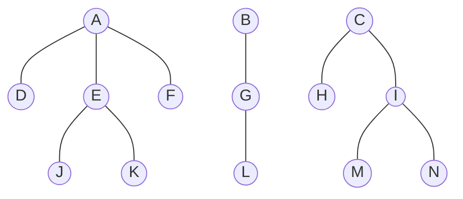

# 20240402 数算B-12班-笔试（期中序幕）

Updated 1651 GMT+8 May 6, 2024

2024 spring, Complied by Hongfei Yan


Logs:

2024/5/19，题目来自“笔试样题1”，暨 2021数算B期末笔试。

2024/5/6，补全了 四.简答，五.算法

2024/5/6，进入五月份，课程内容讲好了，把图相关题目之前的删除线去掉了。当时四月初还没有学习。


说明：

笔试范围：除了图没有，其他的都有，开考之前先把 散列表 讲了。包括：栈、队列、优先队列、排序、散列表、哈夫曼、调度场、各种树的定义、操作（如各种遍历），时间复杂度等。学期过半，课程只剩下图了。


# 一．选择题（30 分，每小题 2 分）

1. 下列不影响算法时间复杂性的因素有（ C ）。
   A：问题的规模 B：输入值
   C：计算结果 D：算法的策略
2. 链表不具有的特点是（ D ）。
   A: 可随机访问任意元素 B: 插入和删除不需要移动元素
   C: 不必事先估计存储空间 D: 所需空间与线性表长度成正比
3. 设有三个元素X，Y，Z 顺序进栈（进的过程中允许出栈），下列得不到的出栈排列是（ C ）。
   A：XYZ B：YZX C：ZXY D：ZYX
4. 判定一个无序表 Q（链表实现）为空的条件是（ A ）。
   A：Q.head == None B： Q == None
   C：Q.head == 0 D： Q.head != None
5. 若定义二叉树中根结点的层数为零，树的高度等于其结点的最大层数加一。则当某二叉树的前序序列和后序序列正好相反，则该二叉树一定是（ B ）的二叉树。
   A： 空或只有一个结点 B：高度等于其节点数
   C： 任一结点无左孩子 D： 任一结点无右孩子
6. 任意一棵二叉树中，所有叶结点在前序、中序和后序周游序列中的相对次序（ B ） 。
   A： 发生改变 B： 不发生改变
   C： 不能确定 D： 以上都不对
7. 假设线性表中每个元素有两个数据项 key1 和 key2，现对线性表按以下规则进行排序：先根据数据项 key1 的值进行非递减排序；在 key1 值相同的情况下，再根据数据项 key2 的值进行非递减排序。
   满足这种要求的排序方法是（ D ）。
   A: 先按key1 值进行冒泡排序，再按 key2 值进行直接选择排序
   B: 先按key2 值进行冒泡排序，再按 key1 值进行直接选择排序
   C: 先按key1 值进行直接选择排序，再按 key2 值进行冒泡排序
   D: 先按key2 值进行直接选择排序，再按 key1 值进行冒泡排序
8. 有n^2 个整数，找到其中最小整数需要比较次数至少为（ C ）次。
   A:n B: log2n C:n^2-1 D:n-1
9. n 个顶点的无向完全图的边数为（ C ）。
   A: n（n-1） B: n（n+1）
   C: n（n-1）/2 D: n（n+1）/2
10. 设无向图G= （V, E），和G’=(V’, E’)，如果 G’是 G 的生成树，则下面说法中错误的是（ B ） 。
    A： G’是G 的子图    B： G’是G 的连通分量
    C： G’是G 的极小连通子图且 V=V’    D： G’是G 的一个无环子图

> 连通分量和强连通分量是两个不同的概念。
>
> 1. **连通分量（Connected Component）：** 在无向图中，一个连通分量是指图中的一个极大连通子图，其中的任意两个节点都可以通过图中的边互相到达。连通分量可以理解为无向图的极大连通子图。
>
> 2. **强连通分量（Strongly Connected Component）：** 在有向图中，一个强连通分量是指图中的一个极大子图，其中的任意两个节点都可以通过有向路径互相到达。强连通分量可以理解为有向图的极大连通子图。
>
> 强连通分量是针对有向图而言的，而连通分量是针对无向图而言的。因此，它们的定义和性质有所不同。


11. 有一个散列表如下图所示，其散列函数为 h(key)=key mod 13，该散列表使用再散列函数
    H2(Key)=Key MOD 3 解决碰撞，问从表中检索出关键码 38 需进行几次比较（ B ）。

| 0    | 1    | 2    | 3    | 4    | 5    | 6    | 7    | 8    | 9    | 10   | 11   | 12   |
| ---- | ---- | ---- | ---- | ---- | ---- | ---- | ---- | ---- | ---- | ---- | ---- | ---- |
| 26   | 38   |      |      | 17   |      |      | 33   |      | 48   |      |      | 25   |

A： 1 B：2 C: 3 D： 4

12. 在一棵度为 3 的树中，度为 3 的节点个数为 2，度为 2 的节点个数为 1，则度为 0 的节点个数为（ C ）。
    A： 4 B：5 C： 6 D： 7

13. 由同一组关键字集合构造的各棵二叉排序树( B )。
    A： 其形态不一定相同，但平均查找长度相同
    B：其形态不一定相同，平均查找长度也不一定相同
    C： 其形态均相同，但平均查找长度不一定相同
    D： 其形态均相同，平均查找长度也都相同

14. 允许表达式内多种括号混合嵌套，检查表达式中括号是否正确配对的算法，通常选用（ A ）。
    A： 栈 B：线性表 C： 队列 D： 二叉排序树

15. 在映射抽象数据类型（ADT Map）的不同实现方法中，适合对动态查找表进行高效率查找的组织结构是（ C ）。
    A： 有序表 B：堆排序 C： 二叉排序树 D： 快速排序


额外题目：

16. 下列叙述中正确的是（ A ）。

A：一个逻辑结构可以有多种类型的存储结构，且不同类型的存储结构会直接影响到数据处理的效率

B：散列是一种基于索引的逻辑结构

C：基于顺序表实现的逻辑结构属于线性结构

D：数据结构设计影响算法效率，逻辑结构起到了决定作用

17. 在广度优先搜索算法中，一般使用什么辅助数据结构？( A )

A: 队列	B: 栈	C: 树	D: 散列表


# 二．判断

（10 分，每小题 1 分；对填写“Y”, 错填写“N” ）

1. （ Y ）考虑一个长度为 n 的顺序表中各个位置插入新元素的概率是相同的，则顺序表的插入算法平均时间复杂度为 O(n) 。
2. （ N ）希尔排序算法的每一趟都要调用一次或多次直接插入排序算法，所以其效率比直接插入排序算法差。
3. （ Y ）直接插入排序、冒泡排序、希尔排序都是在数据正序的情况下比数据在逆序的情况下要快。
4. （ N ）由于碰撞的发生，基于散列表的检索仍然需要进行关键码对比，并且关键码的比较次数仅取决于选择的散列函数与处理碰撞的方法两个因素。
5. （ N ）若有一个叶子结点是二叉树中某个子树的前序遍历结果序列的最后一个结点，则它一定是该子树的中序遍历结果序列的最后一个结点。
6. （ Y ）若某非空且无重复元素二叉树的先序序列和后序序列正好相同，则该二叉树只有一个根结点。
7. （ Y ）有n 个节点的二叉排序树有多种，其中树高最小的二叉排序树是搜索效率最好。
8. （ N ）强连通分量是有向图中的最小强连通子图。
9. （ Y ）用相邻接矩阵法存储一个图时，在不考虑压缩存储的情况下，所占用的存储空间大小只与图中结点个数有关，而与图的边数无关。
10. （ N ）若定义一个有向图的根是指可以从这个结点可到达图中任意其他结点，则可知一个有向图中至少有一个根。


额外题目：

11. （ Y ）按照前序、中序、后序方式周游一棵二叉树，分别得到不同的结点周游序列，然而三种不同的周游序列中，叶子结点都将以相同的顺序出现。

12. （ N ）构建一个含 N 个结点的（二叉）最小值堆，时间效率最优情况下的时间复杂度大 O 表示为 O (N Log N)。


# 三．填空（20 分，每题 2 分）

1. 线性表的顺序存储与链式存储是两种常见存储形式；当表元素有序排序进行二分检索时，应采用 _ _ _ _ 存储形式。**（顺序）**
2. 如果只想得到1000 个元素的序列中最小的前 5个元素，在冒泡排序、快速排序、堆排序和归并排序中，哪种算法最快？**（堆排序）**
3. 设环形队列的容量为 20（单元编号从 0 到19），现经过一系列的入队和出队运算后，队头变量（第一个元素的位置）front=18，队尾变量（待插入元素的位置）rear=11，在这种情况下，环形队列中有 _ _ _ _ 个元素。**（13）**
4. 一棵含有101个结点的二叉树中有36个叶子结点，度为 2 的结点个数是 _ _ _ _ 和度为１的结点个数是 _ _ _ _ 。**（35，30）**
5. 已知二叉树的前序遍历结果 （先根周游序列） 为 ADC， 这棵二叉树的树型有 _ _ _ _ 种可能。**（3）**
6. 已知二叉树的中序序列为 DGBAECF，后序序列为 GDBEFCA，该二叉树的前序序列是 _ _ _ _ 。**（ABDGCEF）**
7. 对于具有 57 个结点的完全二叉树，如果按层次自顶向下，同一层自左向右，顺序从 0 开始对全部结点进行编号，则有：编号为 18 的结点的父结点的编号是 _ _ _ _ ，编号为 19的结点的右子女结点的编号是 _ _ _ _ _ 。**（8，40）**
8. 有n 个数据对象的二路归并排序中，每趟归并的时间复杂度为 _ _ _ _ 。**（O(n)）**
9. 对一组记录进行降序排序，其关键码为（46，70，56，38，40，80，60，22），采用初始步长为 4 的希尔（shell）排序，第一趟扫描的结果是（ _ _ _ _ _ _ _ _ _ _ _ _ _ _ _ _ _ _ _ _ _ _ _ _ ）；而采用归并排序第一轮归并结果是（ _ _ _ _ _ _ _ _ _ _ _ _ _ _ _ _ _ _ _ _ _ _ _ _ ）。**（46,80,60,38,40,70,56,22），（70,46,56,38,80,40,60,22）**
10. 如果一个图节点多而边少（稀疏图），适宜采用邻接矩阵和邻接表中的 _ _ _ _ 方式进行存储。


额外题目：

11. 定义完全二叉树的根结点所在层为第一层。如果一个完全二叉树的第六层有 23 个叶结点，则它的总结点数可能为？（请填写所有 3 个可能的结点数，写对 1 个得 1 分，2 个得 1.5 分，写 错 1 个不得分）。**（54，80，81）**

#可以是第六层是满的 但是叶节点只有23个 还有9个结点是非叶结点。这样第七层要么是17个节点要么是18个。(1+2+4+8+16+32) + 17 或 18 = 80，或 81


# 四．简答（24 分，每小题 6 分）

1、树周游算法可以很好地应用到森林的周游上。查看下列森林结构，请给出其深度优先周游序列和广度优先周游序列。



Answer:

深度优先：ADEJKFBGLCHIMN；广度优先：ABCDEFGHIJKLMN

> 森林的广度优先周游序列定义如下：
>
> 1. 从森林中的每棵树的根节点开始，将根节点加入到遍历队列中。
> 2. 从队列中取出一个节点，并将其加入到遍历结果中。
> 3. 将该节点的所有未被访问过的子节点加入到队列中。
> 4. 重复步骤2和步骤3，直到队列为空。
>
> 在广度优先周游序列中，每一层的节点按照从左到右的顺序加入到遍历结果中。这确保了每棵树的每一层都会被遍历到，而且同一层的节点会按照从左到右的顺序被遍历。


2、哈夫曼树是进行编码的一种有效方式。设给定五个字符，其相应的权值分别为 {4， 8， 6， 9， 18}，试画出相应的哈夫曼树，并计算它的带权外部路径长度 WPL 。


为了构建哈夫曼树，我们需要按照权值从小到大对字符进行排序，并不断地合并权值最小的两个节点，直到只剩下一个节点为止。这个节点就是哈夫曼树的根节点。每次合并两个节点时，新节点的权值为这两个节点的权值之和。

下面是构建哈夫曼树的过程：

1. 将给定的五个字符按照权值从小到大排序：
   1. {4， 6， 8， 9， 18}

2. 不断合并权值最小的两个节点，直到只剩下一个节点：
   1. 合并 4 和 6，得到节点 a，权值为 10
   2. 合并 8 和 9，得到节点 b，权值为 17
   3. 合并节点 a 和 b，得到根节点，权值为 27

下面是相应的哈夫曼树：

```
        (27)
        /   \
   (10)       (17)
   /  \       /   \
  4    6     8     9
```

计算带权外部路径长度（WPL）：
WPL = 4 * 2 + 6 * 2 + 8 * 2 + 9 * 2 + 18 * 1
    = 8 + 12 + 16 + 18 + 18
    = 72

所以，哈夫曼树的带权外部路径长度为 72。


3、 下图是一棵完全二叉树：
1） 请根据初始建堆算法对该完全二叉树建堆，请画出构建的小根堆（2 分）；
2）基于（1）中得到的堆，删除其中的最小元素，请用图给出堆的调整过程（2 分）；
3）基于（1）中得到的堆，向其中插入元素 2，请给出堆的调整过程（2 分）。
注：每移动一个元素视为一个执行步骤，画出所有执行步骤


```
          31
       /      \
     8         53
   /  \       /   \
  10   20    7    15
 / \	 /
3  20 1
```


解答：

对完全二叉树建堆，给出初始建堆算法python

```python
def heapify(arr):
    n = len(arr)
    # 从最后一个非叶子节点开始，依次向下调整每个节点
    for i in range(n // 2 - 1, -1, -1):
        heapify_down(arr, i, n)

def heapify_down(arr, i, n):
    smallest = i  # 假设当前节点最小
    left_child = 2 * i + 1
    right_child = 2 * i + 2

    # 如果左子节点存在且小于当前节点，则更新最小值索引
    if left_child < n and arr[left_child] < arr[smallest]:
        smallest = left_child

    # 如果右子节点存在且小于当前节点，则更新最小值索引
    if right_child < n and arr[right_child] < arr[smallest]:
        smallest = right_child

    # 如果最小值索引不等于当前节点索引，则交换当前节点和最小值节点的值，并继续向下调整
    if smallest != i:
        arr[i], arr[smallest] = arr[smallest], arr[i]
        heapify_down(arr, smallest, n)

# 测试
arr = [31, 8, 53, 10, 20, 7, 15, 3, 20, 1]
heapify(arr)
print(arr)
# [1, 3, 7, 10, 8, 53, 15, 31, 20, 20]
```


1）根据初始建堆算法，我们从最后一个非叶子节点开始，依次向上调整，保证每个节点都满足小根堆的性质。

```
          1
       /      \
     3         7
   /  \       /   \
  10   8    53    15
 / \	 
31 20 
```

2）删除最小元素后，将最后一个元素放到根节点，并进行堆调整：


```
         (20)
       /      \
     3         7
   /  \       /   \
  10   8    53    15
 / \	 
31 20 
```


```
          3
       /      \
    (20)         7
   /  \       /   \
  10   8    53    15
 / \	 /
31 20 20
```


```
          3
       /      \
     8         7
   /  \       /   \
  10  (20)    53    15
 / \	 
31 20 
```

3）插入元素 2 后，将元素 2 放到堆的最后，然后进行堆调整：


```
          1
       /      \
     3         7
   /  \       /   \
  10   8    53    15
 / \	 /\
31 20 20 (2)
```


```
          1
       /      \
     3         7
   /  \       /   \
  10  (2)   53    15
 / \	 /\
31 20 20 8
```


```
          1
       /      \
    (2)         7
   /  \       /   \
  10   3    53    15
 / \	 /\
31 20 20 8
```


4、 已知图 G 的顶点集合 V={V0, V1, V2, V3, V4}，邻接矩阵如下图所示， 可用 prim 算法求 G 的最小生成树。
$$
\left[
\matrix{
  0 & 7 & \infty & 4 & 2 \\ 
  7 & 0 & 9 & 1 & 5 \\ 
  \infty & 9 & 0 & 3 & \infty \\ 
  4 & 1 & 3 & 0 & 10 \\ 
  2 & 5 & \infty & 10 & 0
}
\right]
$$


1） 根据邻接矩阵， 画出图 G（2 分）；
2） 根据 prim 算法，求图 G 从顶点 V0 出发的最小生成树（2 分）；
3） 用图表示出最小生成树每一步的生成过程（2 分） 。


# 五．算法（16 分，每小题 8 分）

1、已知下列 pre2post 函数的功能是根据一个满二叉树的前序遍历序列，求其后序遍历序列，请完成填空（假设序列长度不超过 32）。


```python
# 返回先根序列 preorder[start:start+length]对应的后根序列
def pre2post(preorder, start, length):
    if length == 1:
        return preorder[start]  # 1分
    else:
        length = length // 2    # 2分
        left = pre2post(preorder, start + 1, length)    # 1分
        right = pre2post(preorder, start + 1 + length, length)  # 2分
        root = preorder[start]  # 2分
        return left + right + root

print(pre2post("ABC", 0, 3))  # 输出 BCA
print(pre2post("ABDECFG", 0, 7))  # 输出 DEBFGCA
```


2、阅读下列程序，完成图的深度优先周游算法实现的迷宫探索。已知图采用邻接表表示，Graph 类和 Vertex 类基本定义如下：

```python
class Graph:
    def __init__(self):
        self.vertices = {}

    def addVertex(self, key, label): #添加节点，id 为key，附带数据 label
        self.vertices[key] = Vertex(key, label)

    def getVertex(self, key): # 返回 id 为 key 的节点
        return self.vertices.get(key)

    def __contains__(self, key): # 判断 key 节点是否在图中
        return key in self.vertices

    def addEdge(self, f, t, cost=0): # 添加从节点 id==f 到 id==t 的边
        if f in self.vertices and t in self.vertices:
            self.vertices[f].addNeighbor(t, cost)

    def getVertices(self): # 返回所有的节点 key
        return self.vertices.keys()

    def __iter__(self): # 迭代每一个节点对象
        return iter(self.vertices.values())


class Vertex:
    def __init__(self, key, label=None): # 缺省颜色为"white“
        self.id = key
        self.label = label
        self.color = "white"
        self.connections = {}

    def addNeighbor(self, nbr, weight=0): # 添加到节点 nbr 的边
        self.connections[nbr] = weight

    def setColor(self, color): # 设置节点颜色标记
        self.color = color

    def getColor(self): # 返回节点颜色标记
        return self.color

    def getConnections(self): # 返回节点的所有邻接节点列表
        return self.connections.keys()

    def getId(self): # 返回节点的 id
        return self.id

    def getLabel(self): # 返回节点的附带数据 label
        return self.label

#https://github.com/Yuqiu-Yang/problem_solving_with_algorithms_and_data_structures_using_python/blob/master/ch7/ch4_maze2.txt
mazelist = [
    "++++++++++++++++++++++",
    "+   +   ++ ++        +",
    "E     +     ++++++++++",
    "+ +    ++  ++++ +++ ++",
    "+ +   + + ++    +++  +",
    "+          ++  ++  + +",
    "+++++ + +      ++  + +",
    "+++++ +++  + +  ++   +",
    "+          + + S+ +  +",
    "+++++ +  + + +     + +",
    "++++++++++++++++++++++",
]

def mazeGraph(mlist, rows, cols): # 从 mlist 创建图，迷宫有 rows 行 cols 列
    mGraph = Graph()
    vstart = None
    for row in range(rows):
        for col in range(cols):
            if mlist[row][col] != "+":
                mGraph.addVertex((row, col), mlist[row][col])
                if mlist[row][col] == "S":
                    vstart = mGraph.getVertex((row, col)) # 等号右侧填空（1分）

    for v in mGraph:
        row, col = v.getId()
        for i in [(-1, 0), (1, 0), (0, -1), (0, 1)]:
            if 0 <= row + i[0] < rows and 0 <= col + i[1] < cols:
                if (row + i[0], col + i[1]) in mGraph:
                    mGraph.addEdge((row, col), (row + i[0], col + i[1])) #括号中两个参数填空（1分）

    return mGraph, vstart # 返回图对象，和开始节点


def searchMaze(path, vcurrent, mGraph): # 从 vcurrent 节点开始 DFS 搜索迷宫，path 保存路径
    path.append(vcurrent.getId())
    vcurrent.setColor("gray")
    if vcurrent.getLabel() != "E":
        done = False
        for nbr in vcurrent.getConnections(): # in 后面部分填空（2分）
            nbr_vertex = mGraph.getVertex(nbr)
            if nbr_vertex.getColor() == "white":
                done = searchMaze(path, nbr_vertex, mGraph) # 参数填空（2分）
                if done:
                    break
        if not done:
            path.pop() # 这条语句空着，填空（2分）
            vcurrent.setColor("white")
    else:
        done = True
    return done # 返回是否成功找到通路


g, vstart = mazeGraph(mazelist, len(mazelist), len(mazelist[0]))
path = []
searchMaze(path, vstart, g)
print(path)

# [(8, 15), (7, 15), (7, 14), (6, 14), (5, 14), (4, 14), (4, 13), (5, 13), (6, 13), (6, 12), (6, 11), (6, 10), (5, 10), (5, 9), (4, 9), (3, 9), (2, 9), (2, 8), (2, 7), (1, 7), (1, 6), (1, 5), (2, 5), (3, 5), (4, 5), (5, 5), (5, 4), (4, 4), (3, 4), (2, 4), (2, 3), (1, 3), (1, 2), (2, 2), (2, 1), (2, 0)]
```


