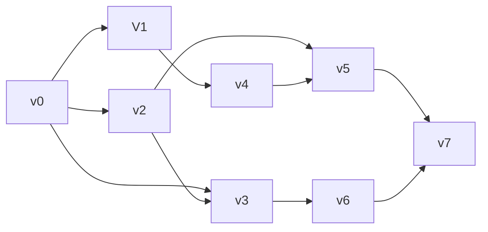

# 20240507 数算B-12班-笔试（模考）答案

Updated 1936 GMT+8 May 4, 2024

2024 spring, Complied by Hongfei Yan


说明：

1）2024/5/7 15:10～17:00，笔试，线下理教410教室有x人+线上y人。

2）周二5月7日15:00～17:00，课堂上进行笔试（电脑上完成），考题在canvas平台，届时开放。

题目包括：选择、判断、填空、简答、算法填空；有的题目需要拍照上传。

请大家带笔记本（pad没有试过，估计也可以），草稿纸，cheat paper，个人独立完成。

预计考100分题目，包括：15个选择题30分，10个判断题10分，10个填空题（改造为选择形式）20分，3个简答14分，4个算法26分。期末考试是120分钟，我们利用两节课加课间时间120分钟完成。

不计分。笔试后再上课，可能线下/线上同学顺序来讲解题目，每人一个。讲解时候（最好到讲台），先介绍下自己的姓名、院系，复述一下题面，然后讲解该题目答案。

2023笔试范围包括：栈、队列、优先队列、排序、散列表、哈夫曼、调度场、各种树的定义、操作（如各种遍历），时间复杂度、图等。


# 一．选择题（30 分，每小题 2 分）

1. 下列叙述中正确的是（ D ）。
   A：散列是一种基于索引的逻辑结构 
   B：基于顺序表实现的逻辑结构属于线性结构
   C：数据结构设计影响算法效率，逻辑结构起到了决定作用 
   D：一个逻辑结构可以有多种类型的存储结构，且不同类型的存储结构会直接影响到数据处理的效率

2. 在广度优先搜索算法中，一般使用什么辅助数据结构？（ A ）。
   A: 队列   B: 栈
   C: 树       D: 散列

3. 若某线性表采取链式存储，那么该线性表中结点的存储地址（ B ）。
   A：一定不连续 B：既可连续亦可不连续 C：一定连续 D：与头结点存储地址保持连续

4. 若某线性表常用操作是在表尾插入或删除元素，则时间开销最小的存储方式是（ C ）。
   A：单链表    B：仅有头指针的单循环链表
   C：顺序表    D：仅有尾指针的单循环链表

5. 给定后缀表达式（逆波兰式）ab+-c*d-对应的中缀表达式是（ B ）。
   A： a - b - c \* d    B：- ( a + b ) \* c -d
   C： a + b \* c - d   D： ( a + b ) \* ( - c - d )

6. 今有一空栈 S，基于待进栈的数据元素序列 a, b, c, d, e, f 依次进行进栈、进栈、出栈、进
   栈、进栈、出栈的操作，上述操作完成以后，栈 S 的栈顶元素为（ B ）。

   A：f     B：c    C：a    D：d

7. 对于单链表，表头节点为 head，判定空表的条件是（ D ）。
   A: head.next \== None
   B: head != None
   C: head.next \== head
   D: head \== None

8. 以下典型排序算法中，具有稳定排序特性的是（ A ）。
   A:冒泡排序（Bubble Sort） B: 直接选择排序（Selection Sort） 

   C:快速排序（Quick Sort）    D:希尔排序（Shell Sort）

9. 以下关键字列表中，可以有效构成一个大根堆（即最大值二叉堆，最大值在堆顶）的序列是（ D ）。
   A: 5 8 1 3 9 6 2 7    B: 9 8 1 7 5 6 2 33
   C: 9 8 6 3 5 1 2 7    D: 9 8 6 7 5 1 2 3

10. 以下典型排序算法中，内存开销最大的是（ C ） 。
    A：冒泡排序    B：快速排序
    C：归并排序    D：堆排序

11. 排序算法依赖于对元素序列的多趟比较/移动操作（即执行多轮循环），第一趟结束后，任一元素
    都无法确定其最终排序位置的算法是（ D ）。

    A：选择排序    B：快速排序    C: 冒泡排序    D：插入排序

12. 考察以下基于单链表的操作，相较于顺序表实现，带来更高时间复杂度的操作是（ D ）。
    A：合并两个有序线性表，并保持合成后的线性表依然有序 
    B：交换第一个元素与第二个元素的值 
    C：查找某一元素值是否在线性表中出现 
    D：输出第 i 个（0<=i<n，n 为元素个数）元素

13. 已知一个整型数组序列，序列元素值依次为 ( 19，20，50，61，73，85，11，39 )，采用某种排序算法，在多趟比较/移动操作（即执行多轮循环）后，依次得到以下中间结果（每一行对应一趟）如下：
    （1）19 20 11 39 73 85 50 61
    （2）11 20 19 39 50 61 73 85
    （3）11 19 20 39 50 61 73 85
    请问，上述过程使用的排序算法是（ C ）。

    A：冒泡排序
    B：插入排序
    C：希尔排序
    D：归并排序

14. 今有一非连通无向图，共有 36 条边，该图至少有（ C ）个顶点。
    A：8  B：9 C：10  D：11

15. 令 G=(V, E) 是一个无向图，若 G 中任何两个顶点之间均存在唯一的简单路径相连，则下面说
    法中错误的是（ A ）。
    A：图 G 中添加任何一条边，不一定造成图包含一个环 
    B：图 G 中移除任意一条边得到的图均不连通 
    C： 图 G 的逻辑结构实际上退化为树结构 
    D： 图 G 中边的数目一定等于顶点数目减 1


# 二．判断

（10 分，每小题 1 分；对填写“Y”, 错填写“N” ）

1. （ Y ）按照前序、中序、后序方式周游一棵二叉树，分别得到不同的结点周游序列，然而三种不同的周游序列中，叶子结点都将以相同的顺序出现。
2. （ N ）构建一个含 N 个结点的（二叉）最小值堆，时间效率最优情况下的时间复杂度大 O 表示为 O (N Log N)。
3. （ N ）对任意一个连通的无向图，如果存在一个环，且这个环中的一条边的权值不小于该环中任意一个其它的边的权值，那么这条边一定不会是该无向图的最小生成树中的边。
4. （ Y ）通过树的周游可以求得树的高度，若采取深度优先遍历方式设计求解树高度问题的算法，算法空间复杂度大 O 表示为 O（树的高度）。
5. （ Y ）树可以等价转化二叉树，树的先序遍历序列与其相应的二叉树的前序遍历序列相同。
6. （ Y ）如果一个连通无向图 G 中所有边的权值均不同，则 G 具有唯一的最小生成树。
7. （ Y ）求解最小生成树问题的 Prim 算法是一种贪心算法。
8. （ Y ）使用线性探测法处理散列表碰撞问题，若表中仍有空槽（空单元），插入操作一定成功。
9. （ N ）从链表中删除某个指定值的结点，其时间复杂度是 O(1)。
10. （ Y ）Dijkstra 算法的局限性是无法正确求解带有负权值边的图的最短路径。


# 三．填空（20 分，每题 2 分）

1. 定义二叉树中一个结点的度数为其子结点的个数。现有一棵结点总数为 101 的二叉树，其中度数为 1 的结点数有 30 个，则度数为 0 结点有 _ _ _ _ 个。**36**

2. 定义完全二叉树的根结点所在层为第一层。如果一个完全二叉树的第六层有 23 个叶结点，则它的总结 点数可能为 _ _ _ _ （请填写所有 3 个可能的结点数，写对 1 个得 1 分，2 个得 1.5 分，写 错 1 个不得分）。**54,80,81**

3. 对于初始排序码序列（51, 41, 31, 21, 61, 71, 81, 11, 91），用双指针原地交换实现，第 1 趟快速排序（以第一个数字为中值）的结果是： _ _ _ _ 。**11 41 31 21 51 71 81 61 91**

4. 如果输入序列是已经正序，在(改进)冒泡排序、直接插入排序和直接选择排序算算法中， _ _ _ _ 算法最慢结束。**直接选择排序**

5. 已知某二叉树的先根周游序列为 ( A, B, D, E, C, F, G )，中根周游序列为 ( D, B, E, A, C, G, F )，则该二叉树的后根次序周游序列(  _ _ _ _  )。**D,E,B,G,F,C,A**

6. 使用栈计算后缀表达式 (操作数均为一位数) “1 2 3 + 4 * 5 + 3 + −” ，当扫描到第二个+号但还未对该+号进行运算时，栈的内容 (以栈底到栈顶从左往右的顺序书写) 为 _ _ _ _ 。**1,20,5**

7. 51 个顶点的连通图 G 有 50 条边，其中权值为 1, 2, 3, 4, 5, 6, 7, 8, 9, 10 的边各 5 条，则连通图 G 的最小生成树各边的权值之和为 _ _ _ _ _ 。**275**

8. 包含 n 个顶点无向图的邻接表存储结构中，所有顶点的边表中最多有 _ _ _ _ 个结点。具有 n 个顶点的有向图，顶点入度和出度之和最大值不超过 _ _ _ _ 。**n(n-1), 2(n-1)**

9. 给定一个长度为 7 的空散列表，采用双散列法解决冲突，两个散列函数分别为：h1(key) = key % 7，h2(key) = key%5 + 1 请向散列表依次插入关键字为 30, 58, 65 的集合元素，插入完成后 65 在散列表中存储地址为 _ _ _ _ _ 。**3**

10. 阅读算法 ABC，回答问题。

    ```python
    def ABC(n):
      k, m = 2, int(n**0.5)
      while (k <= m) and (n %k != 0):
        k += 1
      return k > m
    ```

    1）算法的功能是：_ _ _ _ 。**素数判断**

    2）算法的时间复杂度是O( _ _ _ _ )。**n\**0.5**


# 四．简答（3题，共14分）

1. （4 分）字符串匹配算法从长度为 n 的文本串 S 中查找长度为 m 的模式串 P 的首次出现。

  a）字符串匹配的朴素算法使用暴力搜索，大致过程如下：对于 P 在 S 中可能出现的 n-m+1 个位置，比对此位置时 P 和 S 中对应子串是否相等。其时间复杂度 O((n-m+1)m)。请举例说明算法时间复杂度一种最坏情况（注：例子中请只出现 a 和 b 两种字符）。（1分）

  b）已知字符串 S 为“abaabaabaabcc”，模式串 t 为“abaabc”。采用朴素算法进行查找，请写出字符比对的总次数和查找结果。（2 分）

  c）朴素算法存在很大的改进空间，说明在上述(b)步骤中，第一次出现不匹配（s[i+j] != t[j]）时（i=0, j=5），为了避免冗余比对，则下次比对时，i 和 j 的值可以分别调整为多少？（1分）

  

  字符串匹配的朴素算法：

  ```python
  def issubstring(s, t):
      for i in range(len(s)):
          for j in range(len(t)):
              if s[i + j] != t[j]:
                  break
          else:
              return True
      return False
  ```

  

答：

问题 a) 如 P=“a^m-1^b”，S=“a^n-1^b”，执 行 朴 素 算 法 刚 好 需 要(n-m+1)m 次比对。

问题 b) 需要 24 次比对得到 True 结果

问题 c) i=3, j=2


2. （5 分）有八项活动，每项活动标记为 V+编号 n(0<=n<=7)，每项活动要求的前驱如下:

  | 活动 | V0     | V1   | V2   | V3     | V4   | V5     | V6   | V7     |
  | ---- | ------ | ---- | ---- | ------ | ---- | ------ | ---- | ------ |
  | 前驱 | 无前驱 | V0   | V0   | V0, V2 | V1   | V2, V4 | V3   | V5, V6 |

  （1）画出相应的 AOV（Active On Vertex）网络（即节点为活动，边为先后关系的有向图），
  （2）并给出一个拓扑排序序列，如存在多种，则按照编号从小到大排序，输出最小的一种。


答：

（1）AOV网络




（2）其中一个序列为：V0,V1,V2,V3,V4,V5,V6,V7


3. （5 分）简要回答下列 BST 树以及 BST 树更新过程的相关问题。
   （1）请简述什么是二叉查找树（BST）（1 分）
   （2）请图示 2,1,6,4,5,3 按顺序插入一棵 BST 树的中间过程和最终形态（2 分）
   （3）请图示以上 BST 树，依次删除节点 4 和 2 的过程和树的形态（2 分）


答：

（1）BST 树是二叉树，对于所有的子树而言，其左子树上所有关键值都小于根，右子树上的所有关键值都大于根

（2）


（3）


# 五．算法填空（4题，共26分）

1. （6 分）拓扑排序：给定一个有向图，求拓扑排序序列。

输入：第一行是整数 n，表示图有 n 顶点 (1<=n<=100)，编号 1 到 n。接下来 n 行，第 i 行列了顶点 i 的所有邻点，以 0 结尾。没有邻点的顶点，对应行就是单独一个0。

输出：一个图的拓扑排序序列。如果图中有环，则输出“Loop”。

样例输入 (#及其右边的文字是说明，不是输入的一部分)：

  ```
  5 					#5 个顶点
  0 					#1 号顶点无邻点
  4 5 1 0 		#2 号顶点有邻点 4 5 1
  1 0
  5 3 0
  3 0
  ```

样例输出

  ```
  2 4 5 3 1
  ```

请对下面的解题程序进行填空


```python
class Edge: # 表示邻接表中的图的边,v 是终点
    def __init__(self, v):
        self.v = v


def topoSort(G):    # G 是邻接表，顶点从 0 开始编号
    # G[i][j]是 Edge 对象，代表边 <i, G[i][j].v>
    n = len(G)
    import queue
    inDegree = [0] * n  # inDegree[i]是顶点 i 的入度
    q = queue.Queue()
    # q 是队列, q.put(x)可以将 x 加入队列，q.get()取走并返回对头元素
    # q.empty()返回队列是否为空

    for i in range(n):
        for e in G[i]:
            inDegree[e.v] += 1  # 【1 分】

    for i in range(n):
        if inDegree[i] == 0:
            q.put(i)    # 【1 分】

    seq = []
    while not q.empty():
        k = q.get()
        seq.append(k)   # 【1 分】
        for e in G[k]:
            inDegree[e.v] -= 1  # 【1 分】
            if inDegree[e.v] == 0:
                q.put(e.v)  # 【1 分】

    if len(seq) != n:   # 【1 分】
        return None
    else:
        return seq


n = int(input())
G = [[] for _ in range(n)]  # 邻接表
for i in range(n):
    lst = list(map(int, input().split()))
    print(lst)
    G[i] = [Edge(x - 1) for x in lst[:-1]]
    print(G[i])

result = topoSort(G)
if result is not None:
    for x in result:
        print(x + 1, end=" ")
else:
    print("Loop")

```


2. （7 分）链表操作：读入一个从小到大排好序的整数序列到链表，然后在链表中删除重复的元素，使得重复的元素只保留 1 个，然后将整个链表内容输出。

输入样例：

  ```
  1 2 2 2 3 3 4 4 6
  ```

输出样例:

  ```
  1 2 3 4 6
  ```

请对程序填空:


```python
class Node:
    def __init__(self, data):
        self.data = data
        self.next = None

a = list(map(int, input().split()))
head = Node(a[0])
p = head
for x in a[1:]:
    p.next = Node(x)    # 【2 分】
    p = p.next

p = head
while p:
    while p.next and p.data == p.next.data: # 【2 分】
        p.next = p.next.next    #【1 分】
    p = p.next

p = head
while p:
    print(p.data, end=" ")
    p = p.next  # 【2 分】

```


3. （7 分）无向图判定：给定一个无向图，判断是否连通，是否有回路。
输入：第一行两个整数 n,m，分别表示顶点数和边数。顶点编号从 0 到 n-1。 (1<=n<=110, 1<=m<= 10000) 接下来 m 行，每行两个整数 u 和 v，表示顶点 u 和 v 之间有边。

输出:
如果图是连通的，则在第一行输出“connected:yes",否则第一行输出“connected:no"。
如果图中有回路，则在第二行输出“loop:yes ",否则第二行输出“loop:no"。

样例输入

  ```
  3 2
  0 1
  0 2
  ```

样例输出

  ```
  connected:yes
  loop:no
  ```

请进行程序填空：


```python
def isConnected(G): # G 是邻接表,顶点编号从 0 开始，判断是否连通
    n = len(G)
    visited = [False for _ in range(n)]
    total = 0

    def dfs(v):
        nonlocal total
        visited[v] = True
        total += 1
        for u in G[v]:
            if not visited[u]:
                dfs(u)

    dfs(0)
    return total == n      # 【2 分】

def hasLoop(G): # G 是邻接表,顶点编号从 0 开始，判断有无回路
    n = len(G)
    visited = [False for _ in range(n)]

    def dfs(v, x): # 返回值表示本次 dfs 是否找到回路,x 是深度优先搜索树上 v 的父结点
        visited[v] = True
        for u in G[v]:
            if visited[u] == True:
                if u != x: # 【2 分】
                    return True
            else:
                if dfs(u, v):   # 【2 分】
                    return True
        return False

    for i in range(n):
        if not visited[i]:  # 【1 分】
            if dfs(i, -1):
                return True
    return False

n, m = map(int, input().split())
G = [[] for _ in range(n)]
for _ in range(m):
    u, v = map(int, input().split())
    G[u].append(v)
    G[v].append(u)

if isConnected(G):
    print("connected:yes")
else:
    print("connected:no")

if hasLoop(G):
    print("loop:yes")
else:
    print("loop:no")

```


4. （6 分）堆排序：输入若干个整数，下面的程序使用堆排序算法对这些整数从小到大排序，请填空。
程序中建立的堆是大顶堆（最大元素在堆顶）

输入样例：

  ```
  1 3 43 8 7
  ```

输出样例:

  ```
  1 3 7 8 43
  ```

请进行程序填空：


```python
def heap_sort(arr):
    heap_size = len(arr)

    def goDown(i):
        if i * 2 + 1 >= heap_size:  # a[i]没有儿子
            return
        L, R = i * 2 + 1, i * 2 + 2

        if R >= heap_size or arr[L] > arr[R]:   # 【1 分】
            s = L
        else:
            s = R

        if arr[s] > arr[i]:
            arr[s], arr[i] = arr[i], arr[s] # 【2 分】
            goDown(s)

    def heapify():	# 将列表 a 变成一个堆
        for k in range(len(arr) // 2 - 1, -1, -1): # 【1 分】
            goDown(k)

    heapify()
    for i in range(len(arr) - 1, -1, -1):
        arr[0], arr[i] = arr[i], arr[0] # 【1 分】
        heap_size -= 1
        goDown(0)   # 【1 分】


a = list(map(int, input().split()))
heap_sort(a)
for x in a:
    print(x, end=" ")

```


卷面写法怪异，正常写法应该是

```python
def heapify(arr, n, i):
    largest = i  # 将当前节点标记为最大值
    left = 2 * i + 1  # 左子节点的索引
    right = 2 * i + 2  # 右子节点的索引

    # 如果左子节点存在且大于根节点，则更新最大值索引
    if left < n and arr[i] < arr[left]:
        largest = left

    # 如果右子节点存在且大于根节点或左子节点，则更新最大值索引
    if right < n and arr[largest] < arr[right]:
        largest = right

    # 如果最大值索引发生了变化，则交换根节点和最大值，并递归地堆化受影响的子树
    if largest != i:
        arr[i], arr[largest] = arr[largest], arr[i]
        heapify(arr, n, largest)


def buildMaxHeap(arr):
    n = len(arr)

    # 从最后一个非叶子节点开始进行堆化
    for i in range(n // 2 - 1, -1, -1):
        heapify(arr, n, i)


def heapSort(arr):
    n = len(arr)

    buildMaxHeap(arr)  # 构建大顶堆

    # 逐步取出堆顶元素（最大值），并进行堆化调整
    for i in range(n - 1, 0, -1):
        arr[i], arr[0] = arr[0], arr[i]  # 交换堆顶元素和当前最后一个元素
        heapify(arr, i, 0)  # 对剩余的元素进行堆化

    return arr

a = list(map(int, input().split()))
heapSort(a)
for x in a:
    print(x, end=" ")
```

